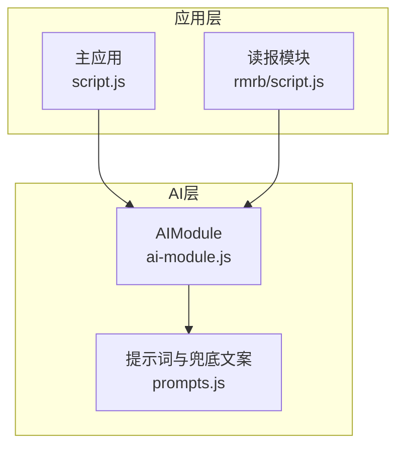
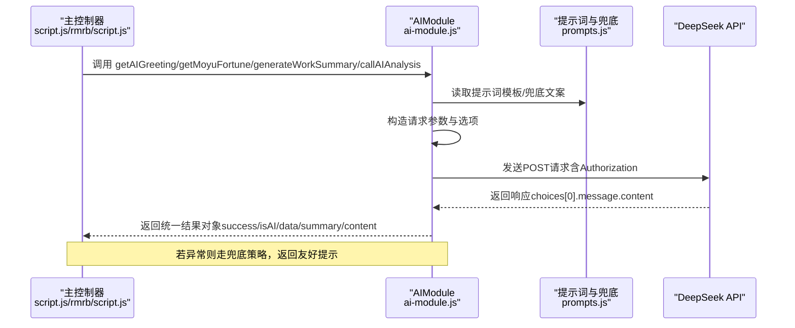
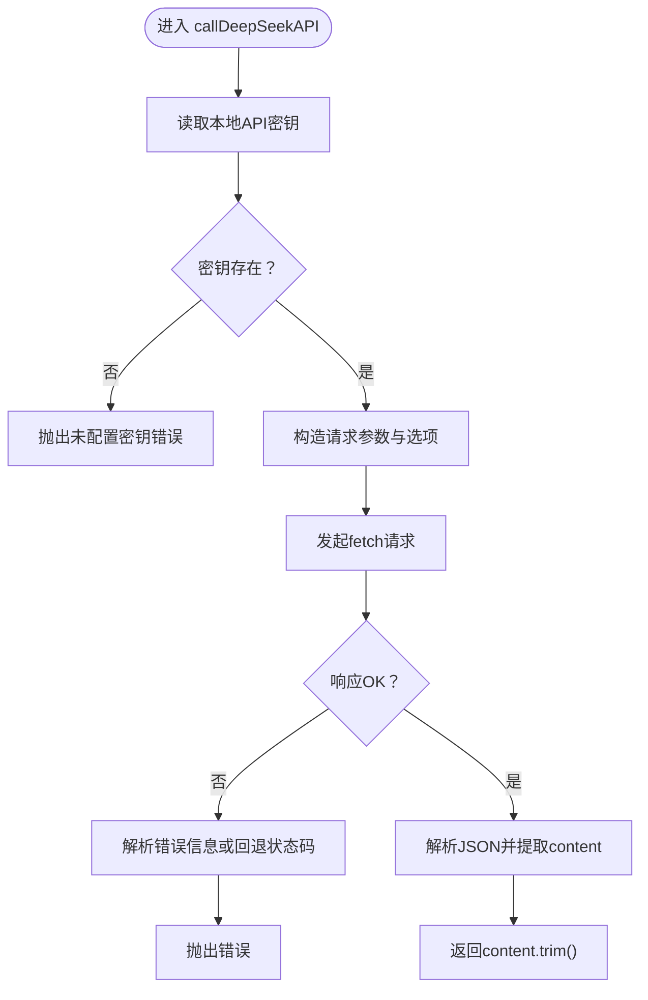
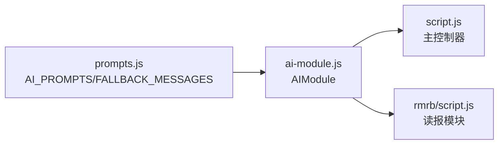

# AI功能模块

<cite>
**本文引用的文件**
- [ai-module.js](file://ai-module.js)
- [prompts.js](file://prompts.js)
- [script.js](file://script.js)
- [rmrb/script.js](file://rmrb/script.js)
</cite>

## 目录
1. [简介](#简介)
2. [项目结构](#项目结构)
3. [核心组件](#核心组件)
4. [架构总览](#架构总览)
5. [详细组件分析](#详细组件分析)
6. [依赖关系分析](#依赖关系分析)
7. [性能考量](#性能考量)
8. [故障排查指南](#故障排查指南)
9. [结论](#结论)
10. [附录](#附录)

## 简介
本文件面向“AI功能模块”的设计与实现，围绕 ai-module.js 展开，系统阐述其如何封装 DeepSeek API 调用（callDeepSeekAPI），以及如何通过统一的提示词模板（prompts.js）驱动多项AI能力：获取打卡问候语（getAIGreeting）、生成摸鱼吉日签（getMoyuFortune）、生成工作总结（generateWorkSummary）与通用内容分析（callAIAnalysis）。重点说明模块的“兜底策略”（fallback strategy）设计，即在API调用失败时如何返回预设的友好提示；并说明该模块如何依赖 prompts.js 中的提示词模板，最终通过 window.AIModule 对象对外暴露接口，供主控制器（如 script.js、rmrb/script.js）调用。

## 项目结构
AI功能模块位于仓库根目录，主要文件如下：
- ai-module.js：AI功能封装与DeepSeek API调用封装
- prompts.js：统一的提示词模板与兜底文案
- script.js：主应用入口，负责初始化与调用 AIModule 接口
- rmrb/script.js：读报模块，调用 AIModule 的通用分析接口

图表来源
- [ai-module.js](file://ai-module.js#L1-L216)
- [prompts.js](file://prompts.js#L1-L159)
- [script.js](file://script.js#L490-L730)
- [rmrb/script.js](file://rmrb/script.js#L390-L474)

章节来源
- [ai-module.js](file://ai-module.js#L1-L216)
- [prompts.js](file://prompts.js#L1-L159)
- [script.js](file://script.js#L490-L730)
- [rmrb/script.js](file://rmrb/script.js#L390-L474)

## 核心组件
- DeepSeek API封装：callDeepSeekAPI，负责请求构建、认证、错误处理与返回解析
- 业务能力函数：
  - getAIGreeting：获取打卡问候语（不调用AI，直接返回预设文案）
  - getMoyuFortune：生成摸鱼吉日签（带兜底）
  - generateWorkSummary：生成工作总结（带兜底）
  - callAIAnalysis：通用内容分析（带兜底）
- 提示词与兜底文案：统一由 prompts.js 管理，通过 window 对象暴露给 AIModule 使用
- 外部接口：window.AIModule 暴露上述函数，供主控制器调用

章节来源
- [ai-module.js](file://ai-module.js#L13-L216)
- [prompts.js](file://prompts.js#L1-L159)

## 架构总览
AIModule 的调用链路如下：
- 主控制器（script.js、rmrb/script.js）调用 window.AIModule 的公开方法
- AIModule 内部根据业务选择合适的提示词模板（来自 window.AI_PROMPTS）
- 调用 callDeepSeekAPI 发起HTTP请求，携带API密钥与参数
- API返回后，AIModule 解析结果或触发兜底策略
- 返回统一的结果对象（包含 success、content/summary/data/isAI/error 等字段）

图表来源
- [ai-module.js](file://ai-module.js#L13-L216)
- [prompts.js](file://prompts.js#L1-L159)
- [script.js](file://script.js#L490-L730)
- [rmrb/script.js](file://rmrb/script.js#L390-L474)

## 详细组件分析

### DeepSeek API封装：callDeepSeekAPI
- 请求构建
  - 使用固定的API端点与模型名
  - 从本地存储读取API密钥并注入到Authorization头
  - 构造messages数组，仅包含用户角色与提示词
  - 支持温度、最大token数、top_p等参数
- 认证
  - 若未配置API密钥，直接抛出错误
  - 使用Bearer Token方式鉴权
- 错误处理
  - 非OK响应时尝试解析错误信息，否则回退到状态码提示
  - 捕获网络/解析异常并打印日志
- 返回值
  - 成功时返回choices[0].message.content.trim()

图表来源
- [ai-module.js](file://ai-module.js#L13-L58)

章节来源
- [ai-module.js](file://ai-module.js#L13-L58)

### 获取打卡问候语：getAIGreeting
- 设计要点
  - 不调用AI，直接返回预设的问候语集合（随机选取）
  - 返回对象包含 success、message、isAI=false
- 适用场景
  - 打卡弹窗首屏展示，快速反馈，避免不必要的API调用

章节来源
- [ai-module.js](file://ai-module.js#L65-L92)

### 生成摸鱼吉日签：getMoyuFortune
- 数据流
  - 从 window.AI_PROMPTS.MOYU_FORTUNE 读取模板
  - 调用 callDeepSeekAPI，传入定制化的maxTokens与temperature
  - 从AI返回文本中匹配并解析JSON片段
- 兜底策略
  - 解析失败或API异常时，返回 window.FALLBACK_MESSAGES.MOYU_FORTUNE
  - 返回对象包含 success=false、data=兜底JSON、isAI=false、error=错误信息
- UI集成
  - 主控制器在调用后根据 isAI 字段决定是否显示错误提示

章节来源
- [ai-module.js](file://ai-module.js#L99-L126)
- [prompts.js](file://prompts.js#L1-L159)
- [script.js](file://script.js#L648-L666)

### 生成工作总结：generateWorkSummary
- 数据流
  - 从 window.AI_PROMPTS.WORK_SUMMARY 读取模板
  - 将工作数据（上班时间、下班时间、摸鱼次数、日收入）注入模板
  - 调用 callDeepSeekAPI，传入定制化的maxTokens与temperature
- 兜底策略
  - API异常或解析失败时，返回 window.FALLBACK_MESSAGES.WORK_SUMMARY
  - 返回对象包含 success=false、summary=兜底文案、isAI=false、error=错误信息
- UI集成
  - 主控制器在调用后根据 isAI 字段决定是否显示错误提示

章节来源
- [ai-module.js](file://ai-module.js#L133-L166)
- [prompts.js](file://prompts.js#L1-L159)
- [script.js](file://script.js#L597-L724)

### 通用内容分析：callAIAnalysis
- 数据流
  - 从 window.AI_PROMPTS[promptType] 读取模板
  - 将待分析内容注入模板占位符
  - 调用 callDeepSeekAPI，传入定制化的maxTokens与temperature
- 兜底策略
  - API异常或模板不存在时，返回 window.getRandomFallbackMessage(promptType)
  - 返回对象包含 success=false、content=随机兜底文案、isAI=false、error=错误信息
- 应用场景
  - 读报模块调用，将人民日报前四版内容作为输入，生成结构化分析

章节来源
- [ai-module.js](file://ai-module.js#L174-L203)
- [prompts.js](file://prompts.js#L1-L159)
- [rmrb/script.js](file://rmrb/script.js#L390-L474)

### 提示词模板与兜底文案：prompts.js
- 提示词模板
  - MOYU_FORTUNE：生成JSON格式的摸鱼吉日签
  - WORK_SUMMARY：生成幽默风格的工作总结
  - NEWS_ANALYSIS：基于人民日报内容的深度分析模板
- 兜底文案
  - MOYU_FORTUNE：兜底JSON对象
  - WORK_SUMMARY：兜底文本
  - NEWS_ANALYSIS：兜底文案数组，配合 getRandomFallbackMessage 随机返回
- 全局暴露
  - window.AI_PROMPTS、window.FALLBACK_MESSAGES、window.getRandomFallbackMessage

章节来源
- [prompts.js](file://prompts.js#L1-L159)

### 外部接口：window.AIModule
- 暴露方法
  - callDeepSeekAPI
  - getAIGreeting
  - getMoyuFortune
  - generateWorkSummary
  - callAIAnalysis
- 使用方式
  - 主控制器通过 window.AIModule.xxx() 调用
  - 例如：主控制器在打卡流程中调用 getAIGreeting 与 getMoyuFortune；在读报模块中调用 callAIAnalysis

章节来源
- [ai-module.js](file://ai-module.js#L206-L216)
- [script.js](file://script.js#L490-L730)
- [rmrb/script.js](file://rmrb/script.js#L390-L474)

## 依赖关系分析
- AIModule 对 prompts.js 的依赖
  - 读取 window.AI_PROMPTS 与 window.FALLBACK_MESSAGES
  - 在 callAIAnalysis 中调用 window.getRandomFallbackMessage
- 主控制器对 AIModule 的依赖
  - script.js：在打卡流程中调用 AIModule 的问候、摸鱼吉日签与工作总结
  - rmrb/script.js：在读报分析中调用 AIModule 的通用分析接口
- 耦合与内聚
  - AIModule 内聚于AI调用与结果处理，耦合通过 window 对象传递
  - 提示词与兜底文案集中管理，降低各业务函数的重复与耦合

图表来源
- [ai-module.js](file://ai-module.js#L1-L216)
- [prompts.js](file://prompts.js#L1-L159)
- [script.js](file://script.js#L490-L730)
- [rmrb/script.js](file://rmrb/script.js#L390-L474)

章节来源
- [ai-module.js](file://ai-module.js#L1-L216)
- [prompts.js](file://prompts.js#L1-L159)
- [script.js](file://script.js#L490-L730)
- [rmrb/script.js](file://rmrb/script.js#L390-L474)

## 性能考量
- API调用成本
  - 通过 getAIGreeting 直接返回预设文案，避免不必要的网络请求
  - 其他功能按需调用，合理设置 temperature、maxTokens，平衡质量与成本
- 兜底策略
  - 在API失败时立即返回友好提示，减少等待与重试开销
- 结果解析
  - 对JSON解析采用正则匹配兜底，避免严格解析失败导致的长时间阻塞

[本节为通用指导，无需列出章节来源]

## 故障排查指南
- API密钥未配置
  - 现象：调用 callDeepSeekAPI 抛出“未配置 API 密钥”
  - 处理：在设置界面保存密钥并确认本地存储存在
- API响应非OK
  - 现象：返回错误信息或状态码提示
  - 处理：检查网络、密钥有效性与服务可用性
- JSON解析失败（摸鱼吉日签）
  - 现象：getMoyuFortune 返回兜底JSON
  - 处理：确认提示词模板要求返回JSON，或放宽解析策略
- 通用分析模板不存在
  - 现象：callAIAnalysis 抛出“无效的 Prompt 类型”
  - 处理：确认 promptType 与 prompts.js 中的键一致

章节来源
- [ai-module.js](file://ai-module.js#L13-L58)
- [ai-module.js](file://ai-module.js#L99-L126)
- [ai-module.js](file://ai-module.js#L174-L203)
- [prompts.js](file://prompts.js#L1-L159)

## 结论
ai-module.js 通过统一的API封装与提示词模板，实现了高内聚、低耦合的AI能力模块。其“兜底策略”确保在API异常时仍能提供友好的用户体验；通过 window.AIModule 对外暴露简洁接口，使主控制器能够以一致的方式调用多种AI功能。prompts.js 的集中管理进一步提升了可维护性与一致性。

[本节为总结性内容，无需列出章节来源]

## 附录

### 异步调用流程与错误处理模式（示例路径）
- 打卡问候语
  - 调用位置：[script.js](file://script.js#L584-L586)
  - 返回结构：success/message/isAI
- 摸鱼吉日签
  - 调用位置：[script.js](file://script.js#L649-L661)
  - 错误处理：根据 isAI 与 error 字段决定是否显示错误提示
- 工作总结
  - 调用位置：[script.js](file://script.js#L599-L724)
  - 错误处理：根据 isAI 与 error 字段决定是否回退兜底文案
- 通用分析
  - 调用位置：[rmrb/script.js](file://rmrb/script.js#L405-L418)
  - 错误处理：根据 success 与 error 字段决定是否提示失败

章节来源
- [script.js](file://script.js#L584-L724)
- [rmrb/script.js](file://rmrb/script.js#L390-L474)