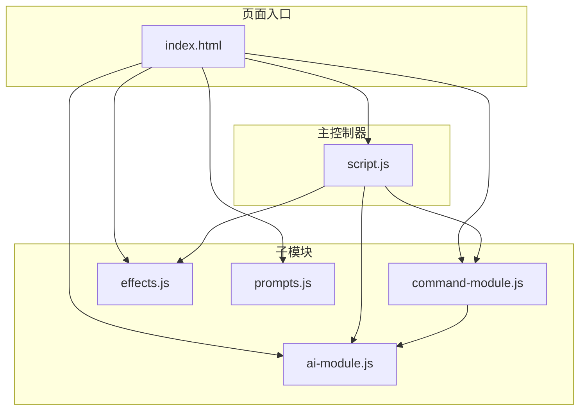
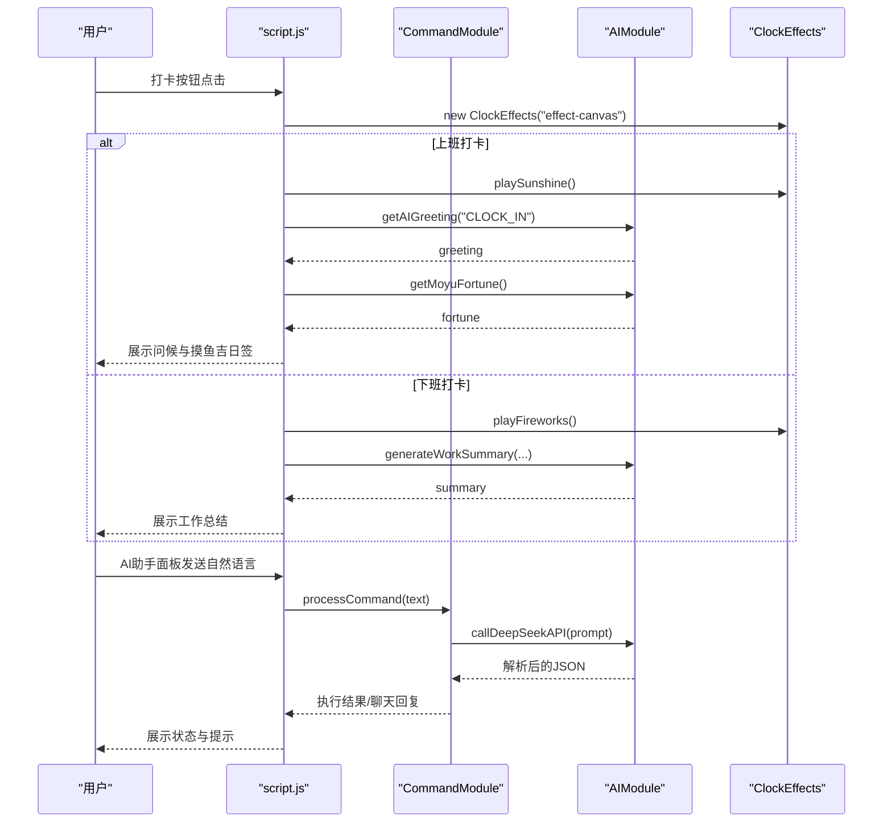
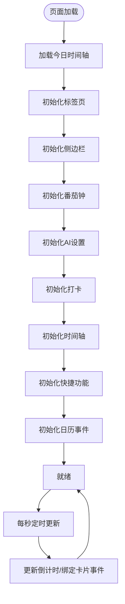
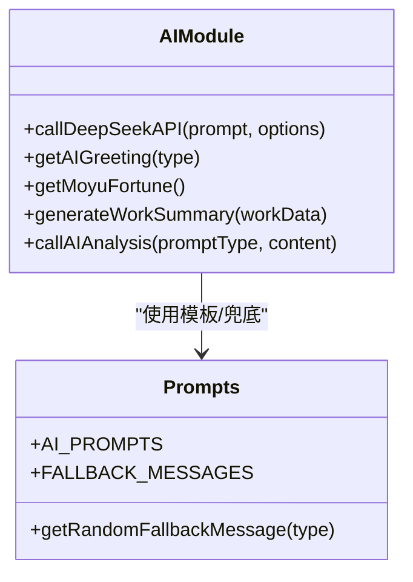
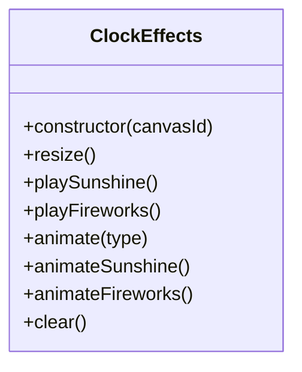
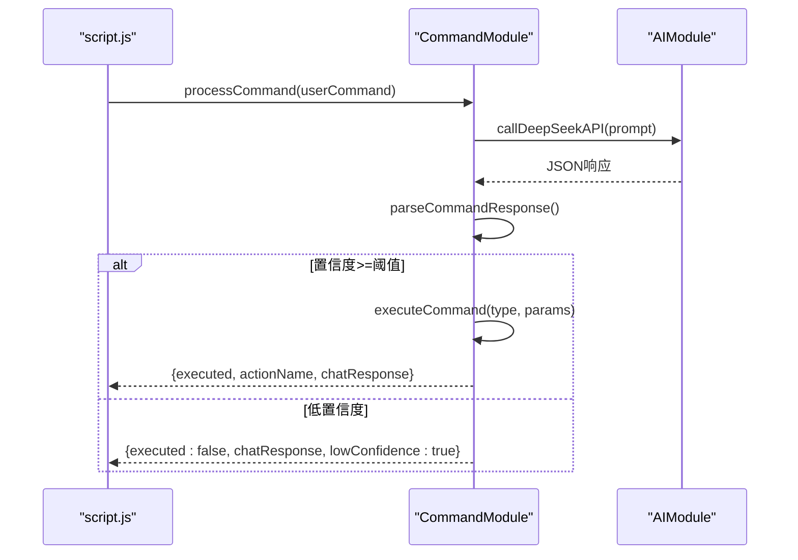
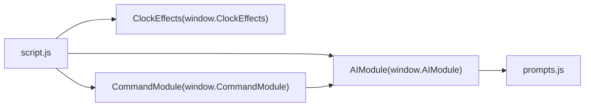

# JavaScript模块架构

<cite>
**本文引用的文件**
- [script.js](file://script.js)
- [ai-module.js](file://ai-module.js)
- [effects.js](file://effects.js)
- [command-module.js](file://command-module.js)
- [prompts.js](file://prompts.js)
- [index.html](file://index.html)
- [README.md](file://README.md)
</cite>

## 目录
1. [简介](#简介)
2. [项目结构](#项目结构)
3. [核心组件](#核心组件)
4. [架构总览](#架构总览)
5. [详细组件分析](#详细组件分析)
6. [依赖关系分析](#依赖关系分析)
7. [性能考量](#性能考量)
8. [故障排查指南](#故障排查指南)
9. [结论](#结论)

## 简介
本文件面向work-timer项目的JavaScript模块架构，系统性梳理script.js作为主控制器如何协调ai-module.js、effects.js与command-module.js等子模块，阐明模块职责划分、事件驱动与window对象接口通信机制，并通过可视化图示展示模块间调用关系与数据流。

## 项目结构
work-timer采用“主控制器 + 子模块”的前端模块化组织方式：
- 主控制器：script.js，负责状态管理、事件绑定、页面初始化、定时任务与跨模块编排
- 子模块：
  - ai-module.js：封装AI能力（DeepSeek API调用、问候语、摸鱼吉日签、工作总结、通用分析）
  - effects.js：提供Canvas特效类，实现打卡时的阳光/礼花特效
  - command-module.js：解析自然语言指令，意图识别与动作执行
  - prompts.js：集中管理AI提示词与兜底文案，供AI模块与外部页面共享
- 页面入口：index.html，按顺序引入prompts.js、ai-module.js、command-module.js、effects.js，最后加载script.js

图表来源
- [index.html](file://index.html#L1-L12)
- [script.js](file://script.js#L95-L155)
- [ai-module.js](file://ai-module.js#L207-L216)
- [command-module.js](file://command-module.js#L306-L312)
- [effects.js](file://effects.js#L276-L279)
- [prompts.js](file://prompts.js#L153-L159)

章节来源
- [index.html](file://index.html#L1-L12)
- [README.md](file://README.md#L90-L125)

## 核心组件
- script.js（主控制器）
  - 职责：页面初始化、标签页切换、侧边栏/底部导航、番茄钟、打卡流程、时间轴、开发者设置、定时更新、AI指令入口、事件驱动编排
  - 关键能力：事件绑定、状态持久化、定时器、UI交互、跨模块调用
- ai-module.js（AI模块）
  - 职责：封装DeepSeek API调用、问候语、摸鱼吉日签、工作总结、通用分析；通过window对象暴露AIModule接口
- effects.js（特效模块）
  - 职责：Canvas粒子系统，实现上班打卡阳光特效与下班打卡礼花特效；通过window对象暴露ClockEffects类
- command-module.js（命令模块）
  - 职责：自然语言指令理解与执行，意图识别、置信度判断、动作映射；通过window对象暴露CommandModule接口
- prompts.js（提示词与兜底）
  - 职责：统一管理AI提示词模板与兜底文案，供AI模块与外部页面共享

章节来源
- [script.js](file://script.js#L95-L155)
- [ai-module.js](file://ai-module.js#L1-L216)
- [effects.js](file://effects.js#L1-L279)
- [command-module.js](file://command-module.js#L1-L313)
- [prompts.js](file://prompts.js#L1-L159)

## 架构总览
work-timer采用“主控制器 + 子模块 + 全局接口”的事件驱动架构：
- 主控制器通过window对象访问各子模块接口，形成松耦合的模块间通信
- 子模块通过window对象导出API，供主控制器与外部页面调用
- 事件驱动体现在：页面加载事件、按钮点击事件、定时器、AI助手面板交互等

图表来源
- [script.js](file://script.js#L546-L732)
- [script.js](file://script.js#L990-L1030)
- [script.js](file://script.js#L3100-L3151)
- [command-module.js](file://command-module.js#L182-L259)
- [ai-module.js](file://ai-module.js#L14-L59)
- [effects.js](file://effects.js#L25-L86)

## 详细组件分析

### 主控制器 script.js 的职责与流程
- 页面初始化与事件绑定
  - DOMContentLoaded触发后加载时间轴、初始化标签页/侧边栏、番茄钟、AI设置、打卡、时间轴、快捷功能、日历事件
  - 事件绑定包括：清空缓存、标签页切换、侧边栏开关、番茄钟控制、打卡按钮、AI助手面板交互等
- 状态管理与持久化
  - 工作时间配置、开发者模式与自定义时间、节假日与串休配置、今日时间轴、打卡状态等均通过localStorage持久化
- 事件驱动与定时更新
  - 每秒更新倒计时与绑定主卡片事件，定时刷新按钮状态
- 跨模块编排
  - 在打卡流程中协调特效模块与AI模块；在AI助手面板中协调命令模块与AI模块；在下班打卡中调用AI生成工作总结并渲染UI

图表来源
- [script.js](file://script.js#L95-L155)
- [script.js](file://script.js#L1097-L1101)

章节来源
- [script.js](file://script.js#L95-L155)
- [script.js](file://script.js#L1097-L1101)
- [script.js](file://script.js#L1132-L1189)

### AI模块 ai-module.js 的职责与接口
- 能力范围
  - DeepSeek API封装：callDeepSeekAPI
  - 问候语：getAIGreeting（简化版，直接返回文案）
  - 摸鱼吉日签：getMoyuFortune（带兜底）
  - 工作总结：generateWorkSummary（带兜底）
  - 通用分析：callAIAnalysis（基于模板）
- 接口导出
  - 通过window对象导出AIModule，供其他模块调用
- 数据流
  - 从prompts.js读取模板，拼装参数后调用DeepSeek API
  - 对AI返回进行解析与兜底处理，统一返回结构

图表来源
- [ai-module.js](file://ai-module.js#L1-L216)
- [prompts.js](file://prompts.js#L1-L159)

章节来源
- [ai-module.js](file://ai-module.js#L1-L216)
- [prompts.js](file://prompts.js#L1-L159)

### 特效模块 effects.js 的职责与接口
- 职责
  - Canvas粒子系统，实现上班打卡的“阳光特效”与下班打卡的“礼花特效”
  - 提供playSunshine、playFireworks、animate、clear等方法
- 接口导出
  - 通过window对象导出ClockEffects类，供主控制器实例化与调用
- 性能特性
  - 使用requestAnimationFrame优化动画流畅度，按帧过滤与清理粒子，避免内存泄漏

图表来源
- [effects.js](file://effects.js#L1-L279)

章节来源
- [effects.js](file://effects.js#L1-L279)

### 命令模块 command-module.js 的职责与接口
- 职责
  - 自然语言指令理解：基于模板判断意图、置信度与参数
  - 动作执行：将意图映射为页面操作（如打卡、启动番茄钟、切换标签页、摸鱼等）
  - 聊天模式：低置信度时转为聊天回复
- 接口导出
  - 通过window对象导出processCommand、executeCommand、COMMAND_TYPES
- 数据流
  - 调用AIModule.callDeepSeekAPI理解用户输入，解析JSON后执行对应动作，返回执行状态与聊天回复

图表来源
- [command-module.js](file://command-module.js#L182-L259)
- [command-module.js](file://command-module.js#L74-L181)

章节来源
- [command-module.js](file://command-module.js#L1-L313)

### 页面入口与模块加载顺序
- index.html按顺序引入脚本：prompts.js → ai-module.js → command-module.js → effects.js → script.js
- 该顺序确保：
  - prompts.js先提供AI提示词与兜底文案
  - ai-module.js导出AIModule接口
  - command-module.js导出CommandModule接口
  - effects.js导出ClockEffects类
  - script.js最后加载，统一绑定事件与初始化

章节来源
- [index.html](file://index.html#L1-L12)

## 依赖关系分析
- 模块间依赖
  - script.js依赖：AIModule（AI）、ClockEffects（特效）、CommandModule（自然语言）、localStorage（状态）
  - ai-module.js依赖：prompts.js（模板）、localStorage（API密钥）
  - command-module.js依赖：AIModule（推理与解析）
  - effects.js无外部依赖，仅依赖Canvas API
- 事件驱动
  - 页面生命周期事件（DOMContentLoaded）、用户交互事件（按钮点击、键盘事件）、定时器事件（每秒更新）

图表来源
- [script.js](file://script.js#L476-L490)
- [script.js](file://script.js#L546-L732)
- [script.js](file://script.js#L990-L1030)
- [script.js](file://script.js#L3100-L3151)
- [command-module.js](file://command-module.js#L182-L259)
- [ai-module.js](file://ai-module.js#L207-L216)
- [effects.js](file://effects.js#L276-L279)
- [prompts.js](file://prompts.js#L153-L159)

章节来源
- [script.js](file://script.js#L476-L490)
- [script.js](file://script.js#L546-L732)
- [script.js](file://script.js#L990-L1030)
- [script.js](file://script.js#L3100-L3151)
- [command-module.js](file://command-module.js#L182-L259)
- [ai-module.js](file://ai-module.js#L207-L216)
- [effects.js](file://effects.js#L276-L279)
- [prompts.js](file://prompts.js#L153-L159)

## 性能考量
- 动画性能
  - 使用requestAnimationFrame优化Canvas动画，避免高频重绘
  - 按帧过滤与清理粒子，防止内存累积
- 网络请求
  - AI请求采用合理的temperature与maxTokens，降低超时风险
  - 对AI调用失败提供兜底策略，避免阻塞UI
- 事件与定时器
  - 每秒定时器仅做必要更新，避免频繁DOM操作
  - 侧边栏/模态框的显隐通过CSS类切换，减少复杂计算

[本节为通用指导，无需列出具体文件来源]

## 故障排查指南
- API密钥问题
  - 现象：AI测试失败或无法生成摸鱼吉日签/工作总结
  - 排查：确认已在设置页保存DeepSeek API密钥；检查网络连通性；查看status提示
- 置信度导致的“聊天模式”
  - 现象：自然语言指令未执行，仅返回聊天回复
  - 排查：提高表达明确度；确认置信度阈值；查看低置信度提示
- 特效异常
  - 现象：打卡特效不显示或卡顿
  - 排查：检查Canvas元素是否存在；确认浏览器支持Canvas；查看控制台错误
- 时间轴与打卡状态
  - 现象：时间轴为空或打卡状态异常
  - 排查：检查localStorage中timeline与lastClockIn相关键值；确认日期切换逻辑

章节来源
- [script.js](file://script.js#L476-L490)
- [command-module.js](file://command-module.js#L217-L231)
- [effects.js](file://effects.js#L25-L86)
- [script.js](file://script.js#L1161-L1189)

## 结论
work-timer通过“主控制器 + 子模块 + 全局接口”的架构实现了清晰的职责分离与松耦合通信。script.js作为主控制器承担状态管理与事件驱动编排，ai-module.js、effects.js、command-module.js分别提供AI能力、特效与自然语言指令解析，prompts.js统一管理提示词与兜底文案。模块间通过window对象暴露接口，形成稳定的事件驱动交互链路，既保证了功能扩展性，也提升了用户体验与可维护性。