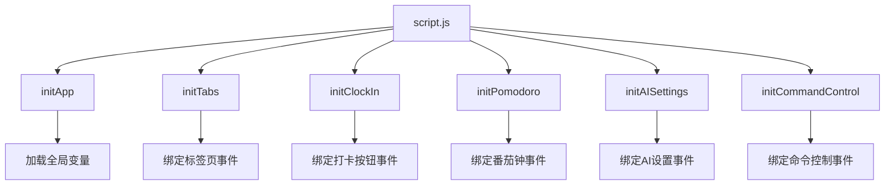
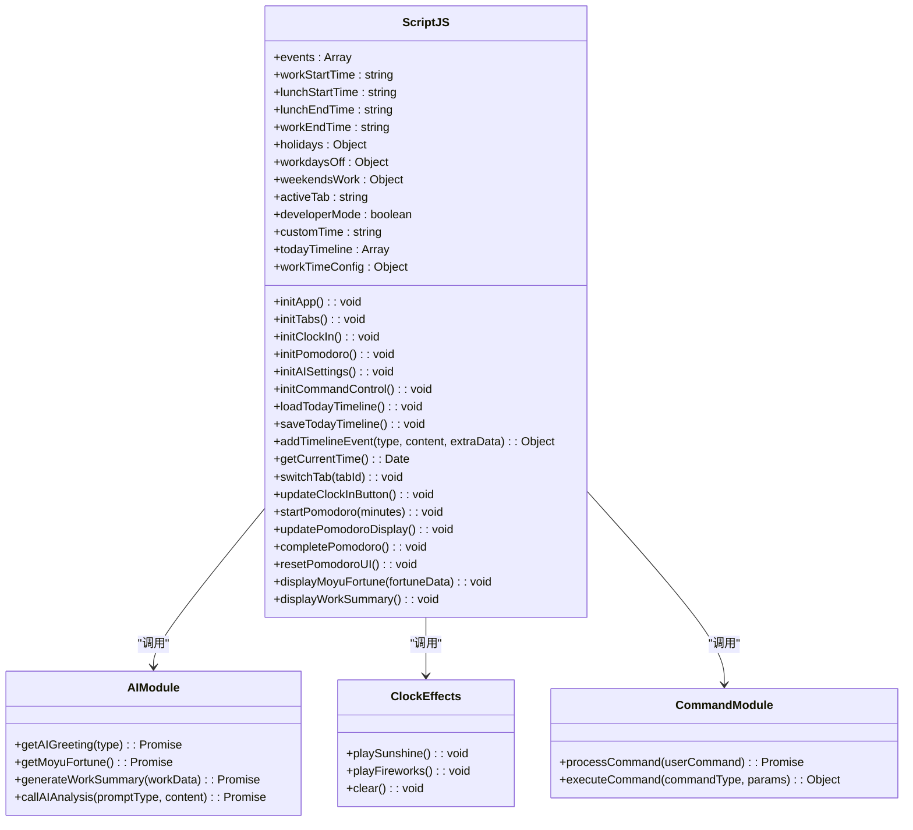
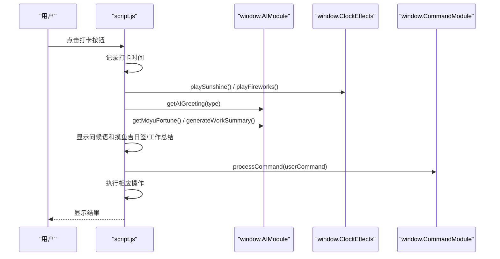
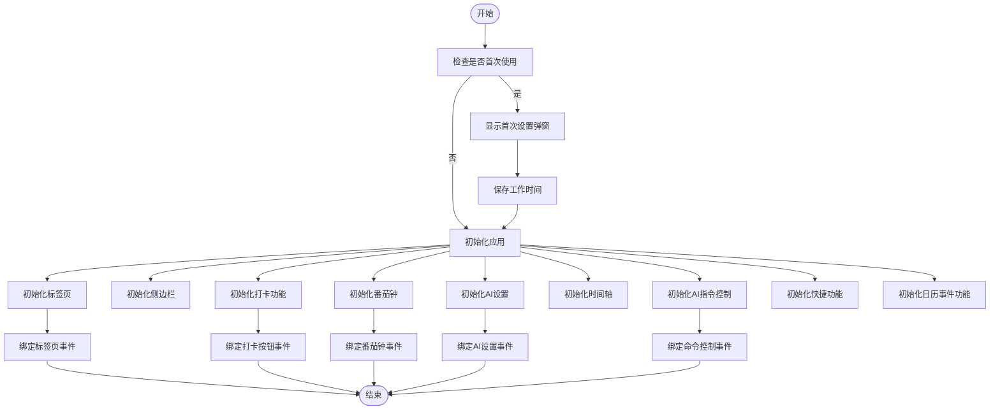
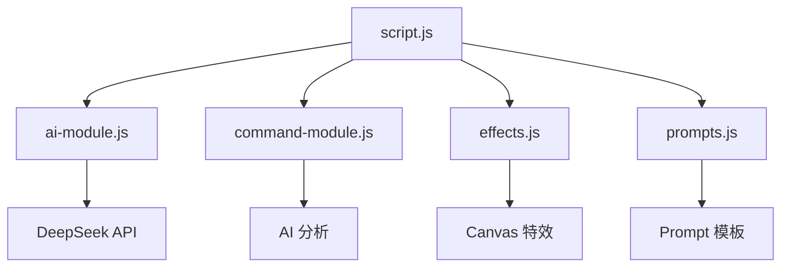

# 主控制器模块

<cite>
**本文档引用的文件**
- [script.js](file://script.js)
- [ai-module.js](file://ai-module.js)
- [command-module.js](file://command-module.js)
- [effects.js](file://effects.js)
- [prompts.js](file://prompts.js)
- [index.html](file://index.html)
</cite>

## 目录
1. [引言](#引言)
2. [项目结构](#项目结构)
3. [核心组件](#核心组件)
4. [架构概述](#架构概述)
5. [详细组件分析](#详细组件分析)
6. [依赖分析](#依赖分析)
7. [性能考虑](#性能考虑)
8. [故障排除指南](#故障排除指南)
9. [结论](#结论)

## 引言
`script.js` 文件是 work-timer 应用的核心控制中枢，负责协调 AI 功能、视觉特效、命令控制等子模块。该模块通过全局变量管理、DOM 事件绑定、用户交互处理、状态维护、数据持久化（localStorage）以及跨模块协调，构建了应用的启动流程和运行逻辑。

## 项目结构
work-timer 应用的项目结构清晰，主要文件包括 `script.js`、`ai-module.js`、`command-module.js`、`effects.js`、`prompts.js` 和 `index.html`。这些文件共同构成了应用的核心功能。

## 核心组件
`script.js` 文件作为主控制器模块，负责初始化应用、管理全局状态、处理用户交互和协调子模块。

**Section sources**
- [script.js](file://script.js#L1-L3151)

## 架构概述
`script.js` 模块通过 `initApp`、`initTabs`、`initClockIn` 等初始化函数构建应用启动流程，并通过 `window` 对象暴露这些函数，实现模块间的协调。

**Diagram sources**
- [script.js](file://script.js#L94-L1205)

## 详细组件分析

### 主控制器分析
`script.js` 模块作为主控制器，通过全局变量管理应用状态，通过 DOM 事件绑定处理用户交互，通过 `localStorage` 实现数据持久化，并通过调用 `window.AIModule`、`window.ClockEffects` 和 `window.CommandModule` 等全局模块接口，协调 AI 功能、视觉特效和命令控制。

#### 对于对象导向的组件：

**Diagram sources**
- [script.js](file://script.js#L1-L3151)
- [ai-module.js](file://ai-module.js#L1-L216)
- [effects.js](file://effects.js#L1-L279)
- [command-module.js](file://command-module.js#L1-L313)

#### 对于 API/服务组件：

**Diagram sources**
- [script.js](file://script.js#L547-L728)
- [ai-module.js](file://ai-module.js#L66-L167)
- [effects.js](file://effects.js#L26-L86)
- [command-module.js](file://command-module.js#L185-L250)

#### 对于复杂逻辑组件：

**Diagram sources**
- [script.js](file://script.js#L94-L145)

### 概念概述
`script.js` 模块通过 `initApp` 函数初始化应用，加载全局变量，绑定事件处理程序，并协调子模块的初始化。

## 依赖分析
`script.js` 模块依赖于 `ai-module.js`、`command-module.js`、`effects.js` 和 `prompts.js` 等子模块，通过 `window` 对象暴露的接口进行调用。

**Diagram sources**
- [script.js](file://script.js#L94-L1205)
- [ai-module.js](file://ai-module.js#L1-L216)
- [command-module.js](file://command-module.js#L1-L313)
- [effects.js](file://effects.js#L1-L279)
- [prompts.js](file://prompts.js#L1-L159)

## 性能考虑
`script.js` 模块通过 `setInterval` 定时更新倒计时，通过 `localStorage` 实现数据持久化，通过异步调用 AI 接口避免阻塞主线程。

## 故障排除指南
如果应用无法正常启动，请检查 `script.js` 文件是否正确加载，检查 `localStorage` 中的配置是否正确，检查 AI API 密钥是否有效。

**Section sources**
- [script.js](file://script.js#L94-L1205)
- [ai-module.js](file://ai-module.js#L424-L491)

## 结论
`script.js` 模块作为 work-timer 应用的核心控制中枢，通过协调 AI 功能、视觉特效、命令控制等子模块，实现了应用的启动流程和运行逻辑。该模块通过全局变量管理、DOM 事件绑定、用户交互处理、状态维护、数据持久化和跨模块协调，构建了一个功能丰富、用户体验良好的应用。