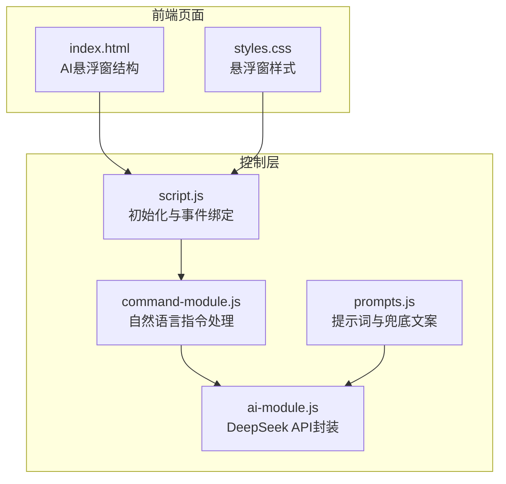
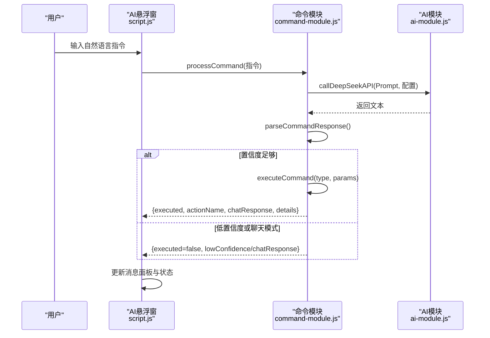
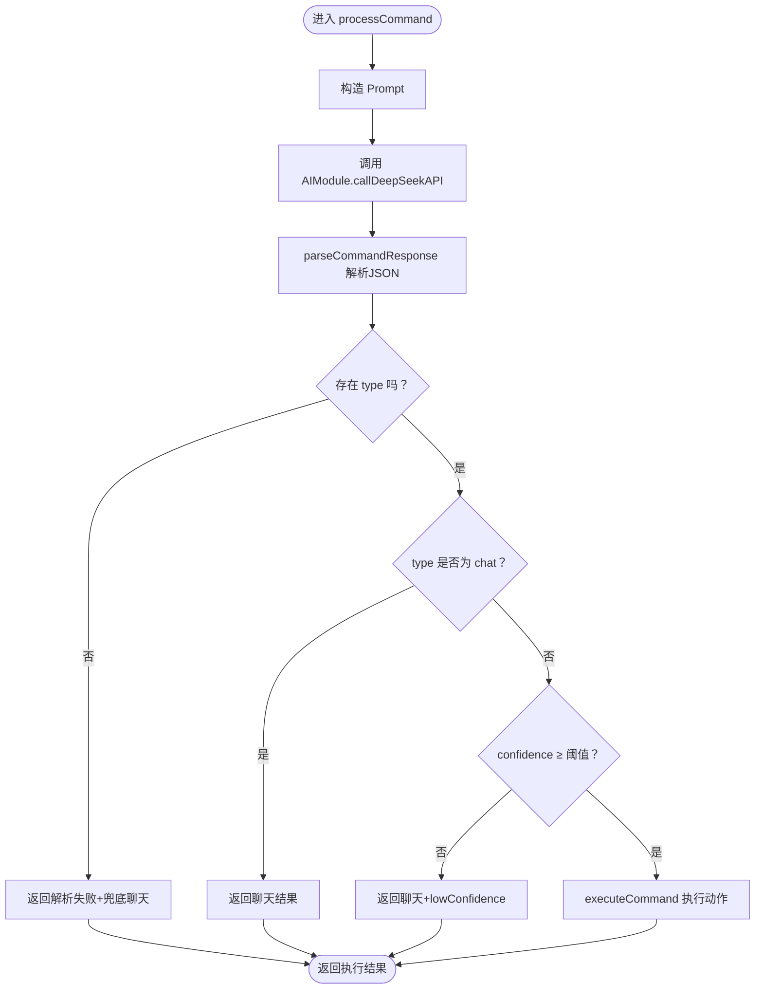
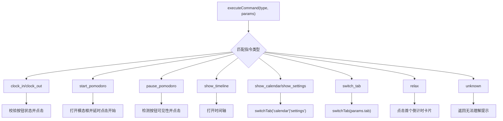
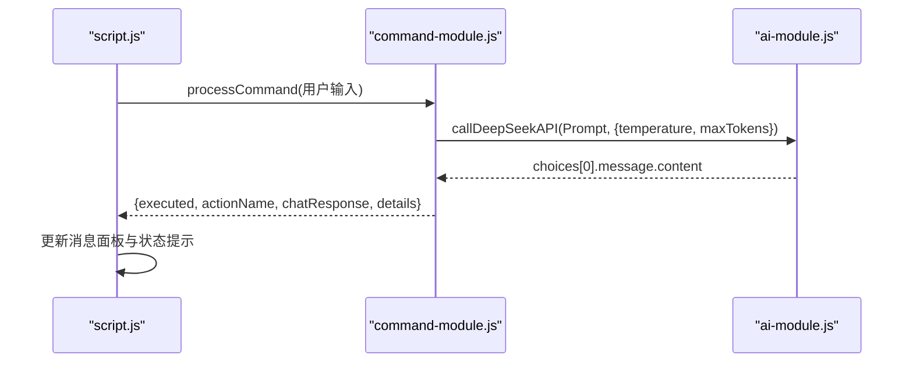
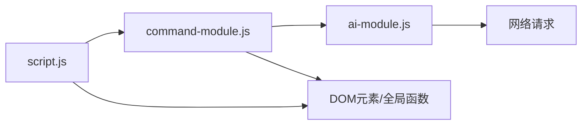

# 命令控制模块

<cite>
**本文引用的文件**
- [command-module.js](file://command-module.js)
- [ai-module.js](file://ai-module.js)
- [prompts.js](file://prompts.js)
- [script.js](file://script.js)
- [index.html](file://index.html)
- [styles.css](file://styles.css)
</cite>

## 目录
1. [简介](#简介)
2. [项目结构](#项目结构)
3. [核心组件](#核心组件)
4. [架构总览](#架构总览)
5. [详细组件分析](#详细组件分析)
6. [依赖关系分析](#依赖关系分析)
7. [性能考量](#性能考量)
8. [故障排查指南](#故障排查指南)
9. [结论](#结论)

## 简介
本文件面向“命令控制模块”的设计与实现，围绕 command-module.js 展开，系统性说明其如何通过大模型对自然语言指令进行意图理解与执行。文档重点包括：
- COMMAND_TYPES 枚举定义的可执行指令类型及其典型用法
- COMMAND_UNDERSTANDING_PROMPT 提示词模板的设计思路与约束
- processCommand 的处理流程：发送 Prompt、解析 JSON、置信度判断、执行动作
- executeCommand 的执行策略：模拟 DOM 点击与调用全局函数（如 switchTab）
- 与主控制器 script.js 和 AI 模块 ai-module.js 的协同工作方式
- 与前端界面（悬浮窗）的集成路径

## 项目结构
命令控制模块位于独立脚本文件中，通过全局命名空间 window.CommandModule 暴露给主控制器使用；AI 能力由独立的 ai-module.js 提供；提示词模板集中于 prompts.js；主控制器 script.js 负责初始化 AI 悬浮窗并与 CommandModule 协同。

图表来源
- [index.html](file://index.html#L47-L66)
- [styles.css](file://styles.css#L117-L200)
- [script.js](file://script.js#L922-L1030)
- [command-module.js](file://command-module.js#L184-L259)
- [ai-module.js](file://ai-module.js#L14-L59)
- [prompts.js](file://prompts.js#L1-L159)

章节来源
- [index.html](file://index.html#L47-L66)
- [styles.css](file://styles.css#L117-L200)
- [script.js](file://script.js#L922-L1030)
- [command-module.js](file://command-module.js#L184-L259)
- [ai-module.js](file://ai-module.js#L14-L59)
- [prompts.js](file://prompts.js#L1-L159)

## 核心组件
- 指令类型常量 COMMAND_TYPES：定义所有可执行指令的枚举值，涵盖打卡、番茄钟、时间轴、日历、标签页切换、摸鱼、设置、聊天模式与未知类型。
- 提示词模板 COMMAND_UNDERSTANDING_PROMPT：指导大模型将自然语言解析为结构化 JSON，包含 type、confidence、params、chat_response 字段，并设定置信度阈值与聊天模式规则。
- 解析函数 parseCommandResponse：从大模型返回文本中提取 JSON 片段并解析，增强鲁棒性。
- 执行函数 executeCommand：根据指令类型映射到 DOM 操作或全局函数调用，返回执行结果与消息。
- 处理函数 processCommand：串联 Prompt 发送、JSON 解析、置信度判断与执行动作，统一返回结构化结果。
- 名称映射函数 getActionName/getTabName：用于 UI 展示与状态提示。
- 导出接口 window.CommandModule：供主控制器调用。

章节来源
- [command-module.js](file://command-module.js#L7-L19)
- [command-module.js](file://command-module.js#L24-L54)
- [command-module.js](file://command-module.js#L59-L72)
- [command-module.js](file://command-module.js#L77-L180)
- [command-module.js](file://command-module.js#L184-L259)
- [command-module.js](file://command-module.js#L264-L292)
- [command-module.js](file://command-module.js#L306-L312)

## 架构总览
命令控制模块的调用链路如下：主控制器 script.js 初始化 AI 悬浮窗并监听输入；收到用户输入后调用 window.CommandModule.processCommand；processCommand 构造 Prompt 并调用 window.AIModule.callDeepSeekAPI；解析返回的 JSON 后根据置信度决定是否执行动作；executeCommand 通过 DOM 或全局函数完成实际操作；最终将结果与聊天回复返回给 UI。

图表来源
- [script.js](file://script.js#L922-L1030)
- [command-module.js](file://command-module.js#L184-L259)
- [ai-module.js](file://ai-module.js#L14-L59)

## 详细组件分析

### 指令类型与意图设计（COMMAND_TYPES 与 COMMAND_UNDERSTANDING_PROMPT）
- 指令类型
  - 上下班打卡：clock_in、clock_out
  - 番茄钟：start_pomodoro、pause_pomodoro
  - 时间轴与日历：show_timeline、show_calendar
  - 标签页切换：switch_tab（携带 tab 参数）
  - 摸鱼：relax
  - 设置：show_settings
  - 聊天模式：chat（当用户仅闲聊时）
  - 未知：unknown（兜底）
- 提示词模板设计要点
  - 明确列出可用操作类型与示例，降低歧义
  - 强制返回结构化 JSON，包含 type、confidence、params、chat_response
  - 设定置信度阈值（>0.7）作为执行门槛
  - chat_response 应自然友好，避免生硬
  - 仅返回 JSON，禁止多余文本

章节来源
- [command-module.js](file://command-module.js#L7-L19)
- [command-module.js](file://command-module.js#L24-L54)

### 处理流程（processCommand）
- 构造 Prompt：将用户输入注入模板
- 调用 AI：通过 window.AIModule.callDeepSeekAPI 发送请求，设置较低温度以提升确定性
- 解析响应：parseCommandResponse 提取 JSON 片段并解析
- 意图判断：
  - 若 type 为 chat，返回聊天结果，不执行操作
  - 若置信度低于阈值，返回聊天提示，标记 lowConfidence
  - 否则执行对应动作
- 执行动作：调用 executeCommand，返回成功与否与消息
- 结果组装：统一返回 success/executed/actionName/chatResponse/details

图表来源
- [command-module.js](file://command-module.js#L184-L259)

章节来源
- [command-module.js](file://command-module.js#L184-L259)

### 执行策略（executeCommand）
- 上下班打卡：根据按钮状态判断当前可执行的动作，模拟点击
- 番茄钟：打开模态框后延时点击开始按钮；暂停时检测按钮可见性
- 时间轴：打开时间轴模态框
- 日历与设置：调用全局函数 switchTab 切换到 calendar 或 settings
- 标签页切换：switchTab(tab)，并根据 tab 名称映射中文显示
- 摸鱼：点击第一个倒计时卡片触发摸鱼事件
- 未知：返回无法理解的友好提示

图表来源
- [command-module.js](file://command-module.js#L77-L180)

章节来源
- [command-module.js](file://command-module.js#L77-L180)

### 与主控制器和 AI 模块的协同
- 主控制器 script.js
  - 初始化 AI 悬浮窗：绑定开关、关闭、输入与发送按钮
  - 监听发送事件：调用 window.CommandModule.processCommand，展示聊天回复与执行状态
  - 支持回车提交
- AI 模块 ai-module.js
  - 封装 DeepSeek API 调用，统一错误处理与响应解析
  - 提供 getAIGreeting、getMoyuFortune、generateWorkSummary 等辅助能力（与命令控制模块互补）

图表来源
- [script.js](file://script.js#L922-L1030)
- [command-module.js](file://command-module.js#L184-L259)
- [ai-module.js](file://ai-module.js#L14-L59)

章节来源
- [script.js](file://script.js#L922-L1030)
- [ai-module.js](file://ai-module.js#L14-L59)

### 与界面的集成
- 悬浮窗结构：index.html 中定义 AI 悬浮窗容器、消息区域、输入与发送按钮
- 样式：styles.css 控制悬浮窗位置、外观与显示状态
- 主控制器初始化：在页面加载完成后调用 initCommandControl，建立事件绑定与交互

章节来源
- [index.html](file://index.html#L47-L66)
- [styles.css](file://styles.css#L117-L200)
- [script.js](file://script.js#L922-L1030)

## 依赖关系分析
- 命令模块依赖
  - window.AIModule：提供 DeepSeek API 调用能力
  - 全局函数 switchTab：用于标签页切换
  - DOM 元素：按钮与模态框 ID 与类名
- AI 模块依赖
  - localStorage 存储 API Key
  - fetch 发起 HTTP 请求
- 主控制器依赖
  - window.CommandModule：调用 processCommand
  - DOM 元素：AI 悬浮窗相关节点

图表来源
- [script.js](file://script.js#L922-L1030)
- [command-module.js](file://command-module.js#L184-L259)
- [ai-module.js](file://ai-module.js#L14-L59)

章节来源
- [script.js](file://script.js#L922-L1030)
- [command-module.js](file://command-module.js#L184-L259)
- [ai-module.js](file://ai-module.js#L14-L59)

## 性能考量
- 温度参数：processCommand 使用较低温度以提升意图判断稳定性，减少歧义
- JSON 解析：parseCommandResponse 采用正则提取 JSON 片段，增强对非标准返回的兼容性
- UI 延时：executeCommand 在打开模态框后使用短延时再点击子按钮，确保 DOM 可见后再交互
- 错误兜底：主控制器对异常进行捕获并提示，避免阻断用户交互

[本节为通用性能讨论，无需特定文件来源]

## 故障排查指南
- API 密钥未配置
  - 现象：调用 AIModule 抛出未配置密钥错误
  - 处理：在设置页保存 DeepSeek API Key，或在本地存储中设置
- 大模型返回格式异常
  - 现象：parseCommandResponse 解析失败，返回空
  - 处理：processCommand 会兜底为聊天回复；可在 UI 中查看 details.rawResponse 定位问题
- 置信度不足
  - 现象：返回 lowConfidence，未执行动作
  - 处理：调整指令表达或增加示例关键词，提升置信度
- 执行失败
  - 现象：executeCommand 返回失败消息
  - 处理：检查对应 DOM 元素是否存在、按钮状态是否允许点击；确认 switchTab 是否可用
- 悬浮窗无响应
  - 现象：点击发送无反应
  - 处理：确认 initCommandControl 已执行、相关 DOM 节点存在、未被样式遮挡

章节来源
- [ai-module.js](file://ai-module.js#L14-L59)
- [command-module.js](file://command-module.js#L59-L72)
- [command-module.js](file://command-module.js#L184-L259)
- [script.js](file://script.js#L922-L1030)

## 结论
命令控制模块通过精心设计的提示词模板与严格的置信度阈值，实现了对自然语言指令的稳定理解与执行。其与主控制器和 AI 模块的解耦设计，使得交互体验流畅、扩展性强。在实际使用中，建议：
- 为用户提供常见指令示例，提升置信度
- 在 UI 中展示执行状态与聊天回复，增强透明度
- 对关键 DOM 与全局函数做好健壮性检查，提升稳定性