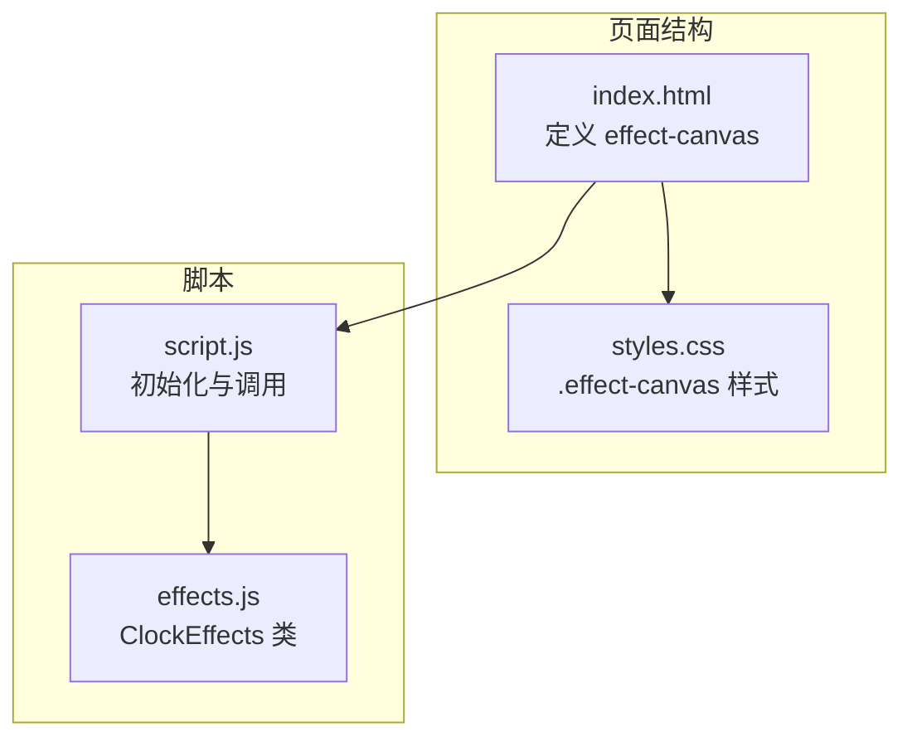
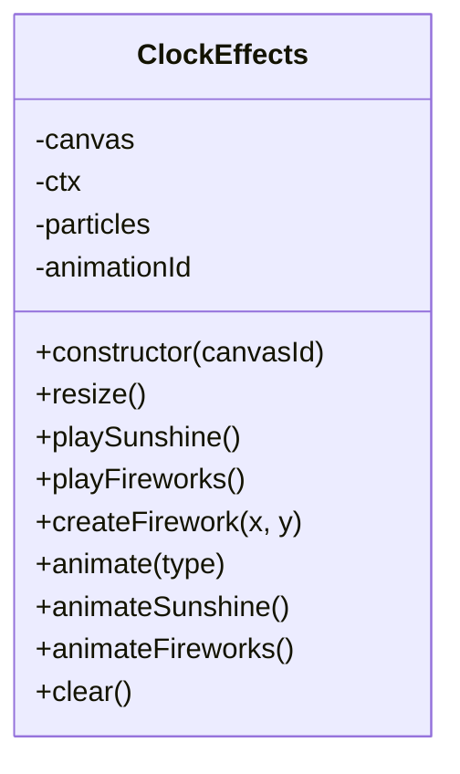
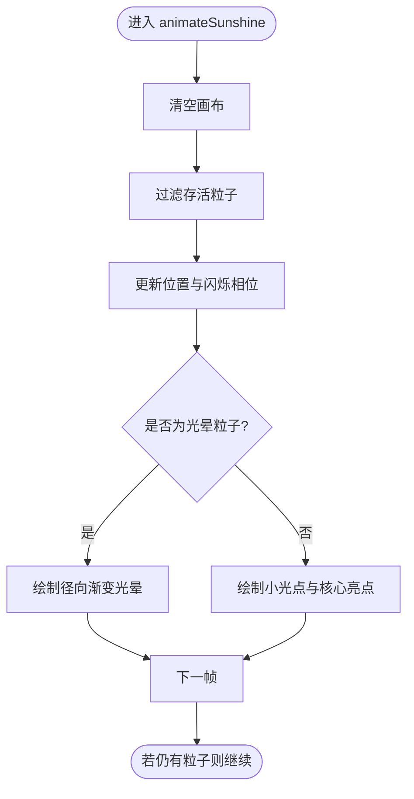
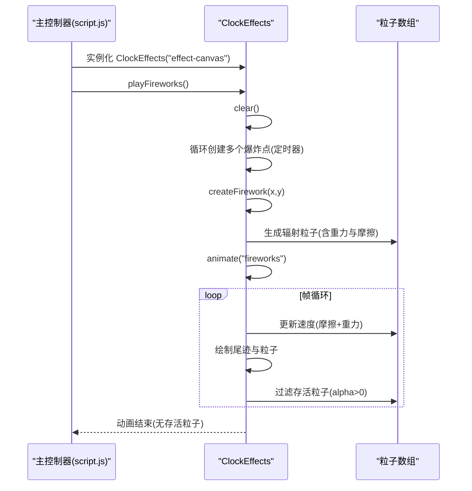
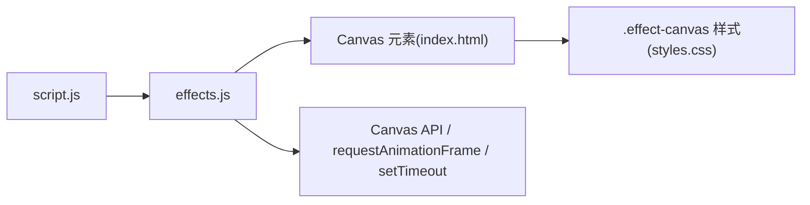

# 视觉特效模块

<cite>
**本文引用的文件**
- [effects.js](file://effects.js)
- [script.js](file://script.js)
- [index.html](file://index.html)
- [styles.css](file://styles.css)
- [README.md](file://README.md)
</cite>

## 目录
1. [简介](#简介)
2. [项目结构](#项目结构)
3. [核心组件](#核心组件)
4. [架构总览](#架构总览)
5. [详细组件分析](#详细组件分析)
6. [依赖关系分析](#依赖关系分析)
7. [性能考量](#性能考量)
8. [故障排查指南](#故障排查指南)
9. [结论](#结论)

## 简介
本文件聚焦于视觉特效模块，深入解析 effects.js 中 ClockEffects 类的设计与实现，说明其如何基于 HTML5 Canvas API 构建全屏动画效果。重点涵盖两类特效：
- 上班打卡的“阳光特效”：通过粒子系统模拟阳光洒落，包含粒子初始化、运动轨迹、闪烁与光晕渲染。
- 下班打卡的“礼花特效”：通过定时器创建多个爆炸点，每个爆炸点生成带速度、重力与摩擦力的粒子群，并绘制粒子尾迹增强视觉。

同时说明 animate、clear 等核心方法如何驱动动画循环与资源清理，并给出主控制器中实例化与调用的示例路径。

## 项目结构
- 效果模块位于 effects.js，提供 ClockEffects 类。
- 主控制器在 script.js 中初始化 Canvas 并调用特效。
- 页面结构在 index.html 中定义特效画布元素 effect-canvas。
- 样式在 styles.css 中对特效画布进行绝对定位与层级控制。

图表来源
- [index.html](file://index.html#L120-L165)
- [styles.css](file://styles.css#L1984-L1993)
- [effects.js](file://effects.js#L1-L279)
- [script.js](file://script.js#L547-L732)

章节来源
- [index.html](file://index.html#L120-L165)
- [styles.css](file://styles.css#L1984-L1993)
- [effects.js](file://effects.js#L1-L279)
- [script.js](file://script.js#L547-L732)

## 核心组件
- ClockEffects 类：封装 Canvas 初始化、全屏尺寸适配、粒子系统、动画循环与清理。
- playSunshine：构建阳光粒子与光晕，启动“阳光特效”动画。
- playFireworks：定时创建多个爆炸点，启动“礼花特效”动画。
- animate/animateSunshine/animateFireworks：根据类型选择动画分支，驱动帧循环。
- clear：取消动画、清空画布、回收粒子数组。

章节来源
- [effects.js](file://effects.js#L1-L279)

## 架构总览
ClockEffects 作为独立的特效引擎，依赖 HTML5 Canvas API 进行绘制；主控制器负责生命周期管理与触发时机。

图表来源
- [effects.js](file://effects.js#L1-L279)

## 详细组件分析

### ClockEffects 类设计与实现
- 构造与初始化
  - 通过传入的 canvasId 获取 Canvas 元素，获取 2D 上下文。
  - 初始化粒子数组与动画句柄。
  - 设置画布为全屏尺寸，并监听窗口 resize 事件以动态调整。
- 尺寸适配
  - resize 方法将 canvas 宽高设为视口宽高，确保全屏覆盖。
- 动画循环
  - animate 根据类型分派到 animateSunshine 或 animateFireworks。
  - 两套动画均采用 requestAnimationFrame 驱动，逐帧过滤并更新存活粒子。
- 资源清理
  - clear 在下一帧前取消动画、清空画布、重置粒子数组，避免内存泄漏与残留绘制。

章节来源
- [effects.js](file://effects.js#L1-L279)

### 阳光特效（playSunshine）实现原理
- 粒子初始化
  - 创建大量小光点粒子，随机位置、大小、速度与透明度，赋予轻微水平漂移与闪烁相位。
  - 额外创建少量大型光晕粒子，用于营造柔和光晕背景。
- 运动与视觉
  - 每帧更新粒子垂直速度与水平偏移，叠加闪烁相位以产生脉动效果。
  - 使用径向渐变绘制光晕与核心亮点，区分“光晕”与“小光点”的渲染细节。
- 生命周期
  - 过滤掉超出屏幕范围的粒子，维持粒子数量稳定。
  - 若仍有存活粒子，则继续下一帧动画。

图表来源
- [effects.js](file://effects.js#L136-L201)

章节来源
- [effects.js](file://effects.js#L25-L62)
- [effects.js](file://effects.js#L136-L201)

### 礼花特效（playFireworks）实现原理
- 爆炸点创建
  - 通过定时器在短时间内依次创建多个爆炸点，分布在画布横向区域。
  - 每个爆炸点调用 createFirework，生成一组围绕中心辐射的粒子。
- 粒子属性与物理
  - 粒子具备初速度方向与大小，受重力影响向下加速，同时应用摩擦系数降低速度。
  - 粒子具有衰减生命值与对应透明度，透明度随生命值线性变化。
- 视觉细节
  - 内圈闪光粒子使用更强的径向渐变与较小半径，突出爆炸中心。
  - 绘制粒子尾迹：从当前位置向反速度方向绘制线条，体现运动轨迹。
  - 绘制粒子：以圆点填充，结合透明度与颜色，形成绚烂的爆炸效果。
- 生命周期
  - 过滤 alpha<=0 的粒子，维持动画帧内粒子数量可控。

图表来源
- [script.js](file://script.js#L547-L732)
- [effects.js](file://effects.js#L64-L134)
- [effects.js](file://effects.js#L136-L273)

章节来源
- [effects.js](file://effects.js#L64-L134)
- [effects.js](file://effects.js#L136-L273)
- [script.js](file://script.js#L547-L732)

### animate 与 clear 的动画循环与资源清理
- animate
  - 根据传入类型选择具体动画分支，分别处理“阳光”与“礼花”。
- animateSunshine/animateFireworks
  - 清空画布，逐帧更新粒子状态，绘制视觉元素，过滤存活粒子，必要时继续下一帧。
- clear
  - 取消 requestAnimationFrame，清空画布，重置粒子数组，确保下次特效可正常启动。

章节来源
- [effects.js](file://effects.js#L136-L273)

### 主控制器中的实例化与调用示例
- 在打卡按钮点击事件中，主控制器创建 ClockEffects 实例，传入特效画布 id。
- 根据打卡类型决定播放哪种特效：
  - 上班打卡：调用 playSunshine。
  - 下班打卡：调用 playFireworks。
- 关闭弹窗时调用 clear，确保特效资源释放。

章节来源
- [script.js](file://script.js#L547-L732)

## 依赖关系分析
- DOM 依赖
  - 通过 id 获取 Canvas 元素，依赖页面结构中存在对应元素。
- 样式依赖
  - .effect-canvas 样式确保画布绝对定位、全屏覆盖、层级高于内容。
- API 依赖
  - HTML5 Canvas 2D 上下文用于绘制粒子与渐变。
  - requestAnimationFrame 用于高效帧循环。
  - setTimeout 用于“礼花特效”的爆炸点时序控制。

图表来源
- [script.js](file://script.js#L547-L732)
- [effects.js](file://effects.js#L1-L279)
- [index.html](file://index.html#L120-L165)
- [styles.css](file://styles.css#L1984-L1993)

章节来源
- [script.js](file://script.js#L547-L732)
- [effects.js](file://effects.js#L1-L279)
- [index.html](file://index.html#L120-L165)
- [styles.css](file://styles.css#L1984-L1993)

## 性能考量
- 帧循环优化
  - 使用 requestAnimationFrame 驱动动画，避免阻塞主线程，保证流畅度。
- 粒子管理
  - 每帧过滤存活粒子，及时移除超出屏幕或生命耗尽的粒子，避免数组无限增长。
- 绘制优化
  - 使用径向渐变一次性绘制光晕与核心亮点，减少多次绘制调用。
  - 礼花特效绘制尾迹时使用线条绘制，配合圆点粒子，视觉与性能平衡良好。
- 资源回收
  - clear 在切换特效或关闭弹窗时调用，防止动画句柄与粒子数组长期占用内存。

章节来源
- [effects.js](file://effects.js#L136-L273)

## 故障排查指南
- 画布未显示特效
  - 检查页面是否存在 id 为 effect-canvas 的 canvas 元素。
  - 确认 .effect-canvas 样式生效，画布层级与尺寸正确。
- 特效无法停止或残留
  - 确保在关闭弹窗或切换状态时调用 clear，取消动画并清空画布。
- 动画卡顿或掉帧
  - 减少同时存在的粒子数量，或适当降低绘制复杂度（如尾迹长度与粒子半径）。
- 粒子不消失或越积越多
  - 检查 animate 分支中的过滤条件与 alpha/life 更新逻辑是否正确。

章节来源
- [index.html](file://index.html#L120-L165)
- [styles.css](file://styles.css#L1984-L1993)
- [effects.js](file://effects.js#L136-L273)
- [script.js](file://script.js#L547-L732)

## 结论
ClockEffects 通过轻量级粒子系统与 Canvas API，实现了两种富有节日氛围的打卡特效。阳光特效强调柔和光晕与脉动闪烁，礼花特效强调爆炸扩散与尾迹动感。主控制器在合适的时机实例化并调用特效，配合 clear 进行资源回收，确保用户体验流畅且性能稳定。该模块设计简洁、职责清晰，易于扩展新的特效类型。