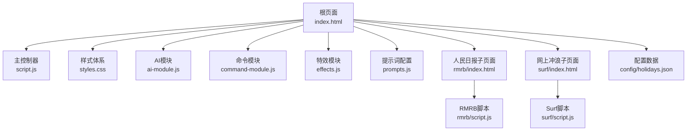
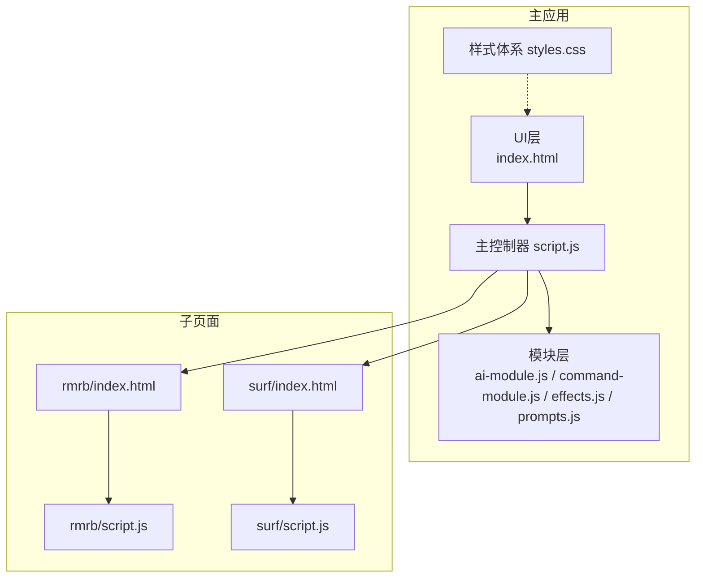
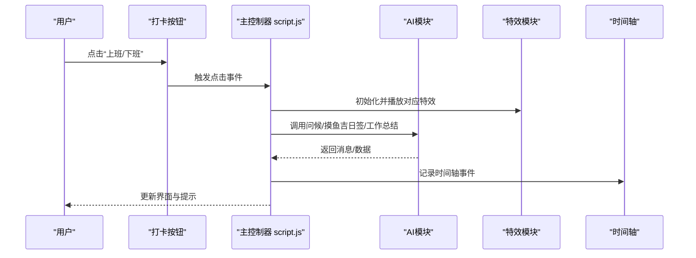
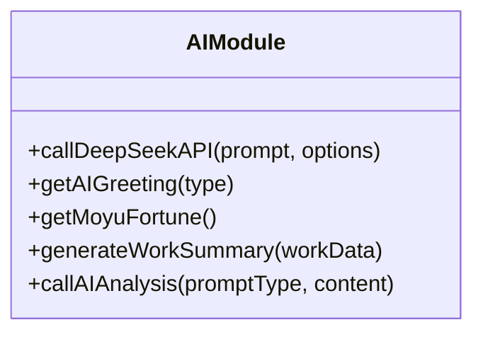
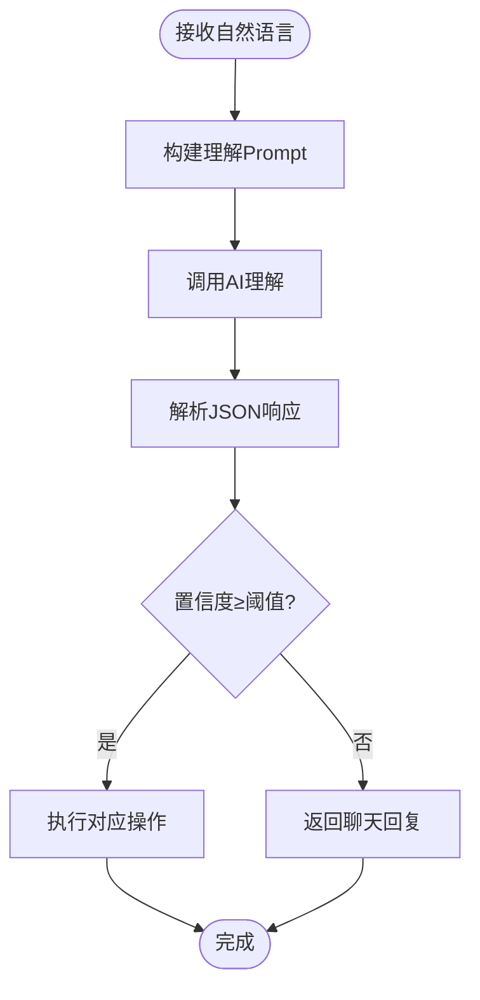
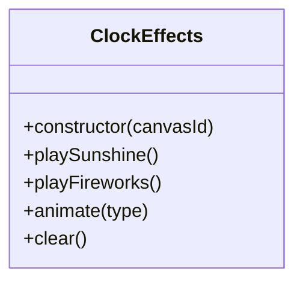
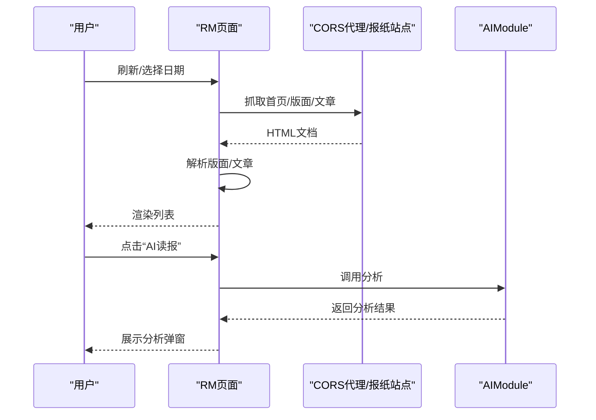
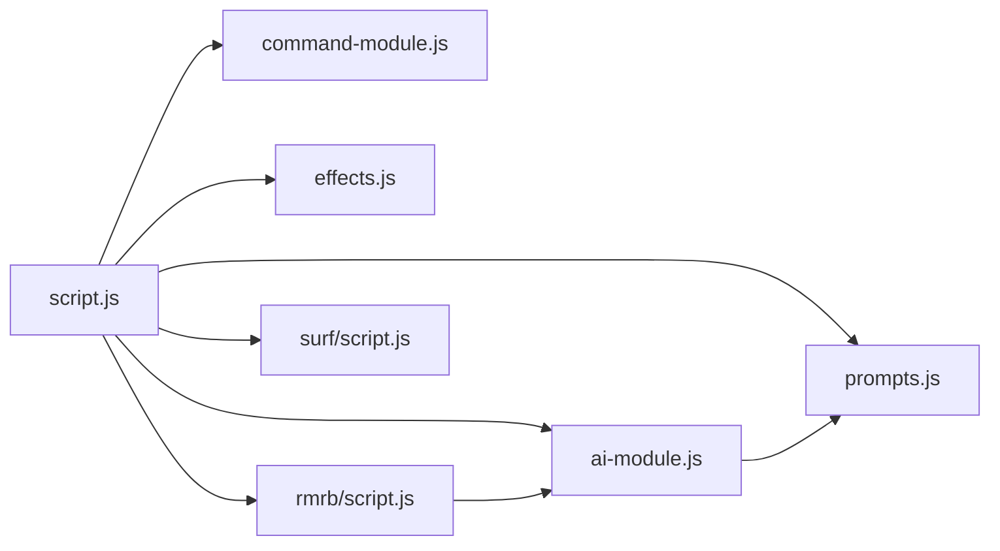

# 技术架构

<cite>
**本文引用的文件**
- [index.html](file://index.html)
- [script.js](file://script.js)
- [styles.css](file://styles.css)
- [ai-module.js](file://ai-module.js)
- [command-module.js](file://command-module.js)
- [effects.js](file://effects.js)
- [prompts.js](file://prompts.js)
- [README.md](file://README.md)
- [rmrb/index.html](file://rmrb/index.html)
- [rmrb/script.js](file://rmrb/script.js)
- [surf/index.html](file://surf/index.html)
- [surf/script.js](file://surf/script.js)
- [config/holidays.json](file://config/holidays.json)
</cite>

## 目录
1. [引言](#引言)
2. [项目结构](#项目结构)
3. [核心组件](#核心组件)
4. [架构总览](#架构总览)
5. [详细组件分析](#详细组件分析)
6. [依赖关系分析](#依赖关系分析)
7. [性能考量](#性能考量)
8. [故障排查指南](#故障排查指南)
9. [结论](#结论)
10. [附录](#附录)

## 引言
本技术文档面向work-timer的整体系统设计，围绕原生JavaScript的模块化架构展开，系统性阐述HTML结构组织、CSS样式体系（含响应式与主题色系）、JavaScript模块职责划分、数据流从用户交互到状态更新再到界面渲染的完整路径，以及全局对象模式与事件驱动架构的实现机制。同时，基于项目分析提供组件关系图的概念描述，说明script.js如何作为主控制器协调其他模块。

## 项目结构
work-timer采用“根页面 + 子页面iframe + 独立模块”的前端架构：
- 根页面index.html承载主应用骨架与全局状态，通过iframe嵌入“人民日报”和“网上冲浪”子页面。
- 子页面各自维护独立的脚本与样式，共享主应用的样式体系。
- 核心功能模块以独立文件形式注入，通过全局命名空间暴露接口，供主控制器统一调度。

图表来源
- [index.html](file://index.html#L1-L485)
- [script.js](file://script.js#L1-L200)
- [styles.css](file://styles.css#L1-L120)
- [ai-module.js](file://ai-module.js#L1-L216)
- [command-module.js](file://command-module.js#L1-L120)
- [effects.js](file://effects.js#L1-L120)
- [prompts.js](file://prompts.js#L1-L120)
- [rmrb/index.html](file://rmrb/index.html#L1-L62)
- [rmrb/script.js](file://rmrb/script.js#L1-L120)
- [surf/index.html](file://surf/index.html#L1-L54)
- [surf/script.js](file://surf/script.js#L1-L80)
- [config/holidays.json](file://config/holidays.json#L1-L46)

章节来源
- [index.html](file://index.html#L1-L120)
- [README.md](file://README.md#L1-L125)

## 核心组件
- 主控制器（script.js）
  - 负责应用初始化、标签页切换、侧边栏、番茄钟、打卡流程、时间轴、设置与开发者模式、AI设置与测试、日历事件等。
  - 通过DOM事件监听与模块方法组合，形成事件驱动的数据流闭环。
- AI模块（ai-module.js）
  - 封装DeepSeek API调用，提供问候语、摸鱼吉日签、工作总结、通用分析等能力；内置兜底策略与错误处理。
- 命令模块（command-module.js）
  - 将自然语言指令解析为结构化动作，桥接AI意图识别与UI交互，支持聊天模式与低置信度降级。
- 特效模块（effects.js）
  - Canvas粒子系统，实现“上班打卡阳光特效”和“下班打卡礼花特效”，动画性能优化。
- 提示词配置（prompts.js）
  - 统一管理AI提示词模板与兜底文案，供AI模块与子模块共享。
- 子页面模块
  - 人民日报（rmrb）：抓取报纸版面与文章，支持AI读报分析。
  - 网上冲浪（surf）：拉取微博/抖音热搜榜单，提供刷新与跳转能力。

章节来源
- [script.js](file://script.js#L1-L200)
- [ai-module.js](file://ai-module.js#L1-L120)
- [command-module.js](file://command-module.js#L1-L120)
- [effects.js](file://effects.js#L1-L120)
- [prompts.js](file://prompts.js#L1-L120)
- [rmrb/script.js](file://rmrb/script.js#L1-L120)
- [surf/script.js](file://surf/script.js#L1-L80)

## 架构总览
work-timer采用“主控制器 + 模块化插件 + 子页面iframe”的前端架构。主控制器在DOM加载完成后初始化各功能模块，建立事件监听与状态管理；模块间通过全局命名空间进行松耦合通信；子页面通过iframe嵌入，独立脚本负责自身业务逻辑，共享主样式。

图表来源
- [index.html](file://index.html#L1-L200)
- [script.js](file://script.js#L90-L160)
- [ai-module.js](file://ai-module.js#L200-L216)
- [command-module.js](file://command-module.js#L300-L313)
- [effects.js](file://effects.js#L260-L279)
- [prompts.js](file://prompts.js#L140-L159)
- [rmrb/index.html](file://rmrb/index.html#L1-L62)
- [rmrb/script.js](file://rmrb/script.js#L350-L474)
- [surf/index.html](file://surf/index.html#L1-L54)
- [surf/script.js](file://surf/script.js#L1-L80)

## 详细组件分析

### 主控制器（script.js）职责与流程
- 应用初始化
  - DOMContentLoaded触发后加载时间轴、检查首次访问、初始化标签页、侧边栏、番茄钟、AI设置、打卡、时间轴、命令控制、快捷功能、日历事件等。
- 标签页与侧边栏
  - 底部与侧边导航切换，维护活动状态与UI可见性。
- 打卡流程（事件驱动）
  - 点击“上班/下班/已下班”按钮，弹出问候与特效，AI生成摸鱼吉日签或工作总结，记录时间轴事件，更新Header提示。
- 番茄钟
  - 打开模态框，设置时长，倒计时执行，完成提示与时间轴记录。
- 设置与开发者模式
  - 首次设置向导、工作时间配置、节假日导入/导出、开发者模式与自定义时间。
- 数据持久化
  - 使用localStorage存储工作时间、节假日、周末上班、时间轴、打卡状态、API Key等。

图表来源
- [script.js](file://script.js#L493-L732)
- [ai-module.js](file://ai-module.js#L60-L127)
- [effects.js](file://effects.js#L1-L120)

章节来源
- [script.js](file://script.js#L90-L160)
- [script.js](file://script.js#L230-L354)
- [script.js](file://script.js#L493-L732)

### AI模块（ai-module.js）设计
- API封装
  - 统一封装DeepSeek Chat Completions调用，参数可配置，错误处理与兜底。
- 功能拆分
  - 问候语（简化版）、摸鱼吉日签（JSON解析与兜底）、工作总结（模板替换与兜底）、通用分析（Prompt模板注入）。
- 全局暴露
  - 通过window.AIModule对外提供方法，供主控制器与子模块调用。

图表来源
- [ai-module.js](file://ai-module.js#L1-L216)

章节来源
- [ai-module.js](file://ai-module.js#L1-L216)
- [prompts.js](file://prompts.js#L1-L120)

### 命令模块（command-module.js）设计
- 指令理解
  - 通过Prompt模板将自然语言映射为结构化JSON，包含类型、置信度、参数与聊天回复。
- 执行策略
  - 高置信度执行操作（如打卡、启动番茄钟、切换标签页、摸鱼记录），低置信度或聊天模式仅回复。
- 与主控制器协作
  - 通过DOM查询与事件派发，间接驱动UI行为；同时提供processCommand统一入口。

图表来源
- [command-module.js](file://command-module.js#L180-L260)

章节来源
- [command-module.js](file://command-module.js#L1-L313)

### 特效模块（effects.js）设计
- Canvas粒子系统
  - 上班打卡：大量光点与光晕，模拟阳光飘落；下班打卡：多组粒子爆炸与重力轨迹，模拟礼花。
- 性能优化
  - requestAnimationFrame驱动动画循环，按帧过滤失效粒子，resize事件重设画布尺寸。
- 生命周期管理
  - clear/cancel动画，避免内存泄漏与重复渲染。

图表来源
- [effects.js](file://effects.js#L1-L279)

章节来源
- [effects.js](file://effects.js#L1-L279)

### 提示词配置（prompts.js）设计
- 统一管理
  - AI_PROMPTS集中存放摸鱼吉日签、工作总结、新闻分析等模板；FALLBACK_MESSAGES提供兜底文案。
- 全局暴露
  - window.AI_PROMPTS、window.FALLBACK_MESSAGES、window.getRandomFallbackMessage，供AI模块与子模块共享。

章节来源
- [prompts.js](file://prompts.js#L1-L159)

### 子页面：人民日报（rmrb）
- 数据抓取
  - 通过CORS代理抓取报纸首页、版面页与文章内容，解析标题与正文。
- UI渲染
  - 文章列表展示、模态框阅读、AI读报分析弹窗。
- AI集成
  - 调用AIModule.callAIAnalysis进行政策与经济角度分析，Markdown转HTML展示。

图表来源
- [rmrb/script.js](file://rmrb/script.js#L135-L213)
- [rmrb/script.js](file://rmrb/script.js#L358-L418)
- [ai-module.js](file://ai-module.js#L169-L205)

章节来源
- [rmrb/index.html](file://rmrb/index.html#L1-L62)
- [rmrb/script.js](file://rmrb/script.js#L1-L474)

### 子页面：网上冲浪（surf）
- 实时热搜
  - 调用第三方API获取微博/抖音热搜，渲染排名、标题与热度标签，支持点击跳转。
- 错误与加载
  - 统一的加载动画与错误提示，防XSS转义。

章节来源
- [surf/index.html](file://surf/index.html#L1-L54)
- [surf/script.js](file://surf/script.js#L1-L231)

## 依赖关系分析
- 模块耦合
  - 主控制器对各模块存在直接依赖（事件绑定、状态更新、UI变更）；模块间通过全局命名空间弱耦合通信。
- 外部依赖
  - DeepSeek API（AI模块）、第三方热搜API（surf）、CORS代理（rmrb）。
- 数据依赖
  - localStorage作为核心状态存储；config/holidays.json提供节假日与周末上班日配置。

图表来源
- [script.js](file://script.js#L90-L160)
- [ai-module.js](file://ai-module.js#L200-L216)
- [command-module.js](file://command-module.js#L300-L313)
- [effects.js](file://effects.js#L260-L279)
- [prompts.js](file://prompts.js#L140-L159)
- [rmrb/script.js](file://rmrb/script.js#L358-L418)
- [surf/script.js](file://surf/script.js#L1-L80)

章节来源
- [config/holidays.json](file://config/holidays.json#L1-L46)

## 性能考量
- 动画性能
  - Canvas粒子系统使用requestAnimationFrame，按帧清理失效粒子，避免过度重绘。
- 网络请求
  - rmrb使用CORS代理与延迟节流，避免请求过快导致限流；surf对错误与空数据进行快速回退。
- 本地存储
  - localStorage读写集中在初始化与设置保存阶段，避免频繁I/O。
- UI渲染
  - 通过类名切换与条件显示控制DOM更新范围，减少不必要的重排重绘。

## 故障排查指南
- API密钥问题
  - 在设置页保存密钥并测试连接；若失败，检查网络与密钥有效性。
- CORS与抓取失败
  - rmrb抓取失败常见于报纸尚未发布或网络异常；可稍后再试或检查代理可用性。
- 番茄钟异常
  - 确认模态框状态与倒计时定时器；取消时需清理定时器并重置UI。
- 开发者模式
  - 开启后可设置自定义时间，注意与真实时间偏差带来的状态不一致。

章节来源
- [script.js](file://script.js#L424-L491)
- [rmrb/script.js](file://rmrb/script.js#L135-L197)
- [surf/script.js](file://surf/script.js#L25-L87)

## 结论
work-timer以原生JavaScript构建，采用模块化与事件驱动架构，主控制器统一协调AI、命令、特效与UI模块，辅以子页面iframe扩展业务边界。HTML结构清晰、CSS主题明确、响应式布局完善，配合localStorage实现轻量级状态持久化。整体架构简洁、可扩展性强，适合在浏览器端实现复杂交互与数据驱动的前端应用。

## 附录
- 全局对象模式
  - 通过window命名空间暴露模块接口（如AIModule、CommandModule、ClockEffects、AI_PROMPTS等），便于跨模块调用与测试。
- 事件驱动机制
  - DOM事件监听贯穿应用生命周期，从初始化到交互再到状态更新，形成闭环。