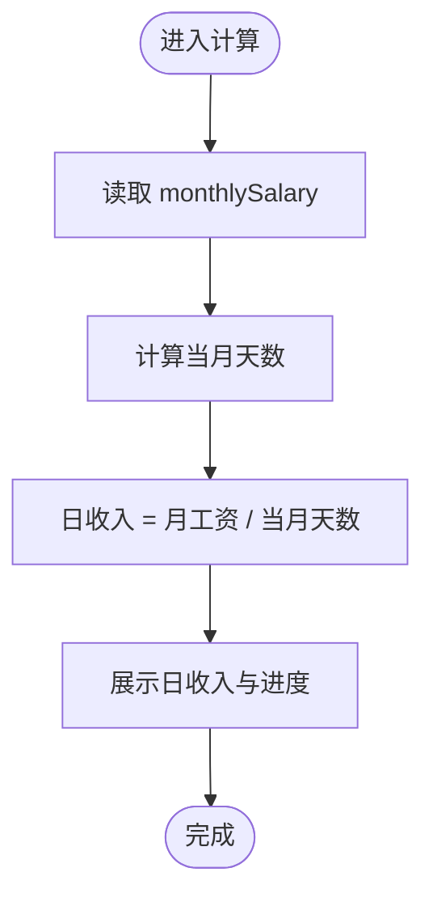

# 数据模型与持久化

<cite>
**本文引用的文件**
- [script.js](file://script.js)
- [ai-module.js](file://ai-module.js)
- [command-module.js](file://command-module.js)
- [effects.js](file://effects.js)
- [prompts.js](file://prompts.js)
- [config/holidays.json](file://config/holidays.json)
- [index.html](file://index.html)
</cite>

## 目录
1. [简介](#简介)
2. [项目结构](#项目结构)
3. [核心组件](#核心组件)
4. [架构总览](#架构总览)
5. [详细组件分析](#详细组件分析)
6. [依赖关系分析](#依赖关系分析)
7. [性能考量](#性能考量)
8. [故障排查指南](#故障排查指南)
9. [结论](#结论)
10. [附录](#附录)

## 简介
本文件面向“work-timer”项目，系统化梳理其数据模型与持久化策略，重点覆盖：
- localStorage 中的关键数据项命名与含义（如月工资、按日期存储的摸鱼运势等）
- 时间轴数据结构设计（事件类型、时间戳、附加属性）
- 数据隔离策略（按日期隔离）如何避免跨日数据混淆
- 数据访问模式与性能优化建议（频繁读写、批量更新）
- 数据生命周期管理与潜在迁移路径

## 项目结构
work-timer 采用前端单页应用结构，核心逻辑集中在主脚本文件中，配合 AI 模块、命令模块、特效模块与提示词配置，形成完整的前端数据与交互闭环。

图表来源
- [index.html](file://index.html#L1-L200)
- [script.js](file://script.js#L1-L120)
- [ai-module.js](file://ai-module.js#L1-L60)
- [command-module.js](file://command-module.js#L1-L60)
- [effects.js](file://effects.js#L1-L40)
- [prompts.js](file://prompts.js#L1-L40)
- [config/holidays.json](file://config/holidays.json#L1-L46)

章节来源
- [index.html](file://index.html#L1-L200)
- [script.js](file://script.js#L1-L120)

## 核心组件
- 应用主逻辑与持久化：负责工作时间配置、打卡状态、时间轴事件、自定义事件、发薪日倒计时、每日收入计算等。
- AI 模块：封装 DeepSeek API 调用、摸鱼运势与工作总结生成、兜底策略。
- 命令模块：自然语言指令理解、意图识别与动作执行。
- 特效模块：打卡时的视觉特效。
- 提示词与兜底文案：统一管理 AI Prompt 与兜底消息。
- 节假日配置：法定节假日与周末加班日的合并与持久化。

章节来源
- [script.js](file://script.js#L1-L120)
- [ai-module.js](file://ai-module.js#L1-L60)
- [command-module.js](file://command-module.js#L1-L60)
- [effects.js](file://effects.js#L1-L40)
- [prompts.js](file://prompts.js#L1-L40)
- [config/holidays.json](file://config/holidays.json#L1-L46)

## 架构总览
下图展示数据在前端的流向与持久化位置，强调“按日期隔离”的时间轴与“按键名隔离”的配置项。

图表来源
- [script.js](file://script.js#L1-L220)
- [ai-module.js](file://ai-module.js#L1-L60)
- [command-module.js](file://command-module.js#L1-L60)
- [effects.js](file://effects.js#L1-L40)
- [prompts.js](file://prompts.js#L1-L40)
- [config/holidays.json](file://config/holidays.json#L1-L46)

## 详细组件分析

### 数据模型总览
- 配置类键（常驻键）：工作时间、月工资、发薪类型、发薪日、开发者模式、自定义时间、AI 密钥、节假日与加班日映射。
- 事件类键（按日期隔离）：当日打卡时间、当日摸鱼运势、当日时间轴事件列表。
- 自定义事件：仅保存用户自定义事件，预设事件由程序动态生成。

章节来源
- [script.js](file://script.js#L1-L220)
- [script.js](file://script.js#L1297-L1322)
- [script.js](file://script.js#L1324-L1345)

### 时间轴数据结构
- 结构：按日期隔离的时间轴数组，每条事件包含：
  - id：事件唯一标识（基于毫秒时间戳）
  - time：事件发生时间（JavaScript Date 对象）
  - type：事件类型（如“上班打卡”“下班打卡”“摸鱼”“番茄钟”等）
  - content：事件描述文本
  - extraData：附加属性（如“时长”“运势”等）

- 读写流程：
  - 加载：按“timeline_YYYY-MM-DD”键从 localStorage 读取并解析为数组
  - 保存：序列化数组后写回同一键
  - 新增：向数组追加事件后立即保存

- 排序与渲染：按事件时间升序排序后渲染，支持空态提示。

图表来源
- [script.js](file://script.js#L19-L47)
- [script.js](file://script.js#L830-L870)

章节来源
- [script.js](file://script.js#L19-L47)
- [script.js](file://script.js#L830-L870)

### 摸鱼运势与打卡数据
- 摸鱼运势（moyuFortune_YYYY-MM-DD）：
  - 生成：上班打卡时通过 AI 生成 JSON，提取“运势”字段并保存
  - 展示：页面 header 的“每日留言条”显示当日运势
  - 再求签：支持重新生成并覆盖当日运势
- 打卡时间（clockInTime_YYYY-MM-DD）：
  - 记录：上班打卡时保存当前时间的 ISO 字符串
  - 使用：下班统计报告中用于展示“今日开始工作时间”
- 打卡状态（lastClockInType/lastClockInDate）：
  - 控制：按钮文案与状态随“是否同日”切换
  - 清理：跨日时清除当日状态与时间轴

图表来源
- [script.js](file://script.js#L547-L730)
- [script.js](file://script.js#L626-L690)
- [ai-module.js](file://ai-module.js#L95-L127)

章节来源
- [script.js](file://script.js#L547-L730)
- [script.js](file://script.js#L626-L690)
- [ai-module.js](file://ai-module.js#L95-L127)

### 工资与收入计算
- 月工资（monthlySalary）：用户设置，作为基础收入参数
- 日收入（dailyIncome）：按当月天数平均计算，用于界面展示与进度条
- 发薪日事件：基于“发薪日类型”和“发薪日”生成事件，计算到下次发薪日的剩余天数与进度

图表来源
- [script.js](file://script.js#L3063-L3077)
- [script.js](file://script.js#L1090-L1116)

章节来源
- [script.js](file://script.js#L3063-L3077)
- [script.js](file://script.js#L1090-L1116)

### 节假日与工作日映射
- 配置来源：config/holidays.json
- 合并逻辑：将“官方节假日”和“周末加班日”合并到内存映射，并持久化到 localStorage
- 使用场景：判断某日是否为工作日，影响时间轴与倒计时计算

图表来源
- [config/holidays.json](file://config/holidays.json#L1-L46)
- [script.js](file://script.js#L1297-L1322)
- [script.js](file://script.js#L1397-L1433)

章节来源
- [config/holidays.json](file://config/holidays.json#L1-L46)
- [script.js](file://script.js#L1297-L1322)
- [script.js](file://script.js#L1397-L1433)

### 自定义事件与预设事件
- 自定义事件：仅保存 type='custom' 的事件，重启后仍保留
- 预设事件：每次初始化时重新生成，不保存到 localStorage
- 保存策略：按需序列化自定义事件集合

章节来源
- [script.js](file://script.js#L1324-L1345)
- [script.js](file://script.js#L1084-L1093)

## 依赖关系分析
- 主逻辑依赖：
  - AI 模块：用于生成摸鱼运势与工作总结
  - 命令模块：用于自然语言指令理解与执行
  - 特效模块：用于打卡时的视觉反馈
  - 提示词与兜底：统一管理 Prompt 与兜底文案
  - 节假日配置：提供节假日与加班日映射
- 数据耦合：
  - 时间轴与打卡状态紧密耦合（同日状态决定按钮行为）
  - 工资与日收入计算依赖月工资键
  - 节假日映射影响工作日判定与事件渲染

图表来源
- [script.js](file://script.js#L1-L120)
- [ai-module.js](file://ai-module.js#L1-L60)
- [command-module.js](file://command-module.js#L1-L60)
- [effects.js](file://effects.js#L1-L40)
- [prompts.js](file://prompts.js#L1-L40)
- [config/holidays.json](file://config/holidays.json#L1-L46)

章节来源
- [script.js](file://script.js#L1-L120)
- [ai-module.js](file://ai-module.js#L1-L60)
- [command-module.js](file://command-module.js#L1-L60)
- [effects.js](file://effects.js#L1-L40)
- [prompts.js](file://prompts.js#L1-L40)
- [config/holidays.json](file://config/holidays.json#L1-L46)

## 性能考量
- 读写频率与热点
  - 时间轴：每次新增事件均触发保存，高频写入；建议在批量操作时合并保存（如延迟保存或批处理）
  - 打卡状态：每日跨日清理，避免长期累积
  - AI 调用：仅在需要时发起，避免重复请求
- 存储体积控制
  - 按日期隔离有效限制单键体积，避免无限增长
  - 自定义事件仅保存必要字段，避免冗余
- 计算与渲染
  - 时间轴排序在渲染前完成，建议在事件较多时分页或虚拟化
  - 日收入计算为轻量级，可按需触发
- 缓存与一致性
  - 页面加载时优先从 localStorage 恢复状态，保证一致性
  - 开发者模式下的自定义时间跨日切换时，主动清理当日状态与时间轴，避免脏数据

章节来源
- [script.js](file://script.js#L19-L47)
- [script.js](file://script.js#L1159-L1187)
- [ai-module.js](file://ai-module.js#L1-L60)

## 故障排查指南
- 无法获取 AI 密钥
  - 现象：调用 AI 接口时报错
  - 排查：确认 localStorage 中存在 deepseekApiKey
  - 修复：在设置中保存密钥并测试连通性
- 摸鱼运势为空或异常
  - 现象：header 未显示运势或显示兜底文案
  - 排查：确认当日 moyuFortune_YYYY-MM-DD 是否存在；检查 AI 返回 JSON 格式
  - 修复：重新求签或检查网络与密钥
- 时间轴不显示或丢失
  - 现象：打开时间轴为空
  - 排查：确认 timeline_YYYY-MM-DD 键是否存在；检查日期格式
  - 修复：手动清理或等待跨日自动清理后重新生成
- 跨日状态未清理
  - 现象：按钮文案异常或历史数据残留
  - 排查：检查 lastClockInDate 与 lastClockInType；确认自定义时间跨日逻辑
  - 修复：刷新页面或手动清空 localStorage 后重置

章节来源
- [ai-module.js](file://ai-module.js#L1-L60)
- [script.js](file://script.js#L626-L690)
- [script.js](file://script.js#L1159-L1187)

## 结论
work-timer 的数据模型以“按日期隔离”为核心设计，将时间轴、打卡状态与每日运势等短期数据与长期配置分离，既保证了数据的可维护性，也降低了跨日数据污染风险。通过 localStorage 的键值组织与主逻辑的读写策略，实现了轻量、直观且可扩展的前端持久化方案。建议在高频写入场景引入延迟保存或批处理策略，进一步提升性能与用户体验。

## 附录

### 关键数据项清单与说明
- 配置类（常驻）
  - workStartTime / lunchStartTime / lunchEndTime / workEndTime：工作时间配置
  - monthlySalary：月工资
  - salaryType：发薪类型
  - salaryDay：发薪日
  - developerMode / customTime：开发者模式与自定义时间
  - deepseekApiKey：AI 密钥
  - officialHolidays / officialWeekendWorkdays：节假日与加班日配置（来自配置文件）
  - workdaysOff / weekendsWork：节假日映射（合并后持久化）
  - customEvents：自定义事件集合
- 事件类（按日期隔离）
  - lastClockInType / lastClockInDate：当日打卡状态
  - clockInTime_YYYY-MM-DD：当日上班时间
  - moyuFortune_YYYY-MM-DD：当日摸鱼运势
  - timeline_YYYY-MM-DD：当日时间轴事件列表

章节来源
- [script.js](file://script.js#L1-L220)
- [script.js](file://script.js#L1297-L1322)
- [script.js](file://script.js#L1324-L1345)