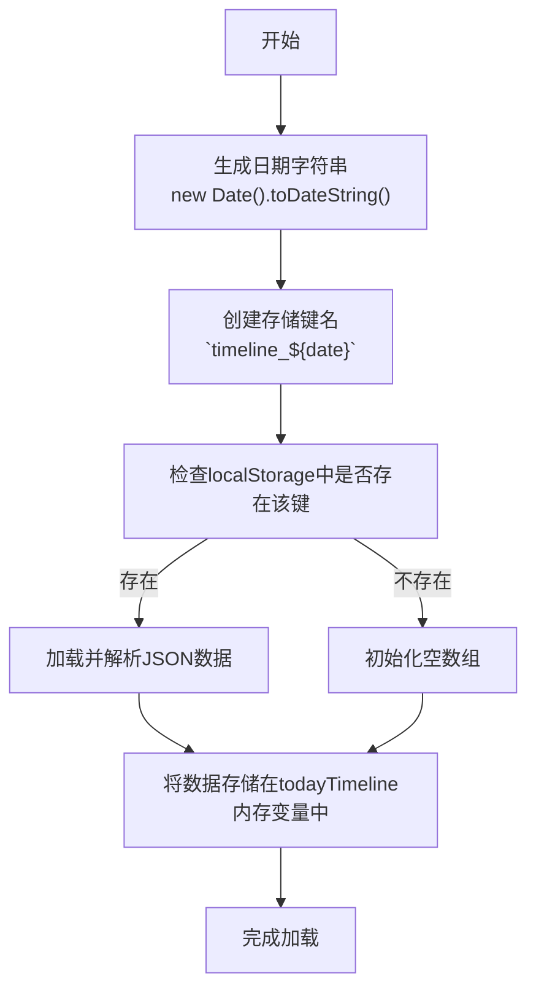
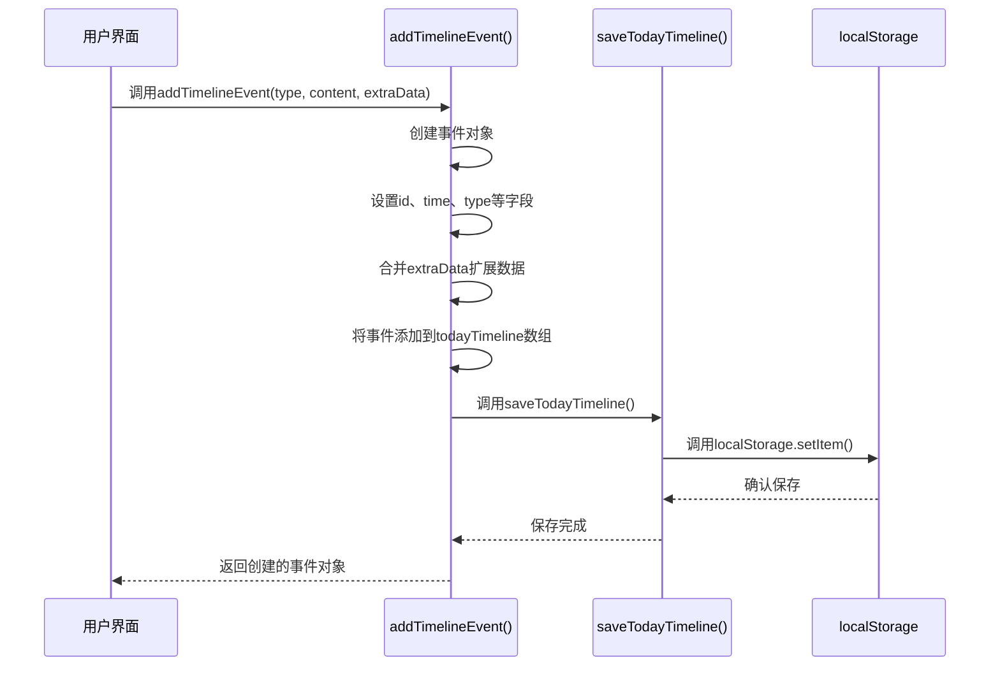

# 时间轴数据结构

<cite>
**本文档引用的文件**   
- [script.js](file://script.js)
- [index.html](file://index.html)
- [styles.css](file://styles.css)
</cite>

## 目录
1. [介绍](#介绍)
2. [时间轴数据模型设计](#时间轴数据模型设计)
3. [按日存储机制](#按日存储机制)
4. [数据操作流程](#数据操作流程)
5. [实际使用示例](#实际使用示例)
6. [性能考虑与优化](#性能考虑与优化)
7. [用户界面展示](#用户界面展示)

## 介绍
work-timer应用中的时间轴功能用于记录用户在工作期间的各种活动，包括打卡、番茄钟、摸鱼等事件。该功能通过精心设计的数据结构和存储机制，实现了高效的数据管理和用户友好的界面展示。本文档深入分析了时间轴数据模型的核心设计，包括数据结构、存储策略、操作流程和性能优化。

**Section sources**
- [script.js](file://script.js#L16-L47)

## 时间轴数据模型设计
时间轴数据模型的核心是`todayTimeline`数组，它存储了当天的所有事件记录。每个事件对象包含多个字段，形成了一个灵活且可扩展的数据结构。

### 事件对象结构
每个事件对象包含以下关键字段：

- **id**: 使用`Date.now()`生成的时间戳，作为事件的唯一标识符，确保每个事件都有全局唯一的ID
- **time**: 事件发生的时间，存储为`Date`对象，便于进行时间计算和排序
- **type**: 事件类型，用于区分不同类型的活动，如'clock-in'（上班打卡）、'clock-out'（下班打卡）、'pomodoro'（番茄钟）等
- **content**: 事件描述文本，提供关于事件的详细信息
- **extraData**: 扩展字段，允许添加任意额外数据，实现了数据结构的灵活性和可扩展性

这种设计模式采用了JavaScript对象的扩展语法（`...extraData`），使得基本事件结构可以轻松地被各种特定类型的事件所复用和扩展。

```mermaid
classDiagram
class TimelineEvent {
+id : number
+time : Date
+type : string
+content : string
+[extraData] : any
}
TimelineEvent : +id : number
TimelineEvent : +time : Date
TimelineEvent : +type : string
TimelineEvent : +content : string
TimelineEvent : +[extraData] : any
```

**Diagram sources **
- [script.js](file://script.js#L37-L43)

**Section sources**
- [script.js](file://script.js#L37-L43)

## 按日存储机制
为了实现数据的按日隔离存储，避免不同日期的数据混淆，系统采用了基于日期的键名格式`timeline_${date}`。

### 键名生成策略
系统使用`new Date().toDateString()`方法生成日期字符串作为键名的一部分。这种方法生成的字符串格式为"Mon Oct 30 2023"，包含了完整的日期信息，确保了每天都有唯一的键名。

这种设计带来了多个优势：
- **数据隔离**: 每天的数据存储在独立的localStorage条目中，避免了数据混淆
- **自动清理**: 旧日期的数据可以独立管理，不会影响当前日期的数据
- **查询效率**: 可以直接通过日期键名快速获取特定日期的时间轴数据

### 存储格式
数据以JSON字符串的形式存储在localStorage中，使用`JSON.stringify()`和`JSON.parse()`进行序列化和反序列化。这种格式既保证了数据的完整性，又便于浏览器存储和传输。



**Diagram sources **
- [script.js](file://script.js#L19-L26)

**Section sources**
- [script.js](file://script.js#L19-L26)

## 数据操作流程
时间轴数据的操作主要通过三个核心函数实现：`loadTodayTimeline`、`saveTodayTimeline`和`addTimelineEvent`，形成了一个完整的数据处理闭环。

### 加载流程
`loadTodayTimeline`函数负责从localStorage加载当天的时间轴数据：

1. 获取当前日期的字符串表示
2. 构造对应的存储键名`timeline_${today}`
3. 从localStorage中获取对应的数据
4. 如果存在数据，则解析JSON并赋值给`todayTimeline`数组
5. 如果不存在数据，则初始化为空数组

### 保存流程
`saveTodayTimeline`函数负责将内存中的时间轴数据保存到localStorage：

1. 获取当前日期的字符串表示
2. 构造对应的存储键名`timeline_${today}`
3. 将`todayTimeline`数组序列化为JSON字符串
4. 使用`localStorage.setItem()`保存到浏览器存储中

### 添加事件流程
`addTimelineEvent`函数是添加新事件的核心方法，它整合了事件创建和数据保存的完整流程：

1. 创建新的事件对象，包含id、time、type、content和扩展数据
2. 将新事件添加到`todayTimeline`数组中
3. 调用`saveTodayTimeline()`自动保存更新后的数据
4. 返回创建的事件对象，便于调用者使用

这种设计实现了"添加即保存"的原子操作，确保了数据的一致性和可靠性。



**Diagram sources **
- [script.js](file://script.js#L18-L47)

**Section sources**
- [script.js](file://script.js#L18-L47)

## 实际使用示例
时间轴功能在应用的多个场景中被实际使用，展示了其灵活性和实用性。

### 番茄钟完成记录
当用户完成一个番茄钟时，系统会自动记录相应的事件：

```javascript
addTimelineEvent('pomodoro', `完成了 ${duration} 的番茄钟`, { duration: totalMinutes });
```

这个调用创建了一个类型为'pomodoro'的事件，内容描述了完成的番茄钟时长，并通过extraData字段存储了具体的分钟数，便于后续统计和分析。

### 上班打卡记录
在上班打卡时，系统会记录打卡事件，并将摸鱼吉日签的信息作为扩展数据保存：

```javascript
addTimelineEvent('clock-in', `上班打卡 ${timeStr}`, { 
    fortune: fortuneResult.data.fortune 
});
```

这里不仅记录了打卡时间，还保存了用户的摸鱼运势，实现了功能的集成和数据的丰富性。

### 摸鱼记录
当用户点击摸鱼卡片时，系统会记录相应的摸鱼事件：

```javascript
addTimelineEvent('relax', `点击了「${cardName}」卡片`, { cardId: cardId });
```

通过记录具体的卡片ID，系统可以统计用户在不同摸鱼活动上的时间分配，为用户提供行为分析。

**Section sources**
- [script.js](file://script.js#L409-L410)
- [script.js](file://script.js#L682-L685)
- [script.js](file://script.js#L2766-L2766)

## 性能考虑与优化
尽管当前实现已经较为高效，但在频繁写入localStorage的场景下，仍有一些性能优化的考虑。

### 当前实现分析
当前的实现采用了"每次添加事件立即保存"的策略，这种设计的优点是数据安全性高，即使应用意外关闭也不会丢失数据。然而，如果用户频繁触发事件（如短时间内多次点击摸鱼卡片），可能会导致频繁的localStorage写入操作。

### 优化建议
针对频繁写入的场景，可以考虑以下优化策略：

1. **批量保存**: 实现一个缓冲机制，将多个事件累积到内存中，定期（如每30秒）或达到一定数量时批量保存到localStorage
2. **防抖保存**: 使用防抖技术，当连续添加事件时，只在最后一次操作后延迟一定时间再保存
3. **内存优先**: 优先在内存中维护数据，只在关键节点（如页面卸载前）进行持久化保存

这些优化可以在保证数据安全性的前提下，减少对localStorage的频繁访问，提高应用性能。

**Section sources**
- [script.js](file://script.js#L44-L45)

## 用户界面展示
时间轴数据最终通过UI组件展示给用户，实现了数据的可视化。

### 界面结构
时间轴模态窗口包含以下主要组件：
- 日期标题：显示当前查看的日期
- 时间轴列表：按时间顺序排列的事件项
- 空状态提示：当没有记录时显示的友好提示

### 事件渲染
每个事件项的渲染包含：
- 时间戳：显示事件发生的具体时间
- 事件类型标签：用不同颜色标识不同类型的事件
- 事件内容：显示事件的描述信息
- 扩展信息：如备注等额外内容

这种设计使得用户可以直观地了解一天的活动轨迹，增强了应用的可用性和用户体验。

```mermaid
erDiagram
TIMELINE : todayTimeline array
EVENT : id, time, type, content, extraData
TIMELINE ||--o{ EVENT : "contains"
class EVENT {
+id: number
+time: Date
+type: string
+content: string
+extraData: object
}
note right of TIMELINE
存储在内存中的当前时间轴数据
end note
note left of EVENT
每个事件包含基本字段和可扩展的extraData
end note
```

**Diagram sources **
- [index.html](file://index.html#L165-L184)
- [styles.css](file://styles.css#L1712-L1811)

**Section sources**
- [index.html](file://index.html#L165-L184)
- [styles.css](file://styles.css#L1712-L1811)