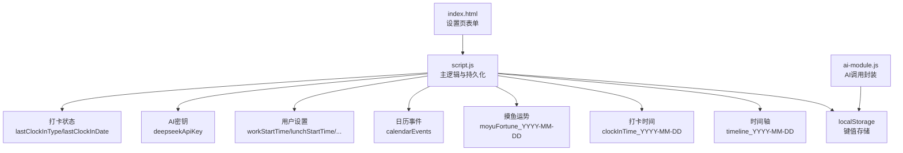
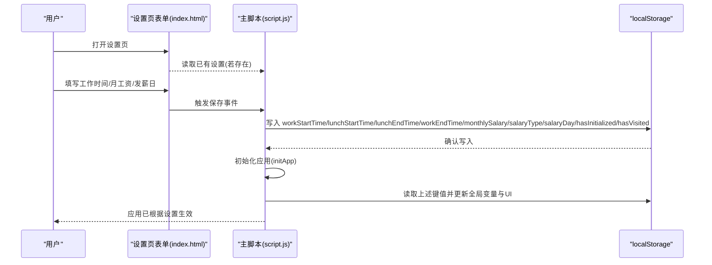
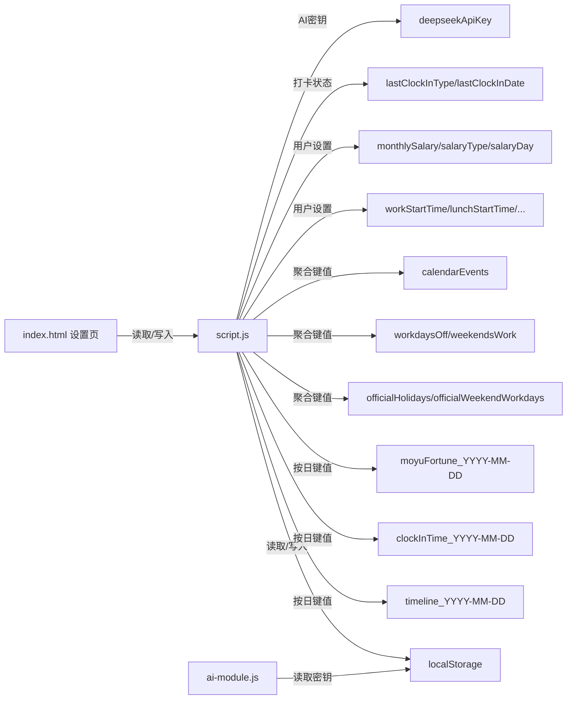

# 本地存储结构

<cite>
**本文引用的文件**
- [script.js](file://script.js)
- [ai-module.js](file://ai-module.js)
- [index.html](file://index.html)
- [README.md](file://README.md)
</cite>

## 目录
1. [简介](#简介)
2. [项目结构](#项目结构)
3. [核心组件](#核心组件)
4. [架构总览](#架构总览)
5. [详细组件分析](#详细组件分析)
6. [依赖关系分析](#依赖关系分析)
7. [性能考量](#性能考量)
8. [故障排查指南](#故障排查指南)
9. [结论](#结论)

## 简介
本文件聚焦 work-timer 项目中 localStorage 的使用方式，系统梳理关键数据项、数据类型、生命周期与持久化策略，结合脚本实现展示读取与写入流程，并提供常见问题排查建议。内容涵盖工作时间配置、工资与发薪日设置、打卡状态、AI 密钥、时间轴与日历事件等。

## 项目结构
- 主入口脚本负责全局状态初始化、事件绑定、定时任务与 UI 更新。
- AI 模块独立封装 DeepSeek API 调用，通过 localStorage 读取密钥。
- 设置页提供工作时间、发薪日、节假日等配置入口，与 localStorage 交互频繁。
- 日历与时间轴功能基于按日维度的键值进行数据持久化。

图表来源
- [script.js](file://script.js#L1-L120)
- [ai-module.js](file://ai-module.js#L1-L60)
- [index.html](file://index.html#L209-L412)

章节来源
- [script.js](file://script.js#L1-L120)
- [ai-module.js](file://ai-module.js#L1-L60)
- [index.html](file://index.html#L209-L412)

## 核心组件
- 首次设置与初始化
  - 首次访问检测与引导弹窗，保存工作时间、月工资、发薪日类型与日期等基础设置。
  - 初始化后从 localStorage 读取并应用到全局变量与 UI。
- 打卡与状态管理
  - 按日记录上班/下班时间，维护当日打卡状态与“摸鱼吉日签”。
- 时间轴与事件
  - 按日存储当日事件流，支持跨页面加载与展示。
- 日历与节假日
  - 合并官方节假日与周末加班配置，按月渲染日历并高亮日期。
- AI 密钥与对话
  - 读取/保存 DeepSeek API 密钥；AI 生成内容作为兜底降级策略。

章节来源
- [script.js](file://script.js#L94-L155)
- [script.js](file://script.js#L169-L223)
- [script.js](file://script.js#L493-L732)
- [script.js](file://script.js#L19-L33)
- [script.js](file://script.js#L2448-L2627)
- [ai-module.js](file://ai-module.js#L14-L30)

## 架构总览
以下序列图展示“首次设置保存”与“应用初始化”的典型流程，体现 localStorage 的读取与写入路径。

图表来源
- [index.html](file://index.html#L209-L412)
- [script.js](file://script.js#L169-L223)
- [script.js](file://script.js#L1065-L1117)

章节来源
- [index.html](file://index.html#L209-L412)
- [script.js](file://script.js#L169-L223)
- [script.js](file://script.js#L1065-L1117)

## 详细组件分析

### 1) 工作时间与工资配置
- 键值与类型
  - workStartTime: 字符串，格式 HH:mm
  - lunchStartTime: 字符串，格式 HH:mm
  - lunchEndTime: 字符串，格式 HH:mm
  - workEndTime: 字符串，格式 HH:mm
  - monthlySalary: 字符串，数值字符串
  - salaryType: 字符串，枚举值 "fixed"/"last"
  - salaryDay: 字符串，数值字符串（当 salaryType 为 fixed 时）
  - hasInitialized: 字符串 "true"/"false"
  - hasVisited: 字符串 "true"/"false"
- 生命周期
  - 首次设置保存后，hasInitialized 与 hasVisited 标记为 "true"，后续不再弹窗。
  - 更新设置时，会同时更新工作时间与月工资，并触发 UI 与事件列表重绘。
- 数据持久化策略
  - 首次设置保存：写入上述键值，标记初始化完成。
  - 应用初始化：从 localStorage 读取并填充全局变量与表单。
  - 发薪日计算：根据 salaryType 与 salaryDay 推导下一次发薪日。
- 读取与写入路径
  - 首次设置保存：见 [script.js](file://script.js#L187-L223)
  - 应用初始化读取：见 [script.js](file://script.js#L1065-L1117)
  - 更新设置：见 [script.js](file://script.js#L1220-L1270)
  - 发薪日计算：见 [script.js](file://script.js#L2671-L2701)

章节来源
- [script.js](file://script.js#L187-L223)
- [script.js](file://script.js#L1065-L1117)
- [script.js](file://script.js#L1220-L1270)
- [script.js](file://script.js#L2671-L2701)
- [index.html](file://index.html#L209-L412)

### 2) 打卡状态与当日记录
- 键值与类型
  - lastClockInType: 字符串，枚举值 "CLOCK_IN"/"CLOCK_OUT"/"FINISHED"
  - lastClockInDate: 字符串，日期字符串 YYYY-MM-DD
  - clockInTime_YYYY-MM-DD: 字符串，ISO 时间字符串
  - moyuFortune_YYYY-MM-DD: 字符串，当日运势文本
- 生命周期
  - 每日重置：若开发者模式切换到不同日期，会清理 lastClockInType/lastClockInDate/clockInTime_YYYY-MM-DD/moyuFortune_YYYY-MM-DD 与当日 timeline。
  - 按日维度存储，避免跨日数据污染。
- 数据持久化策略
  - 打卡时立即写入 lastClockInType、lastClockInDate、clockInTime_YYYY-MM-DD。
  - 下班打卡时生成“摸鱼吉日签”，并保存 moyuFortune_YYYY-MM-DD。
  - 每分钟刷新按钮状态，依据 lastClockInDate 与 lastClockInType 切换按钮文案与可用性。
- 读取与写入路径
  - 打卡状态读取与按钮更新：见 [script.js](file://script.js#L499-L545)
  - 打卡写入与 UI 弹窗：见 [script.js](file://script.js#L547-L732)
  - 开发者模式日期切换清理：见 [script.js](file://script.js#L1161-L1200)

章节来源
- [script.js](file://script.js#L499-L545)
- [script.js](file://script.js#L547-L732)
- [script.js](file://script.js#L1161-L1200)

### 3) 时间轴与事件
- 键值与类型
  - timeline_YYYY-MM-DD: 字符串，JSON 数组，表示当日事件流
  - calendarEvents: 字符串，JSON 数组，日历事件集合
- 生命周期
  - 每日独立键值，随日期变化而变化。
  - 事件类型包括 clock-in、clock-out、relax、pomodoro 等。
- 数据持久化策略
  - 新增事件时追加到 todayTimeline 并立即保存到 timeline_YYYY-MM-DD。
  - 日历事件单独持久化，支持导入/导出/重置。
- 读取与写入路径
  - 加载/保存当日时间轴：见 [script.js](file://script.js#L19-L33)
  - 添加事件并保存：见 [script.js](file://script.js#L35-L47)
  - 日历事件加载/保存：见 [script.js](file://script.js#L2818-L2833)

章节来源
- [script.js](file://script.js#L19-L33)
- [script.js](file://script.js#L35-L47)
- [script.js](file://script.js#L2818-L2833)

### 4) AI 密钥与对话
- 键值与类型
  - deepseekApiKey: 字符串，API 密钥
- 生命周期
  - 仅在设置页保存，AI 模块在调用时读取。
  - 支持测试连接，临时保存用于验证。
- 数据持久化策略
  - 设置页保存：见 [script.js](file://script.js#L425-L491)
  - AI 模块读取：见 [ai-module.js](file://ai-module.js#L14-L30)
- 读取与写入路径
  - 保存密钥：见 [script.js](file://script.js#L450-L459)
  - 临时保存用于测试：见 [script.js](file://script.js#L472-L474)
  - AI 模块读取：见 [ai-module.js](file://ai-module.js#L14-L30)

章节来源
- [script.js](file://script.js#L425-L491)
- [ai-module.js](file://ai-module.js#L14-L30)

### 5) 节假日与周末加班配置
- 键值与类型
  - officialHolidays: 字符串，JSON 对象，{"YYYY-M-D":"节日名"}
  - officialWeekendWorkdays: 字符串，JSON 对象，{"YYYY-M-D":true}
  - workdaysOff: 对象，合并后的公休假期映射
  - weekendsWork: 对象，合并后的周末加班映射
- 生命周期
  - 首次加载时从配置文件读取默认值并写入 localStorage。
  - 日历渲染时合并官方节假日与周末加班，按月写入 workdaysOff/weekendsWork。
- 数据持久化策略
  - 导入/重置节假日：见 [script.js](file://script.js#L2643-L2668)
  - 合并到工作日映射：见 [script.js](file://script.js#L1297-L1322)
  - 日历渲染时读取并高亮：见 [script.js](file://script.js#L2495-L2599)
- 读取与写入路径
  - 初始化默认节假日：见 [script.js](file://script.js#L1272-L1295)
  - 合并节假日到日历：见 [script.js](file://script.js#L1297-L1322)

章节来源
- [script.js](file://script.js#L1272-L1322)
- [script.js](file://script.js#L2495-L2599)
- [script.js](file://script.js#L2643-L2668)

### 6) 开发者模式与自定义时间
- 键值与类型
  - developerMode: 字符串 "true"/"false"
  - customTime: 字符串，ISO 时间字符串
- 生命周期
  - 切换开发者模式时写入 developerMode。
  - 修改自定义时间时写入 customTime，并在日期变化时清理当日打卡状态与时间轴。
- 数据持久化策略
  - 开发者模式开关：见 [script.js](file://script.js#L1149-L1156)
  - 自定义时间写入与清理：见 [script.js](file://script.js#L1156-L1200)
- 读取与写入路径
  - 表单值初始化与更新：见 [script.js](file://script.js#L1133-L1148)

章节来源
- [script.js](file://script.js#L1133-L1156)
- [script.js](file://script.js#L1156-L1200)

## 依赖关系分析
- 主脚本对 localStorage 的依赖贯穿多个模块：
  - 首次设置与初始化：读取/写入工作时间、月工资、发薪日、初始化标记。
  - 打卡与状态：读取/写入 lastClockInType/lastClockInDate/clockInTime_YYYY-MM-DD/moyuFortune_YYYY-MM-DD。
  - 时间轴与日历事件：读取/写入 timeline_YYYY-MM-DD/calendarEvents。
  - 节假日与周末加班：读取/写入 officialHolidays/officialWeekendWorkdays，并合并到 workdaysOff/weekendsWork。
  - AI 密钥：读取/写入 deepseekApiKey。
- AI 模块对 localStorage 的依赖：
  - 读取 deepseekApiKey 并发起 API 调用；若未配置则抛错。
- 设置页对 localStorage 的依赖：
  - 读取已有设置并填充表单；保存后写入对应键值。

图表来源
- [script.js](file://script.js#L1-L120)
- [script.js](file://script.js#L19-L33)
- [script.js](file://script.js#L1297-L1322)
- [script.js](file://script.js#L2448-L2627)
- [ai-module.js](file://ai-module.js#L14-L30)
- [index.html](file://index.html#L209-L412)

章节来源
- [script.js](file://script.js#L1-L120)
- [script.js](file://script.js#L19-L33)
- [script.js](file://script.js#L1297-L1322)
- [script.js](file://script.js#L2448-L2627)
- [ai-module.js](file://ai-module.js#L14-L30)
- [index.html](file://index.html#L209-L412)

## 性能考量
- 读写频率
  - 时间轴按日写入，单日数据量有限，性能开销低。
  - 打卡状态每分钟刷新按钮状态，读取少量键值，开销极小。
- 存储体积
  - 大多数键值为短字符串或小型 JSON，不会造成显著存储压力。
  - 日历事件与时间轴按日拆分，避免单键过大。
- 一致性与并发
  - 采用单页内同步读写，避免跨标签页并发冲突。
  - 开发者模式切换日期时，集中清理当日相关键值，确保一致性。

[本节为通用指导，无需特定文件引用]

## 故障排查指南
- 数据未保存或丢失
  - 症状：设置后刷新页面未生效、打卡状态异常、时间轴为空。
  - 排查要点：
    - 检查浏览器隐私模式或无痕模式，此类模式可能限制 localStorage。
    - 确认未手动清空浏览器存储或被扩展程序拦截。
    - 查看控制台是否存在权限/网络错误（尤其是 AI 密钥相关）。
  - 参考路径：
    - 首次设置保存：[script.js](file://script.js#L187-L223)
    - 应用初始化读取：[script.js](file://script.js#L1065-L1117)
    - 打卡状态写入：[script.js](file://script.js#L626-L633)
    - 时间轴保存：[script.js](file://script.js#L30-L33)
- 数据未更新
  - 症状：修改工作时间/月工资后 UI 未变化。
  - 排查要点：
    - 确认已点击“更新”按钮并触发保存逻辑。
    - 检查是否在开发者模式下切换了日期，导致当日状态被清理。
  - 参考路径：
    - 更新设置：[script.js](file://script.js#L1220-L1270)
    - 开发者模式清理：[script.js](file://script.js#L1161-L1200)
- AI 密钥相关问题
  - 症状：AI 功能不可用或报错。
  - 排查要点：
    - 确认已在设置页保存 deepseekApiKey。
    - 使用“测试连接”按钮验证密钥有效性。
  - 参考路径：
    - 保存密钥：[script.js](file://script.js#L450-L459)
    - 测试连接：[script.js](file://script.js#L465-L490)
    - 读取密钥：[ai-module.js](file://ai-module.js#L14-L30)
- 打卡状态异常
  - 症状：按钮文案不正确、无法再次打卡。
  - 排查要点：
    - 检查 lastClockInDate 是否为今日；否则按钮会重置为“上班打卡”。
    - 若跨日，确认是否被开发者模式清理。
  - 参考路径：
    - 按钮状态更新：[script.js](file://script.js#L499-L545)
    - 开发者模式清理：[script.js](file://script.js#L1161-L1200)

章节来源
- [script.js](file://script.js#L187-L223)
- [script.js](file://script.js#L1065-L1117)
- [script.js](file://script.js#L626-L633)
- [script.js](file://script.js#L30-L33)
- [script.js](file://script.js#L1220-L1270)
- [script.js](file://script.js#L1161-L1200)
- [script.js](file://script.js#L450-L459)
- [script.js](file://script.js#L465-L490)
- [ai-module.js](file://ai-module.js#L14-L30)

## 结论
work-timer 通过 localStorage 实现轻量、可靠的前端持久化，围绕“按日键值 + 聚合配置 + 用户设置”的策略组织数据。关键特性包括：
- 首次设置与初始化：一次性写入核心配置，后续按需读取。
- 打卡与时间轴：按日隔离，避免跨日污染，支持丰富的事件类型。
- 日历与节假日：官方节假日与周末加班配置可导入/重置，按月合并渲染。
- AI 密钥：集中管理，调用时读取，支持测试验证。
- 开发者模式：提供日期切换与清理能力，保障调试一致性。

该策略兼顾易用性与性能，适用于个人与团队场景。建议在生产环境中配合备份与迁移策略，以进一步提升数据可靠性。