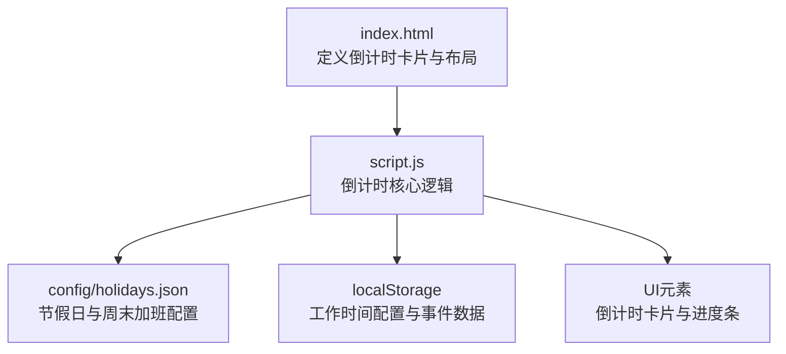
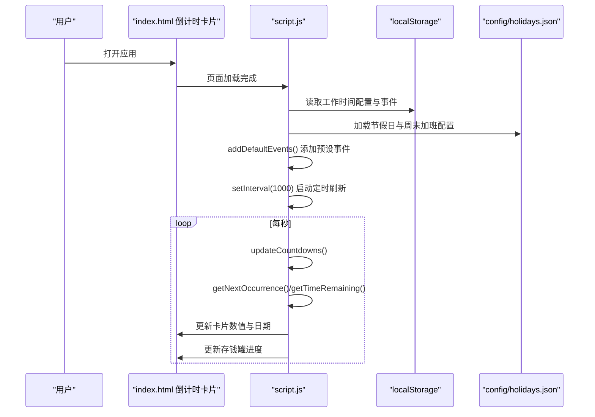
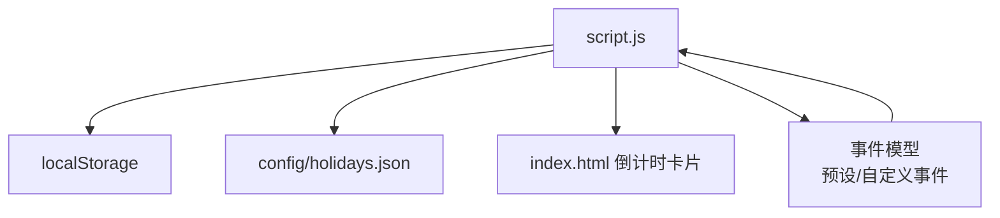

# 倒计时功能

<cite>
**本文引用的文件**
- [index.html](file://index.html)
- [script.js](file://script.js)
- [config/holidays.json](file://config/holidays.json)
</cite>

## 目录
1. [简介](#简介)
2. [项目结构](#项目结构)
3. [核心组件](#核心组件)
4. [架构总览](#架构总览)
5. [详细组件分析](#详细组件分析)
6. [依赖关系分析](#依赖关系分析)
7. [性能考量](#性能考量)
8. [故障排查指南](#故障排查指南)
9. [结论](#结论)
10. [附录](#附录)

## 简介
本文件面向“倒计时功能”的实现与使用，覆盖下班倒计时、周末倒计时、发薪日倒计时与“期待时间”（下一个假期或午休）的完整流程。重点解释：
- 如何通过 getCurrentTime() 获取当前时间，并结合 localStorage 中的工作时间配置（workStartTime、workEndTime）计算剩余时间；
- UI 更新逻辑：如何在 index.html 中渲染倒计时元素，以及每秒调用 updateCountdowns() 动态刷新显示；
- 实际使用示例：用户设置 17:30 下班后，系统如何实时显示距离下班的时分秒；
- 与工作进度追踪模块的数据共享机制；
- 常见问题与调试方法（时区偏差、自定义时间模式等）。

## 项目结构
倒计时功能位于主应用脚本与首页模板中，关键位置如下：
- index.html：定义倒计时卡片与 UI 结构（下班倒计时、本周剩余工作时间、发薪倒计时、期待时间等）。
- script.js：倒计时核心逻辑（获取当前时间、计算剩余时间、渲染 UI、定时刷新、节假日与工作日判定、存钱罐进度）。
- config/holidays.json：法定节假日与周末加班配置（用于节假日与工作日判定）。

图表来源
- [index.html](file://index.html#L227-L285)
- [script.js](file://script.js#L1090-L1101)
- [config/holidays.json](file://config/holidays.json#L1-L46)

章节来源
- [index.html](file://index.html#L227-L285)
- [script.js](file://script.js#L1090-L1101)

## 核心组件
- 当前时间获取：getCurrentTime() 支持开发者模式与自定义时间，优先返回自定义时间，否则返回真实时间。
- 事件模型：预设事件（下班、午饭、发薪日、周末、法定节假日）与自定义事件统一管理，按“下一次发生时间”排序。
- 剩余时间计算：根据事件类型与重复规则，计算到下次发生时间的剩余毫秒数，再格式化显示。
- UI 渲染：按卡片维度更新“倒计时数值”和“日期”，并支持鼠标悬停查看计算提示。
- 存钱罐进度：基于发薪日周期计算进度条百分比，与倒计时联动。

章节来源
- [script.js](file://script.js#L86-L92)
- [script.js](file://script.js#L1347-L1395)
- [script.js](file://script.js#L1560-L1588)
- [script.js](file://script.js#L1590-L1692)
- [script.js](file://script.js#L2371-L2399)

## 架构总览
倒计时功能采用“事件驱动 + 定时刷新”的架构：
- 初始化：加载预设事件（下班、午饭、发薪日、周末、节假日），绑定卡片点击事件，启动每秒定时器。
- 每秒刷新：updateCountdowns() 重新计算每个事件的“下一次发生时间”和“剩余时间”，并渲染 UI。
- 数据来源：localStorage 中的工作时间配置、节假日配置、自定义事件；config/holidays.json 作为默认节假日来源。
- UI 层：index.html 中的倒计时卡片负责展示数值与日期，进度条展示工资进度。

图表来源
- [script.js](file://script.js#L1090-L1101)
- [script.js](file://script.js#L1347-L1395)
- [script.js](file://script.js#L1827-L1858)
- [script.js](file://script.js#L1860-L2004)
- [script.js](file://script.js#L2005-L2199)
- [script.js](file://script.js#L2371-L2399)
- [config/holidays.json](file://config/holidays.json#L1-L46)

## 详细组件分析

### 1) 当前时间与开发者模式
- getCurrentTime()：若启用开发者模式且存在自定义时间，则返回自定义时间；否则返回真实时间。
- 开发者模式开关与自定义时间输入：在设置页中启用“自定义时间”，修改后自动保存到 localStorage 并触发 updateCountdowns() 重新计算。
- 作用：允许在测试或演示场景下模拟特定时间，便于验证倒计时逻辑。

章节来源
- [script.js](file://script.js#L86-L92)
- [script.js](file://script.js#L1133-L1204)

### 2) 事件模型与预设事件
- 预设事件包括：
  - 下班时间：工作日重复，时间来自 workEndTime。
  - 午休时间：每天重复，时间来自 lunchStartTime。
  - 发薪日：按月重复，类型来自 salaryType（固定日期或月末最后一天）。
  - 周末：每周六重复。
  - 法定节假日：从 localStorage 或默认配置加载。
- 自定义事件：用户可添加一次性或按日/工作日/周/月/年重复的事件，保存在 localStorage。

章节来源
- [script.js](file://script.js#L1347-L1395)
- [script.js](file://script.js#L1489-L1518)
- [script.js](file://script.js#L1520-L1551)
- [script.js](file://script.js#L1324-L1345)

### 3) 下班倒计时（下班时间）
- 计算逻辑：
  - 若当前时间早于上班时间或晚于下班时间，标记为“不在工作时间”，显示“下班啦！”。
  - 否则直接计算到下班时间的剩余秒数，格式化为“时:分:秒”。
- UI 更新：
  - 在“下班倒计时”卡片中显示剩余时间，不显示日期。
  - 鼠标悬停显示计算提示（包含当前时间、上班/午休/下班时间、剩余时分秒）。

章节来源
- [script.js](file://script.js#L2045-L2085)
- [script.js](file://script.js#L1599-L1612)
- [script.js](file://script.js#L1693-L1700)

### 4) 本周剩余工作时间
- 计算逻辑：
  - 计算从当前时间到本周五下班的“累计剩余工作时长”，期间扣除午休时间。
  - 若已过本周五下班时间，返回 0。
- UI 更新：
  - 显示“X小时Y分钟”，并在日期区域显示本周五的日期。

章节来源
- [script.js](file://script.js#L2087-L2184)
- [script.js](file://script.js#L1614-L1631)

### 5) 发薪日倒计时
- 计算逻辑：
  - nextOccurrence 为发薪日的第二天凌晨 0 点（即发薪日 24:00）。
  - 若已过发薪日，显示“发钱啦！”。
- UI 更新：
  - 显示“X天”，日期显示为发薪日的前一天（因为 nextOccurrence 是第二天 0 点）。
  - 存钱罐进度条根据“上一次发薪日到下一次发薪日”的总天数与“剩余天数”计算进度百分比。

章节来源
- [script.js](file://script.js#L1940-L1968)
- [script.js](file://script.js#L1633-L1649)
- [script.js](file://script.js#L2371-L2399)

### 6) 期待时间（下一个假期或午休）
- 逻辑：
  - 若当前是工作日上午且未到午饭时间，显示“午休倒计时”（精确到秒）。
  - 否则显示最近的一个假期（法定节假日或自定义节假日）。
- UI 更新：
  - 标题随场景变化（午休倒计时/假期名称）。
  - 时间显示根据场景选择“秒”或“天”。

章节来源
- [script.js](file://script.js#L1651-L1692)
- [script.js](file://script.js#L1489-L1518)

### 7) UI 渲染与定时刷新
- 定时刷新：每秒执行 updateCountdowns()，更新右上角当前时间、存钱罐进度，并重新计算与渲染所有倒计时卡片。
- 主要卡片：
  - 下班倒计时
  - 本周剩余工作时间
  - 发薪倒计时
  - 期待时间（下一个假期或午休）

章节来源
- [script.js](file://script.js#L1098-L1101)
- [script.js](file://script.js#L1827-L1858)
- [index.html](file://index.html#L227-L285)

### 8) 与工作进度追踪模块的数据共享
- 时间轴数据：工作进度追踪模块维护 todayTimeline，记录打卡、番茄钟等事件，与倒计时模块共享同一 localStorage 存储键。
- 数据共享点：
  - 今日时间轴：timeline_日期 字符串键。
  - 打卡状态：lastClockInType、lastClockInDate、clockInTime_日期。
  - 摸鱼运势：moyuFortune_日期。
- 影响：倒计时模块在开发者模式切换时会清理这些数据，确保测试环境一致性。

章节来源
- [script.js](file://script.js#L1-L47)
- [script.js](file://script.js#L1161-L1204)

## 依赖关系分析
- 外部依赖：
  - config/holidays.json：提供法定节假日与周末加班配置，用于 isHoliday()、isWeekendWork() 判定。
  - localStorage：保存工作时间配置、发薪日配置、自定义事件、时间轴与打卡状态。
- 内部依赖：
  - 事件模型：统一由 getNextOccurrence() 和 getTimeRemaining() 计算“下一次发生时间”和“剩余时间”。
  - UI 更新：renderMainCountdowns() 负责将计算结果映射到各卡片。

图表来源
- [script.js](file://script.js#L1347-L1395)
- [script.js](file://script.js#L1860-L2004)
- [script.js](file://script.js#L2005-L2199)
- [config/holidays.json](file://config/holidays.json#L1-L46)
- [index.html](file://index.html#L227-L285)

## 性能考量
- 定时器频率：每秒执行一次 updateCountdowns()，对 CPU 开销极小，适合在移动端与低端设备运行。
- 计算复杂度：
  - getNextOccurrence()：按事件重复类型分支，最坏情况为线性遍历工作日（仅在“工作日重复”场景）。
  - getTimeRemaining()：常量时间计算，按事件类型分支。
- 优化建议：
  - 仅在倒计时标签页激活时刷新，当前实现已在初始化时启动定时器，建议在标签切换时暂停/恢复定时器以进一步降低能耗。
  - 对频繁 DOM 查询进行缓存（如卡片元素），减少查询成本。

[本节为通用指导，无需列出章节来源]

## 故障排查指南
- 时区偏差
  - 现象：倒计时与本地时间不一致。
  - 排查：确认系统时区设置；开发者模式下自定义时间以本地时间解析，注意时区差异。
  - 参考路径：[script.js](file://script.js#L86-L92)、[script.js](file://script.js#L1133-L1204)

- 自定义时间模式调试
  - 现象：切换“自定义时间”后倒计时异常。
  - 排查：检查自定义时间输入格式；确认是否跨日导致打卡状态与时间轴被重置。
  - 参考路径：[script.js](file://script.js#L1133-L1204)

- 发薪日显示异常
  - 现象：发薪日显示“发钱啦！”但进度条未更新。
  - 排查：确认 salaryType 与 salaryDay 是否正确保存；检查“上一次发薪日到下一次发薪日”的计算逻辑。
  - 参考路径：[script.js](file://script.js#L1372-L1381)、[script.js](file://script.js#L1940-L1968)、[script.js](file://script.js#L2371-L2399)

- 节假日与周末加班未生效
  - 现象：法定节假日或周末加班未影响倒计时。
  - 排查：确认 localStorage 中 officialHolidays 与 officialWeekendWorkdays 是否正确；初始化时会从 config/holidays.json 合并默认配置。
  - 参考路径：[script.js](file://script.js#L1289-L1322)、[config/holidays.json](file://config/holidays.json#L1-L46)

- 午休倒计时不显示秒
  - 现象：期待时间显示为“午休倒计时”，但日期区域为空。
  - 说明：午休倒计时精确到秒，不显示日期，属预期行为。
  - 参考路径：[script.js](file://script.js#L1651-L1692)

## 结论
倒计时功能通过“事件模型 + 定时刷新”的方式，实现了下班、周末、发薪日与期待时间的统一管理与渲染。其核心优势在于：
- 以 localStorage 为中心的数据持久化，支持跨页面共享；
- 以 getNextOccurrence() 与 getTimeRemaining() 为核心的计算逻辑，覆盖多种重复类型与节假日场景；
- UI 渲染清晰直观，支持鼠标悬停查看计算提示，便于调试与理解。

## 附录

### 实际使用示例：设置 17:30 下班后的实时显示
- 设置步骤：
  - 在设置页或首次设置弹窗中，将下班时间设置为 17:30。
  - 保存后，预设事件“下班时间”会被添加，重复类型为“工作日”。
- 实时显示：
  - 页面加载后，每秒调用 updateCountdowns()。
  - 计算当前时间到下班时间的剩余秒数，格式化为“时:分:秒”显示在“下班倒计时”卡片中。
  - 若当前时间不在工作时间范围内，显示“下班啦！”。
- 参考路径：
  - [index.html](file://index.html#L227-L285)
  - [script.js](file://script.js#L1347-L1360)
  - [script.js](file://script.js#L2045-L2085)
  - [script.js](file://script.js#L1599-L1612)