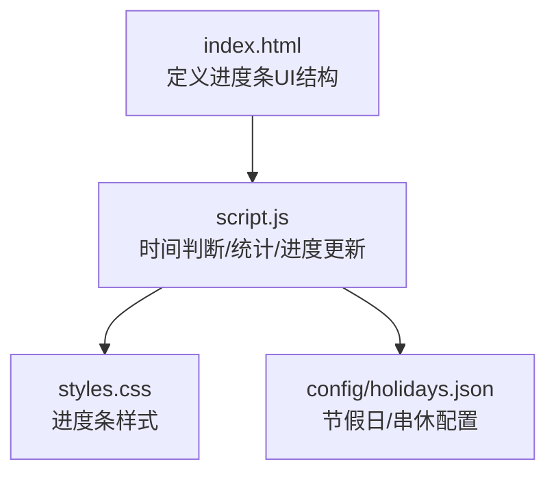
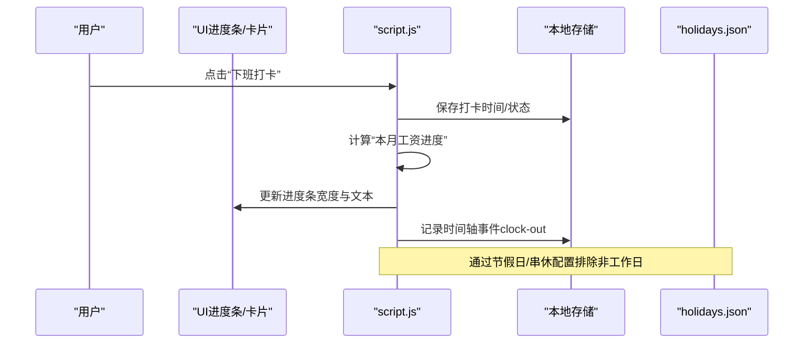
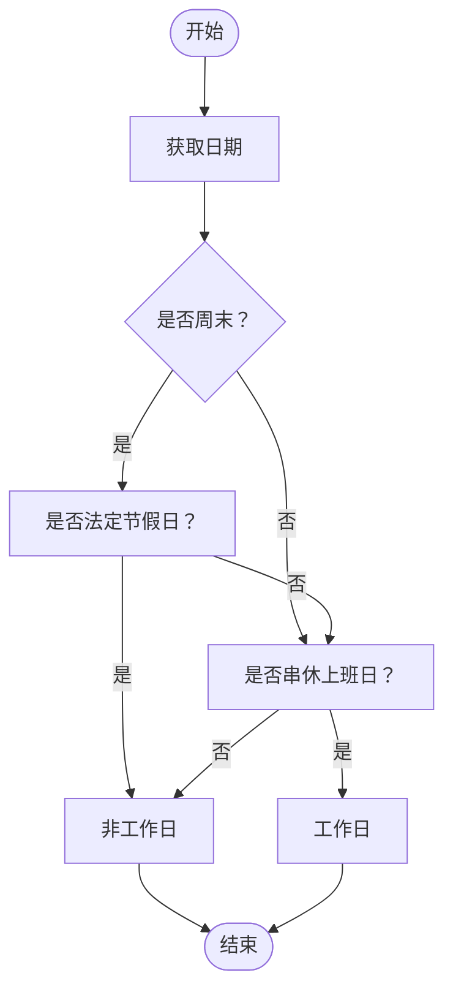
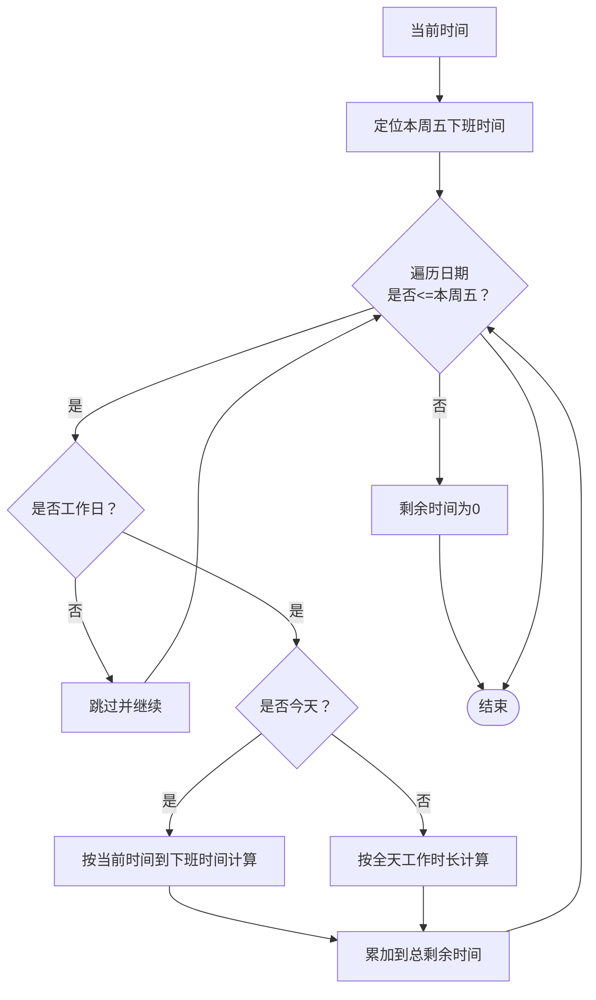
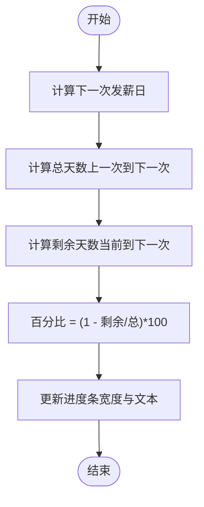
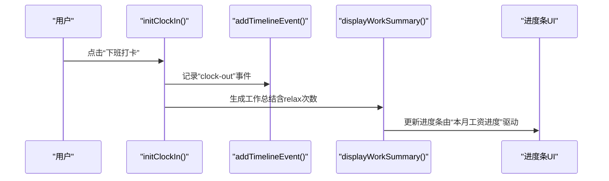
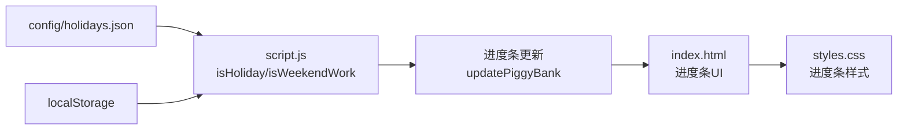

# 工作进度追踪

<cite>
**本文引用的文件**
- [index.html](file://index.html)
- [script.js](file://script.js)
- [styles.css](file://styles.css)
- [config/holidays.json](file://config/holidays.json)
</cite>

## 目录
1. [简介](#简介)
2. [项目结构](#项目结构)
3. [核心组件](#核心组件)
4. [架构总览](#架构总览)
5. [详细组件分析](#详细组件分析)
6. [依赖关系分析](#依赖关系分析)
7. [性能考量](#性能考量)
8. [故障排查指南](#故障排查指南)
9. [结论](#结论)

## 简介
本文件面向“工作进度追踪”模块，聚焦于“本周工作日”和“本月工作日”的统计与可视化展示。基于脚本中的时间判断函数与打卡时间轴数据，系统能够：
- 统计当前周的工作日总数（周一至周五，排除法定节假日与串休上班日）
- 统计当前月的工作日总数（按自然月天数）
- 结合当日打卡记录（todayTimeline）计算“已完成的工作日比例”
- 通过进度条在UI层直观展示进度，并随打卡行为实时更新

同时，文档还解释了UI层如何通过进度条可视化展示数据、如何响应打卡行为变化，并给出调试进度计算异常的排查步骤。

## 项目结构
工作进度追踪涉及以下关键文件：
- index.html：定义进度条UI结构（进度容器、进度条、进度文本）
- script.js：包含时间判断函数、工作日统计逻辑、进度条更新逻辑、打卡时间轴管理
- styles.css：进度条样式与交互样式
- config/holidays.json：法定节假日与串休上班日配置（用于排除非工作日）

图表来源
- [index.html](file://index.html#L258-L267)
- [script.js](file://script.js#L2371-L2410)
- [styles.css](file://styles.css#L1-L200)
- [config/holidays.json](file://config/holidays.json#L1-L46)

章节来源
- [index.html](file://index.html#L258-L267)
- [script.js](file://script.js#L2371-L2410)
- [styles.css](file://styles.css#L1-L200)
- [config/holidays.json](file://config/holidays.json#L1-L46)

## 核心组件
- 时间轴数据 todayTimeline：记录当日各类事件（含打卡、摸鱼等），用于统计“已完成的工作日”
- 时间判断函数：
  - isWeekend：判断是否周末
  - isHoliday：判断是否法定节假日（来自workdaysOff）
  - isWeekendWork：判断是否串休上班日（来自weekendsWork）
- 进度条UI：
  - 进度容器与进度条元素
  - 进度文本显示百分比
- 进度计算与更新：
  - 计算本周工作日剩余总时长（用于“本周剩余工作时间”卡片）
  - 计算本月工资进度（用于“存钱罐进度条”）
  - 本周/本月工作日统计与进度条更新

章节来源
- [script.js](file://script.js#L61-L84)
- [script.js](file://script.js#L2371-L2410)
- [index.html](file://index.html#L258-L267)

## 架构总览
工作进度追踪的运行时流程如下：
- 页面加载后，初始化时间轴、标签页、侧边栏、番茄钟、AI设置、打卡、时间轴等模块
- 每分钟更新打卡按钮状态；点击“下班打卡”时，生成工作总结并记录时间轴事件
- 通过“存钱罐进度条”展示“本月工资进度”，该进度由“当前到下一次发薪日的天数占比”决定
- “本周剩余工作时间”卡片展示本周剩余工作时长，用于辅助理解本周工作节奏

图表来源
- [script.js](file://script.js#L493-L732)
- [script.js](file://script.js#L2371-L2410)
- [config/holidays.json](file://config/holidays.json#L1-L46)

## 详细组件分析

### 1. 时间判断与工作日判定
- isWeekend：根据日期的星期判断是否周末
- isHoliday：根据日期字符串查询workdaysOff映射，判断是否法定节假日
- isWeekendWork：根据日期字符串查询weekendsWork映射，判断是否串休上班日
- 以上函数共同决定某一天是否为有效工作日

图表来源
- [script.js](file://script.js#L61-L84)

章节来源
- [script.js](file://script.js#L61-L84)

### 2. 本周工作日统计与进度计算
- 本周剩余工作时间计算：从当前时间起，累加到本周五下班的剩余工作时长（排除法定节假日与周末）
- 该逻辑用于“本周剩余工作时间”卡片，帮助用户感知本周工作节奏
- 本周工作日总数：由上述计算过程隐含得出（按工作日逐日累加）

图表来源
- [script.js](file://script.js#L2101-L2162)

章节来源
- [script.js](file://script.js#L2101-L2162)

### 3. 本月工作日统计与进度条更新
- 本月工资进度条：基于“当前到下一次发薪日”的天数占比，计算进度百分比并更新UI
- 进度条更新逻辑：
  - 计算总天数（上一次发薪日到下一次发薪日）
  - 计算剩余天数（当前到下一次发薪日）
  - 百分比 = (1 - 剩余/总) × 100
  - 更新进度条宽度与文本

图表来源
- [script.js](file://script.js#L2371-L2410)

章节来源
- [script.js](file://script.js#L2371-L2410)

### 4. 与打卡系统和时间轴数据的集成
- 打卡系统：
  - 上班打卡：记录“clock-in”事件，生成摸鱼吉日签
  - 下班打卡：记录“clock-out”事件，生成工作总结
- 时间轴数据 todayTimeline：
  - addTimelineEvent：统一添加事件，包含时间、类型、内容等
  - displayWorkSummary：统计当日“relax”事件数量，作为“已完成的工作日”参考之一
- UI层：
  - 进度条容器与进度条元素位于index.html
  - styles.css定义进度条样式与交互

图表来源
- [script.js](file://script.js#L493-L732)
- [script.js](file://script.js#L3079-L3151)
- [index.html](file://index.html#L258-L267)
- [styles.css](file://styles.css#L1-L200)

章节来源
- [script.js](file://script.js#L493-L732)
- [script.js](file://script.js#L3079-L3151)
- [index.html](file://index.html#L258-L267)
- [styles.css](file://styles.css#L1-L200)

### 5. 实时响应与UI更新
- 进度条更新：
  - 通过updatePiggyBank计算百分比并设置进度条宽度
  - 进度文本显示“本月工资进度：XX%”
- UI交互：
  - 点击进度条区域触发金币动画与提示
  - 进度条样式由styles.css控制

章节来源
- [script.js](file://script.js#L2371-L2410)
- [styles.css](file://styles.css#L1-L200)

### 6. 示例：一周5个工作日中的3天完成，进度条更新至60%
- 假设本周工作日总数为5天，已完成3天
- 进度条更新逻辑（以“本月工资进度”为例）：
  - 若当前到下一次发薪日的天数占比为40%，则进度条显示60%
  - UI层通过updatePiggyBank更新进度条宽度与文本
- 注意：该示例为概念说明，实际进度条展示的是“本月工资进度”，并非“本周完成比例”。若需展示“本周完成比例”，可在UI层扩展一个独立的“本周进度条”。

章节来源
- [script.js](file://script.js#L2371-L2410)

## 依赖关系分析
- 外部配置依赖：
  - config/holidays.json：提供法定节假日与串休上班日映射，用于排除非工作日
- 本地存储依赖：
  - localStorage：保存工作时间配置、节假日配置、月工资、打卡时间等
- UI依赖：
  - index.html：进度条结构
  - styles.css：进度条样式

图表来源
- [config/holidays.json](file://config/holidays.json#L1-L46)
- [script.js](file://script.js#L2371-L2410)
- [index.html](file://index.html#L258-L267)
- [styles.css](file://styles.css#L1-L200)

章节来源
- [config/holidays.json](file://config/holidays.json#L1-L46)
- [script.js](file://script.js#L2371-L2410)
- [index.html](file://index.html#L258-L267)
- [styles.css](file://styles.css#L1-L200)

## 性能考量
- 时间计算采用毫秒级运算，避免频繁DOM操作
- 进度条更新仅在必要时触发（如点击“下班打卡”或定时刷新）
- UI交互使用CSS过渡与样式类切换，减少复杂动画开销

## 故障排查指南
- 现象：进度条不更新
  - 检查是否调用了进度条更新函数（如updatePiggyBank）
  - 检查进度条元素是否存在（进度容器、进度条、进度文本）
  - 检查百分比计算逻辑（剩余天数/总天数）
- 现象：本周剩余工作时间显示异常
  - 检查工作时间配置（上班/午休/下班）
  - 检查节假日与串休配置是否正确
  - 检查当前时间是否处于工作日范围内
- 现象：打卡后未记录时间轴事件
  - 检查addTimelineEvent是否被调用
  - 检查todayTimeline是否正确保存/读取
- 现象：节假日/串休未生效
  - 检查localStorage中的节假日配置是否正确
  - 检查日期格式与映射键值是否一致

章节来源
- [script.js](file://script.js#L18-L33)
- [script.js](file://script.js#L2371-L2410)
- [script.js](file://script.js#L493-L732)

## 结论
工作进度追踪模块通过时间判断函数与打卡时间轴数据，实现了对“本周剩余工作时间”和“本月工资进度”的可视化展示。UI层以进度条为核心，结合定时更新与事件驱动，能够实时反映用户的打卡行为与工作节奏。若需进一步细化到“本周完成比例”，可在现有基础上扩展独立的“本周进度条”组件，并基于todayTimeline统计已完成的工作日数量进行计算与展示。