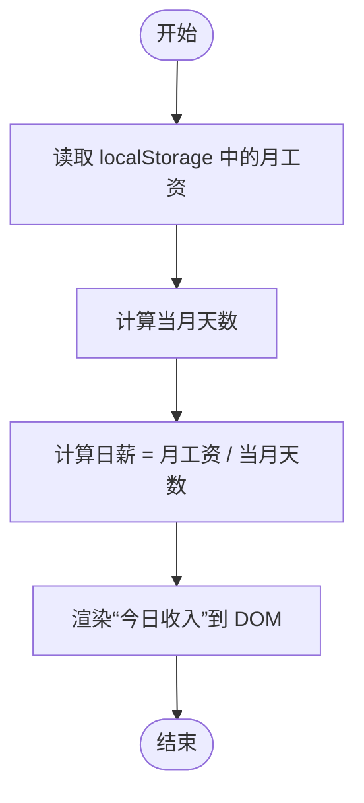

# 工资计算与收入展示

<cite>
**本文引用的文件**
- [index.html](file://index.html)
- [script.js](file://script.js)
- [config/holidays.json](file://config/holidays.json)
</cite>

## 目录
1. [简介](#简介)
2. [项目结构](#项目结构)
3. [核心组件](#核心组件)
4. [架构总览](#架构总览)
5. [详细组件分析](#详细组件分析)
6. [依赖关系分析](#依赖关系分析)
7. [性能考量](#性能考量)
8. [故障排查指南](#故障排查指南)
9. [结论](#结论)
10. [附录](#附录)

## 简介
本技术文档聚焦“工资计算模块”，围绕以下目标展开：
- 月工资设置与日薪换算的数学模型
- 如何基于 localStorage 中的 monthlySalary 和工作日天数计算日薪
- 结合打卡时间估算当日已赚收入的流程
- 在 index.html 中的展示位置与更新频率（每分钟刷新）
- 不同薪资类型的配置方法（固定月薪、时薪）
- 边界情况处理（跨月、节假日、发薪日）

## 项目结构
工资计算模块位于主应用脚本与首页模板中，核心逻辑集中在 script.js，界面元素在 index.html 中定义。节假日配置来自 config/holidays.json 并在运行期注入到日历事件中。

图表来源
- [index.html](file://index.html#L200-L399)
- [script.js](file://script.js#L180-L223)
- [script.js](file://script.js#L1297-L1322)
- [config/holidays.json](file://config/holidays.json#L1-L46)

章节来源
- [index.html](file://index.html#L200-L399)
- [script.js](file://script.js#L180-L223)
- [config/holidays.json](file://config/holidays.json#L1-L46)

## 核心组件
- 月工资设置与保存
  - 首次设置与设置更新均将 monthlySalary 写入 localStorage
  - 支持固定月薪与按月最后一天发薪两种发薪日类型
- 日薪计算
  - 基于当月天数进行等分，得到日薪
- 今日收入展示
  - 在下班打卡后生成的工作总结中展示“今日收入”
  - 每分钟刷新打卡按钮状态，间接体现“实时”工作进度
- 节假日与发薪日
  - 节假日合并到日历事件，发薪日倒计时卡片显示剩余天数

章节来源
- [script.js](file://script.js#L180-L223)
- [script.js](file://script.js#L1250-L1269)
- [script.js](file://script.js#L3063-L3077)
- [script.js](file://script.js#L540-L545)
- [script.js](file://script.js#L2703-L2718)
- [script.js](file://script.js#L1297-L1322)

## 架构总览
工资计算模块的控制流如下：用户在设置中输入月工资；系统在每次计算日薪时读取该值并结合当月天数得出日薪；下班打卡时，系统将日薪写入“今日工作总结”的展示区域。

图表来源
- [script.js](file://script.js#L180-L223)
- [script.js](file://script.js#L3063-L3077)
- [script.js](file://script.js#L540-L545)

## 详细组件分析

### 月工资设置与保存
- 首次设置
  - 从表单读取工作时间、月工资、发薪日类型、发薪日等
  - 将上述配置写入 localStorage，并标记初始化完成
- 设置更新
  - 更新工作时间与月工资后，同步写入 localStorage
  - 若发薪日类型为“固定日期”，则保存发薪日；否则移除发薪日键
- 读取默认值
  - 若未设置，月工资默认值为 8000

章节来源
- [script.js](file://script.js#L180-L223)
- [script.js](file://script.js#L1250-L1269)
- [index.html](file://index.html#L200-L399)

### 日薪换算与数学模型
- 数学模型
  - 日薪 = 月工资 ÷ 当月天数
  - 当月天数通过“下个月 0 日”推导
- 实现要点
  - 从 localStorage 读取月工资（默认 8000）
  - 使用当前年月计算当月天数
  - 结果保留两位小数
- 示例
  - 8000 元月薪，假设当月 31 天，则日薪 ≈ 8000 ÷ 31 ≈ 258.06 元
  - 注意：示例数值仅用于说明，实际日薪由代码按当月天数计算

章节来源
- [script.js](file://script.js#L3063-L3077)

### 今日收入展示与更新频率
- 展示位置
  - “今日工作总结”弹窗中的“今日收入”字段
  - 该区域由 displayWorkSummary() 动态渲染
- 更新频率
  - 打卡按钮状态每分钟刷新一次（便于用户感知工作进度）
  - 日薪计算在每次生成工作总结时执行，因此“今日收入”随下班打卡即时更新
- 数据来源
  - 月工资来自 localStorage
  - 当前日期用于确定“今日”并读取打卡时间

章节来源
- [script.js](file://script.js#L540-L545)
- [script.js](file://script.js#L3063-L3077)
- [script.js](file://script.js#L3079-L3151)

### 不同薪资类型的配置方法
- 固定月薪
  - 在设置中选择“固定日期”发薪日类型
  - 保存后将发薪日写入 localStorage
- 时薪
  - 当前代码未提供“时薪”配置入口
  - 若需支持时薪，可在设置中新增“薪资类型=时薪”，并在计算日薪时改为“时薪 × 工作小时数”模式
  - 该扩展属于二次开发建议，不在现有代码范围内

章节来源
- [index.html](file://index.html#L200-L399)
- [script.js](file://script.js#L1250-L1269)

### 跨月与节假日的边界情况处理
- 跨月
  - 日薪按“当月天数”等分，自动适应不同月份天数差异
  - 发薪日倒计时按“下个发薪日”计算，不受跨月影响
- 节假日
  - 节假日与调休合并到日历事件，不影响日薪计算
  - 发薪日倒计时卡片显示剩余天数，节假日不会改变日薪
- 发薪日类型
  - 固定日期：按设定日期倒计时
  - 每月最后一天：按“当月最后一天”倒计时

章节来源
- [script.js](file://script.js#L2703-L2718)
- [script.js](file://script.js#L1297-L1322)
- [config/holidays.json](file://config/holidays.json#L1-L46)

## 依赖关系分析
- 依赖 localStorage 存储月工资、发薪日类型、发薪日等关键配置
- 依赖 DOM 节点用于展示“今日收入”和倒计时
- 依赖节假日配置文件注入到日历事件中

图表来源
- [script.js](file://script.js#L180-L223)
- [script.js](file://script.js#L1297-L1322)
- [config/holidays.json](file://config/holidays.json#L1-L46)

## 性能考量
- 日薪计算为纯数值运算，复杂度低，对性能影响可忽略
- 每分钟刷新打卡按钮状态，避免频繁 DOM 操作
- 节假日合并与发薪日倒计时均为一次性计算，不构成性能瓶颈

## 故障排查指南
- 月工资未生效
  - 检查是否已保存设置，确认 localStorage 中存在 monthlySalary 键
  - 确认设置页面的“每月工资”输入框已填写并保存
- 日薪显示异常
  - 确认当月天数是否正确（跨月时会自动调整）
  - 检查是否存在 localStorage 中的月工资值被意外清空
- 今日收入未更新
  - 确认已下班打卡，系统才会生成“今日工作总结”
  - 检查 DOM 中“summary-content”是否存在
- 发薪日倒计时不准确
  - 检查发薪日类型与发薪日设置是否正确
  - 确认系统时间与本地时间一致

章节来源
- [script.js](file://script.js#L180-L223)
- [script.js](file://script.js#L3079-L3151)
- [script.js](file://script.js#L2703-L2718)

## 结论
- 本模块采用“月工资 ÷ 当月天数”的简单而直观的日薪换算模型
- 通过 localStorage 持久化配置，结合 DOM 展示，实现“今日收入”的即时呈现
- 跨月与节假日场景通过当月天数与日历事件自然适配，无需额外分支逻辑
- 若需支持时薪，可在现有基础上扩展配置入口与计算路径

## 附录

### 数学模型与示例说明
- 日薪 = 月工资 ÷ 当月天数
- 示例：8000 元月薪
  - 假设当月 31 天：日薪 ≈ 8000 ÷ 31 ≈ 258.06 元
  - 假设当月 30 天：日薪 ≈ 8000 ÷ 30 ≈ 266.67 元
  - 假设当月 28 天：日薪 ≈ 8000 ÷ 28 ≈ 285.71 元
- 注意：以上数值仅为示例，实际日薪由代码按当月天数精确计算

### 关键流程图：今日收入生成

图表来源
- [script.js](file://script.js#L3063-L3077)
- [script.js](file://script.js#L3079-L3151)