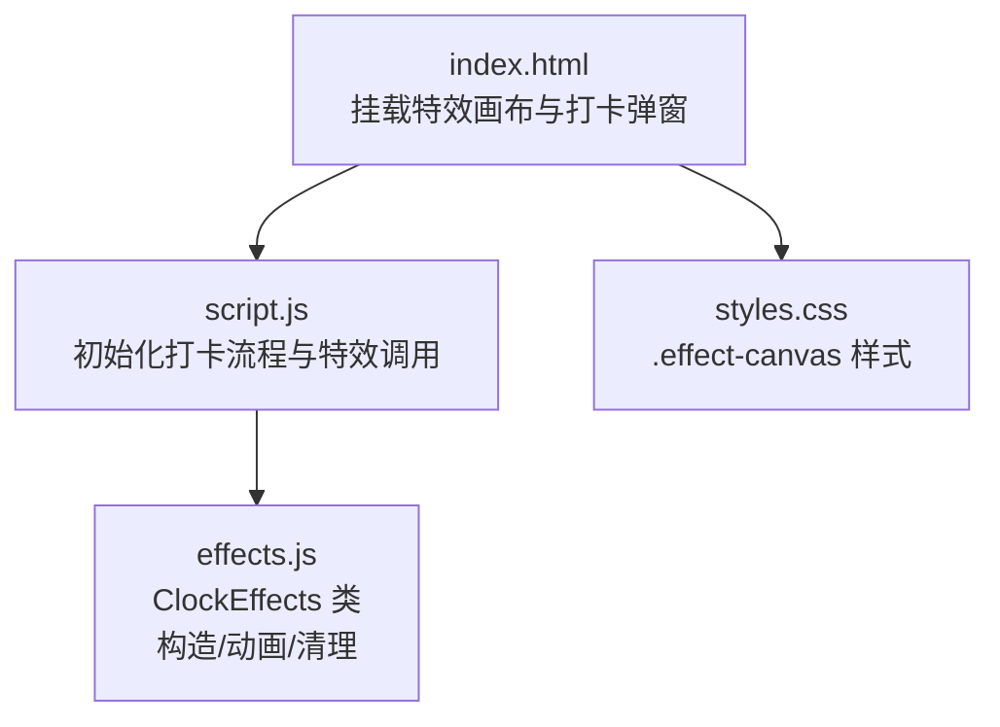
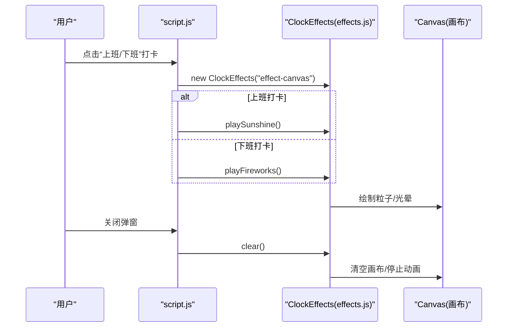
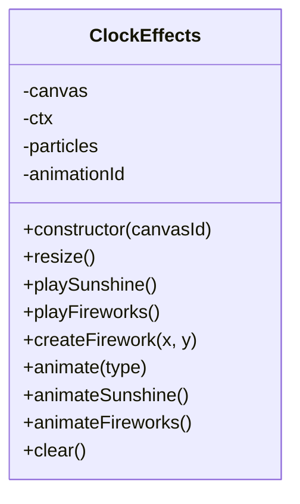
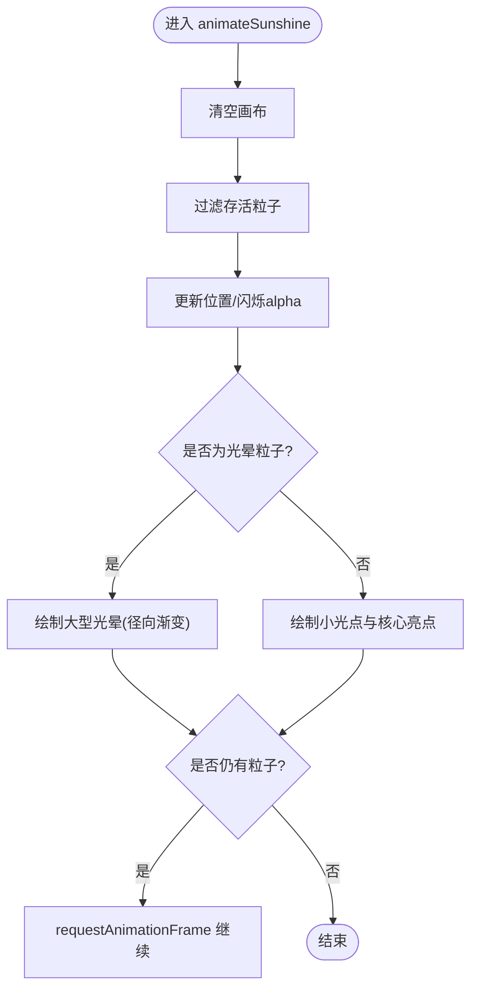
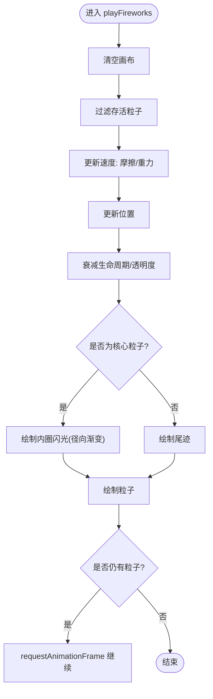
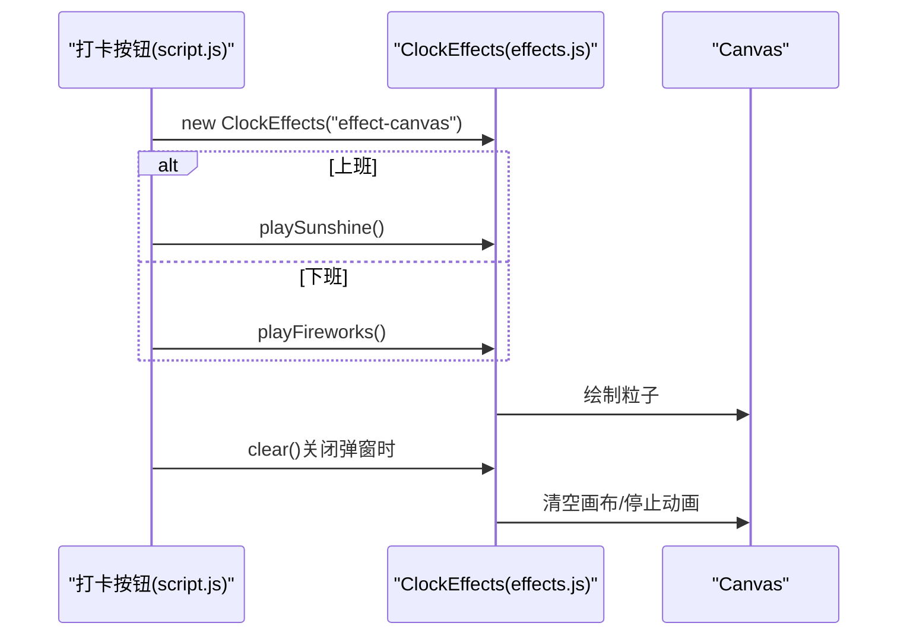
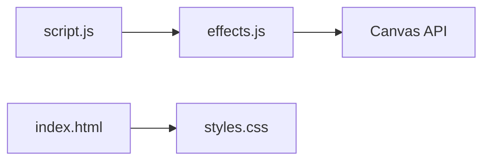

# 打卡特效系统

<cite>
**本文引用的文件**
- [index.html](file://index.html)
- [script.js](file://script.js)
- [effects.js](file://effects.js)
- [styles.css](file://styles.css)
</cite>

## 目录
1. [简介](#简介)
2. [项目结构](#项目结构)
3. [核心组件](#核心组件)
4. [架构总览](#架构总览)
5. [详细组件分析](#详细组件分析)
6. [依赖关系分析](#依赖关系分析)
7. [性能考量](#性能考量)
8. [故障排查指南](#故障排查指南)
9. [结论](#结论)

## 简介
本文件面向“打卡特效系统”的实现与使用，聚焦于两种打卡场景的视觉特效：
- 上班打卡：阳光特效（sunshine），营造温暖、轻盈的入场氛围。
- 下班打卡：礼花特效（fireworks），庆祝一天的结束与成就。

系统通过 Canvas 在全屏画布上渲染粒子动画，结合 requestAnimationFrame 实现流畅的逐帧更新；同时提供 clear 方法统一清理动画资源，避免内存泄漏与设备卡顿。

## 项目结构
- 整体页面在 index.html 中挂载特效画布与打卡弹窗，脚本入口为 script.js。
- 特效逻辑集中在 effects.js，提供 ClockEffects 类封装 Canvas 动画与粒子系统。
- 样式 styles.css 定义特效画布的定位与层级，保证其覆盖在弹窗之上。

图表来源
- [index.html](file://index.html#L120-L165)
- [script.js](file://script.js#L555-L728)
- [effects.js](file://effects.js#L1-L279)
- [styles.css](file://styles.css#L1984-L1993)

章节来源
- [index.html](file://index.html#L120-L165)
- [script.js](file://script.js#L555-L728)
- [effects.js](file://effects.js#L1-L279)
- [styles.css](file://styles.css#L1984-L1993)

## 核心组件
- ClockEffects 类
  - 负责创建全屏 Canvas、管理粒子集合、启动/停止动画循环、清理资源。
  - 提供 playSunshine() 与 playFireworks() 两个入口方法，分别驱动不同类型的粒子系统。
- 打卡流程（script.js）
  - 在点击“上班/下班”打卡按钮后，实例化 ClockEffects 并调用对应特效方法。
  - 弹窗关闭时，调用 effects.clear() 清理动画，防止资源残留。

章节来源
- [effects.js](file://effects.js#L1-L279)
- [script.js](file://script.js#L555-L728)

## 架构总览
打卡特效的调用链路如下：
- 用户点击“上班/下班”按钮 -> 初始化 ClockEffects -> 调用 playSunshine()/playFireworks() -> 启动粒子动画 -> 弹窗关闭时 clear() 清理。

图表来源
- [script.js](file://script.js#L555-L728)
- [effects.js](file://effects.js#L1-L279)
- [index.html](file://index.html#L120-L165)

## 详细组件分析

### ClockEffects 类（粒子动画引擎）
- 构造与初始化
  - 通过传入的 canvasId 获取画布，设置为全屏尺寸，并监听窗口 resize 事件以自适应。
- 粒子系统
  - 使用数组维护所有粒子，每个粒子包含位置、速度、尺寸、透明度、颜色、生命周期等属性。
  - 不同特效通过不同的粒子参数与绘制策略实现差异化效果。
- 动画循环
  - 通过 requestAnimationFrame 驱动 animateSunshine/animateFireworks，逐帧更新粒子状态并重绘。
  - 每帧对存活粒子进行过滤，移除超出寿命或屏幕范围的粒子，减少无效计算。
- 特效方法
  - playSunshine()
    - 创建大量小光点与若干大型光晕粒子，模拟阳光飘落与闪烁。
    - 使用径向渐变绘制光晕与核心亮点，营造柔和的光感。
  - playFireworks()
    - 以定时器触发多处礼花爆炸，每个爆炸由中心向外辐射大量粒子。
    - 粒子具备重力与摩擦力，形成抛物轨迹与尾迹，呈现真实的烟花效果。
- 清理方法
  - clear() 会取消当前动画帧回调、清空画布、重置粒子数组，确保资源释放。

图表来源
- [effects.js](file://effects.js#L1-L279)

章节来源
- [effects.js](file://effects.js#L1-L279)

### 上班打卡：阳光特效（playSunshine）
- 粒子构成
  - 小光点：随机位置、轻微水平漂移、缓慢下落，带闪烁 alpha 波动。
  - 大型光晕：少量大尺寸粒子，alpha 更低，使用径向渐变填充矩形，形成柔和光晕。
- 绘制策略
  - 小光点：径向渐变从高亮核心过渡到透明边缘；核心亮点叠加更高亮度。
  - 大光晕：径向渐变从中心高不透明到边缘完全透明，配合较小半径实现扩散感。
- 生命周期
  - 仅保留仍在屏幕内的粒子，超出范围则移除，避免累积导致卡顿。

图表来源
- [effects.js](file://effects.js#L144-L201)

章节来源
- [effects.js](file://effects.js#L25-L62)
- [effects.js](file://effects.js#L144-L201)

### 下班打卡：礼花特效（playFireworks）
- 触发机制
  - 通过定时器在不同位置依次创建多个礼花，形成连贯的庆祝节奏。
- 粒子配置
  - createFirework(x, y) 会创建两类粒子：
    - 外围爆炸粒子：围绕中心均匀分布角度，赋予初速度，带有重力与摩擦力，形成抛物轨迹与尾迹。
    - 内圈闪光粒子：更少数量、更大尺寸、更低重力，突出爆炸中心的明亮内核。
- 绘制策略
  - 尾迹：根据当前速度绘制线段，体现运动轨迹。
  - 粒子：按 alpha 与尺寸绘制圆点，随生命周期衰减透明度。
  - 内圈闪光：使用更短半径的径向渐变，强调高亮中心。

图表来源
- [effects.js](file://effects.js#L64-L86)
- [effects.js](file://effects.js#L88-L133)
- [effects.js](file://effects.js#L203-L260)

章节来源
- [effects.js](file://effects.js#L64-L86)
- [effects.js](file://effects.js#L88-L133)
- [effects.js](file://effects.js#L203-L260)

### 打卡流程与特效调用（script.js）
- 初始化与状态切换
  - 根据本地存储判断“上班/下班/已完成”，动态更新按钮文案与状态。
- 特效调用时机
  - 上班打卡：实例化 ClockEffects 后立即调用 playSunshine()。
  - 下班打卡：实例化 ClockEffects 后调用 playFireworks()。
- 资源清理
  - 弹窗关闭时调用 effects.clear()，确保动画停止且画布被清空。

图表来源
- [script.js](file://script.js#L555-L728)
- [effects.js](file://effects.js#L1-L279)
- [index.html](file://index.html#L120-L165)

章节来源
- [script.js](file://script.js#L555-L728)

### Canvas 与样式（index.html + styles.css）
- 画布挂载
  - 在打卡弹窗中插入 id 为 “effect-canvas” 的 Canvas 元素，作为特效渲染目标。
- 样式要点
  - .effect-canvas 使用绝对定位、宽高 100%、z-index 较高、禁止交互，确保特效覆盖在弹窗内容之上。

章节来源
- [index.html](file://index.html#L120-L165)
- [styles.css](file://styles.css#L1984-L1993)

## 依赖关系分析
- 外部依赖
  - 无第三方库，纯原生 Canvas API 与 requestAnimationFrame。
- 内部依赖
  - script.js 依赖 ClockEffects 类（effects.js）提供的特效能力。
  - index.html 依赖 styles.css 的 .effect-canvas 样式以正确显示特效画布。
- 耦合与内聚
  - ClockEffects 与 Canvas 的耦合度适中，职责清晰：只负责粒子与绘制，不关心 UI 状态。
  - script.js 仅在特定事件中实例化与调用特效类，保持良好的分层。

图表来源
- [script.js](file://script.js#L555-L728)
- [effects.js](file://effects.js#L1-L279)
- [index.html](file://index.html#L120-L165)
- [styles.css](file://styles.css#L1984-L1993)

章节来源
- [script.js](file://script.js#L555-L728)
- [effects.js](file://effects.js#L1-L279)
- [index.html](file://index.html#L120-L165)
- [styles.css](file://styles.css#L1984-L1993)

## 性能考量
- 粒子数量控制
  - 阳光特效：小光点约百级，光晕粒子约十级；礼花特效：每次爆炸约百级粒子，但通过定时器分批触发，降低瞬时峰值。
  - 建议在低端设备上进一步限制粒子数量（例如将阳光小光点从 100 降至 60~80），以减少 CPU/GPU 压力。
- 生命周期与过滤
  - 每帧对粒子进行过滤，移除超出屏幕或生命周期耗尽的粒子，避免数组无限增长。
- 渐变与绘制
  - 使用径向渐变绘制光晕与核心亮点，属于轻量绘制；若设备性能不足，可适当降低渐变层级或半径。
- 动画循环
  - 使用 requestAnimationFrame，浏览器会自动匹配刷新率；若出现卡顿，可在 clear() 前后增加节流或降帧策略（例如每 N 帧绘制一次）。
- 资源清理
  - 必须在弹窗关闭时调用 clear()，否则动画回调仍会执行，造成资源泄漏与后台消耗。

章节来源
- [effects.js](file://effects.js#L144-L201)
- [effects.js](file://effects.js#L203-L260)
- [effects.js](file://effects.js#L262-L273)
- [script.js](file://script.js#L555-L728)

## 故障排查指南
- 特效不显示
  - 检查 index.html 中是否存在 id 为 “effect-canvas” 的 Canvas 元素。
  - 确认 styles.css 中 .effect-canvas 的样式生效（定位、层级、宽高）。
- 特效卡顿或掉帧
  - 降低粒子数量或减少特效触发频率。
  - 确保在弹窗关闭时调用了 clear()，避免动画回调持续运行。
- 特效结束后仍有残留
  - 确认 clear() 是否被调用；若未调用，动画回调仍会尝试绘制，导致画面残留。
- 窗口尺寸变化后特效错位
  - ClockEffects 构造时已绑定 resize 事件并重设画布尺寸；若自定义布局导致画布尺寸异常，需检查父容器尺寸与 CSS 样式。

章节来源
- [index.html](file://index.html#L120-L165)
- [styles.css](file://styles.css#L1984-L1993)
- [effects.js](file://effects.js#L1-L279)
- [script.js](file://script.js#L555-L728)

## 结论
打卡特效系统通过 ClockEffects 类实现了两种风格明确的 Canvas 动画：
- 上班打卡：阳光特效以柔和光晕与闪烁为核心，营造轻松愉悦的入场体验。
- 下班打卡：礼花特效以爆炸与尾迹为特色，带来庆祝与满足感。

系统采用 requestAnimationFrame 驱动的粒子系统，结合生命周期过滤与清空策略，兼顾视觉效果与性能稳定性。建议在低端设备上适度降低粒子数量，并确保在弹窗关闭时调用 clear()，以避免资源泄漏与卡顿。