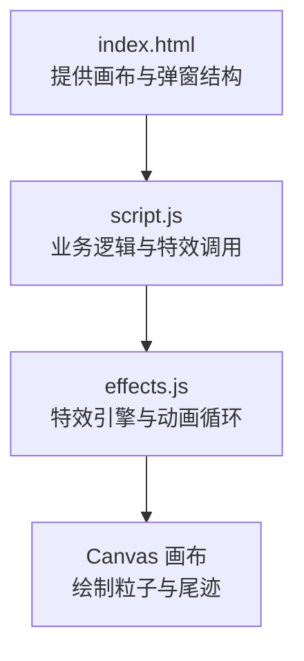
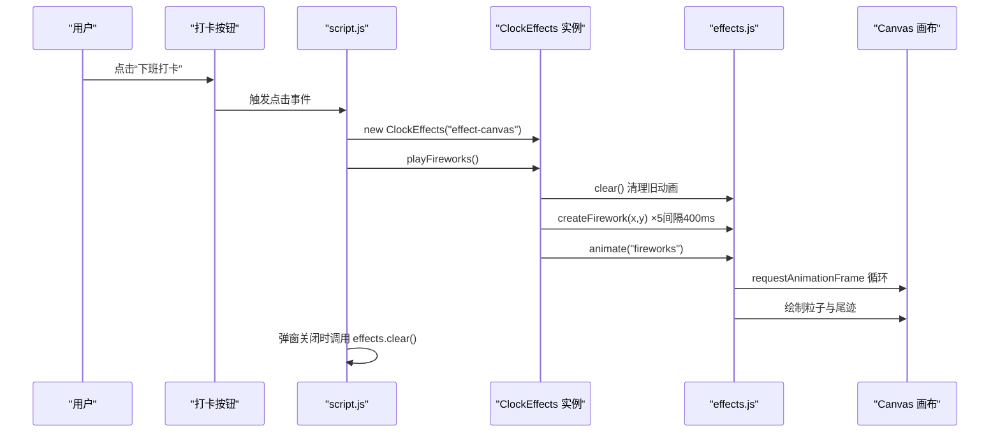
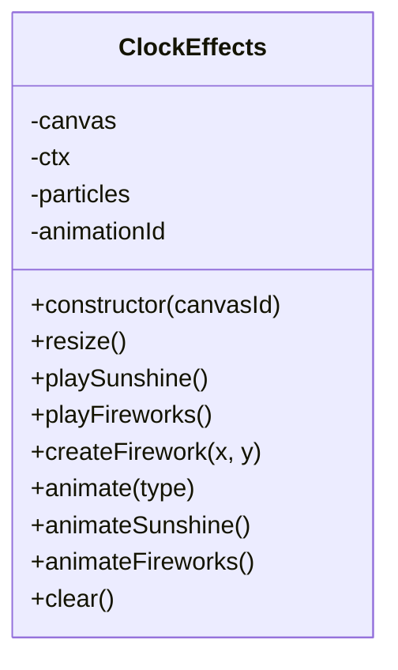
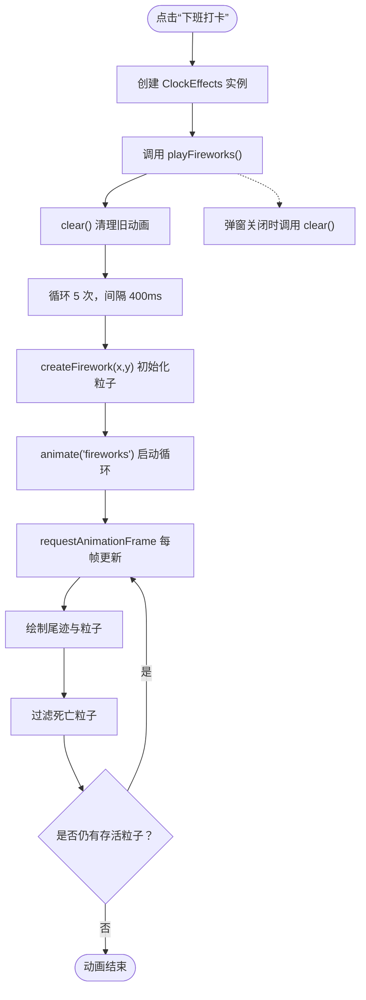
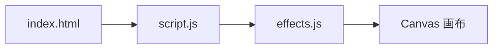

# 礼花特效

<cite>
**本文引用的文件**
- [index.html](file://index.html)
- [script.js](file://script.js)
- [effects.js](file://effects.js)
</cite>

## 目录
1. [简介](#简介)
2. [项目结构](#项目结构)
3. [核心组件](#核心组件)
4. [架构总览](#架构总览)
5. [详细组件分析](#详细组件分析)
6. [依赖关系分析](#依赖关系分析)
7. [性能考量](#性能考量)
8. [故障排查指南](#故障排查指南)
9. [结论](#结论)

## 简介
本文件聚焦“下班打卡”场景下的“礼花特效”，完整梳理从页面交互到 Canvas 动画渲染的端到端流程。重点说明：
- 在下班打卡时，前端如何通过 new ClockEffects('effect-canvas') 实例化特效对象，并调用 playFireworks() 方法。
- effects.js 中 playFireworks() 的实现机制：使用 setTimeout 分 5 次延迟创建礼花，每次调用 createFirework(x, y) 在不同水平位置生成爆炸效果。
- createFirework() 中 80 个主粒子与 20 个内圈闪光粒子的初始化过程：基于极坐标的角度分布、随机初速度、重力与摩擦的物理模拟。
- animateFireworks() 中粒子运动方程（vx、vy 乘以摩擦系数；vy 加上重力）、尾迹绘制（lineTo）与生命值衰减（life -= 0.01）的实现逻辑。
- clear() 方法在动画结束时调用 cancelAnimationFrame 终止循环，确保资源及时释放。

## 项目结构
该特性涉及三个关键文件：
- index.html：提供特效画布元素与打卡弹窗结构。
- script.js：负责业务逻辑与特效调用，包含下班打卡触发与特效生命周期管理。
- effects.js：特效引擎，封装 Canvas 动画、粒子系统与物理模拟。

图表来源
- [index.html](file://index.html#L120-L165)
- [script.js](file://script.js#L546-L728)
- [effects.js](file://effects.js#L1-L279)

章节来源
- [index.html](file://index.html#L120-L165)
- [script.js](file://script.js#L546-L728)
- [effects.js](file://effects.js#L1-L279)

## 核心组件
- ClockEffects 类：封装特效初始化、粒子系统、动画循环与清理。
- Canvas 画布：承载粒子绘制与帧渲染。
- 打卡交互：在下班打卡时触发特效播放。

章节来源
- [effects.js](file://effects.js#L5-L279)
- [index.html](file://index.html#L120-L165)
- [script.js](file://script.js#L546-L728)

## 架构总览
下班打卡到礼花特效的调用链路如下：

图表来源
- [script.js](file://script.js#L546-L728)
- [effects.js](file://effects.js#L64-L133)
- [index.html](file://index.html#L120-L165)

## 详细组件分析

### ClockEffects 类与生命周期
- 构造函数：绑定画布、初始化上下文、设置全屏尺寸并监听窗口变化。
- clear()：终止 requestAnimationFrame、清空画布、重置粒子数组，确保资源释放。
- animate(type)：根据类型选择 Sunshine 或 Fireworks 的动画分支。
- playFireworks()：清理旧状态，按 5 次、每 400ms 的节奏调用 createFirework(x, y)，并在最后启动 animate('fireworks')。
- createFirework(x, y)：初始化 80 个主粒子与 20 个内圈闪光粒子，赋予随机初速度、颜色与物理参数。
- animateFireworks()：每帧更新粒子速度（摩擦与重力）、位置、透明度与生命值，绘制尾迹与粒子，并过滤掉死亡粒子。

图表来源
- [effects.js](file://effects.js#L5-L279)

章节来源
- [effects.js](file://effects.js#L5-L279)

### playFireworks() 的实现机制
- 清理与初始化：调用 clear() 与重置粒子数组，避免残留动画影响。
- 分批创建：循环 5 次，每次通过 setTimeout 延迟 400ms，计算不同水平位置 (x) 与随机垂直位置 (y)，调用 createFirework(x, y)。
- 启动动画：在最后一次延迟之后统一调用 animate('fireworks')，进入主动画循环。

章节来源
- [effects.js](file://effects.js#L64-L86)

### createFirework(x, y) 的粒子初始化
- 主粒子（80 个）：
  - 角度均匀分布在 0 到 2π，速度随机范围设定，初速度由极坐标转换得到。
  - 每个粒子携带随机色相、初始透明度、重力（0.15）与摩擦（0.98），以及初始生命值。
- 内圈闪光（20 个）：
  - 角度同样均匀分布，速度较小且更亮，摩擦（0.95）与重力（0.1）更温和。
  - 通过标记区分内圈粒子，以便在渲染阶段绘制不同样式。

章节来源
- [effects.js](file://effects.js#L88-L133)

### animateFireworks() 的物理与渲染逻辑
- 物理更新：
  - 速度衰减：vx *= 摩擦系数，vy *= 摩擦系数。
  - 重力下落：vy += 重力。
  - 位置更新：x += vx，y += vy。
  - 生命值衰减：life -= 0.01，alpha = life。
- 尾迹绘制：
  - 使用 lineTo 连接当前位置与前一帧位置，形成拖尾效果。
  - 线宽随粒子大小变化，线帽为圆角。
- 粒子绘制：
  - 内圈闪光粒子使用径向渐变绘制外圈光晕与中心亮点。
  - 普通粒子绘制实心圆，透明度随生命值变化。
- 生命周期管理：
  - 过滤 alpha <= 0 的粒子，维持粒子数组规模稳定。
  - 若仍有存活粒子，则继续 requestAnimationFrame 循环。

章节来源
- [effects.js](file://effects.js#L203-L260)

### 从页面到特效的调用链
- 页面结构：index.html 提供 id 为 "effect-canvas" 的 Canvas 元素与打卡弹窗。
- 业务入口：script.js 在下班打卡时创建 ClockEffects 实例并调用 playFireworks()。
- 关闭清理：弹窗关闭或用户离开时，调用 effects.clear()，确保动画循环被取消，避免内存泄漏。

图表来源
- [script.js](file://script.js#L546-L728)
- [effects.js](file://effects.js#L64-L133)
- [index.html](file://index.html#L120-L165)

章节来源
- [script.js](file://script.js#L546-L728)
- [effects.js](file://effects.js#L64-L133)
- [index.html](file://index.html#L120-L165)

## 依赖关系分析
- script.js 依赖 effects.js 提供的 ClockEffects 类。
- ClockEffects 依赖 Canvas API 进行绘制与动画调度。
- index.html 提供特效画布与弹窗容器，作为特效渲染的 DOM 基础。

图表来源
- [index.html](file://index.html#L120-L165)
- [script.js](file://script.js#L546-L728)
- [effects.js](file://effects.js#L1-L279)

章节来源
- [index.html](file://index.html#L120-L165)
- [script.js](file://script.js#L546-L728)
- [effects.js](file://effects.js#L1-L279)

## 性能考量
- 帧循环优化：仅对存活粒子进行更新与绘制，通过过滤死亡粒子减少无效计算。
- 物理参数平衡：摩擦与重力参数适中，避免过高的 CPU 占用；粒子数量可控（100 左右），适合移动端流畅运行。
- 资源释放：clear() 中取消 requestAnimationFrame 并清空画布，防止后台持续渲染导致性能下降。
- 绘制策略：使用径向渐变与线段绘制尾迹，避免复杂路径计算；线帽为圆角，减少锯齿带来的额外开销。

## 故障排查指南
- 画布未显示特效：
  - 检查 Canvas 是否存在且尺寸正确（构造函数会设置全屏尺寸）。
  - 确认弹窗已打开且特效已启动（playFireworks 被调用）。
- 特效不消失或卡顿：
  - 确认弹窗关闭时调用了 effects.clear()，否则动画循环仍在后台运行。
  - 检查是否有多个 playFireworks() 并行调用，导致粒子数量叠加。
- 粒子异常：
  - 检查 createFirework() 中角度与速度的初始化是否正常。
  - 确认 animateFireworks() 中摩擦与重力参数未被意外覆盖。

章节来源
- [script.js](file://script.js#L546-L728)
- [effects.js](file://effects.js#L64-L133)
- [effects.js](file://effects.js#L203-L260)

## 结论
本实现以 ClockEffects 为核心，通过 playFireworks() 的分批延迟创建与 animateFireworks() 的物理渲染，构建了节奏清晰、视觉丰富的礼花特效。其设计要点包括：
- 使用 setTimeout 控制 5 次爆炸的节奏，提升观感层次。
- createFirework() 基于极坐标分布初始化主粒子与内圈闪光粒子，兼顾爆炸扩散与中心高亮。
- animateFireworks() 采用标准物理公式（速度衰减、重力下落）与尾迹绘制，营造自然的粒子轨迹。
- clear() 在动画结束时终止循环，保障资源及时释放，避免性能问题。