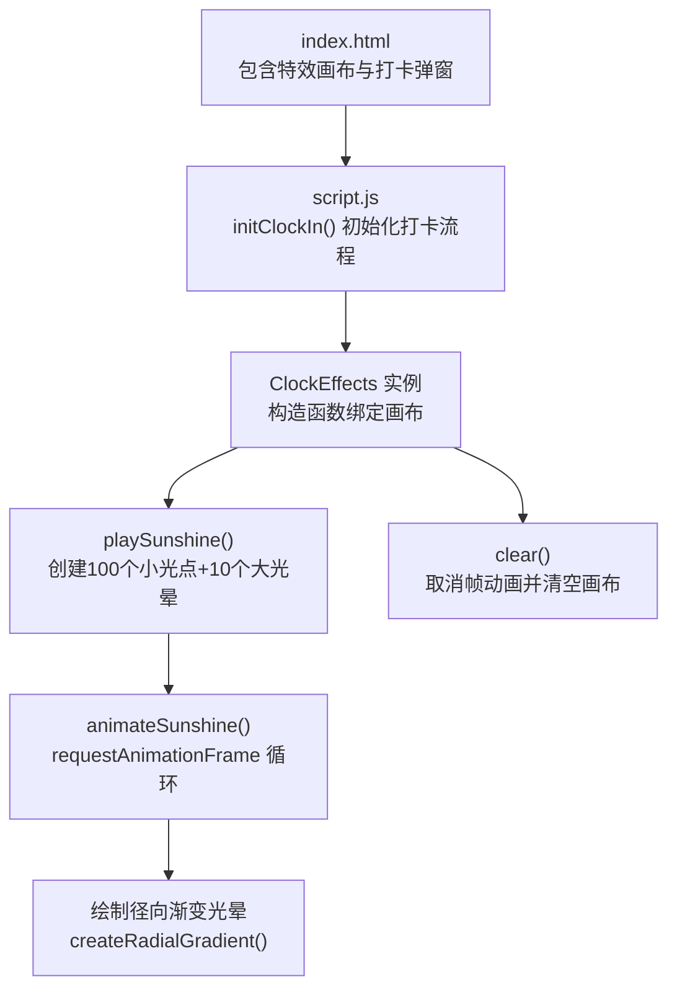
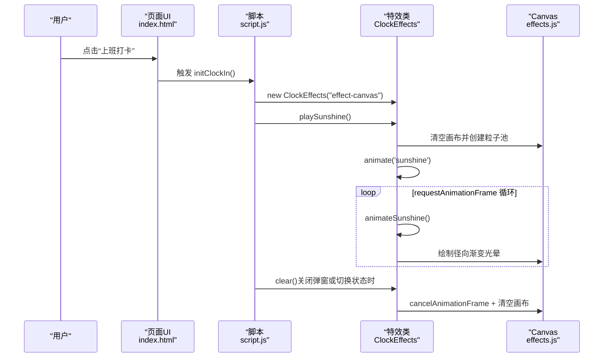
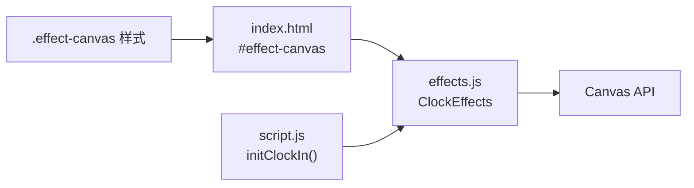

# 阳光特效

<cite>
**本文引用的文件**
- [effects.js](file://effects.js)
- [script.js](file://script.js)
- [index.html](file://index.html)
- [styles.css](file://styles.css)
</cite>

## 目录
1. [简介](#简介)
2. [项目结构](#项目结构)
3. [核心组件](#核心组件)
4. [架构总览](#架构总览)
5. [详细组件分析](#详细组件分析)
6. [依赖关系分析](#依赖关系分析)
7. [性能考量](#性能考量)
8. [故障排查指南](#故障排查指南)
9. [结论](#结论)

## 简介
本文件聚焦“阳光特效”的实现，围绕上班打卡时的视觉体验展开，详细说明从页面交互到特效渲染的完整链路：如何通过 script.js 中的 initClockIn() 触发 window.ClockEffects.playSunshine()，再到 effects.js 中 playSunshine() 的粒子参数配置、animateSunshine() 的动画循环与 requestAnimationFrame 使用、闪烁效果的数学实现，以及 createRadialGradient 径向渐变光晕的绘制细节。同时提供性能优化建议与清理策略，确保在低端设备上也能稳定运行。

## 项目结构
- 效果模块位于 effects.js，提供 ClockEffects 类，负责全屏 Canvas 特效的创建、动画与清理。
- 页面入口 script.js 负责初始化打卡流程，在上班打卡时实例化 ClockEffects 并调用 playSunshine()。
- 页面模板 index.html 提供特效画布 canvas 和打卡弹窗结构。
- 样式 styles.css 定义特效画布的定位与层级，保证特效覆盖在弹窗之上。

图表来源
- [index.html](file://index.html#L120-L165)
- [script.js](file://script.js#L493-L732)
- [effects.js](file://effects.js#L5-L279)
- [styles.css](file://styles.css#L1984-L2000)

章节来源
- [index.html](file://index.html#L120-L165)
- [script.js](file://script.js#L493-L732)
- [effects.js](file://effects.js#L5-L279)
- [styles.css](file://styles.css#L1984-L2000)

## 核心组件
- ClockEffects 类
  - 负责 Canvas 初始化、粒子池管理、动画循环与清理。
  - 提供 playSunshine() 与 animateSunshine()，以及 clear()。
- script.js 中的 initClockIn()
  - 在上班打卡路径中创建 ClockEffects 实例并调用 playSunshine()，随后显示摸鱼吉日签。
- index.html 中的特效画布
  - 通过 id="effect-canvas" 的 canvas 元素承载全屏特效。
- styles.css 中的特效画布样式
  - 绝对定位、全屏尺寸、z-index 层级高于弹窗，且禁用指针事件，避免干扰弹窗交互。

章节来源
- [effects.js](file://effects.js#L5-L279)
- [script.js](file://script.js#L493-L732)
- [index.html](file://index.html#L120-L165)
- [styles.css](file://styles.css#L1984-L2000)

## 架构总览
下面的序列图展示了“上班打卡”到“阳光特效播放”的关键调用链路。

图表来源
- [script.js](file://script.js#L493-L732)
- [effects.js](file://effects.js#L25-L201)
- [index.html](file://index.html#L120-L165)

## 详细组件分析

### 1) 上班打卡触发链路：initClockIn() 与 playSunshine()
- initClockIn() 在页面加载后初始化打卡按钮与状态；当用户点击“上班打卡”时：
  - 创建 ClockEffects 实例，传入特效画布 id。
  - 调用 effects.playSunshine() 开始播放阳光特效。
  - 随后异步生成问候语与摸鱼吉日签，最终在关闭弹窗时调用 effects.clear() 清理动画。
- playSunshine() 的职责：
  - 清理上次动画残留（clear）。
  - 初始化粒子池 particles 数组。
  - 生成两类粒子：
    - 100 个基础光点粒子（小光点）：随机位置、速度、大小、透明度与 HSLA 颜色。
    - 10 个大型光晕粒子（isGlow=true）：更大的尺寸与更低的透明度，营造柔和光晕。
  - 调用 animate('sunshine') 进入动画循环。

章节来源
- [script.js](file://script.js#L493-L732)
- [effects.js](file://effects.js#L25-L62)

### 2) 粒子参数配置（位置、速度、透明度、颜色）
- 基础光点粒子（共 100 个）
  - 位置：x ∈ [0, canvas.width]，y 从画布上方随机偏移，确保从上而下飘落。
  - 速度：垂直速度 speedY ∈ [0.5, 2]，水平速度 speedX ∈ [-0.25, 0.25]，形成轻微左右摆动。
  - 大小：size ∈ [2, 6]，视觉上呈现细小光点。
  - 透明度：alpha ∈ [0.4, 1.0]，结合闪烁算法叠加。
  - 颜色：HSLA 格式，色相 H ∈ [45, 60]，饱和度 100%，亮度 L ∈ [60, 80]%。
  - 闪烁：twinkle ∈ [0, 2π)，每帧递增 0.05，用于 sin(twinkle) 的周期性闪烁。
- 大型光晕粒子（共 10 个）
  - 位置：x/y 与基础光点类似，但 y 的起始范围更靠上，营造“从天而降”的光晕感。
  - 速度：更慢的 speedY 与较小的 speedX，强调漂浮感。
  - 大小：size ∈ [30, 50]，isGlow=true，绘制为矩形填充的径向渐变光晕。
  - 透明度：alpha ∈ [0.1, 0.3]，强调“薄雾”般的扩散。
  - 颜色：HSLA 格式，色相 H ∈ [50, 60]，亮度 70%。

章节来源
- [effects.js](file://effects.js#L25-L62)

### 3) animateSunshine() 动画循环与 requestAnimationFrame
- 每帧执行：
  - 更新粒子位置：y += speedY；x += speedX。
  - 更新闪烁相位：twinkle += 0.05。
  - 计算闪烁透明度：twinkleAlpha = sin(twinkle) × 0.3 + 0.7，使透明度在 0.4~1.0 之间周期性波动。
  - 根据 isGlow 判断绘制分支：
    - isGlow=true：使用 createRadialGradient 在粒子中心绘制从内向外的径向渐变光晕，采用三段色阶（0/0.5/1），alpha 由粒子 alpha 与 twinkleAlpha 共同决定。
    - isGlow=false：绘制小光点与其核心亮点，同样使用径向渐变，但半径更小，核心高亮 alpha 更大。
  - 过滤存活粒子：仅保留 y < canvas.height + 50 的粒子，超出范围则丢弃。
  - 若仍有粒子，则继续下一帧：requestAnimationFrame(() => this.animateSunshine())。
- 结束条件：当粒子池为空时，停止动画循环。

章节来源
- [effects.js](file://effects.js#L144-L201)

### 4) 绘制技术细节：createRadialGradient 径向渐变光晕
- 光晕绘制步骤：
  - 创建径向渐变对象：以粒子坐标为中心，半径从 0 到 size。
  - 添加三段色阶：
    - 0：高亮，alpha 为粒子 alpha 与闪烁 alpha 的乘积。
    - 0.5：中间过渡，alpha 降低至原 alpha 的一半。
    - 1：边缘透明，alpha 为 0，实现自然衰减。
  - 使用 fillStyle 设置渐变，然后绘制矩形或圆形，形成柔和光晕。
- 小光点绘制：
  - 使用较小半径的径向渐变，核心高亮 alpha 更大，突出“光点”质感。

章节来源
- [effects.js](file://effects.js#L144-L193)

### 5) 清理策略：clear() 如何避免内存泄漏
- clear() 的职责：
  - 若存在 animationId，调用 cancelAnimationFrame(this.animationId) 停止动画帧。
  - 清空 ctx 画布内容：ctx.clearRect(0, 0, canvas.width, canvas.height)。
  - 重置 particles 数组为空，释放引用，避免残留粒子导致的持续计算。
- 在关闭打卡弹窗或切换状态时调用，确保资源及时回收。

章节来源
- [effects.js](file://effects.js#L262-L273)

### 6) 页面与交互：initClockIn() 的完整流程
- initClockIn() 负责：
  - 初始化打卡按钮状态与文案，区分“上班打卡”“下班打卡”“已下班”三种状态。
  - 点击事件中：
    - 创建 ClockEffects 实例并调用 playSunshine()。
    - 显示问候语与摸鱼吉日签，支持“再求一签”与“开始摸鱼”保存。
    - 关闭弹窗时调用 effects.clear()，确保动画与画布资源被清理。
  - 该流程与特效类解耦，便于扩展其他特效（如下班的“礼花特效”）。

章节来源
- [script.js](file://script.js#L493-L732)

## 依赖关系分析
- 低耦合设计：
  - script.js 仅通过 window.ClockEffects.playSunshine() 调用特效，不关心内部实现。
  - effects.js 通过 Canvas API 独立完成粒子创建、更新与绘制，不依赖业务逻辑。
- 关键依赖点：
  - index.html 提供 id="effect-canvas" 的画布元素，作为特效载体。
  - styles.css 通过 .effect-canvas 的绝对定位与 z-index，确保特效覆盖在弹窗之上。
  - script.js 在 initClockIn() 中创建 ClockEffects 实例并调用 playSunshine()。

图表来源
- [index.html](file://index.html#L120-L165)
- [script.js](file://script.js#L493-L732)
- [effects.js](file://effects.js#L5-L279)
- [styles.css](file://styles.css#L1984-L2000)

章节来源
- [index.html](file://index.html#L120-L165)
- [script.js](file://script.js#L493-L732)
- [effects.js](file://effects.js#L5-L279)
- [styles.css](file://styles.css#L1984-L2000)

## 性能考量
- 粒子数量控制
  - 当前配置：100 个小光点 + 10 个大光晕，适合大多数设备。
  - 建议在低端设备上限制总数（例如将小光点减少到 60~80），以降低 CPU/GPU 压力。
- 动画帧调度
  - 使用 requestAnimationFrame 控制帧率，避免手动定时器造成的掉帧。
  - 在 animateSunshine() 中按需过滤存活粒子，避免无限增长。
- 绘制优化
  - 使用径向渐变一次性绘制，减少多次路径绘制。
  - 适当降低大光晕粒子数量与半径，减少大面积透明像素填充。
- 资源回收
  - 在 clear() 中取消帧动画与清空画布，防止后台持续计算与内存占用。

[本节为通用性能建议，无需特定文件引用]

## 故障排查指南
- 特效未显示
  - 检查 index.html 是否存在 id="effect-canvas" 的 canvas 元素。
  - 确认 styles.css 中 .effect-canvas 的定位与层级是否正确。
- 特效卡顿或掉帧
  - 降低粒子数量（小光点减少到 60~80）。
  - 降低大光晕数量或半径。
  - 确保未在其他地方频繁创建新的 ClockEffects 实例，避免多动画并发。
- 特效结束后仍占用资源
  - 确认在关闭弹窗或切换状态时调用了 effects.clear()。
  - 检查是否存在未取消的 requestAnimationFrame 或未清空的粒子池。

章节来源
- [index.html](file://index.html#L120-L165)
- [styles.css](file://styles.css#L1984-L2000)
- [effects.js](file://effects.js#L262-L273)

## 结论
阳光特效通过 ClockEffects 类实现了“小光点+大光晕”的双层粒子系统，利用 requestAnimationFrame 驱动的 animateSunshine() 实现平滑的 Y 轴移动与闪烁效果，并通过 createRadialGradient 绘制柔和的径向渐变光晕。initClockIn() 将业务交互与特效渲染解耦，既保证了用户体验，又便于后续扩展其他特效。通过合理的粒子数量控制、帧调度与资源回收策略，可在不同设备上获得流畅稳定的视觉效果。