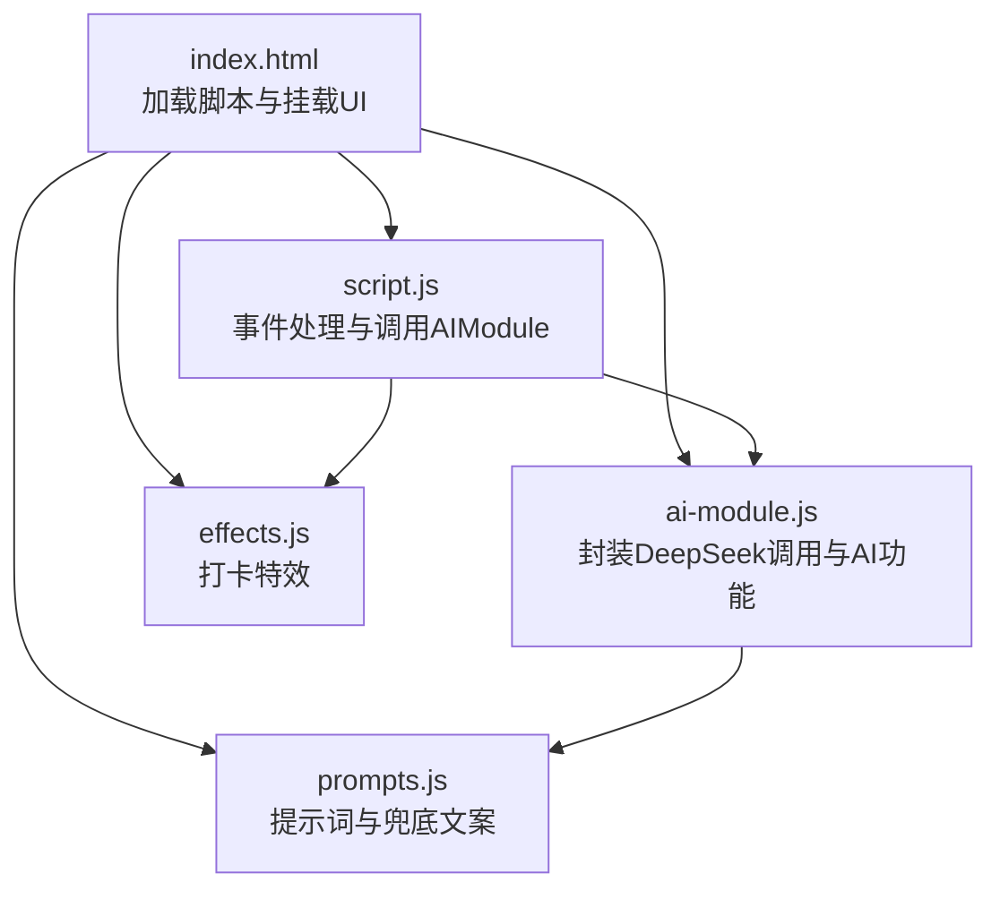
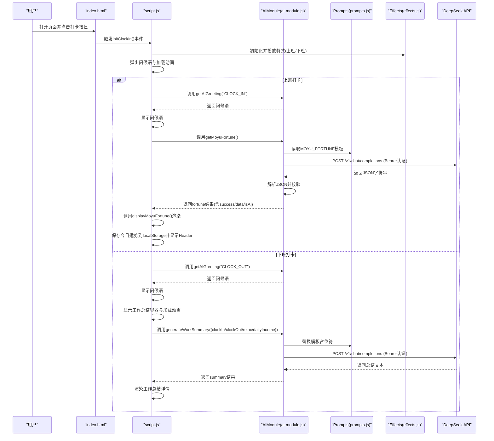
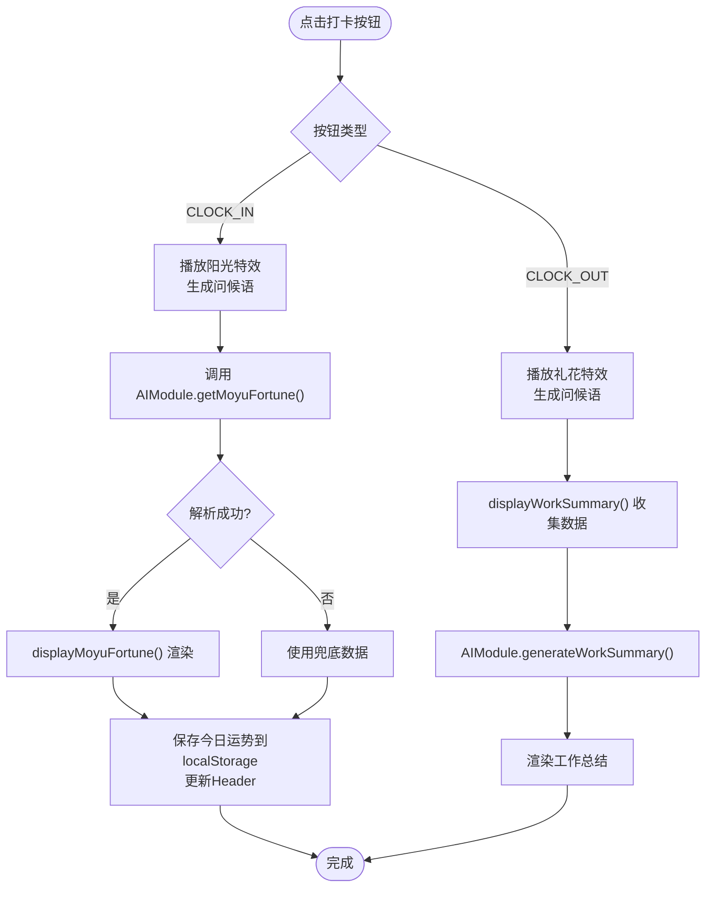
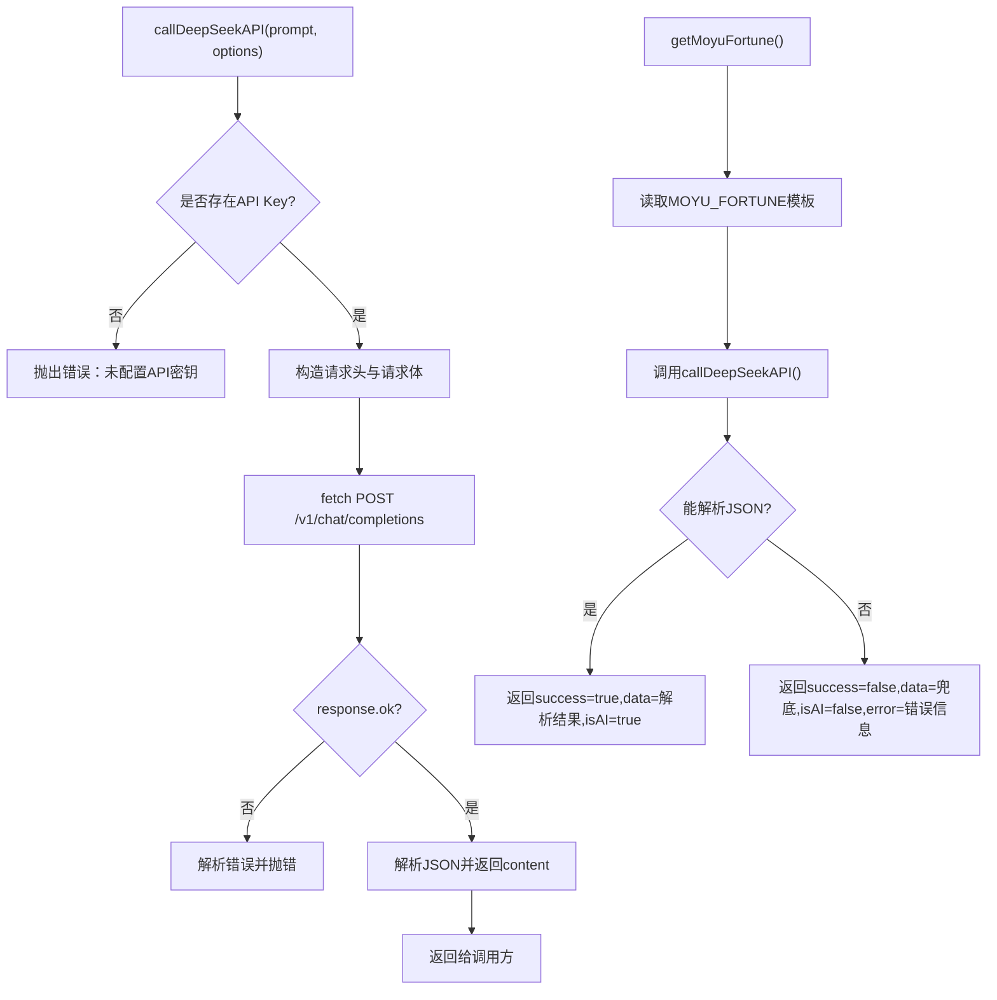
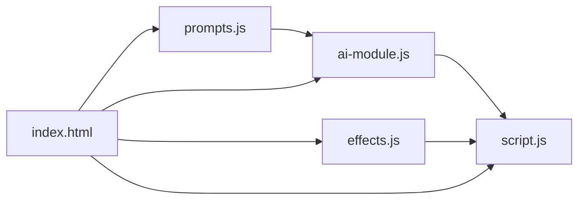

# AI生成流程

<cite>
**本文引用的文件**
- [index.html](file://index.html)
- [script.js](file://script.js)
- [ai-module.js](file://ai-module.js)
- [prompts.js](file://prompts.js)
- [effects.js](file://effects.js)
- [README.md](file://README.md)
</cite>

## 目录
1. [简介](#简介)
2. [项目结构](#项目结构)
3. [核心组件](#核心组件)
4. [架构总览](#架构总览)
5. [详细组件分析](#详细组件分析)
6. [依赖关系分析](#依赖关系分析)
7. [性能考量](#性能考量)
8. [故障排查指南](#故障排查指南)
9. [结论](#结论)

## 简介
本文围绕“摸鱼吉日签”的AI生成完整流程展开，从用户点击打卡按钮触发事件，到调用window.AIModule.getMoyuFortune()，再到向DeepSeek API发起带Bearer认证的POST请求，最终回传并渲染结果。文档还说明了脚本如何集成AI模块、如何处理返回结果、错误冒泡与兜底策略，以及请求头与请求体参数的作用，并提供调试建议。

## 项目结构
- 入口页面index.html负责加载AI提示词、AI模块、特效模块等脚本，并挂载UI结构。
- 主逻辑script.js负责事件绑定、UI交互、调用AIModule、播放特效、渲染结果。
- ai-module.js封装DeepSeek API调用、提示词拼装、错误兜底与结果解析。
- prompts.js集中管理AI提示词模板与兜底文案。
- effects.js提供打卡特效类，增强用户体验。

图表来源
- [index.html](file://index.html#L1-L20)
- [script.js](file://script.js#L493-L732)
- [ai-module.js](file://ai-module.js#L1-L60)
- [prompts.js](file://prompts.js#L1-L60)
- [effects.js](file://effects.js#L1-L40)

章节来源
- [index.html](file://index.html#L1-L20)
- [README.md](file://README.md#L32-L41)

## 核心组件
- 事件处理与UI交互：script.js中initClockIn()负责监听打卡按钮点击，控制弹窗、加载动画、特效播放与结果渲染。
- AI模块：ai-module.js提供getMoyuFortune()、generateWorkSummary()、callDeepSeekAPI()等方法，统一管理DeepSeek调用与错误兜底。
- 提示词与兜底：prompts.js集中管理MOYU_FORTUNE、WORK_SUMMARY等模板，以及MOYU_FORTUNE的兜底JSON结构。
- 特效系统：effects.js提供ClockEffects类，分别在上班/下班打卡时播放阳光/礼花特效。

章节来源
- [script.js](file://script.js#L493-L732)
- [ai-module.js](file://ai-module.js#L95-L167)
- [prompts.js](file://prompts.js#L1-L60)
- [effects.js](file://effects.js#L1-L40)

## 架构总览
从用户点击到AI生成的端到端流程如下：

图表来源
- [index.html](file://index.html#L120-L163)
- [script.js](file://script.js#L547-L732)
- [ai-module.js](file://ai-module.js#L95-L167)
- [prompts.js](file://prompts.js#L1-L60)
- [effects.js](file://effects.js#L1-L40)

## 详细组件分析

### 事件处理与调用链（script.js）
- initClockIn()负责：
  - 更新按钮状态与样式（区分CLOCK_IN/CLOCK_OUT/FINISHED）。
  - 点击事件中：
    - 上班打卡：播放阳光特效；生成问候语；调用AIModule.getMoyuFortune()；解析并渲染摸鱼吉日签；保存localStorage并显示Header；提供“再求一签”与“开始摸鱼”按钮。
    - 下班打卡：播放礼花特效；生成问候语；显示工作总结容器与加载动画；调用AIModule.generateWorkSummary()；渲染总结详情。
- displayMoyuFortune()负责将fortuneData渲染为卡片结构。
- displayWorkSummary()负责收集当日数据（上班/下班时间、摸鱼次数、今日收入），调用AIModule.generateWorkSummary()，并渲染结果。

图表来源
- [script.js](file://script.js#L547-L732)
- [script.js](file://script.js#L3026-L3061)
- [script.js](file://script.js#L3079-L3150)

章节来源
- [script.js](file://script.js#L547-L732)
- [script.js](file://script.js#L3026-L3061)
- [script.js](file://script.js#L3079-L3150)

### AI模块与DeepSeek调用（ai-module.js）
- callDeepSeekAPI(prompt, options)：
  - 从localStorage读取deepseekApiKey，若缺失抛错。
  - 构建POST请求：
    - URL：https://api.deepseek.com/v1/chat/completions
    - Headers：Content-Type为application/json；Authorization为Bearer {apiKey}
    - Body：包含model、messages、temperature、max_tokens、top_p等参数。
  - 校验response.ok，否则解析错误信息并抛错；成功则返回choices[0].message.content.trim()。
- getMoyuFortune()：
  - 读取MOYU_FORTUNE模板，调用callDeepSeekAPI，尝试从返回文本中提取JSON并解析；失败则返回FALLBACK_MESSAGES.MOYU_FORTUNE。
- generateWorkSummary(workData)：
  - 将workData注入WORK_SUMMARY模板，调用callDeepSeekAPI，返回summary；失败则返回FALLBACK_MESSAGES.WORK_SUMMARY。

图表来源
- [ai-module.js](file://ai-module.js#L14-L59)
- [ai-module.js](file://ai-module.js#L95-L127)
- [ai-module.js](file://ai-module.js#L129-L167)

章节来源
- [ai-module.js](file://ai-module.js#L14-L59)
- [ai-module.js](file://ai-module.js#L95-L127)
- [ai-module.js](file://ai-module.js#L129-L167)

### 提示词与兜底（prompts.js）
- MOYU_FORTUNE模板要求返回JSON，包含fortune、bestTime、tips三项。
- WORK_SUMMARY模板要求将clockInTime、clockOutTime、relaxCount、dailyIncome替换后输出总结文本。
- FALLBACK_MESSAGES提供MOYU_FORTUNE的兜底JSON与WORK_SUMMARY的兜底文本，作为错误回退方案。

章节来源
- [prompts.js](file://prompts.js#L1-L60)
- [prompts.js](file://prompts.js#L122-L158)

### 特效系统（effects.js）
- ClockEffects类：
  - playSunshine()：创建100+光点粒子，绘制光晕，模拟阳光洒落。
  - playFireworks()：创建多组粒子，带重力与摩擦，模拟礼花爆炸。
  - animateSunshine()/animateFireworks()：基于requestAnimationFrame驱动动画循环。
- 在script.js中，上班打卡调用playSunshine()，下班打卡调用playFireworks()。

章节来源
- [effects.js](file://effects.js#L1-L40)
- [effects.js](file://effects.js#L64-L141)
- [effects.js](file://effects.js#L135-L201)
- [effects.js](file://effects.js#L203-L261)
- [script.js](file://script.js#L638-L728)

## 依赖关系分析
- index.html加载顺序：
  - prompts.js → ai-module.js → command-module.js → effects.js → script.js
- 调用链依赖：
  - script.js依赖window.AIModule（ai-module.js导出）。
  - AIModule依赖window.AI_PROMPTS与window.FALLBACK_MESSAGES（prompts.js导出）。
  - script.js依赖ClockEffects（effects.js导出）。

图表来源
- [index.html](file://index.html#L1-L12)
- [ai-module.js](file://ai-module.js#L206-L216)
- [effects.js](file://effects.js#L275-L279)
- [prompts.js](file://prompts.js#L153-L159)

章节来源
- [index.html](file://index.html#L1-L12)
- [ai-module.js](file://ai-module.js#L206-L216)
- [effects.js](file://effects.js#L275-L279)
- [prompts.js](file://prompts.js#L153-L159)

## 性能考量
- 动画性能：特效使用Canvas与requestAnimationFrame，避免频繁DOM操作，降低主线程压力。
- API调用：采用异步await/try/catch，避免阻塞UI线程；对错误进行快速回退，保证交互流畅。
- 数据持久化：将今日运势写入localStorage，避免重复请求；在页面加载时读取并显示。
- 文本解析：getMoyuFortune()通过正则提取JSON片段，减少严格解析失败的概率。

[本节为通用指导，无需特定文件引用]

## 故障排查指南
- 网络请求状态与响应：
  - 打开浏览器开发者工具，切换到Network标签，复现打卡流程，观察POST请求状态码、响应体与错误信息。
  - 若返回401/403，检查API Key是否正确保存与可见性。
- 错误冒泡与兜底：
  - getMoyuFortune()与generateWorkSummary()均捕获异常并返回包含error字段的对象；前端根据success与isAI决定是否显示兜底内容。
  - 在script.js中，若fortuneResult.isAI为false且存在error，会在界面显示“AI 调用失败: ...”。
- 调试要点：
  - 在浏览器Console中查看日志，确认调用链是否到达AIModule、是否进入兜底分支。
  - 检查localStorage中是否存在deepseekApiKey与moyuFortune_{today}。
  - 确认index.html中脚本加载顺序正确，确保window.AIModule与window.AI_PROMPTS可用。

章节来源
- [script.js](file://script.js#L648-L666)
- [ai-module.js](file://ai-module.js#L95-L127)
- [ai-module.js](file://ai-module.js#L129-L167)

## 结论
“摸鱼吉日签”的AI生成流程以事件驱动为核心，通过script.js协调UI与特效，借助ai-module.js统一管理DeepSeek API调用与错误兜底，配合prompts.js的模板与兜底文案，实现了稳定、可回退且富交互的AI体验。开发者可通过浏览器开发者工具快速定位网络与逻辑问题，确保流程顺畅。