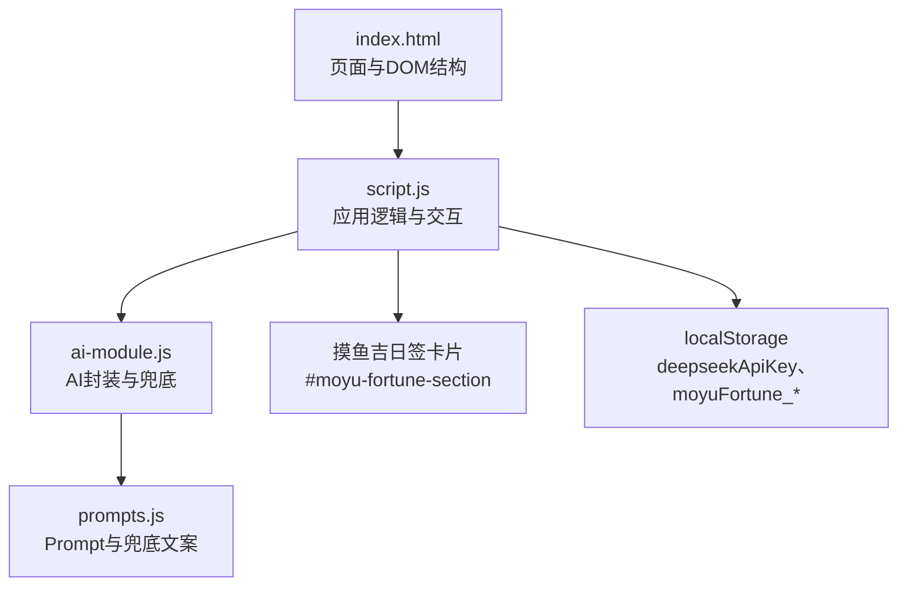
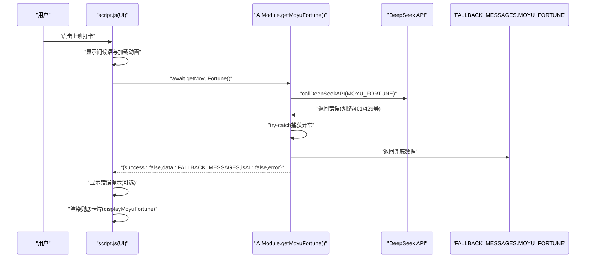
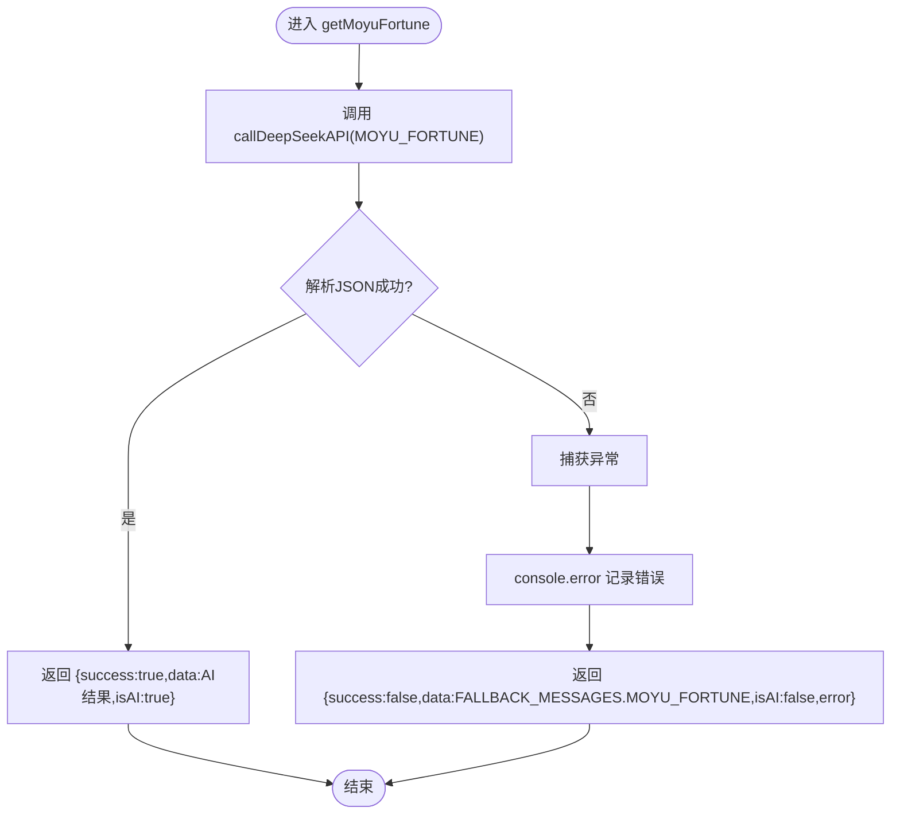
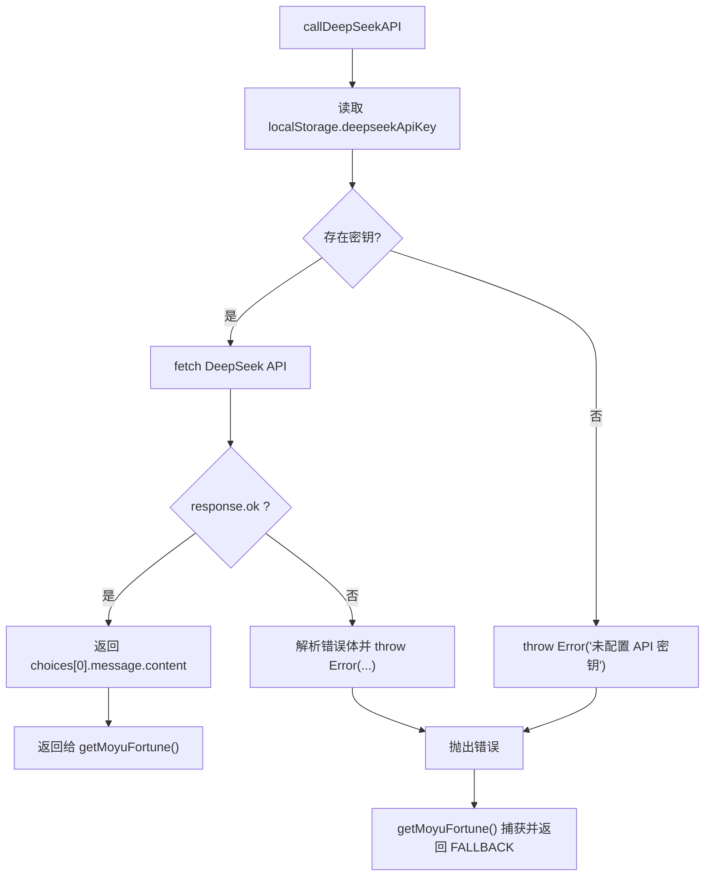
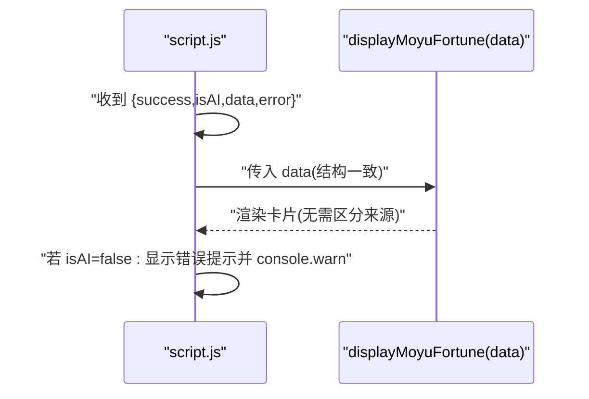
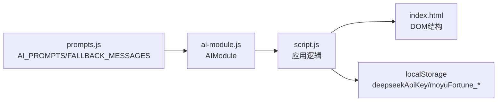

# 兜底机制

<cite>
**本文引用的文件**
- [ai-module.js](file://ai-module.js)
- [prompts.js](file://prompts.js)
- [script.js](file://script.js)
- [index.html](file://index.html)
- [README.md](file://README.md)
</cite>

## 目录
1. [简介](#简介)
2. [项目结构](#项目结构)
3. [核心组件](#核心组件)
4. [架构总览](#架构总览)
5. [详细组件分析](#详细组件分析)
6. [依赖关系分析](#依赖关系分析)
7. [性能考量](#性能考量)
8. [故障排查指南](#故障排查指南)
9. [结论](#结论)

## 简介
本文件围绕“摸鱼吉日签”系统的兜底机制展开，系统性阐述当 DeepSeek API 调用失败（如网络异常、API 密钥无效、服务不可用）时，getMoyuFortune() 如何通过 try-catch 捕获异常，并返回 FALLBACK_MESSAGES.MOYU_FORTUNE 中预设的默认值；同时分析 ai-module.js 中的错误处理流程（console.error 日志记录、错误信息封装与降级响应返回）；解释 prompts.js 中 FALLBACK_MESSAGES 常量的结构设计，使其与 AI 生成结果保持一致的数据格式（fortune、bestTime、tips），从而确保前端消费逻辑无需区分来源。最后提供故障排查指南，包括检查 localStorage 中 deepseekApiKey 的有效性、验证网络连接状态、分析 API 返回的错误码（如 401 Unauthorized、429 Rate Limited）等实用方法。

## 项目结构
- 前端入口与页面结构：index.html 引入 prompts.js、ai-module.js、command-module.js、effects.js，并挂载打卡弹窗、摸鱼吉日签卡片等 UI。
- AI 能力封装：ai-module.js 提供 callDeepSeekAPI、getMoyuFortune 等函数，负责与 DeepSeek API 通信与兜底处理。
- Prompt 与兜底文案：prompts.js 定义 AI_PROMPTS 和 FALLBACK_MESSAGES，统一管理提示词与兜底数据。
- 应用逻辑：script.js 负责 UI 交互、打卡流程、调用 AIModule 并渲染结果，同时负责兜底回退后的错误提示与本地存储。



图表来源
- [index.html](file://index.html#L1-L160)
- [script.js](file://script.js#L540-L720)
- [ai-module.js](file://ai-module.js#L1-L216)
- [prompts.js](file://prompts.js#L1-L159)

章节来源
- [index.html](file://index.html#L1-L160)
- [README.md](file://README.md#L32-L42)

## 核心组件
- getMoyuFortune(): 在 try-catch 中调用 DeepSeek API，解析返回的 JSON，失败时返回 FALLBACK_MESSAGES.MOYU_FORTUNE，并标记 isAI=false、附带 error 字段。
- callDeepSeekAPI(): 从 localStorage 读取 deepseekApiKey，构造请求，处理 response.ok 与 JSON 错误体，失败时抛出错误并记录 console.error。
- FALLBACK_MESSAGES.MOYU_FORTUNE: 与 AI 期望的 JSON 结构一致（fortune、bestTime、tips），保证前端 displayMoyuFortune() 无需区分来源即可渲染。
- 前端消费逻辑：script.js 在打卡流程中调用 AIModule.getMoyuFortune()，若 isAI=false 则显示错误提示并使用兜底数据渲染。

章节来源
- [ai-module.js](file://ai-module.js#L95-L127)
- [ai-module.js](file://ai-module.js#L14-L59)
- [prompts.js](file://prompts.js#L122-L139)
- [script.js](file://script.js#L638-L690)

## 架构总览
下图展示了“摸鱼吉日签”在 API 失败时的完整兜底路径：从 UI 触发到 AIModule 调用、API 错误捕获、降级返回与前端渲染。



图表来源
- [script.js](file://script.js#L638-L690)
- [ai-module.js](file://ai-module.js#L95-L127)
- [prompts.js](file://prompts.js#L122-L139)

## 详细组件分析

### getMoyuFortune() 兜底流程
- 调用链路：getMoyuFortune() -> callDeepSeekAPI() -> fetch DeepSeek API -> 解析 JSON -> 成功返回 {success:true,data:{fortune,bestTime,tips},isAI:true}。
- 失败分支：当 callDeepSeekAPI() 抛错或无法解析 JSON 时，getMoyuFortune() 捕获异常，记录 console.error，并返回 {success:false,data:FALLBACK_MESSAGES.MOYU_FORTUNE,isAI:false,error:xxx}。
- 前端处理：script.js 在收到 isAI=false 时，会在 UI 上显示错误提示并使用兜底数据渲染卡片。



图表来源
- [ai-module.js](file://ai-module.js#L95-L127)

章节来源
- [ai-module.js](file://ai-module.js#L95-L127)
- [script.js](file://script.js#L638-L690)

### ai-module.js 错误处理流程
- callDeepSeekAPI():
  - 从 localStorage 读取 deepseekApiKey，不存在则抛错。
  - fetch 请求，若 response.ok 为 false，尝试解析 JSON 错误体并抛错。
  - 捕获异常时记录 console.error，并再次抛出，供上层 getMoyuFortune() 捕获。
- getMoyuFortune():
  - try-catch 包裹 API 调用，失败时返回 FALLBACK_MESSAGES.MOYU_FORTUNE，并附带 error 字段。
  - isAI=false 表明数据来自兜底，便于前端区分。



图表来源
- [ai-module.js](file://ai-module.js#L14-L59)
- [ai-module.js](file://ai-module.js#L95-L127)

章节来源
- [ai-module.js](file://ai-module.js#L14-L59)
- [ai-module.js](file://ai-module.js#L95-L127)

### prompts.js FALLBACK_MESSAGES 结构设计
- FALLBACK_MESSAGES.MOYU_FORTUNE 严格遵循与 AI 期望一致的 JSON 结构：包含 fortune、bestTime、tips 字段，确保前端 displayMoyuFortune() 无需区分数据来源即可直接渲染。
- 其他类型（如 WORK_SUMMARY、NEWS_ANALYSIS）也采用一致的“字段化”兜底策略，便于统一消费。

```mermaid
classDiagram
class FALLBACK_MESSAGES {
+MOYU_FORTUNE : {
fortune : string
bestTime : string
tips : string[]
}
+WORK_SUMMARY : string
+NEWS_ANALYSIS : string[]
}
```

图表来源
- [prompts.js](file://prompts.js#L122-L139)

章节来源
- [prompts.js](file://prompts.js#L122-L139)

### 前端消费与渲染一致性
- script.js 在打卡流程中调用 AIModule.getMoyuFortune()，无论来自 AI 还是兜底，均以相同结构 data（含 fortune、bestTime、tips）传入 displayMoyuFortune()，从而实现“无差别渲染”。
- 若 isAI=false，UI 会显示错误提示并记录 console.warn，提示用户当前使用的是兜底数据。



图表来源
- [script.js](file://script.js#L638-L690)
- [script.js](file://script.js#L3026-L3061)

章节来源
- [script.js](file://script.js#L638-L690)
- [script.js](file://script.js#L3026-L3061)

## 依赖关系分析
- ai-module.js 依赖 prompts.js 中的 AI_PROMPTS 与 FALLBACK_MESSAGES，通过 window 全局暴露 AIModule 供 script.js 使用。
- script.js 依赖 index.html 的 DOM 结构（如 #moyu-fortune-section），并在打卡流程中协调特效、提示与渲染。
- localStorage 作为密钥与持久化数据的唯一来源，贯穿设置、测试、调用与渲染全过程。



图表来源
- [prompts.js](file://prompts.js#L1-L159)
- [ai-module.js](file://ai-module.js#L207-L216)
- [script.js](file://script.js#L540-L720)
- [index.html](file://index.html#L120-L160)

章节来源
- [prompts.js](file://prompts.js#L1-L159)
- [ai-module.js](file://ai-module.js#L207-L216)
- [script.js](file://script.js#L540-L720)
- [index.html](file://index.html#L120-L160)

## 性能考量
- 兜底返回避免了重复网络请求与复杂解析逻辑，降低 UI 卡顿风险。
- 前端渲染统一结构，减少分支判断与 DOM 重建成本。
- 建议：在高频重试场景（如“再求一签”）中，可增加节流/防抖，避免短时间内多次触发 API 调用。

## 故障排查指南
- 检查 localStorage 中 deepseekApiKey 是否有效
  - 在设置页保存密钥后，可在浏览器开发者工具的 Application/Local Storage 中确认 deepseekApiKey 是否存在且非空。
  - 若为空，callDeepSeekAPI() 将直接抛错，getMoyuFortune() 捕获并返回兜底。
- 验证网络连接状态
  - 确认设备可访问 https://api.deepseek.com/v1/chat/completions。
  - 若网络异常导致 fetch 抛错，getMoyuFortune() 会捕获并返回兜底。
- 分析 API 返回的错误码
  - 401 Unauthorized：通常表示密钥无效或过期。callDeepSeekAPI() 会解析响应 JSON 的错误体并抛错，getMoyuFortune() 捕获后返回兜底。
  - 429 Rate Limited：表示请求过于频繁。callDeepSeekAPI() 会抛错，getMoyuFortune() 捕获后返回兜底。
  - 其他错误：如网络超时、DNS 解析失败等，同样会被 try-catch 捕获并返回兜底。
- 查看控制台日志
  - getMoyuFortune() 与 callDeepSeekAPI() 均会记录 console.error，便于定位问题。
  - script.js 在 isAI=false 时会记录 console.warn，提示使用了兜底数据。
- 使用“测试连接”功能
  - 在设置页点击“测试连接”，脚本会临时保存密钥并调用 AIModule.getAIGreeting()，根据返回的 success/error 判断连接状态。

章节来源
- [ai-module.js](file://ai-module.js#L14-L59)
- [ai-module.js](file://ai-module.js#L95-L127)
- [script.js](file://script.js#L424-L491)
- [script.js](file://script.js#L638-L690)

## 结论
本系统通过“统一结构的兜底数据 + 明确的错误封装 + 前端无差别渲染”的设计，在 DeepSeek API 失败时实现了稳定、一致的用户体验。getMoyuFortune() 的 try-catch 与 FALLBACK_MESSAGES.MOYU_FORTUNE 的结构化设计，确保前端消费逻辑无需区分来源，极大降低了集成复杂度与维护成本。配合完善的日志记录与设置页测试功能，开发者与用户均可快速定位与修复问题。