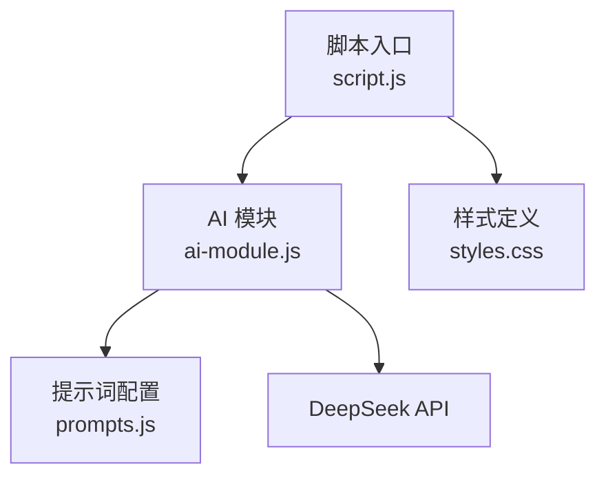
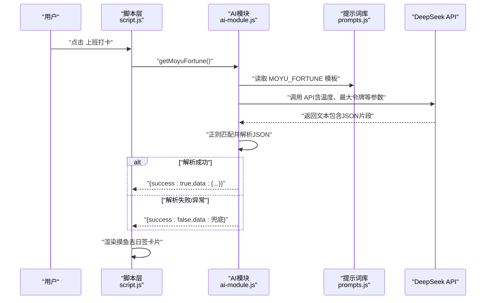
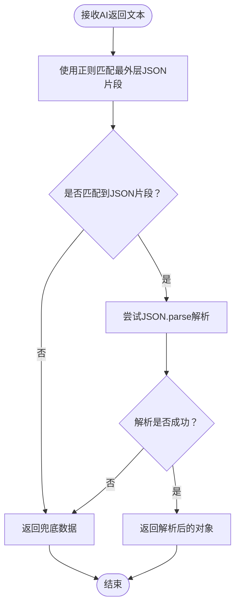
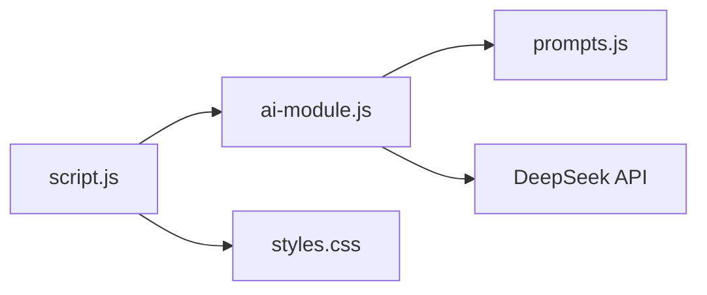

# 提示词设计

<cite>
**本文引用的文件列表**
- [prompts.js](file://prompts.js)
- [ai-module.js](file://ai-module.js)
- [script.js](file://script.js)
- [styles.css](file://styles.css)
</cite>

## 目录
1. [引言](#引言)
2. [项目结构](#项目结构)
3. [核心组件](#核心组件)
4. [架构总览](#架构总览)
5. [详细组件分析](#详细组件分析)
6. [依赖关系分析](#依赖关系分析)
7. [性能考量](#性能考量)
8. [故障排查指南](#故障排查指南)
9. [结论](#结论)
10. [附录](#附录)

## 引言
本文件围绕“摸鱼吉日签”提示词的设计与实现进行深入解析，重点说明 prompts.js 中定义的 AI_PROMPTS.MOYU_FORTUNE 模板如何通过多行字符串明确角色定位、输出要求与格式规范；解释风格控制、内容约束与语言调性在提示词中的具体落点；剖析 JSON 强制输出与正则解析机制的协同工作原理；并提供修改提示词的实践指导及对生成结果的影响评估。

## 项目结构
本项目采用前端单页应用结构，AI 相关能力集中在独立模块中，提示词集中管理，UI 交互负责触发与展示。与“摸鱼吉日签”相关的文件分布如下：
- 提示词与兜底文案：prompts.js
- AI 调用与解析：ai-module.js
- 用户交互与展示：script.js、styles.css

图表来源
- [script.js](file://script.js#L636-L728)
- [ai-module.js](file://ai-module.js#L13-L58)
- [prompts.js](file://prompts.js#L1-L25)
- [styles.css](file://styles.css#L2005-L2097)

章节来源
- [script.js](file://script.js#L636-L728)
- [ai-module.js](file://ai-module.js#L13-L58)
- [prompts.js](file://prompts.js#L1-L25)
- [styles.css](file://styles.css#L2005-L2097)

## 核心组件
- 提示词模板：AI_PROMPTS.MOYU_FORTUNE 使用多行字符串定义角色、风格、输出结构与格式约束，明确要求返回纯 JSON。
- AI 调用与解析：ai-module.js 中的 getMoyuFortune 负责拼装提示词、调用 DeepSeek API，并通过正则提取 JSON 片段进行解析。
- 兜底策略：当 AI 返回非预期格式或调用失败时，回退至 FALLBACK_MESSAGES.MOYU_FORTUNE。
- UI 展示：script.js 调用 AIModule 接口，将结果渲染为卡片式 UI。

章节来源
- [prompts.js](file://prompts.js#L1-L25)
- [ai-module.js](file://ai-module.js#L99-L126)
- [script.js](file://script.js#L636-L728)

## 架构总览
“摸鱼吉日签”的端到端流程如下：
- 用户点击“上班打卡”，触发脚本层逻辑
- 脚本层调用 AIModule.getMoyuFortune
- AIModule 从全局提示词中取模板，调用 DeepSeek API
- AI 返回文本，AIModule 使用正则提取 JSON 并解析
- 若解析失败或异常，则使用兜底文案
- 脚本层将结果渲染到页面

图表来源
- [script.js](file://script.js#L636-L728)
- [ai-module.js](file://ai-module.js#L99-L126)
- [prompts.js](file://prompts.js#L1-L25)

## 详细组件分析

### 提示词模板：MOYU_FORTUNE 设计要点
- 角色定位：明确“幽默风趣的摸鱼大师”，使模型在回答时采用轻松、友好的语调。
- 输出要求：严格限定返回三个字段（fortune、bestTime、tips），并通过 JSON 结构示例说明字段含义与长度范围。
- 格式规范：要求“只返回JSON，不要有其他文字”，确保后续解析稳定。
- 风格控制：强调“幽默诙谐、积极向上”，避免沉闷或负面表达。
- 内容约束：鼓励结合“办公室日常、工作场景”，贴近用户情境。
- 语言调性：要求“接地气、朋友间的玩笑”，降低距离感，增强亲和力。

章节来源
- [prompts.js](file://prompts.js#L1-L25)

### JSON 强制输出与正则解析机制
- 强制输出：提示词明确要求“只返回JSON，不要有其他文字”，从源头减少多余文本干扰。
- 正则提取：AIModule 在收到响应后使用正则匹配最外层大括号包裹的 JSON 片段，避免模型在 JSON 外附加解释性文字。
- 解析与兜底：若正则未命中或 JSON 解析失败，统一走兜底逻辑，保证 UI 可用性与一致性。

图表来源
- [ai-module.js](file://ai-module.js#L99-L126)
- [prompts.js](file://prompts.js#L1-L25)

章节来源
- [ai-module.js](file://ai-module.js#L99-L126)

### 参数与温度控制对生成结果的影响
- 温度（temperature）：AIModule 对不同任务设置了不同的温度值，MOYU_FORTUNE 使用较高温度以提升创意与多样性；温度越高，输出越随机、越富于变化，但也可能增加格式偏差风险。
- 最大令牌（max_tokens）：为 MOYU_FORTUNE 设置了较大的上限，确保能容纳完整的 JSON 结构与说明文字。
- Top-P（top_p）：维持在较高水平，有助于保留更多候选词的概率质量，提升流畅度与自然度。

章节来源
- [ai-module.js](file://ai-module.js#L13-L58)
- [ai-module.js](file://ai-module.js#L99-L126)

### UI 展示与交互
- 卡片布局：使用样式类名组织“运势”“最佳时间”“锦囊”三栏，视觉层次清晰。
- 交互按钮：“再求一签”支持重新生成，“开始摸鱼”用于保存事件并关闭弹窗。
- 数据持久化：将当日运势写入本地存储，供头部展示与后续使用。

章节来源
- [styles.css](file://styles.css#L2005-L2097)
- [script.js](file://script.js#L636-L728)
- [script.js](file://script.js#L3026-L3061)

## 依赖关系分析
- 脚本层依赖 AI 模块接口，间接依赖提示词库与样式资源。
- AI 模块依赖提示词库与 DeepSeek API。
- 提示词库提供模板与兜底文案，样式库提供 UI 呈现。

图表来源
- [script.js](file://script.js#L636-L728)
- [ai-module.js](file://ai-module.js#L99-L126)
- [prompts.js](file://prompts.js#L1-L25)
- [styles.css](file://styles.css#L2005-L2097)

章节来源
- [script.js](file://script.js#L636-L728)
- [ai-module.js](file://ai-module.js#L99-L126)
- [prompts.js](file://prompts.js#L1-L25)
- [styles.css](file://styles.css#L2005-L2097)

## 性能考量
- API 调用成本：每次生成“摸鱼吉日签”都会发起一次网络请求，建议在 UI 层做节流与缓存策略（例如按日缓存结果）。
- 解析开销：正则匹配与 JSON 解析为轻量级操作，通常不影响整体性能。
- 渲染成本：卡片渲染为 DOM 操作，数量有限，一般不会成为瓶颈。
- 参数优化：适当降低温度可减少格式漂移，提高稳定性；增大最大令牌可避免截断，但会增加耗时与成本。

## 故障排查指南
- API 密钥缺失：调用前需确保本地存储中存在有效密钥，否则会抛出错误。
- JSON 解析失败：若模型返回文本中未包含完整 JSON 或混入解释性文字，正则无法匹配或 JSON.parse 抛错，将触发兜底。
- 网络异常：HTTP 状态码非 2xx 时会捕获错误并回退。
- UI 不显示：确认脚本层已正确调用渲染函数，并检查样式类名与容器是否存在。

章节来源
- [ai-module.js](file://ai-module.js#L13-L58)
- [ai-module.js](file://ai-module.js#L99-L126)
- [script.js](file://script.js#L636-L728)

## 结论
MOYU_FORTUNE 提示词通过明确的角色设定、严格的输出结构与格式约束，配合 AIModule 的正则提取与兜底策略，实现了稳定可靠的“摸鱼吉日签”生成体验。合理调节温度与令牌上限可在创意与稳定性之间取得平衡；UI 层的卡片化展示与交互按钮进一步提升了可用性与趣味性。

## 附录

### 修改提示词的实践指导
- 调整温度参数
  - 影响：提高温度可增强创意与多样性，但可能增加 JSON 格式不稳的风险；降低温度更易保持结构稳定。
  - 建议：若发现 JSON 解析失败增多，可适当降低温度；若希望生成更有趣味性，可小幅上调。
  - 参考位置：[ai-module.js](file://ai-module.js#L99-L126)

- 变更输出结构
  - 影响：新增字段需同步更新 UI 渲染逻辑与样式布局；删除字段需清理渲染代码，避免空值处理。
  - 建议：先在提示词中声明新字段与长度限制，再在脚本层扩展渲染函数与样式。
  - 参考位置：[prompts.js](file://prompts.js#L1-L25)，[script.js](file://script.js#L3026-L3061)，[styles.css](file://styles.css#L2005-L2097)

- 增加个性化元素
  - 影响：引入用户上下文（如姓名、部门、历史摸鱼记录）可提升相关性，但需注意令牌消耗与隐私保护。
  - 建议：在提示词中预留占位符并在调用前替换，同时控制上下文长度，避免超出最大令牌限制。
  - 参考位置：[ai-module.js](file://ai-module.js#L134-L167)

- 风格与语言调性微调
  - 影响：风格描述直接影响模型输出的语气与用词倾向。
  - 建议：在提示词中细化风格关键词与示例，必要时提供反例以排除不期望的表达。
  - 参考位置：[prompts.js](file://prompts.js#L1-L25)