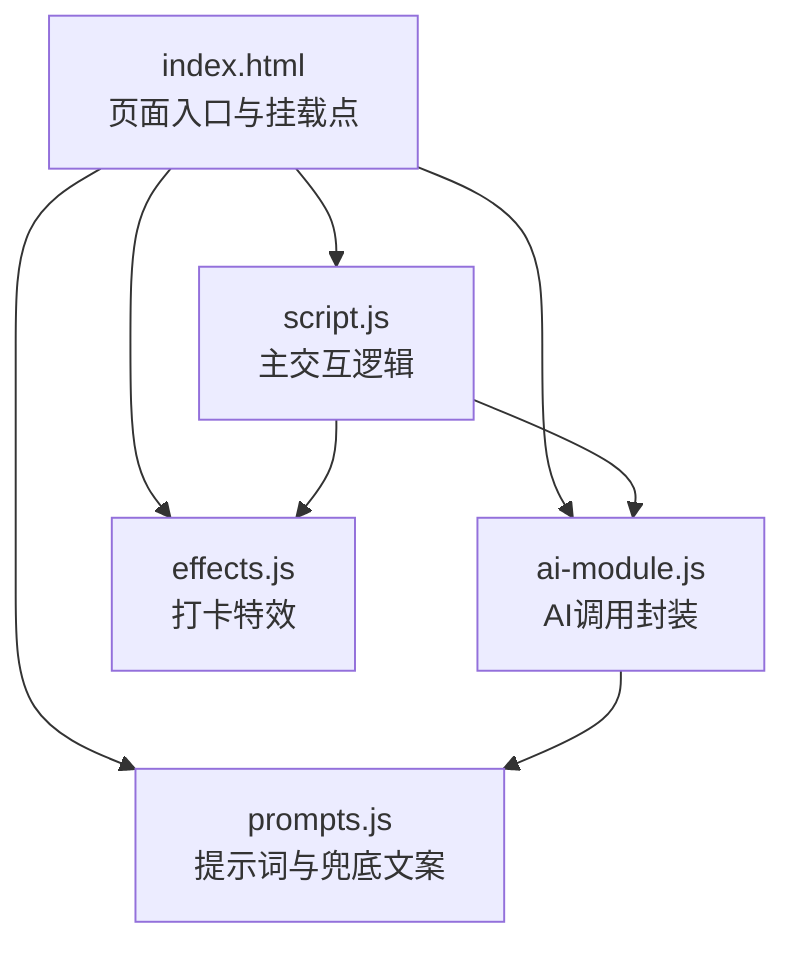
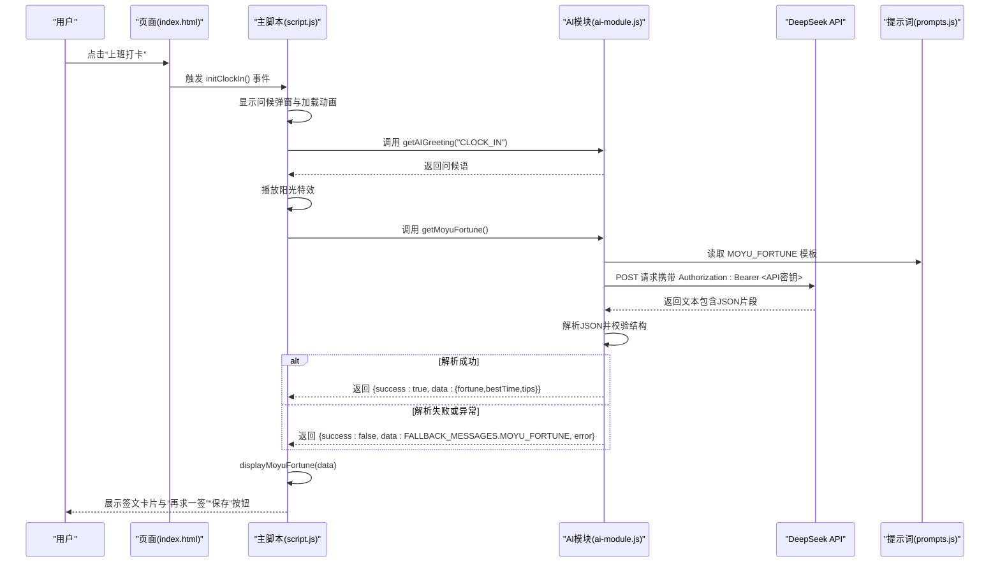
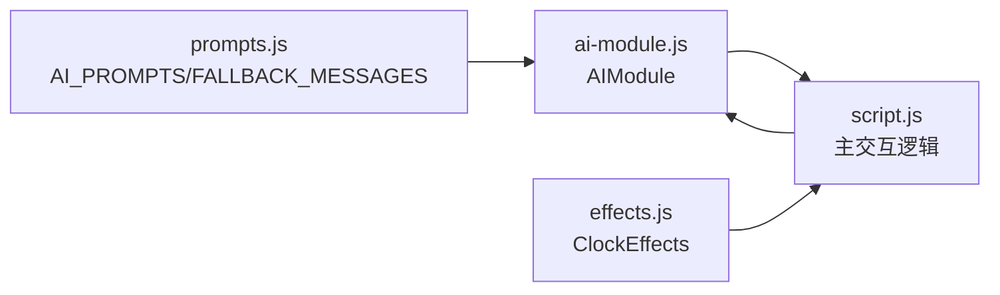

# 摸鱼吉日签系统

<cite>
**本文引用的文件**
- [index.html](file://index.html)
- [script.js](file://script.js)
- [ai-module.js](file://ai-module.js)
- [prompts.js](file://prompts.js)
- [effects.js](file://effects.js)
- [README.md](file://README.md)
</cite>

## 目录
1. [简介](#简介)
2. [项目结构](#项目结构)
3. [核心组件](#核心组件)
4. [架构总览](#架构总览)
5. [详细组件分析](#详细组件分析)
6. [依赖关系分析](#依赖关系分析)
7. [性能考量](#性能考量)
8. [故障排查指南](#故障排查指南)
9. [结论](#结论)
10. [附录](#附录)

## 简介
本文件面向“摸鱼吉日签系统”的深度文档，围绕从用户点击“上班打卡”到AI生成签文的完整流程展开，重点说明：
- script.js 如何调用 window.AIModule.getMoyuFortune() 发起请求
- ai-module.js 中 callDeepSeekAPI() 如何使用 DeepSeek API 密钥发送 POST 请求
- prompts.js 中 MOYU_FORTUNE 模板的设计原则
- JSON 响应解析机制及兜底方案（FALLBACK_MESSAGES）在 API 失败时的作用
- 调试 AI 调用失败的步骤（检查网络请求、验证 API 密钥格式、分析返回错误码）
- 如何通过修改提示词改变生成风格的实践路径

## 项目结构
系统采用前端单页结构，核心交互集中在首页与设置页，AI 能力通过独立模块注入到全局命名空间，供页面脚本调用。

图表来源
- [index.html](file://index.html#L1-L40)
- [script.js](file://script.js#L493-L732)
- [ai-module.js](file://ai-module.js#L1-L60)
- [prompts.js](file://prompts.js#L1-L60)
- [effects.js](file://effects.js#L1-L40)

章节来源
- [index.html](file://index.html#L1-L120)
- [README.md](file://README.md#L32-L41)

## 核心组件
- 页面入口与挂载点：index.html 引入 prompts.js、ai-module.js、command-module.js、effects.js，并挂载主交互脚本 script.js。
- 主交互逻辑：script.js 负责初始化、标签页与侧边栏、番茄钟、AI 设置、打卡流程、特效播放、时间轴与消息展示。
- AI 调用封装：ai-module.js 提供 callDeepSeekAPI()、getMoyuFortune()、generateWorkSummary()、callAIAnalysis() 等方法，并暴露到 window.AIModule。
- 提示词与兜底：prompts.js 定义 AI_PROMPTS 与 FALLBACK_MESSAGES，统一管理提示词与失败兜底。
- 打卡特效：effects.js 提供 ClockEffects 类，实现“阳光特效（上班）”和“礼花特效（下班）”。

章节来源
- [index.html](file://index.html#L1-L40)
- [script.js](file://script.js#L493-L732)
- [ai-module.js](file://ai-module.js#L1-L120)
- [prompts.js](file://prompts.js#L1-L159)
- [effects.js](file://effects.js#L1-L120)

## 架构总览
从“上班打卡”到“摸鱼吉日签”的端到端流程如下：

图表来源
- [script.js](file://script.js#L546-L732)
- [ai-module.js](file://ai-module.js#L95-L127)
- [prompts.js](file://prompts.js#L1-L60)

## 详细组件分析

### 组件A：打卡流程与签文生成（script.js）
- 初始化与按钮状态：initClockIn() 负责按钮文案与状态切换（CLOCK_IN/CLOCK_OUT/FINISHED），并绑定点击事件。
- 上班打卡分支：
  - 显示问候弹窗与加载动画
  - 调用 AIModule.getAIGreeting("CLOCK_IN") 获取问候语
  - 播放阳光特效（ClockEffects.playSunshine）
  - 调用 AIModule.getMoyuFortune() 获取签文
  - 解析返回结果，若 isAI=false 且存在 error，则使用 FALLBACK_MESSAGES.MOYU_FORTUNE
  - 调用 displayMoyuFortune(data) 渲染卡片
  - 提供“再求一签”与“保存”按钮交互
- 下班打卡分支：
  - 调用 AIModule.getAIGreeting("CLOCK_OUT") 获取问候语
  - 播放礼花特效（ClockEffects.playFireworks）
  - 生成并显示工作总结（displayWorkSummary）

章节来源
- [script.js](file://script.js#L546-L732)
- [effects.js](file://effects.js#L1-L120)

### 组件B：AI 调用封装（ai-module.js）
- callDeepSeekAPI(prompt, options)：
  - 从 localStorage 读取 deepseekApiKey
  - 使用 fetch 发送 POST 请求至 https://api.deepseek.com/v1/chat/completions
  - 请求头包含 Authorization: Bearer <API密钥> 与 Content-Type: application/json
  - body 包含 model、messages、temperature、max_tokens、top_p 等参数
  - 若 response.ok 为 false，尝试解析错误信息并抛出错误
  - 成功时返回 choices[0].message.content.trim()
- getMoyuFortune()：
  - 读取 window.AI_PROMPTS.MOYU_FORTUNE 作为 prompt
  - 调用 callDeepSeekAPI，传入 maxTokens 与 temperature
  - 使用正则匹配 { ... } 形式的 JSON 片段并解析
  - 解析成功返回 {success:true, data:{fortune,bestTime,tips}, isAI:true}
  - 解析失败或异常返回 {success:false, data:FALLBACK_MESSAGES.MOYU_FORTUNE, isAI:false, error}
- generateWorkSummary()：
  - 读取 window.AI_PROMPTS.WORK_SUMMARY 并替换占位符
  - 调用 callDeepSeekAPI 生成总结
  - 成功返回 {success:true, summary, isAI:true}
  - 失败返回 {success:false, summary:FALLBACK_MESSAGES.WORK_SUMMARY, isAI:false, error}
- callAIAnalysis()：
  - 读取 window.AI_PROMPTS[promptType]，将内容插入模板
  - 调用 callDeepSeekAPI 生成分析
  - 成功返回 {success:true, content, isAI:true}
  - 失败返回 {success:false, content:getRandomFallbackMessage(promptType), isAI:false, error}

章节来源
- [ai-module.js](file://ai-module.js#L1-L216)

### 组件C：提示词与兜底（prompts.js）
- AI_PROMPTS.MOYU_FORTUNE 设计原则：
  - 明确要求返回 JSON，包含 fortune、bestTime、tips 三项
  - 风格：幽默诙谐、积极向上、贴近办公室日常
  - 输出格式严格约束，便于后端解析
- FALLBACK_MESSAGES.MOYU_FORTUNE：
  - 在 AI 失败或 JSON 解析失败时使用
  - 提供默认的运势、最佳时间与锦囊，保证用户体验连续性
- FALLBACK_MESSAGES.WORK_SUMMARY：
  - 下班总结失败时的兜底文案
- getRandomFallbackMessage(type)：
  - 根据类型返回对应兜底内容（支持 MOYU_FORTUNE、WORK_SUMMARY 与 NEWS_ANALYSIS）

章节来源
- [prompts.js](file://prompts.js#L1-L159)

### 组件D：打卡特效（effects.js）
- ClockEffects 类：
  - playSunshine：创建大量光点与光晕粒子，模拟阳光飘落
  - playFireworks：创建多组烟花粒子，带重力与摩擦，形成爆炸效果
  - animateSunshine/animateFireworks：基于 requestAnimationFrame 的动画循环
  - clear：清理画布与动画资源
- 在 script.js 中，上班打卡调用 playSunshine，下班打卡调用 playFireworks

章节来源
- [effects.js](file://effects.js#L1-L279)
- [script.js](file://script.js#L634-L728)

## 依赖关系分析
- 脚本加载顺序：
  - index.html 先引入 prompts.js，再引入 ai-module.js，最后引入 command-module.js、effects.js，最后引入 script.js
  - 这样确保 window.AI_PROMPTS、window.FALLBACK_MESSAGES、window.AIModule、window.ClockEffects 在 script.js 中可用
- 模块间耦合：
  - script.js 依赖 window.AIModule 与 window.ClockEffects
  - ai-module.js 依赖 window.AI_PROMPTS 与 window.FALLBACK_MESSAGES
  - prompts.js 为纯配置模块，不依赖其他模块
  - effects.js 为纯渲染模块，不依赖其他模块

图表来源
- [index.html](file://index.html#L1-L20)
- [script.js](file://script.js#L493-L732)
- [ai-module.js](file://ai-module.js#L1-L60)
- [prompts.js](file://prompts.js#L1-L60)
- [effects.js](file://effects.js#L1-L40)

章节来源
- [index.html](file://index.html#L1-L20)
- [script.js](file://script.js#L493-L732)
- [ai-module.js](file://ai-module.js#L1-L60)
- [prompts.js](file://prompts.js#L1-L60)
- [effects.js](file://effects.js#L1-L40)

## 性能考量
- 动画性能：
  - ClockEffects 使用 requestAnimationFrame 控制帧率，避免阻塞主线程
  - 粒子数量与生命周期控制在合理范围，避免过度消耗 GPU/CPU
- 网络请求：
  - fetch 为异步请求，不会阻塞 UI
  - 建议在 UI 上提供加载指示与错误提示，避免长时间无响应
- JSON 解析：
  - 使用正则匹配 JSON 片段，避免对整段文本进行解析，降低复杂度
  - 若解析失败，立即回退兜底，保证交互连续性

[本节为通用指导，无需特定文件来源]

## 故障排查指南
- 检查网络请求
  - 打开浏览器开发者工具 Network 面板，确认 POST 请求地址为 https://api.deepseek.com/v1/chat/completions
  - 确认请求头包含 Authorization: Bearer <API密钥> 与 Content-Type: application/json
  - 观察响应状态码与响应体，定位错误来源
- 验证 API 密钥格式
  - 在设置页保存 API 密钥后，使用“测试连接”按钮验证连通性
  - 确认 localStorage 中存在 deepseekApiKey
- 分析返回错误码
  - ai-module.js 中对 response.ok 进行判断，非 OK 时尝试解析错误信息并抛出
  - 常见错误：401 未授权（密钥无效）、403 禁止访问、429 限流、5xx 服务器错误
- 兜底机制生效
  - 若 getMoyuFortune() 解析失败或异常，将使用 FALLBACK_MESSAGES.MOYU_FORTUNE
  - greetingError 会显示“AI 调用失败: ...”，同时仍可展示兜底签文

章节来源
- [ai-module.js](file://ai-module.js#L1-L60)
- [script.js](file://script.js#L634-L732)
- [prompts.js](file://prompts.js#L120-L159)

## 结论
摸鱼吉日签系统通过清晰的模块划分与严格的提示词约束，实现了从“上班打卡”到“AI签文”的顺畅流程。其核心优势在于：
- 明确的提示词模板与 JSON 输出约定，便于稳定解析
- 完善的兜底策略，确保 API 失败时仍能提供良好体验
- 与特效模块解耦，交互体验与性能兼顾
- 易于扩展：通过修改 prompts.js 的模板即可改变生成风格与内容结构

[本节为总结，无需特定文件来源]

## 附录

### 修改提示词以改变生成风格的实践路径
- 修改位置
  - 在 prompts.js 中编辑 AI_PROMPTS.MOYU_FORTUNE 或新增模板类型
- 关键要素
  - 输出格式：严格要求返回 JSON，包含 fortune、bestTime、tips 字段
  - 风格约束：明确幽默/严肃、积极/消极、口语化/书面化等风格
  - 场景限制：限定与办公室/摸鱼相关的场景，避免无关内容
- 应用与验证
  - 保存修改后，重新加载页面
  - 通过“测试连接”或实际打卡流程验证新模板是否生效
  - 若 JSON 解析失败，检查模板输出是否符合预期格式

章节来源
- [prompts.js](file://prompts.js#L1-L60)
- [ai-module.js](file://ai-module.js#L95-L127)
- [README.md](file://README.md#L32-L41)