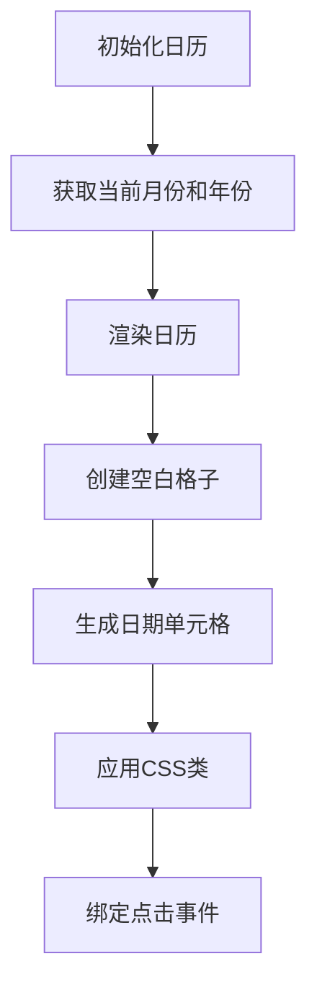
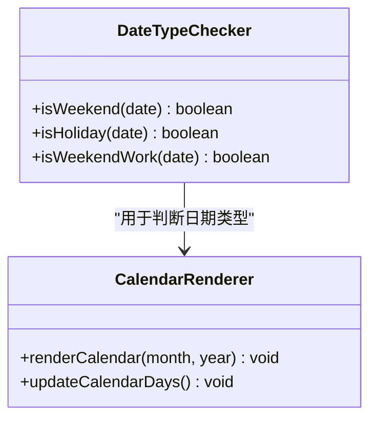
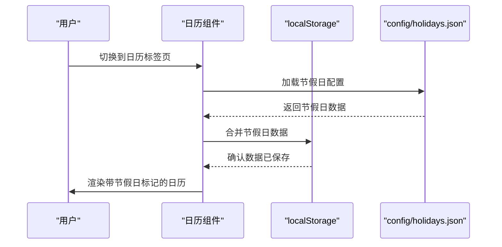
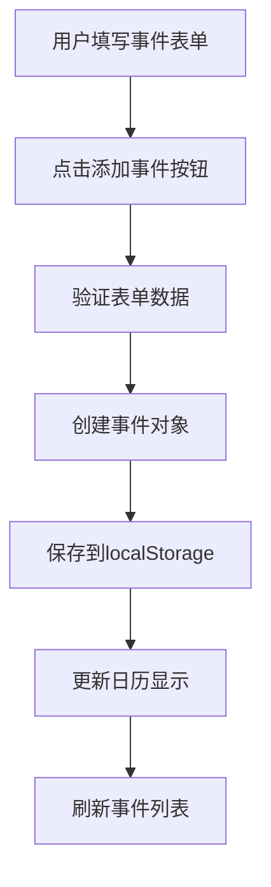

# 日历视图

<cite>
**本文档引用的文件**   
- [script.js](file://script.js)
- [index.html](file://index.html)
- [styles.css](file://styles.css)
- [config/holidays.json](file://config/holidays.json)
</cite>

## 目录
1. [项目结构](#项目结构)
2. [日历视图实现](#日历视图实现)
3. [日期类型判断逻辑](#日期类型判断逻辑)
4. [节假日数据加载](#节假日数据加载)
5. [用户自定义事件](#用户自定义事件)
6. [配置与优先级处理](#配置与优先级处理)

## 项目结构
工作计时器项目包含多个模块，其中日历视图功能主要由`script.js`、`index.html`和`styles.css`三个文件实现。`config/holidays.json`文件存储了官方节假日配置。项目通过标签页切换不同功能，日历视图位于"日历"标签页中。

**Section sources**
- [index.html](file://index.html#L287-L349)
- [script.js](file://script.js#L2449-L2628)

## 日历视图实现
日历视图采用月视图布局，通过`initCalendar()`函数初始化，当用户切换到日历标签页时自动调用。日历由左右两部分组成：左侧显示月历，右侧提供事件管理功能。

月历的生成逻辑在`renderCalendar()`函数中实现。首先获取当月第一天和天数，然后创建空白格子填充到第一个日期前，再循环生成日期单元格。每个日期单元格根据其类型应用不同的CSS类进行视觉区分。



**Diagram sources **
- [script.js](file://script.js#L2449-L2628)
- [index.html](file://index.html#L287-L317)

**Section sources**
- [script.js](file://script.js#L2449-L2628)
- [index.html](file://index.html#L287-L317)
- [styles.css](file://styles.css#L557-L696)

## 日期类型判断逻辑
系统通过三个函数判断日期类型：`isWeekend()`、`isHoliday()`和`isWeekendWork()`。这些函数根据日期的星期几和用户配置来确定日期类型。

`isWeekend()`函数检查日期是否为周六或周日（JavaScript中`getDay()`返回0表示周日，6表示周六）。`isHoliday()`函数检查日期是否在`workdaysOff`对象中被标记为公休假期。`isWeekendWork()`函数检查日期是否在`weekendsWork`对象中被标记为串休上班日。



**Diagram sources **
- [script.js](file://script.js#L61-L84)
- [script.js](file://script.js#L2524-L2546)

**Section sources**
- [script.js](file://script.js#L61-L84)
- [script.js](file://script.js#L2524-L2546)

## 节假日数据加载
`initCalendarEvents()`函数负责加载节假日数据。它首先从`config/holidays.json`文件中加载官方节假日配置，然后将这些数据合并到`localStorage`中。用户可以在设置页面导入自定义的节假日JSON数据。



**Diagram sources **
- [script.js](file://script.js#L2793-L2815)
- [script.js](file://script.js#L1274-L1294)
- [config/holidays.json](file://config/holidays.json)

**Section sources**
- [script.js](file://script.js#L2793-L2815)
- [config/holidays.json](file://config/holidays.json)

## 用户自定义事件
用户可以在日历中添加自定义事件。右侧的事件管理面板提供了添加事件的表单，包括标题、类型、时间和备注。添加的事件会保存到`localStorage`中的`calendarEvents`数组，并在对应日期显示事件标记。



**Diagram sources **
- [script.js](file://script.js#L2844-L2895)
- [index.html](file://index.html#L323-L338)

**Section sources**
- [script.js](file://script.js#L2844-L2895)
- [index.html](file://index.html#L323-L338)

## 配置与优先级处理
当`localStorage`中的`workdaysOff`与`weekendsWork`发生冲突时，系统采用特定的优先级处理策略。根据代码逻辑，串休上班日的优先级高于公休假期。这意味着如果某一天既被标记为公休假期又被标记为串休上班日，系统会将其视为工作日。

配置自定义假期的代码示例如下：
```javascript
// 添加自定义假期
const customHolidays = {
    "2026-12-25": "圣诞节",
    "2026-12-31": "跨年夜"
};
localStorage.setItem('workdaysOff', JSON.stringify(customHolidays));
```

**Section sources**
- [script.js](file://script.js#L2534-L2537)
- [script.js](file://script.js#L2542-L2545)