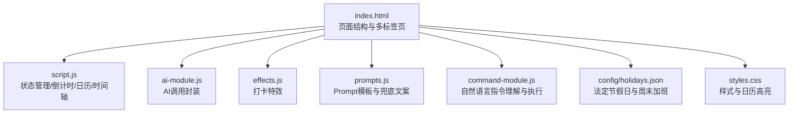
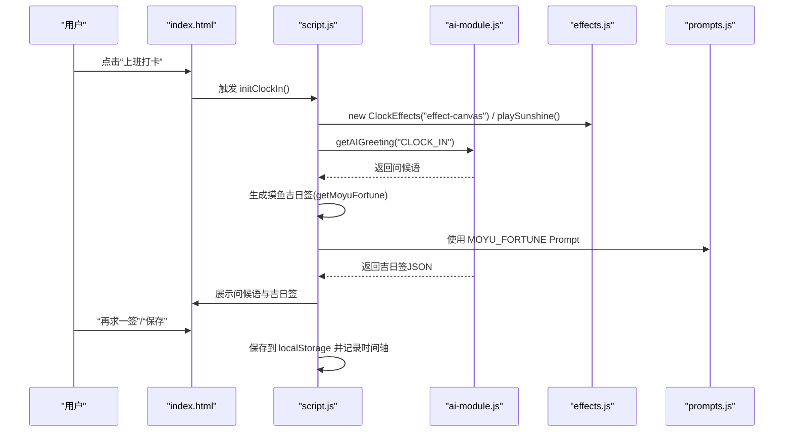
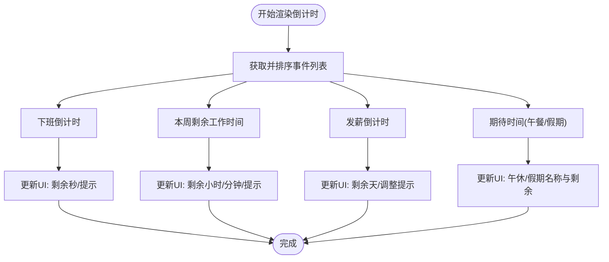
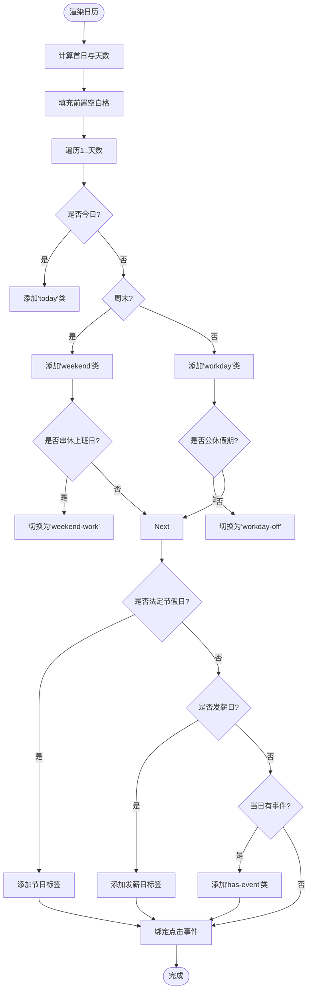
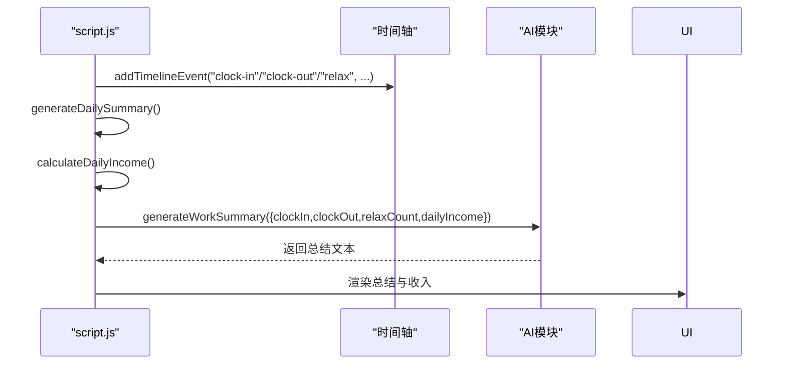
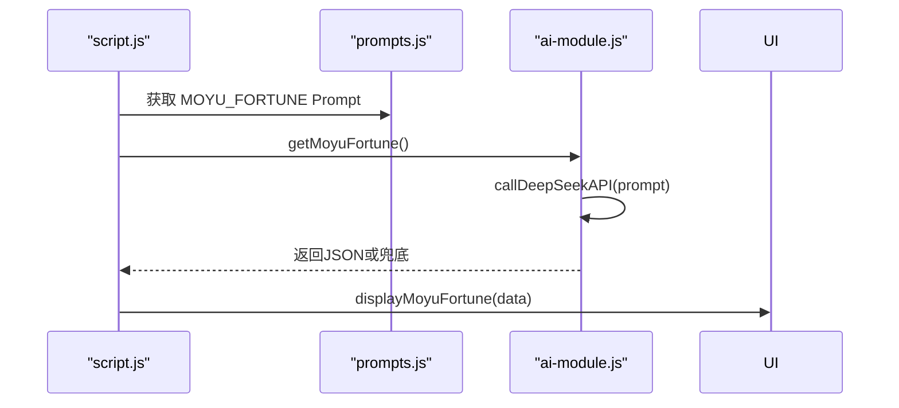
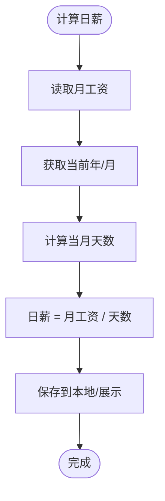
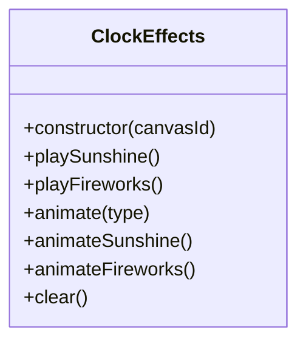
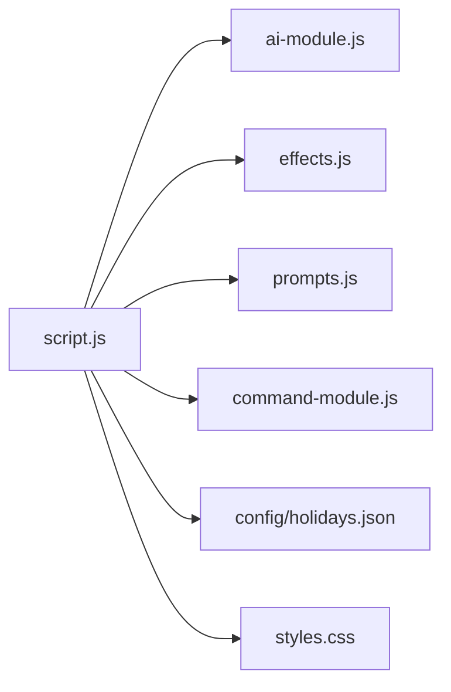

# 核心功能详解

<cite>
**本文引用的文件**
- [index.html](file://index.html)
- [script.js](file://script.js)
- [ai-module.js](file://ai-module.js)
- [effects.js](file://effects.js)
- [prompts.js](file://prompts.js)
- [command-module.js](file://command-module.js)
- [config/holidays.json](file://config/holidays.json)
- [styles.css](file://styles.css)
</cite>

## 目录
1. [引言](#引言)
2. [项目结构](#项目结构)
3. [核心组件](#核心组件)
4. [架构总览](#架构总览)
5. [详细组件分析](#详细组件分析)
6. [依赖关系分析](#依赖关系分析)
7. [性能考量](#性能考量)
8. [故障排查指南](#故障排查指南)
9. [结论](#结论)
10. [附录](#附录)

## 引言
本文件系统性梳理 work-timer 的核心功能，围绕六大主题展开：倒计时功能（下班、周末、发薪日、假期）、日历视图与日期高亮策略、工作进度追踪算法、摸鱼吉日签的AI生成流程、工资计算与收入展示的数学模型、打卡特效系统的视觉表现。文档同时结合 script.js 中的状态管理与 UI 更新逻辑，说明各功能如何协同工作，并提供实际使用示例与代码定位路径。

## 项目结构
work-timer 采用前端单页应用结构，主页面 index.html 提供多标签页布局与交互入口；核心业务逻辑集中在 script.js；AI 能力由 ai-module.js 提供；特效系统由 effects.js 实现；Prompts 与兜底文案由 prompts.js 管理；自然语言指令由 command-module.js 处理；节假日数据来自 config/holidays.json 并可导入导出；样式统一在 styles.css 中维护。

图表来源
- [index.html](file://index.html#L1-L120)
- [script.js](file://script.js#L1-L120)
- [ai-module.js](file://ai-module.js#L1-L60)
- [effects.js](file://effects.js#L1-L40)
- [prompts.js](file://prompts.js#L1-L40)
- [command-module.js](file://command-module.js#L1-L40)
- [config/holidays.json](file://config/holidays.json#L1-L46)
- [styles.css](file://styles.css#L599-L660)

章节来源
- [index.html](file://index.html#L1-L120)
- [script.js](file://script.js#L1-L120)

## 核心组件
- 倒计时系统：按“下班倒计时”“本周剩余工作时间”“发薪倒计时”“期待时间（午餐/假期）”四大类构建，支持工作日、周末、法定节假日、串休上班日、自定义假期的综合计算。
- 日历视图：按月渲染，支持工作日/周末/串休/公休/发薪日/事件标记的高亮与标注。
- 工作进度追踪：基于时间轴记录“上班打卡”“下班打卡”“摸鱼”等事件，生成今日总结与收入展示。
- 摸鱼吉日签：AI 生成“运势、最佳时间、锦囊”，失败时回退兜底。
- 工资计算与收入展示：按月工资与当月天数计算日薪，展示今日收入。
- 打卡特效：上班打卡播放阳光特效，下班打卡播放礼花特效，全屏粒子动画。

章节来源
- [script.js](file://script.js#L1590-L1789)
- [script.js](file://script.js#L2484-L2699)
- [script.js](file://script.js#L3063-L3150)
- [ai-module.js](file://ai-module.js#L95-L167)
- [effects.js](file://effects.js#L1-L120)
- [index.html](file://index.html#L225-L360)

## 架构总览
整体采用“页面结构 + 状态管理 + 业务模块 + 外部能力”的分层设计。script.js 负责全局状态、定时任务、UI 更新与事件编排；ai-module.js 提供 DeepSeek API 调用与兜底；effects.js 提供 Canvas 粒子特效；prompts.js 管理 Prompt 与兜底文案；command-module.js 将自然语言转为具体操作；config/holidays.json 提供节假日与周末加班数据。

图表来源
- [index.html](file://index.html#L120-L170)
- [script.js](file://script.js#L493-L732)
- [ai-module.js](file://ai-module.js#L61-L127)
- [effects.js](file://effects.js#L25-L62)
- [prompts.js](file://prompts.js#L1-L40)

## 详细组件分析

### 1. 倒计时功能：下班、周末、发薪日、假期
- 下班倒计时：基于工作时间配置（上班/午休/下班）与当前时间计算剩余秒数，非工作时间显示“下班啦！”。
- 本周剩余工作时间：从当前日期起累加到本周五下班的总工作时长（扣除午休），若已过周五则为0。
- 发薪倒计时：支持“固定日期”和“每月最后一天”两种类型，遇周末/节假日自动提前到工作日；显示剩余天数与调整提示。
- 期待时间：优先显示“午休倒计时”（工作日且上午未到11:30），否则显示最近的假期（含自定义假期）。
- 其他假期：按名称分组，仅展示最早出现的日期，避免重复。

图表来源
- [script.js](file://script.js#L1590-L1789)
- [script.js](file://script.js#L2671-L2699)

章节来源
- [script.js](file://script.js#L1590-L1789)
- [script.js](file://script.js#L2671-L2699)

### 2. 日历视图：实现机制与日期高亮策略
- 月渲染：计算当月第一天与天数，生成空白格与日期格，逐日设置样式与标注。
- 高亮策略：
  - 今日：边框高亮。
  - 周末：背景色区分；若为“串休上班日”，切换为串休样式。
  - 工作日：背景色区分；若为“公休假期”，切换为公休样式。
  - 法定节假日：叠加节日标签并标记为公休。
  - 发薪日：遇周末/节假日自动提前到工作日，显示“发薪日(调整)”提示。
  - 事件：当日有事件时添加“has-event”类，配合样式高亮。
- 交互：点击日期更新选中日期、事件列表与输入框，支持添加/删除日历事件。

图表来源
- [script.js](file://script.js#L2484-L2699)
- [styles.css](file://styles.css#L599-L660)

章节来源
- [script.js](file://script.js#L2484-L2699)
- [styles.css](file://styles.css#L599-L660)

### 3. 工作进度追踪：算法原理
- 时间轴：以“今日”为单位存储事件，支持“上班打卡”“下班打卡”“摸鱼”等类型，自动持久化。
- 今日总结：统计“摸鱼次数”（按上午/下午分组）、记录“上班时间”“下班时间”，结合日薪计算“今日收入”，生成幽默风格的总结文本。
- 进度条：在倒计时页展示“工资进度”，基于“已工作天数/当月总天数”计算进度百分比与文本。

图表来源
- [script.js](file://script.js#L1-L47)
- [script.js](file://script.js#L734-L778)
- [script.js](file://script.js#L3063-L3150)
- [ai-module.js](file://ai-module.js#L129-L167)

章节来源
- [script.js](file://script.js#L1-L47)
- [script.js](file://script.js#L734-L778)
- [script.js](file://script.js#L3063-L3150)
- [ai-module.js](file://ai-module.js#L129-L167)

### 4. 摸鱼吉日签系统的AI生成流程
- Prompt：统一在 prompts.js 中定义，要求返回 JSON 结构（运势、最佳时间、锦囊）。
- 调用：ai-module.js 通过 DeepSeek API 发送消息，解析返回的 JSON；失败时回退到 FALLBACK_MESSAGES。
- 展示：script.js 在打卡弹窗中显示“摸鱼吉日签”，支持“再求一签”与“保存”。

图表来源
- [prompts.js](file://prompts.js#L1-L40)
- [ai-module.js](file://ai-module.js#L95-L127)
- [script.js](file://script.js#L634-L729)

章节来源
- [prompts.js](file://prompts.js#L1-L40)
- [ai-module.js](file://ai-module.js#L95-L127)
- [script.js](file://script.js#L634-L729)

### 5. 工资计算与收入展示的数学模型
- 日薪计算：日薪 = 月工资 / 当月总天数（按当前年月动态计算）。
- 今日收入：在“今日工作总结”中展示，同时在“工资进度”中以百分比形式呈现。
- 发薪日规则：支持“固定日期”和“每月最后一天”，遇周末/节假日自动提前到工作日，日历与倒计时均体现调整提示。

图表来源
- [script.js](file://script.js#L3063-L3077)
- [script.js](file://script.js#L2671-L2699)

章节来源
- [script.js](file://script.js#L3063-L3077)
- [script.js](file://script.js#L2671-L2699)

### 6. 打卡特效系统的视觉表现
- 上班打卡：播放“阳光特效”，创建大量光点与光晕，营造温暖氛围。
- 下班打卡：播放“礼花特效”，多处粒子爆炸，带重力与摩擦，色彩随机。
- 生命周期：Canvas 全屏尺寸，使用 requestAnimationFrame 循环绘制；关闭弹窗时清理动画与粒子。

图表来源
- [effects.js](file://effects.js#L1-L120)
- [effects.js](file://effects.js#L135-L273)

章节来源
- [effects.js](file://effects.js#L1-L120)
- [effects.js](file://effects.js#L135-L273)

## 依赖关系分析
- script.js 依赖：
  - 本地存储：工作时间配置、节假日、周末加班、发薪日类型与日期、时间轴、打卡状态、摸鱼运势。
  - 外部模块：ai-module.js（AI 能力）、effects.js（特效）、prompts.js（Prompt/兜底）、command-module.js（自然语言指令）。
  - 数据源：config/holidays.json（法定节假日与周末加班）。
- 样式依赖：styles.css 控制日历高亮、模态框、标签页等 UI。

图表来源
- [script.js](file://script.js#L1-L120)
- [ai-module.js](file://ai-module.js#L1-L60)
- [effects.js](file://effects.js#L1-L40)
- [prompts.js](file://prompts.js#L1-L40)
- [command-module.js](file://command-module.js#L1-L40)
- [config/holidays.json](file://config/holidays.json#L1-L46)
- [styles.css](file://styles.css#L599-L660)

章节来源
- [script.js](file://script.js#L1-L120)
- [config/holidays.json](file://config/holidays.json#L1-L46)

## 性能考量
- 动画性能：特效使用 requestAnimationFrame，避免使用 setInterval；粒子过期自动清理，减少内存占用。
- 计算复杂度：倒计时与日历渲染为 O(n)（n 为当月天数或事件数量），在现代浏览器中可流畅运行。
- 本地存储：合理拆分键空间（如 timeline_、clockInTime_、moyuFortune_），避免单键过大。
- UI 更新：批量 DOM 操作前先构建 HTML 字符串，减少重排与重绘。

[本节为通用指导，无需代码引用]

## 故障排查指南
- AI 密钥未配置：AI 相关功能会抛出错误或返回兜底文案。可在设置页保存密钥并测试连接。
- 日历节假日异常：确认“导入节假日”JSON 格式正确；重置为默认后重新添加。
- 发薪日显示异常：检查“发薪日类型”与“发薪日日期”，确认是否遇周末/节假日提前。
- 特效不显示：检查 Canvas 初始化与弹窗显示顺序；关闭弹窗后特效会自动清理。

章节来源
- [ai-module.js](file://ai-module.js#L14-L59)
- [script.js](file://script.js#L2643-L2670)
- [script.js](file://script.js#L2631-L2641)
- [effects.js](file://effects.js#L262-L273)

## 结论
work-timer 通过“倒计时 + 日历 + 进度追踪 + AI + 特效 + 指令”的组合，形成完整的“工作节奏与摸鱼文化”体验。script.js 作为中枢协调各模块，ai-module.js 与 prompts.js 提供可扩展的智能能力，effects.js 增强交互体验，config/holidays.json 保障节假日与发薪日的准确性。整体架构清晰、模块职责明确，具备良好的可维护性与扩展性。

[本节为总结，无需代码引用]

## 附录
- 实际使用示例（路径指引）：
  - 设置工作时间与发薪日：[index.html](file://index.html#L186-L223)
  - 上班/下班打卡与摸鱼吉日签：[script.js](file://script.js#L493-L732)
  - 日历视图与事件管理：[script.js](file://script.js#L2484-L3017)
  - 今日工作总结与日薪计算：[script.js](file://script.js#L734-L778), [script.js](file://script.js#L3063-L3150)
  - AI 生成摸鱼吉日签与工作总结：[ai-module.js](file://ai-module.js#L95-L167), [prompts.js](file://prompts.js#L1-L40)
  - 打卡特效：[effects.js](file://effects.js#L25-L120)

[本节为补充说明，无需代码引用]