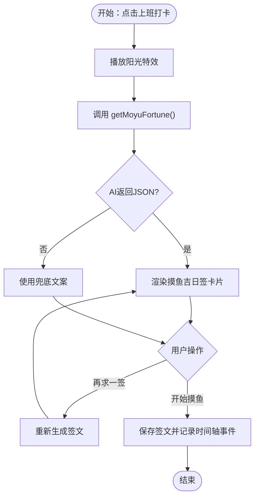

# 版本历史

<cite>
**本文引用的文件**
- [CHANGELOG.md](file://CHANGELOG.md)
- [RELEASE_v1.3.3.md](file://RELEASE_v1.3.3.md)
- [README.md](file://README.md)
- [ai-module.js](file://ai-module.js)
- [effects.js](file://effects.js)
- [prompts.js](file://prompts.js)
- [script.js](file://script.js)
- [styles.css](file://styles.css)
- [index.html](file://index.html)
- [TEST_CHECKLIST_v1.3.3.md](file://TEST_CHECKLIST_v1.3.3.md)
</cite>

## 目录
1. [引言](#引言)
2. [项目结构](#项目结构)
3. [核心组件](#核心组件)
4. [架构总览](#架构总览)
5. [详细组件分析](#详细组件分析)
6. [依赖关系分析](#依赖关系分析)
7. [性能与体验考量](#性能与体验考量)
8. [故障排查指南](#故障排查指南)
9. [结论](#结论)
10. [附录](#附录)

## 引言
本版本历史文档系统性梳理 work-timer 在 v1.3.3 中的功能迭代与演进，围绕“摸鱼吉日签”“工资计算与收入展示”“打卡特效”三大新增功能，以及配套的技术改进、UI/UX 优化与 Bug 修复，帮助用户与开发者快速理解当前版本的功能来源与设计取舍。文档同时强调 v1.3.3 对 AI 交互体验的全面升级，使打卡过程从“简单问候”跃升为“智能陪伴”。

## 项目结构
work-timer 采用前端单页应用结构，核心文件组织如下：
- 核心入口与页面结构：index.html
- 业务逻辑与交互：script.js
- AI 能力封装：ai-module.js、prompts.js
- 特效系统：effects.js
- 样式与主题：styles.css
- 版本与发布说明：CHANGELOG.md、RELEASE_v1.3.3.md、README.md
- 测试清单：TEST_CHECKLIST_v1.3.3.md

图表来源
- [index.html](file://index.html)
- [script.js](file://script.js)
- [ai-module.js](file://ai-module.js)
- [effects.js](file://effects.js)
- [styles.css](file://styles.css)
- [prompts.js](file://prompts.js)

章节来源
- [index.html](file://index.html)
- [script.js](file://script.js)
- [ai-module.js](file://ai-module.js)
- [effects.js](file://effects.js)
- [styles.css](file://styles.css)
- [prompts.js](file://prompts.js)

## 核心组件
- 摸鱼吉日签系统：上班打卡时生成“今日摸鱼运势、最佳摸鱼时间、摸鱼锦囊”的 AI 内容，支持“再求一签”与“开始摸鱼”操作；首页 Header 实时展示今日运势。
- 工资计算与收入展示：支持设置月工资，按当月天数自动计算日薪；下班打卡时生成“今日收入”的高亮总结，并通过 AI 生成幽默总结。
- 打卡特效系统：上班打卡播放“阳光特效”，下班打卡播放“礼花特效”，基于 Canvas 与 requestAnimationFrame 实现高性能动画，自动清理粒子避免内存泄漏。
- AI 交互体验：统一的 DeepSeek API 调用封装，支持兜底文案与错误回退，确保稳定性与一致性。

章节来源
- [CHANGELOG.md](file://CHANGELOG.md)
- [RELEASE_v1.3.3.md](file://RELEASE_v1.3.3.md)
- [README.md](file://README.md)

## 架构总览
v1.3.3 的整体架构围绕“交互层（script.js）—AI 层（ai-module.js + prompts.js）—特效层（effects.js）—展示层（index.html + styles.css）”展开，形成清晰的职责边界与调用链路。

图表来源
- [script.js](file://script.js)
- [ai-module.js](file://ai-module.js)
- [prompts.js](file://prompts.js)
- [effects.js](file://effects.js)
- [index.html](file://index.html)
- [styles.css](file://styles.css)

## 详细组件分析

### 组件A：摸鱼吉日签系统
- 功能要点
  - 上班打卡时生成“今日摸鱼运势、最佳摸鱼时间、摸鱼锦囊”的三段式内容，风格积极幽默。
  - 支持“再求一签”重新生成，直至满意为止；“开始摸鱼”保存当前签文并记录时间轴事件。
  - 首页 Header 实时展示今日运势，持续提醒。
- 设计考量
  - 使用 JSON 结构化的提示词，确保 AI 输出稳定可解析；失败时回退到兜底文案，保证可用性。
  - UI 采用黄色主题色系与渐变边框，强化“摸鱼”主题与视觉识别。
- 技术实现
  - 提示词模板与兜底文案集中管理，便于维护与迭代。
  - 交互逻辑在 script.js 中统一调度，特效与渲染解耦。
- 数据存储
  - 按日期隔离存储“moyuFortune_[date]”，避免跨日混淆。

图表来源
- [script.js](file://script.js)
- [ai-module.js](file://ai-module.js)
- [prompts.js](file://prompts.js)
- [styles.css](file://styles.css)

章节来源
- [CHANGELOG.md](file://CHANGELOG.md)
- [RELEASE_v1.3.3.md](file://RELEASE_v1.3.3.md)
- [README.md](file://README.md)
- [script.js](file://script.js)
- [ai-module.js](file://ai-module.js)
- [prompts.js](file://prompts.js)
- [styles.css](file://styles.css)

### 组件B：工资计算与收入展示
- 功能要点
  - 首次设置向导与设置页面新增“月工资”输入框，默认值 8000 元。
  - 按当月天数自动计算日薪（月工资 ÷ 当月天数），精确到小数点后两位。
  - 下班打卡时高亮显示“今日收入”，并在总结中突出展示。
  - AI 生成幽默总结，包含上班时间、下班时间、摸鱼次数、今日收入。
- 设计考量
  - 将“月工资”作为核心参数，贯穿计算与展示，提升用户感知与激励。
  - 总结卡片采用蓝色渐变背景与黄色高亮，提升信息层级与可读性。
- 技术实现
  - 日薪计算与 UI 展示在 script.js 中实现；样式在 styles.css 中定义。
  - AI 总结通过占位符替换提示词模板，确保上下文完整。

图表来源
- [script.js](file://script.js)
- [styles.css](file://styles.css)
- [prompts.js](file://prompts.js)

章节来源
- [CHANGELOG.md](file://CHANGELOG.md)
- [RELEASE_v1.3.3.md](file://RELEASE_v1.3.3.md)
- [README.md](file://README.md)
- [script.js](file://script.js)
- [styles.css](file://styles.css)
- [prompts.js](file://prompts.js)

### 组件C：打卡特效系统
- 功能要点
  - 上班打卡：播放“阳光特效”，50 个金黄色光点从顶部缓缓飘落，带光晕与闪烁效果。
  - 下班打卡：播放“礼花特效”，3 组彩色粒子从中心向外爆炸，带重力与尾迹效果。
  - 高性能实现：Canvas + requestAnimationFrame，自动清理过期粒子，避免内存泄漏。
- 设计考量
  - 通过视觉符号强化“开始/结束”的仪式感，提升用户体验。
  - 动画参数与生命周期管理确保流畅与稳定。
- 技术实现
  - effects.js 封装 ClockEffects 类，统一管理粒子生成、动画循环与清理。
  - script.js 在打卡事件中实例化特效并触发相应动画。

图表来源
- [effects.js](file://effects.js)
- [script.js](file://script.js)

章节来源
- [CHANGELOG.md](file://CHANGELOG.md)
- [RELEASE_v1.3.3.md](file://RELEASE_v1.3.3.md)
- [README.md](file://README.md)
- [effects.js](file://effects.js)
- [script.js](file://script.js)
- [styles.css](file://styles.css)

### 组件D：AI 交互体验（全面升级）
- 统一的 AI 能力封装
  - ai-module.js 封装 DeepSeek API 调用，支持温度、最大令牌等参数配置。
  - 提供 getMoyuFortune() 与 generateWorkSummary() 等函数，统一返回结构与错误处理。
- 提示词与兜底策略
  - prompts.js 定义 MOYU_FORTUNE 与 WORK_SUMMARY 提示词模板，支持占位符替换。
  - FALLBACK_MESSAGES 提供兜底文案，确保网络异常或解析失败时仍能正常展示。
- 交互与稳定性
  - script.js 在 UI 中展示加载动画与错误提示，支持“再求一签”等容错操作。
  - README 与 RELEASE_v1.3.3.md 明确标注“全面优化 AI 交互体验”。

图表来源
- [script.js](file://script.js)
- [ai-module.js](file://ai-module.js)
- [prompts.js](file://prompts.js)

章节来源
- [CHANGELOG.md](file://CHANGELOG.md)
- [RELEASE_v1.3.3.md](file://RELEASE_v1.3.3.md)
- [README.md](file://README.md)
- [ai-module.js](file://ai-module.js)
- [prompts.js](file://prompts.js)
- [script.js](file://script.js)

## 依赖关系分析
- 模块耦合
  - script.js 作为中枢，依赖 ai-module.js、effects.js、prompts.js、styles.css。
  - ai-module.js 依赖 prompts.js 与 localStorage 存储的 API Key。
  - effects.js 仅依赖 DOM Canvas 元素，低耦合、易测试。
- 数据流
  - 配置数据（月工资、每日运势）通过 localStorage 持久化，按日期隔离，避免跨日冲突。
  - 时间轴数据以数组形式保存，支持扩展事件类型与字段（如 fortune 字段）。

图表来源
- [script.js](file://script.js)
- [ai-module.js](file://ai-module.js)
- [effects.js](file://effects.js)
- [prompts.js](file://prompts.js)
- [styles.css](file://styles.css)

章节来源
- [script.js](file://script.js)
- [ai-module.js](file://ai-module.js)
- [effects.js](file://effects.js)
- [prompts.js](file://prompts.js)
- [styles.css](file://styles.css)

## 性能与体验考量
- 性能
  - Canvas 动画使用 requestAnimationFrame，确保帧率稳定；粒子过期自动清理，避免内存泄漏。
  - AI 请求参数（温度、最大令牌）经过权衡，兼顾创意与稳定性。
- 体验
  - 首页 Header 展示今日运势，增强即时反馈与正向激励。
  - 下班总结卡片高亮“今日收入”，强化成果可视化。
  - “再求一签”与“开始摸鱼”按钮明确操作路径，降低认知负担。

章节来源
- [CHANGELOG.md](file://CHANGELOG.md)
- [RELEASE_v1.3.3.md](file://RELEASE_v1.3.3.md)
- [README.md](file://README.md)
- [effects.js](file://effects.js)
- [styles.css](file://styles.css)

## 故障排查指南
- 常见问题
  - AI 密钥未配置：在设置页面保存 DeepSeek API Key 后，可通过“测试连接”验证连通性。
  - AI 调用失败：脚本会回退到兜底文案并提示错误；检查网络与密钥有效性。
  - 特效不显示：确认 Canvas 元素存在且未被遮挡；浏览器兼容性与权限问题需排查。
- 诊断步骤
  - 在设置页面保存密钥并测试连接，观察状态提示。
  - 刷新页面后查看 Header 是否显示今日运势。
  - 下班打卡时确认“今日收入”高亮显示与总结卡片出现。
- 相关测试
  - 测试清单覆盖月工资设置、localStorage 更新、按日期存储运势等关键路径。

章节来源
- [script.js](file://script.js)
- [ai-module.js](file://ai-module.js)
- [effects.js](file://effects.js)
- [TEST_CHECKLIST_v1.3.3.md](file://TEST_CHECKLIST_v1.3.3.md)

## 结论
v1.3.3 以“AI 交互体验全面升级”为核心，将打卡从“简单问候”提升为“智能陪伴”。通过“摸鱼吉日签”“工资计算与收入展示”“打卡特效”三大功能，配合统一的 AI 能力封装与兜底策略，显著提升了趣味性、可视化与稳定性。对于开发者而言，模块化设计与清晰的数据流为后续扩展提供了良好基础。

## 附录
- 版本日志与发布说明
  - 参考 [CHANGELOG.md](file://CHANGELOG.md) 与 [RELEASE_v1.3.3.md](file://RELEASE_v1.3.3.md) 获取更详尽的功能与技术细节。
- 产品定位与使用场景
  - 参考 [README.md](file://README.md) 了解产品定位、典型使用场景与后续迭代建议。