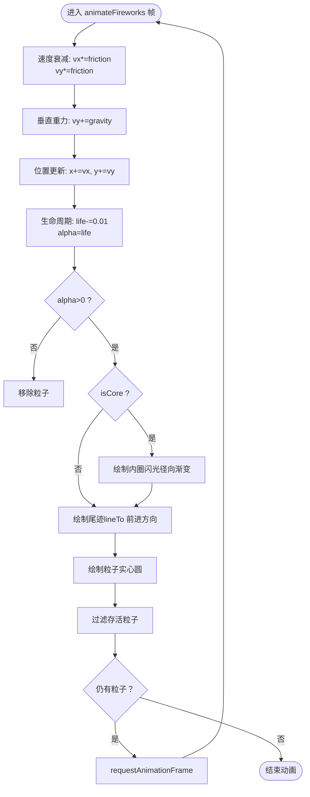

# 礼花特效

<cite>
**本文引用的文件**
- [effects.js](file://effects.js)
- [script.js](file://script.js)
- [index.html](file://index.html)
</cite>

## 目录
1. [简介](#简介)
2. [项目结构](#项目结构)
3. [核心组件](#核心组件)
4. [架构总览](#架构总览)
5. [详细组件分析](#详细组件分析)
6. [依赖关系分析](#依赖关系分析)
7. [性能考量](#性能考量)
8. [故障排查指南](#故障排查指南)
9. [结论](#结论)

## 简介
本专项文档聚焦于“下班打卡”场景下的礼花特效实现，深入解析 effects.js 中 ClockEffects 类的 playFireworks 与 createFirework 方法，阐明以下关键点：
- 5个礼花的定时延迟生成机制（setTimeout，间隔400ms）
- 礼花在画布不同水平位置（0.2至0.95倍宽度）与随机高度的分布策略
- 单个礼花由80个彩色粒子构成的放射状爆炸，基于极坐标角度与随机速度实现圆形扩散
- 粒子物理模拟：重力（gravity=0.15）、摩擦力（friction=0.98）与速度衰减
- 内圈闪光粒子（isCore）的额外添加及高亮度HSLA颜色配置
- 结合 script.js 中下班打卡调用逻辑，说明特效通过 playFireworks 触发，以及 animateFireworks 中粒子生命值（life）递减与透明度同步控制的动画生命周期管理
- 强调粒子尾迹（trail）绘制对动态视觉效果的增强

## 项目结构
与礼花特效直接相关的文件与职责如下：
- effects.js：特效系统的核心实现，包含 Canvas 初始化、粒子系统、动画循环与特效方法
- script.js：应用主逻辑，负责在下班打卡时实例化特效并触发 playFireworks
- index.html：页面结构，包含特效画布 effect-canvas，供 ClockEffects 在全屏范围内渲染

图表来源
- [index.html](file://index.html#L120-L163)
- [script.js](file://script.js#L690-L700)
- [effects.js](file://effects.js#L1-L20)

章节来源
- [index.html](file://index.html#L120-L163)
- [script.js](file://script.js#L690-L700)
- [effects.js](file://effects.js#L1-L20)

## 核心组件
- ClockEffects 类：封装 Canvas、粒子集合与动画循环；提供 playSunshine、playFireworks、createFirework、animate、animateSunshine、animateFireworks、clear 等方法
- 粒子属性：x/y 位置、vx/vy 速度、size、color、alpha、gravity、friction、life、isCore、trail 等
- 画布尺寸：全屏自适应，resize 事件触发

章节来源
- [effects.js](file://effects.js#L1-L279)

## 架构总览
下班打卡触发流程（从用户点击到特效播放）：

图表来源
- [script.js](file://script.js#L690-L700)
- [effects.js](file://effects.js#L65-L133)
- [index.html](file://index.html#L120-L163)

章节来源
- [script.js](file://script.js#L690-L700)
- [effects.js](file://effects.js#L65-L133)
- [index.html](file://index.html#L120-L163)

## 详细组件分析

### ClockEffects 类与粒子系统
- 构造函数：获取 Canvas、创建 2D 上下文、初始化粒子数组与动画句柄；监听窗口 resize 并自适应画布尺寸
- clear：取消动画帧、清空画布、重置粒子数组
- animate：根据类型分派到 sunshine 或 fireworks 的动画循环
- animateFireworks：核心物理与渲染循环，包含速度衰减、重力、生命周期与尾迹绘制

图表来源
- [effects.js](file://effects.js#L1-L279)

章节来源
- [effects.js](file://effects.js#L1-L279)

### playFireworks：定时延迟生成5个礼花
- 清空旧粒子与动画
- 固定创建5个礼花
- 使用 setTimeout，按 i*400ms 间隔依次创建
- 水平位置分布：x = width × (0.2 + i × 0.15)，保证从约20%宽度到约95%宽度均匀分布
- 高度分布：y = height × (0.3 + 随机数×0.2)，集中在约30%-50%高度区间
- 每次创建后立即启动 animate("fireworks")

章节来源
- [effects.js](file://effects.js#L65-L86)

### createFirework：单个礼花的粒子生成
- 生成80个外层彩色粒子，围绕中心点呈放射状爆炸
  - 角度 angle = (2π × i) / 80
  - 速度 speed 在固定范围内随机
  - 初始位置为 x/y，初始速度 vx/vy 由极坐标公式计算
  - 粒子属性：size、color（HSLA）、alpha、gravity=0.15、friction=0.98、life=1
- 额外添加20个内圈闪光粒子（isCore=true）
  - 角度同样均分，速度较小且更亮
  - color 使用更高亮度的HSLA
  - gravity=0.1、friction=0.95，使内圈更快衰减并形成聚焦效果

章节来源
- [effects.js](file://effects.js#L88-L133)

### animateFireworks：粒子生命周期与物理模拟
- 每帧更新：
  - 速度乘以摩擦系数（friction），实现速度衰减
  - 垂直方向叠加重力（gravity），模拟下落
  - 位置由速度累加更新
  - 生命周期递减（life -= 0.01），alpha 同步等于 life
- 绘制顺序：
  - 若粒子为内圈闪光（isCore），绘制高亮径向渐变圆
  - 绘制粒子尾迹（trail）：从当前位置向前延伸，线宽与粒子 size 相关，半透明
  - 绘制粒子：实心圆，alpha 与 life 同步
- 过滤条件：仅保留 alpha > 0 的粒子，维持动画循环

图表来源
- [effects.js](file://effects.js#L203-L260)

章节来源
- [effects.js](file://effects.js#L203-L260)

### 调用链与页面集成
- index.html 提供 canvas#effect-canvas，作为特效画布
- script.js 在下班打卡路径中：
  - 实例化 ClockEffects("effect-canvas")
  - 调用 effects.playFireworks()
  - 在弹窗关闭或流程结束后调用 effects.clear() 清理

章节来源
- [index.html](file://index.html#L120-L163)
- [script.js](file://script.js#L690-L700)

## 依赖关系分析
- 外部依赖
  - Canvas 2D API：用于绘制粒子、渐变与线条
  - requestAnimationFrame：驱动动画循环
  - DOM：获取 canvas 元素与尺寸
- 内部耦合
  - ClockEffects 与 Canvas 强耦合（尺寸、上下文、绘制）
  - animate 与 animateFireworks 的职责分离，便于扩展其他特效（如 playSunshine）

图表来源
- [effects.js](file://effects.js#L1-L279)
- [script.js](file://script.js#L690-L700)
- [index.html](file://index.html#L120-L163)

章节来源
- [effects.js](file://effects.js#L1-L279)
- [script.js](file://script.js#L690-L700)
- [index.html](file://index.html#L120-L163)

## 性能考量
- 粒子数量：单次爆炸80个外层粒子 + 20个内圈粒子，共100个；5次定时生成，峰值约500个粒子同时存在
- 每帧计算：每个粒子进行速度衰减、重力、位置更新与绘制判断，复杂度 O(N)
- 优化建议
  - 控制 friciton 与 gravity 的数值，避免过度衰减导致闪烁
  - 限制最大粒子数或按屏幕分辨率动态调整
  - 使用对象池减少频繁创建/销毁粒子
  - 在低端设备上降低粒子数或尾迹长度

[本节为通用性能讨论，无需特定文件引用]

## 故障排查指南
- 画布未显示
  - 确认页面包含 canvas#effect-canvas
  - 确认 ClockEffects 构造时能获取到该元素
- 特效不触发
  - 检查下班打卡路径是否调用 effects.playFireworks()
  - 确认 animate("fireworks") 是否被调用
- 粒子不消失
  - 检查 life 递减与 alpha 同步逻辑
  - 确认过滤条件 alpha > 0
- 位置异常
  - 检查 width/height 是否正确获取
  - 检查 x = width × (0.2 + i × 0.15) 与 y = height × (0.3 + rand × 0.2) 的范围
- 尾迹不明显
  - 检查尾迹绘制的 lineTo 参数与 alpha 缩放
  - 确认 lineCap 为 round，lineWidth 与 size 相关

章节来源
- [index.html](file://index.html#L120-L163)
- [script.js](file://script.js#L690-L700)
- [effects.js](file://effects.js#L65-L133)
- [effects.js](file://effects.js#L203-L260)

## 结论
- 礼花特效通过定时器在500ms间隔内生成5个礼花，利用极坐标与随机速度实现放射状爆炸
- animateFireworks 实现了重力、摩擦与速度衰减的物理模拟，并通过 life/alpha 控制生命周期
- 内圈闪光粒子（isCore）与尾迹绘制显著增强了视觉层次与动态感
- 该实现结构清晰、职责明确，易于扩展其他特效（如 playSunshine）