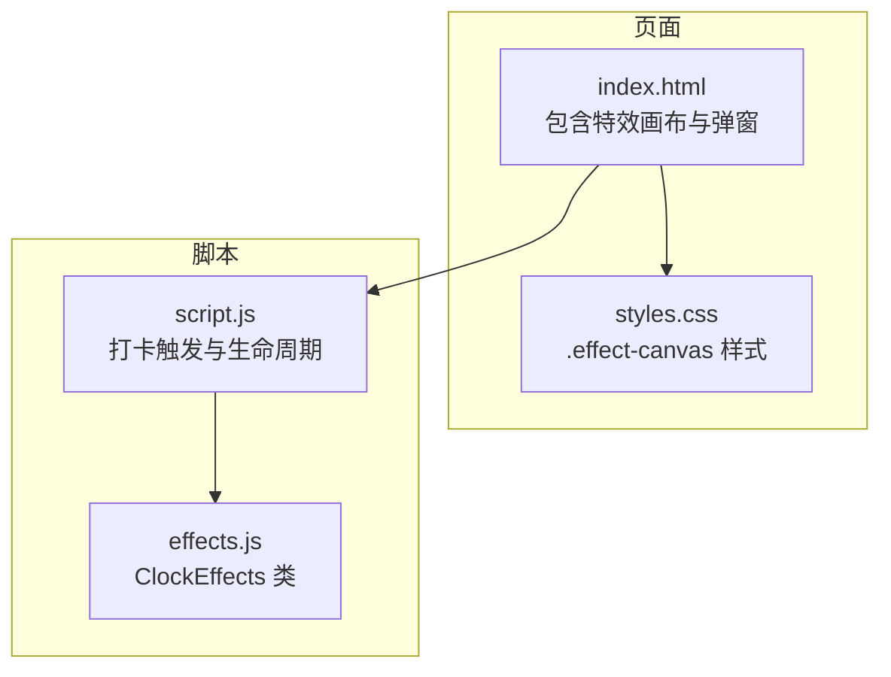
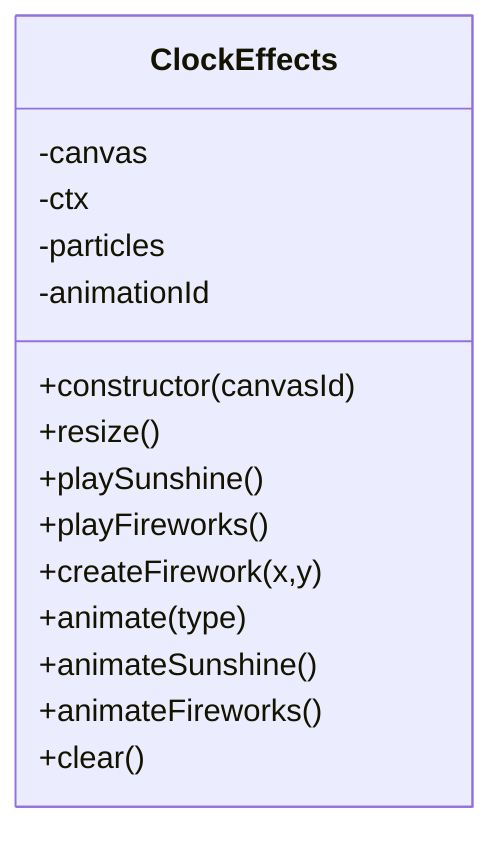
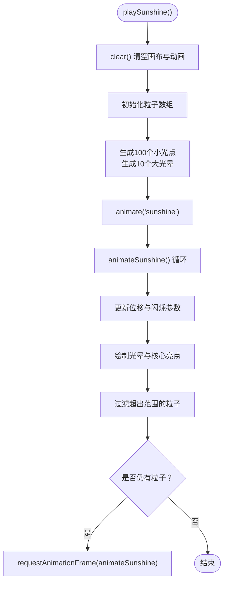
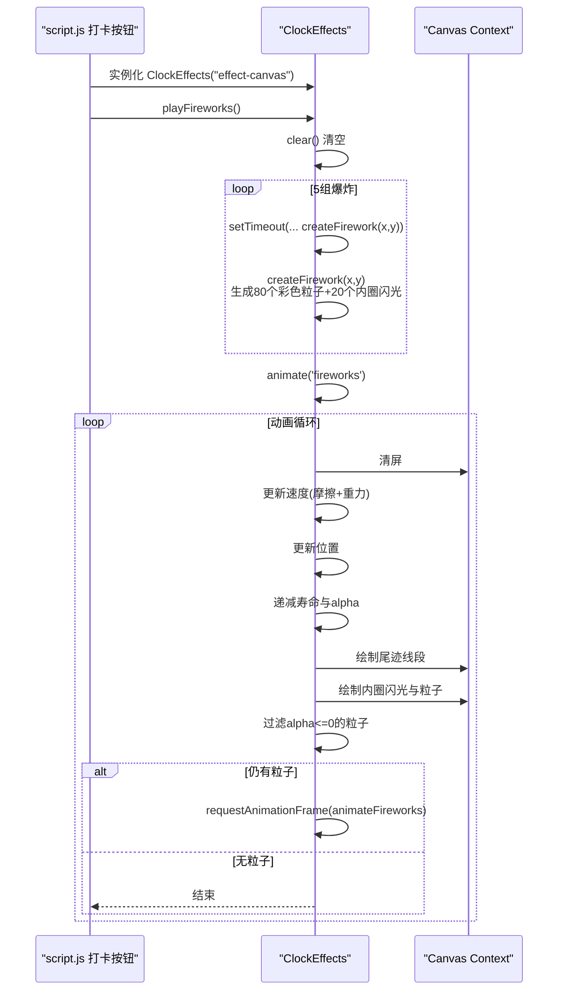
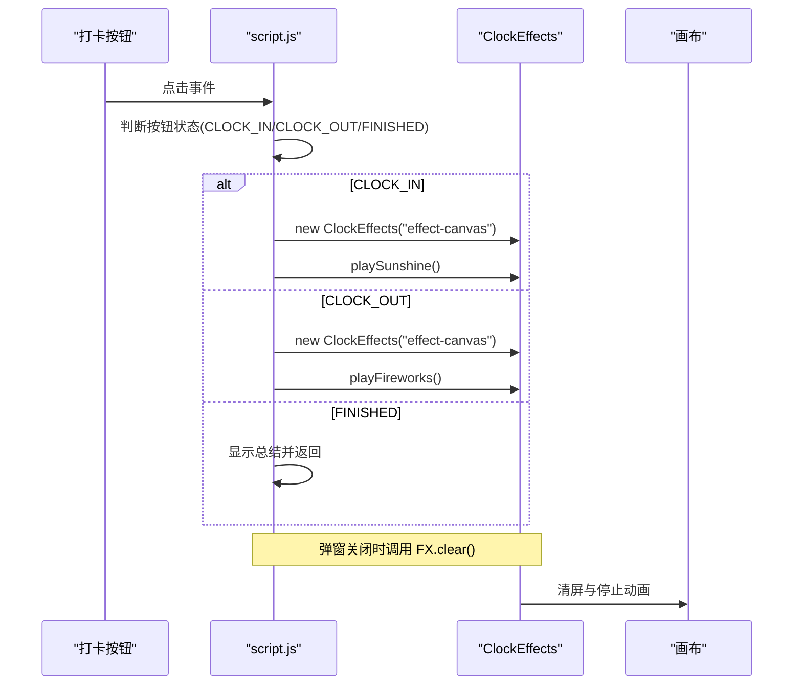
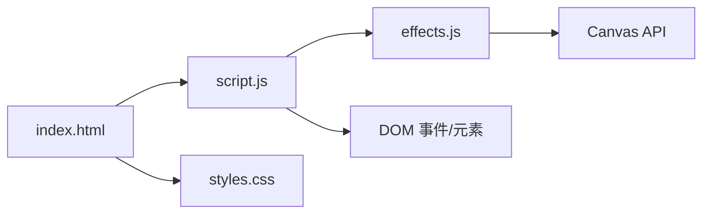

# 视觉特效系统

<cite>
**本文引用的文件**
- [effects.js](file://effects.js)
- [script.js](file://script.js)
- [index.html](file://index.html)
- [styles.css](file://styles.css)
- [README.md](file://README.md)
</cite>

## 目录
1. [简介](#简介)
2. [项目结构](#项目结构)
3. [核心组件](#核心组件)
4. [架构总览](#架构总览)
5. [详细组件分析](#详细组件分析)
6. [依赖关系分析](#依赖关系分析)
7. [性能考量](#性能考量)
8. [故障排查指南](#故障排查指南)
9. [结论](#结论)

## 简介
本专项文档聚焦于视觉特效系统，围绕 effects.js 中基于 Canvas 的粒子动画实现，深入解析两类特效：
- 上班打卡的“阳光特效”：50个黄色光点的生成、运动轨迹与光晕渲染
- 下班打卡的“礼花特效”：3组彩色粒子的爆炸动画、重力与摩擦物理模拟、颜色随机化

同时说明 requestAnimationFrame 的使用如何确保动画流畅，以及自动清理机制如何防止内存泄漏；结合 script.js 的调用逻辑，阐明特效触发条件与生命周期管理。

## 项目结构
- 特效模块位于 effects.js，提供 ClockEffects 类，封装 Canvas 初始化、粒子系统、动画循环与清理
- 页面在 index.html 中提供特效画布元素与弹窗容器，样式通过 styles.css 控制
- 调用逻辑集中在 script.js 的打卡流程中，负责根据按钮状态触发对应特效

图表来源
- [index.html](file://index.html#L120-L165)
- [styles.css](file://styles.css#L1984-L1993)
- [script.js](file://script.js#L547-L732)
- [effects.js](file://effects.js#L5-L23)

章节来源
- [index.html](file://index.html#L120-L165)
- [styles.css](file://styles.css#L1984-L1993)
- [script.js](file://script.js#L547-L732)
- [effects.js](file://effects.js#L5-L23)

## 核心组件
- ClockEffects 类
  - Canvas 初始化与全屏尺寸适配
  - 粒子系统数据结构与生命周期管理
  - 阳光特效与礼花特效的生成与渲染
  - requestAnimationFrame 动画循环与自动清理

章节来源
- [effects.js](file://effects.js#L5-L23)
- [effects.js](file://effects.js#L25-L62)
- [effects.js](file://effects.js#L64-L86)
- [effects.js](file://effects.js#L88-L133)
- [effects.js](file://effects.js#L135-L273)

## 架构总览
特效系统采用“模块化类 + Canvas 绘制”的架构：
- ClockEffects 负责特效生命周期与渲染
- script.js 在打卡事件中实例化特效对象并触发对应动画
- index.html 提供特效画布与弹窗容器，styles.css 控制画布层级与交互

图表来源
- [effects.js](file://effects.js#L5-L23)
- [effects.js](file://effects.js#L25-L62)
- [effects.js](file://effects.js#L64-L86)
- [effects.js](file://effects.js#L88-L133)
- [effects.js](file://effects.js#L135-L273)

## 详细组件分析

### 阳光特效（上班打卡）
- 粒子生成
  - 生成约 100 个小型光点，随机分布于画布上方，赋予初速度与透明度
  - 额外生成约 10 个大型光晕粒子，作为背景光晕
- 运动与渲染
  - 每帧更新光点 Y 方向位移与轻微 X 方向漂移
  - 使用正弦函数产生闪烁 alpha 效果，增强动态感
  - 小光点绘制径向渐变光晕与核心亮点；大型光晕使用径向渐变从中心向外透明衰减
- 生命周期
  - 通过过滤器保留仍在屏幕内的粒子，超出范围则移除
  - 若仍有粒子存活，则继续下一帧动画

图表来源
- [effects.js](file://effects.js#L25-L62)
- [effects.js](file://effects.js#L135-L201)

章节来源
- [effects.js](file://effects.js#L25-L62)
- [effects.js](file://effects.js#L135-L201)

### 礼花特效（下班打卡）
- 粒子生成
  - 以定时器序列创建 5 组爆炸，每组在不同位置释放
  - 每组爆炸包含 80 个彩色粒子，围绕中心呈圆周分布，赋予初速度
  - 每组额外生成 20 个内圈闪光粒子，形成爆炸核心
- 物理模拟
  - 每帧对粒子施加重力与摩擦，使其速度逐渐衰减并下落
  - 通过 alpha 递减实现粒子寿命消逝
- 渲染细节
  - 内圈闪光粒子绘制较小的径向渐变光晕
  - 绘制粒子尾迹线段，体现运动轨迹
  - 绘制粒子本体，使用随机色相与亮度

图表来源
- [script.js](file://script.js#L547-L732)
- [effects.js](file://effects.js#L64-L86)
- [effects.js](file://effects.js#L88-L133)
- [effects.js](file://effects.js#L135-L273)

章节来源
- [effects.js](file://effects.js#L64-L86)
- [effects.js](file://effects.js#L88-L133)
- [effects.js](file://effects.js#L135-L273)
- [script.js](file://script.js#L547-L732)

### Canvas 初始化与生命周期管理
- 初始化
  - 通过构造函数获取画布并设置上下文
  - 全屏尺寸适配，并监听窗口 resize 事件
- 生命周期
  - playSunshine/playFireworks 会先 clear()，确保每次触发前干净
  - clear() 调用 cancelAnimationFrame 并清空画布与粒子数组
- 触发条件
  - script.js 根据按钮状态决定调用 playSunshine 或 playFireworks
  - 弹窗关闭时同样调用 clear()，避免残留动画

图表来源
- [script.js](file://script.js#L547-L732)
- [effects.js](file://effects.js#L25-L62)
- [effects.js](file://effects.js#L262-L273)

章节来源
- [effects.js](file://effects.js#L25-L62)
- [effects.js](file://effects.js#L262-L273)
- [script.js](file://script.js#L547-L732)

## 依赖关系分析
- 外部依赖
  - HTML5 Canvas API：绘图与动画
  - requestAnimationFrame：驱动动画循环
  - DOM：获取画布元素、弹窗容器与按钮
- 内部依赖
  - ClockEffects 依赖 Canvas 上下文与窗口尺寸
  - script.js 依赖 ClockEffects 类与 DOM 事件
  - index.html 依赖 styles.css 的特效画布样式

图表来源
- [script.js](file://script.js#L547-L732)
- [effects.js](file://effects.js#L5-L23)
- [index.html](file://index.html#L120-L165)
- [styles.css](file://styles.css#L1984-L1993)

章节来源
- [script.js](file://script.js#L547-L732)
- [effects.js](file://effects.js#L5-L23)
- [index.html](file://index.html#L120-L165)
- [styles.css](file://styles.css#L1984-L1993)

## 性能考量
- 动画驱动
  - 使用 requestAnimationFrame 驱动动画循环，避免过度占用主线程
  - 每帧仅对存活粒子进行更新与绘制，过滤掉超出范围或寿命耗尽的粒子
- 绘制优化
  - 使用径向渐变一次性绘制光晕，减少多次绘制调用
  - 尾迹线段使用 stroke，避免过多 fill 操作
- 内存与资源
  - clear() 在每次触发前取消上一次动画并清空粒子数组，防止累积
  - resize 事件中重设画布尺寸，避免离屏绘制导致的性能损耗

章节来源
- [effects.js](file://effects.js#L135-L201)
- [effects.js](file://effects.js#L203-L273)
- [effects.js](file://effects.js#L262-L273)

## 故障排查指南
- 画布未显示或特效不出现
  - 检查 index.html 是否存在 id 为 effect-canvas 的 canvas 元素
  - 确认 styles.css 中 .effect-canvas 样式已生效（绝对定位、全屏、z-index）
- 动画卡顿或闪烁异常
  - 确认未在动画循环中执行昂贵任务（如频繁 DOM 查询）
  - 检查粒子数量是否过大，适当减少粒子数
- 弹窗关闭后仍有残影
  - 确认弹窗关闭事件中调用了 FX.clear()
  - 检查是否存在多个 ClockEffects 实例未正确清理

章节来源
- [index.html](file://index.html#L120-L165)
- [styles.css](file://styles.css#L1984-L1993)
- [script.js](file://script.js#L547-L732)
- [effects.js](file://effects.js#L262-L273)

## 结论
本视觉特效系统通过 ClockEffects 类实现了高性能的 Canvas 粒子动画：
- 阳光特效通过大量小光点与光晕组合，营造温暖氛围
- 礼花特效通过爆炸式粒子与重力/摩擦物理模拟，呈现完成工作的庆祝感
- requestAnimationFrame 与自动清理机制共同保障了流畅性与稳定性
- script.js 的调用逻辑将特效与打卡流程无缝衔接，形成完整的用户体验闭环

章节来源
- [README.md](file://README.md#L50-L55)
- [effects.js](file://effects.js#L25-L62)
- [effects.js](file://effects.js#L64-L86)
- [effects.js](file://effects.js#L135-L273)
- [script.js](file://script.js#L547-L732)