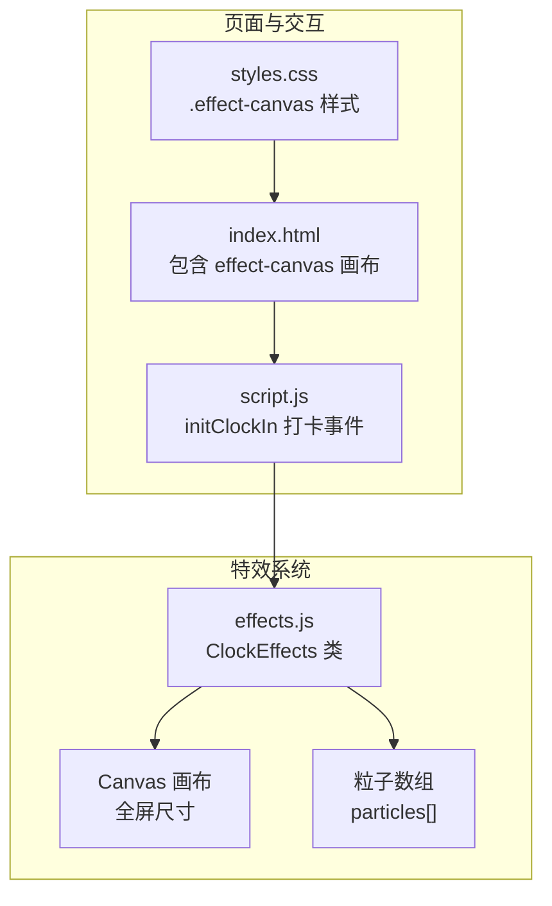
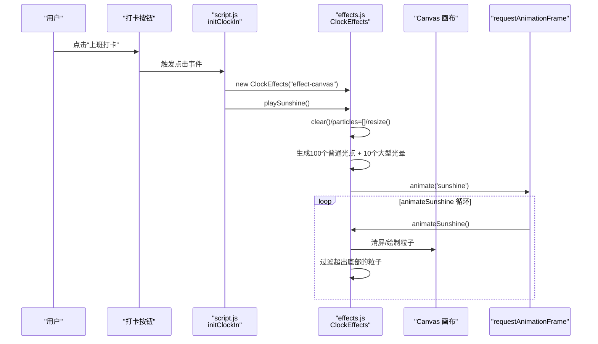
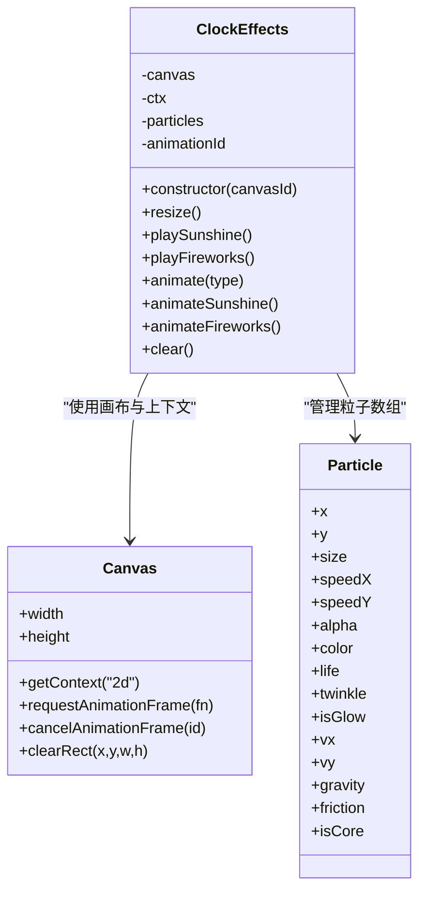

# 阳光特效

<cite>
**本文引用的文件**
- [effects.js](file://effects.js)
- [script.js](file://script.js)
- [index.html](file://index.html)
- [styles.css](file://styles.css)
</cite>

## 目录
1. [简介](#简介)
2. [项目结构](#项目结构)
3. [核心组件](#核心组件)
4. [架构总览](#架构总览)
5. [详细组件分析](#详细组件分析)
6. [依赖关系分析](#依赖关系分析)
7. [性能考量](#性能考量)
8. [故障排查指南](#故障排查指南)
9. [结论](#结论)

## 简介
本专项文档聚焦于“阳光特效”的实现，围绕 effects.js 中的 ClockEffects 类与 playSunshine 方法展开，系统性解析以下关键点：
- 100个普通光点与10个大型光晕粒子的生成机制（初始位置、大小、速度、透明度、颜色HSLA）
- 粒子运动轨迹（Y轴向下、X轴轻微偏移）与闪烁效果（twinkle正弦波动）
- 大型光晕粒子（isGlow）与普通光点的渲染差异（径向渐变createRadialGradient）
- 与打卡逻辑的联动（ClockEffects实例化、playSunshine触发、requestAnimationFrame驱动）
- 粒子过滤与生命周期管理（超出画布底部自动清理）

## 项目结构
- 效果模块位于 effects.js，提供 ClockEffects 类，负责粒子系统的创建、更新与渲染。
- 打卡交互位于 script.js，负责在上班打卡事件中实例化 ClockEffects 并触发 playSunshine。
- 页面结构与样式位于 index.html 与 styles.css，其中包含特效画布 effect-canvas 的定位与层级。

图表来源
- [index.html](file://index.html#L120-L170)
- [styles.css](file://styles.css#L1984-L1994)
- [script.js](file://script.js#L546-L732)
- [effects.js](file://effects.js#L1-L279)

章节来源
- [index.html](file://index.html#L120-L170)
- [styles.css](file://styles.css#L1984-L1994)
- [script.js](file://script.js#L546-L732)
- [effects.js](file://effects.js#L1-L279)

## 核心组件
- ClockEffects 类：封装画布尺寸适配、粒子生成、动画循环与清理。
- playSunshine 方法：一次性生成100个普通光点与10个大型光晕粒子，并启动 animateSunshine 循环。
- animateSunshine 方法：逐帧更新粒子位置与闪烁，按 isGlow 使用不同径向渐变进行渲染，并在粒子超出画布底部时过滤掉，防止内存泄漏。

章节来源
- [effects.js](file://effects.js#L1-L279)

## 架构总览
从“打卡事件”到“阳光特效”的调用链如下：

图表来源
- [script.js](file://script.js#L546-L732)
- [effects.js](file://effects.js#L25-L62)
- [effects.js](file://effects.js#L144-L201)

章节来源
- [script.js](file://script.js#L546-L732)
- [effects.js](file://effects.js#L25-L62)
- [effects.js](file://effects.js#L144-L201)

## 详细组件分析

### ClockEffects 类与 playSunshine 实现
- 画布初始化与全屏适配：构造函数根据 canvasId 获取画布，设置全屏宽高并在窗口 resize 时同步更新。
- playSunshine 生成策略：
  - 普通光点（100个）：随机初始x/y；y在屏幕上方随机范围外；随机大小、下落速度、横向微偏移、透明度、HSLA颜色、初始闪烁相位。
  - 大型光晕（10个）：随机初始x/y（更高起点）；更大size、更慢下落速度、更小横向偏移、更低透明度、HSLA颜色、初始闪烁相位；标记 isGlow=true。
- 动画启动：调用 animate('sunshine')，内部委托至 animateSunshine。

章节来源
- [effects.js](file://effects.js#L1-L279)

### 粒子运动与闪烁
- 位置更新：每帧将 y 增加 speedY，x 增加 speedX，形成“向下为主、轻微左右摇摆”的轨迹。
- 闪烁效果：每帧 twinkle 增加一个常量，使用正弦函数计算闪烁alpha，最终 alpha = 基础alpha × (sin(twinkle)×幅度 + 基准)。这使粒子呈现柔和的呼吸感闪烁。

章节来源
- [effects.js](file://effects.js#L144-L201)

### 渲染差异：isGlow 与普通光点
- 普通光点：
  - 使用径向渐变 createRadialGradient，中心点(粒子x,粒子y)，半径从0到 size×3，颜色从中心高亮到边缘透明。
  - 绘制为圆形光晕与核心亮点（核心亮度更高）。
- 大型光晕（isGlow）：
  - 使用径向渐变从0到 size，颜色从中心到边缘更平滑过渡，末端透明度为0，形成柔和的光晕扩散。
  - 绘制为矩形填充，覆盖范围为直径，营造“光球”感。

章节来源
- [effects.js](file://effects.js#L144-L201)

### HSLA 配置要点
- 颜色空间：HSLA（色相、饱和度、亮度、透明度）。普通光点与光晕均使用HSLA字符串拼接，保证色彩统一且亮度可控。
- 色相与亮度：普通光点色相范围较宽、亮度范围较广；光晕色相范围更集中、亮度更高，突出“暖色太阳感”。
- 透明度：普通光点基础alpha较高，光晕基础alpha较低，配合闪烁后整体视觉柔和。

章节来源
- [effects.js](file://effects.js#L25-L62)

### requestAnimationFrame 驱动与循环
- animateSunshine 在每帧清屏后对粒子执行更新与渲染，并通过 filter 返回存活粒子集合。
- 当仍有粒子时，继续通过 requestAnimationFrame 调用自身，形成持续循环。
- 若无粒子，则停止循环，避免无效渲染。

章节来源
- [effects.js](file://effects.js#L144-L201)

### 粒子过滤与生命周期管理
- 过滤条件：仅保留 y < canvasHeight + 安全阈值 的粒子，超出底部即被移除。
- 作用：防止粒子无限增长导致内存占用上升与性能下降，实现“超出画布即回收”的轻量生命周期管理。

章节来源
- [effects.js](file://effects.js#L144-L201)

### 与打卡逻辑的集成
- 页面结构：index.html 中包含 id 为 "effect-canvas" 的 canvas，作为特效画布。
- 打卡触发：script.js 的 initClockIn 在“上班打卡”状态下实例化 ClockEffects 并调用 playSunshine。
- 弹窗与关闭：打卡弹窗关闭时，脚本调用 effects.clear() 清理画布与动画，避免残留。

章节来源
- [index.html](file://index.html#L120-L170)
- [script.js](file://script.js#L546-L732)
- [effects.js](file://effects.js#L262-L273)

## 依赖关系分析

图表来源
- [effects.js](file://effects.js#L1-L279)

章节来源
- [effects.js](file://effects.js#L1-L279)

## 性能考量
- 粒子数量控制：100个普通光点 + 10个光晕，数量适中，配合每帧过滤，避免长期累积。
- 渲染优化：使用径向渐变与批量绘制，减少复杂路径计算；闪烁alpha通过正弦函数计算，开销低。
- 循环节流：仅当存在粒子时才继续 requestAnimationFrame，空闲时自动停止。
- 画布尺寸：全屏尺寸在 resize 时同步更新，避免多余重绘。

[本节为通用性能建议，无需特定文件引用]

## 故障排查指南
- 特效不出现
  - 检查页面是否正确挂载 effect-canvas 画布。
  - 确认 initClockIn 是否在“上班打卡”状态下触发 playSunshine。
  - 查看浏览器控制台是否存在 effects.js 相关错误。
- 特效闪烁异常或消失过快
  - 检查 animateSunshine 中的过滤条件与安全阈值是否合理。
  - 确认 requestAnimationFrame 是否被正常调度。
- 画布尺寸不匹配
  - 确认 resize 事件是否触发，画布宽高是否与窗口一致。

章节来源
- [index.html](file://index.html#L120-L170)
- [script.js](file://script.js#L546-L732)
- [effects.js](file://effects.js#L1-L279)

## 结论
阳光特效通过 ClockEffects 类实现了“全屏柔和光晕+光点”的视觉体验。playSunshine 以100个普通光点与10个大型光晕为核心，结合 Y 轴向下、X 轴轻微偏移的运动与正弦函数驱动的 twinkle 闪烁，营造自然的“阳光飘洒”感。isGlow 与普通光点采用不同的径向渐变策略，前者强调柔和扩散，后者强调核心高亮与光晕过渡。通过 requestAnimationFrame 驱动与底部过滤机制，系统在保证视觉效果的同时兼顾性能与稳定性。该特效与打卡逻辑无缝集成，为用户带来愉悦的交互反馈。