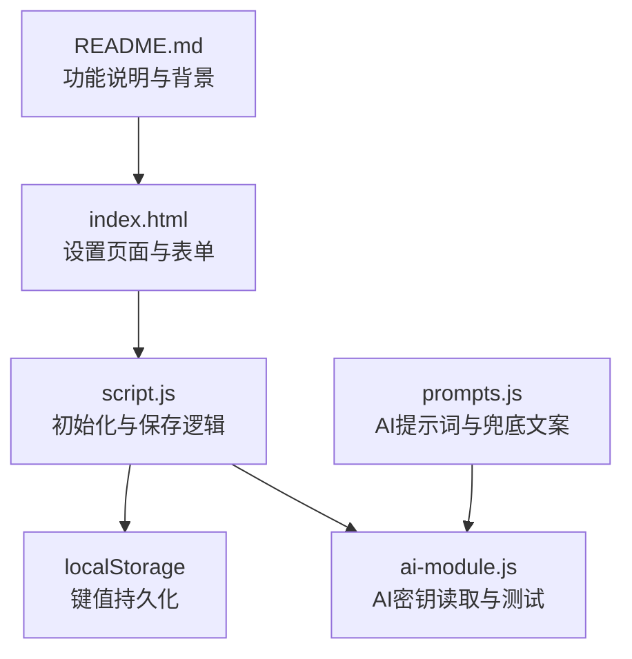
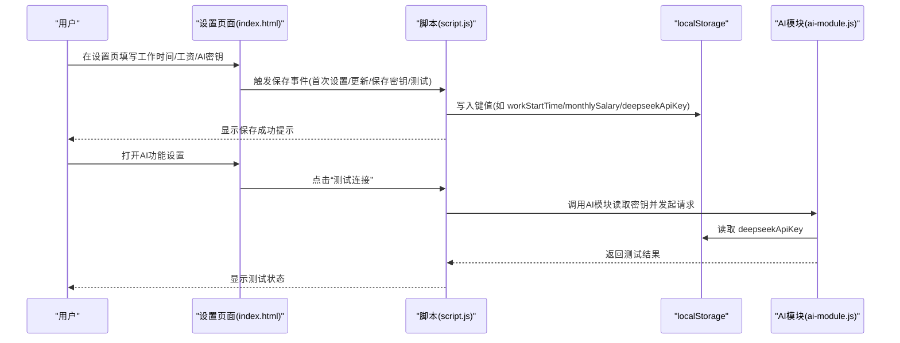
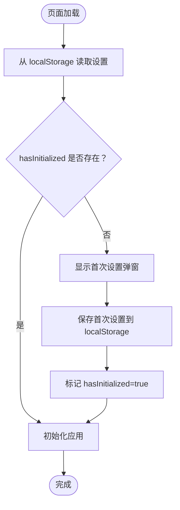
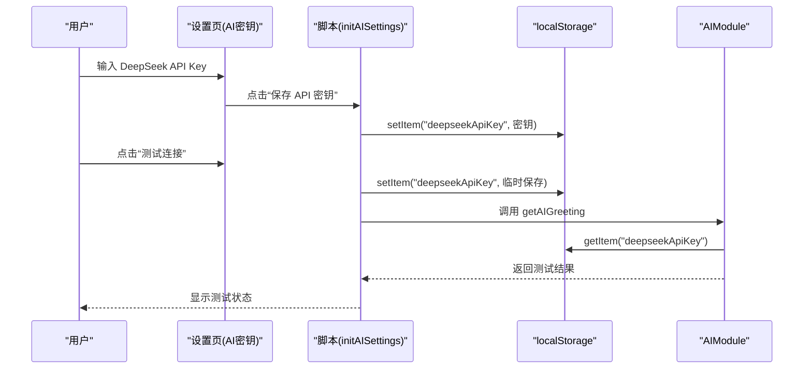
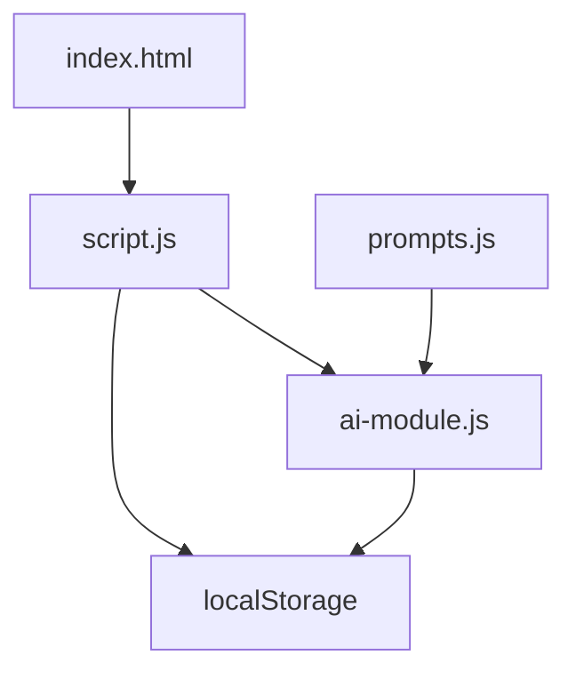

# 用户设置

<cite>
**本文引用的文件**
- [index.html](file://index.html)
- [script.js](file://script.js)
- [ai-module.js](file://ai-module.js)
- [prompts.js](file://prompts.js)
- [README.md](file://README.md)
</cite>

## 目录
1. [简介](#简介)
2. [项目结构](#项目结构)
3. [核心组件](#核心组件)
4. [架构总览](#架构总览)
5. [详细组件分析](#详细组件分析)
6. [依赖关系分析](#依赖关系分析)
7. [性能考量](#性能考量)
8. [故障排查指南](#故障排查指南)
9. [结论](#结论)
10. [附录](#附录)

## 简介
本章节面向使用者与开发者，系统性说明“用户设置”相关功能，包括工作时间、月工资、AI密钥等偏好配置的设置方式与持久化机制。文档基于仓库中的实际代码实现，重点解释 localStorage 中键值的命名规则、数据类型与默认值，以及与脚本中初始化与保存逻辑的对应关系。同时提供扩展新设置项的最佳实践与常见问题排查方法，帮助你在不破坏现有系统的情况下平滑新增配置项。

## 项目结构
用户设置主要分布在以下位置：
- 设置页面与表单：index.html 的“设置”标签页
- 初始化与保存逻辑：script.js 中的初始化函数与事件绑定
- AI密钥读写与测试：ai-module.js 与 script.js 的 initAISettings
- 提示词与兜底文案：prompts.js
- 产品说明与功能背景：README.md

图表来源
- [index.html](file://index.html#L360-L460)
- [script.js](file://script.js#L1-L120)
- [ai-module.js](file://ai-module.js#L1-L60)
- [prompts.js](file://prompts.js#L1-L60)
- [README.md](file://README.md#L43-L71)

章节来源
- [index.html](file://index.html#L360-L460)
- [script.js](file://script.js#L1-L120)
- [README.md](file://README.md#L43-L71)

## 核心组件
- 工作时间与工资设置
  - 首次设置弹窗：保存 workStartTime、lunchStartTime、lunchEndTime、workEndTime、monthlySalary、salaryType、salaryDay
  - 设置页更新：保存 workStartTime、lunchStartTime、lunchEndTime、workEndTime、monthlySalary、salaryType、salaryDay
  - 默认值与校验：时间字段默认值来自首次设置弹窗；月工资默认值来自首次设置弹窗
- AI密钥设置
  - 读取与显示：localStorage 中的 deepseekApiKey
  - 保存与测试：保存到 localStorage 并可测试连接
- 开发者设置
  - developerMode（布尔）、customTime（字符串，datetime-local）

章节来源
- [script.js](file://script.js#L1-L120)
- [script.js](file://script.js#L130-L155)
- [script.js](file://script.js#L162-L223)
- [script.js](file://script.js#L424-L491)
- [index.html](file://index.html#L360-L460)

## 架构总览
用户设置的读取与保存遵循“页面表单 -> 事件监听 -> localStorage”的路径。AI密钥的读取与测试由独立模块负责，但同样依赖 localStorage 作为持久化介质。

图表来源
- [index.html](file://index.html#L360-L460)
- [script.js](file://script.js#L162-L223)
- [script.js](file://script.js#L424-L491)
- [ai-module.js](file://ai-module.js#L1-L60)

## 详细组件分析

### 工作时间与工资设置（localStorage 键值与数据类型）
- 键值与默认值
  - workStartTime：字符串，格式 HH:mm；默认值来自首次设置弹窗
  - lunchStartTime：字符串，格式 HH:mm；默认值来自首次设置弹窗
  - lunchEndTime：字符串，格式 HH:mm；默认值来自首次设置弹窗
  - workEndTime：字符串，格式 HH:mm；默认值来自首次设置弹窗
  - monthlySalary：数值（number），单位元；默认值来自首次设置弹窗
  - salaryType：字符串，取值 "fixed" 或 "last"
  - salaryDay：数值（number），取值 1-31；默认值来自首次设置弹窗
- 初始化与读取
  - 页面加载时从 localStorage 读取上述键值，若不存在则使用默认值
  - 首次进入时弹窗引导用户填写并保存
- 保存逻辑
  - 首次设置：保存 workStartTime、lunchStartTime、lunchEndTime、workEndTime、monthlySalary、salaryType、salaryDay，并标记 hasInitialized 与 hasVisited
  - 设置页更新：保存 workStartTime、lunchStartTime、lunchEndTime、workEndTime、monthlySalary、salaryType、salaryDay
  - 清空缓存：清空所有相关 localStorage 键值，并重置表单默认值

图表来源
- [script.js](file://script.js#L1-L120)
- [script.js](file://script.js#L162-L223)
- [script.js](file://script.js#L130-L155)

章节来源
- [script.js](file://script.js#L1-L120)
- [script.js](file://script.js#L130-L155)
- [script.js](file://script.js#L162-L223)
- [index.html](file://index.html#L186-L223)

### AI密钥设置（localStorage 键值与数据类型）
- 键值与默认值
  - deepseekApiKey：字符串；页面加载时从 localStorage 读取，若存在则填充到输入框
- 保存与测试
  - 保存：点击“保存 API 密钥”将输入值 trim 后写入 localStorage
  - 测试：点击“测试连接”会临时保存密钥并调用 AIModule.getAIGreeting，根据返回结果更新状态
- 读取与使用
  - AI模块在调用 DeepSeek API 时从 localStorage 读取 deepseekApiKey

图表来源
- [script.js](file://script.js#L424-L491)
- [ai-module.js](file://ai-module.js#L1-L60)

章节来源
- [script.js](file://script.js#L424-L491)
- [ai-module.js](file://ai-module.js#L1-L60)

### 开发者设置（localStorage 键值与数据类型）
- 键值与默认值
  - developerMode：布尔；页面加载时从 localStorage 读取，若为 "true" 则启用
  - customTime：字符串；datetime-local 格式；仅在 developerMode 为真时生效
- 用途
  - 开启后可通过自定义时间覆盖真实时间，便于演示与调试

章节来源
- [script.js](file://script.js#L1-L120)
- [index.html](file://index.html#L414-L427)

### 表单交互与保存流程（代码示例路径）
- 首次设置保存
  - 触发事件：document.getElementById('save-work-time').addEventListener
  - 保存键值：localStorage.setItem('workStartTime'...)、localStorage.setItem('monthlySalary'...)
  - 标记初始化：localStorage.setItem('hasInitialized', 'true')
  - 重新初始化：initApp()
  - 示例路径：[script.js](file://script.js#L187-L223)
- 设置页更新
  - 触发事件：document.getElementById('update-work-time').addEventListener
  - 保存键值：同上
  - 示例路径：[script.js](file://script.js#L133-L136)
- 清空缓存
  - 触发事件：document.getElementById('clear-cache').addEventListener
  - 清空：localStorage.clear()
  - 重置表单默认值
  - 示例路径：[script.js](file://script.js#L133-L155)
- AI密钥保存与测试
  - 保存：localStorage.setItem('deepseekApiKey', apiKey)
  - 测试：调用 window.AIModule.getAIGreeting('CLOCK_IN')
  - 示例路径：[script.js](file://script.js#L424-L491)、[ai-module.js](file://ai-module.js#L1-L60)

章节来源
- [script.js](file://script.js#L133-L155)
- [script.js](file://script.js#L162-L223)
- [script.js](file://script.js#L424-L491)
- [ai-module.js](file://ai-module.js#L1-L60)

### 扩展新的用户设置项（兼容性与最佳实践）
- 新增键值命名规范
  - 使用语义化英文命名，避免与现有键冲突
  - 与现有键值保持一致的数据类型（字符串、数值、布尔）
- 新增表单控件
  - 在设置页添加对应的 input/select/textarea，并赋予唯一 id
  - 示例参考：[index.html](file://index.html#L360-L460)
- 新增初始化与保存逻辑
  - 在页面加载时从 localStorage 读取新键值并填充表单
  - 在保存事件中写入新键值
  - 示例参考：[script.js](file://script.js#L1-L120)、[script.js](file://script.js#L162-L223)
- 新增默认值与校验
  - 在首次设置弹窗或设置页中提供合理的默认值
  - 如需校验，可在保存前进行验证
- 与现有系统兼容
  - 不要删除或重命名现有键值
  - 保持 localStorage 的键值与数据类型一致
  - 若涉及 AI 功能，优先复用 AIModule 的读取方式

章节来源
- [index.html](file://index.html#L360-L460)
- [script.js](file://script.js#L1-L120)
- [script.js](file://script.js#L162-L223)

## 依赖关系分析
- 设置页面依赖脚本进行初始化与保存
- 脚本依赖 localStorage 进行持久化
- AI功能依赖 AIModule 与 localStorage 中的密钥
- 提示词与兜底文案由 prompts.js 提供，间接影响 AI 功能

图表来源
- [index.html](file://index.html#L360-L460)
- [script.js](file://script.js#L1-L120)
- [script.js](file://script.js#L424-L491)
- [ai-module.js](file://ai-module.js#L1-L60)
- [prompts.js](file://prompts.js#L1-L60)

章节来源
- [index.html](file://index.html#L360-L460)
- [script.js](file://script.js#L1-L120)
- [script.js](file://script.js#L424-L491)
- [ai-module.js](file://ai-module.js#L1-L60)
- [prompts.js](file://prompts.js#L1-L60)

## 性能考量
- localStorage 读写为同步操作，频繁写入可能阻塞主线程。建议：
  - 合并多次写入为一次批量保存
  - 避免在高频事件中重复写入相同值
- 表单交互与提示反馈采用轻量级 DOM 操作，性能开销较小
- AI 密钥测试仅在用户主动触发时进行，避免不必要的网络请求

## 故障排查指南
- 设置不生效
  - 检查是否正确点击“保存”或“更新”按钮
  - 确认 localStorage 中是否存在对应键值
  - 若使用“清空缓存”，需重新设置并刷新页面
  - 参考：[script.js](file://script.js#L133-L155)、[script.js](file://script.js#L162-L223)
- 数据类型错误
  - 月工资应为数值；若输入非数值，可能导致计算异常
  - AI 密钥为空时，AI 模块会抛出未配置密钥的错误
  - 参考：[ai-module.js](file://ai-module.js#L1-L60)
- 本地存储被清理
  - 使用“清空缓存”会清除所有设置；可重新设置并刷新页面
  - 参考：[script.js](file://script.js#L133-L155)
- 开发者模式下时间异常
  - 确认 developerMode 与 customTime 的值是否符合预期
  - 参考：[script.js](file://script.js#L1-L120)

章节来源
- [script.js](file://script.js#L133-L155)
- [script.js](file://script.js#L162-L223)
- [ai-module.js](file://ai-module.js#L1-L60)

## 结论
用户设置通过“表单 -> 事件 -> localStorage”的链路实现持久化，覆盖工作时间、月工资、AI密钥与开发者设置等关键偏好。脚本在页面加载时读取并初始化这些设置，确保用户体验连贯。新增设置项时，遵循命名规范、数据类型与默认值策略，即可与现有系统保持良好兼容。

## 附录
- 功能背景与价值：README 中对“工资计算与收入展示”“摸鱼吉日签系统”“打卡特效”等新增功能的说明，有助于理解设置项在整体功能中的作用
  - 参考：[README.md](file://README.md#L43-L71)