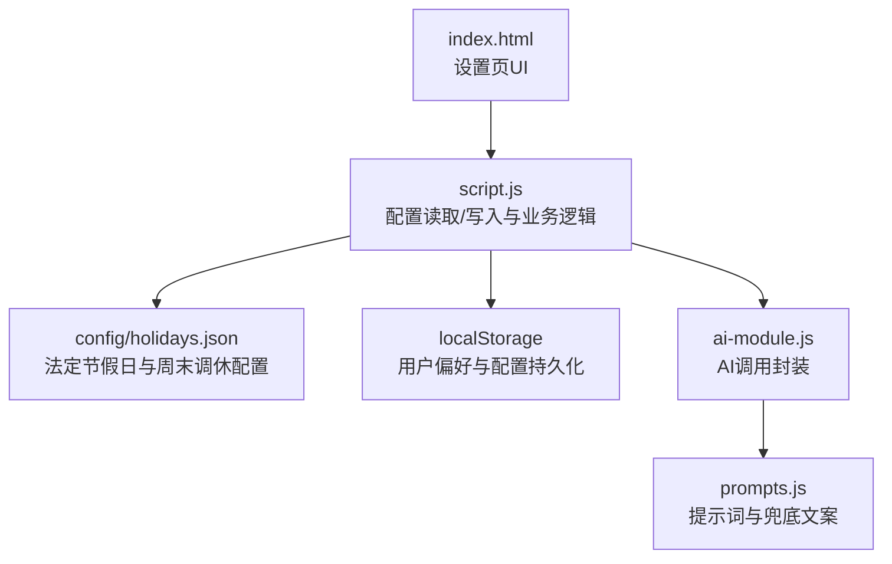
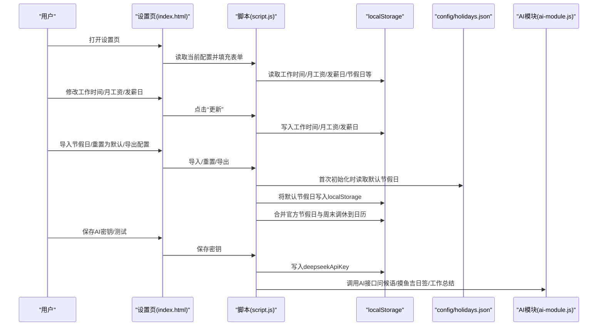
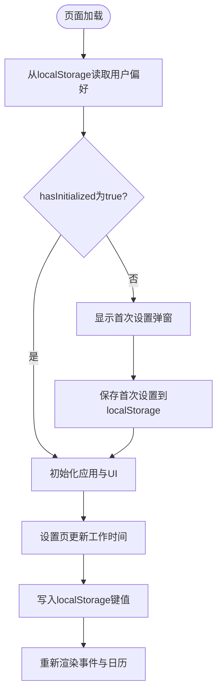
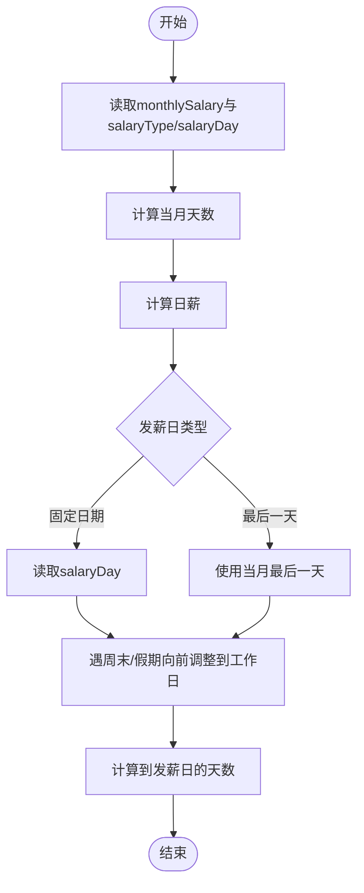
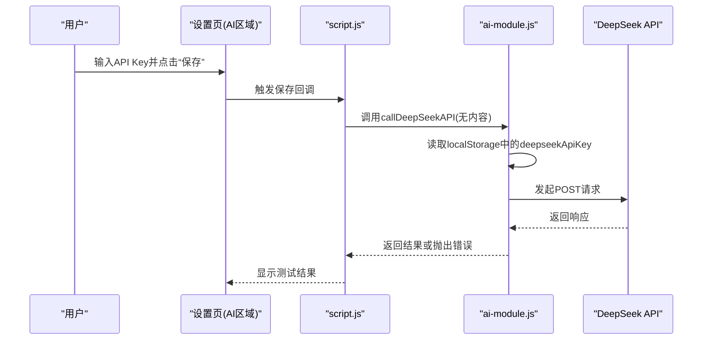
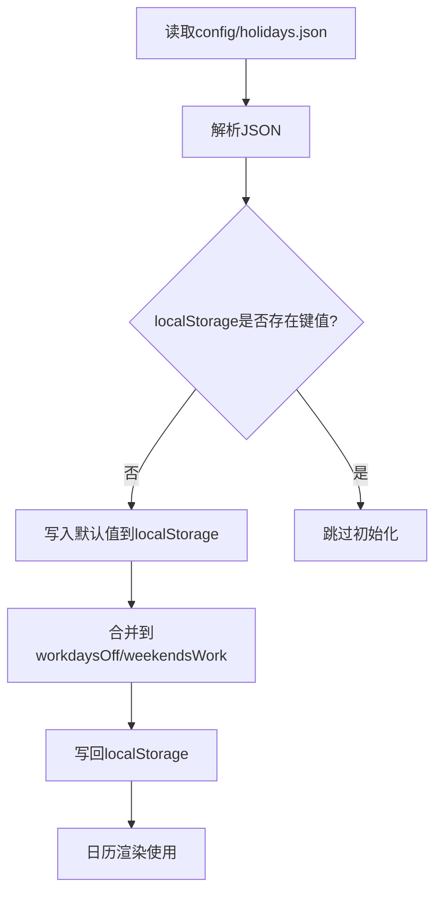
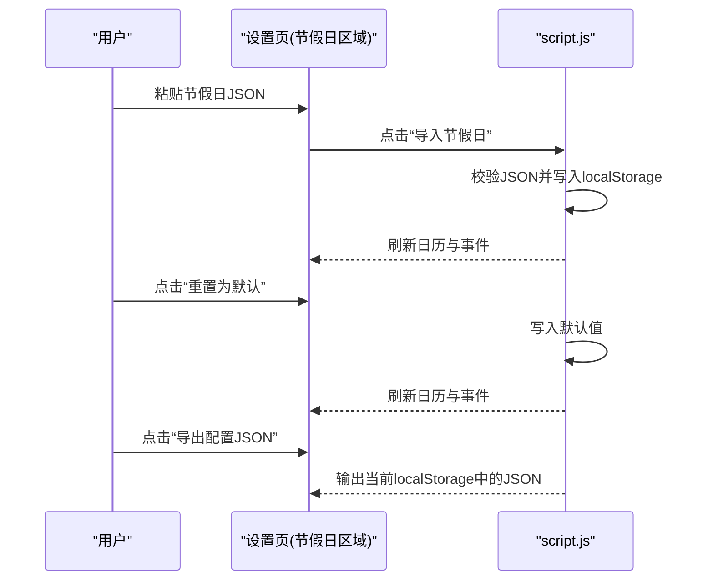
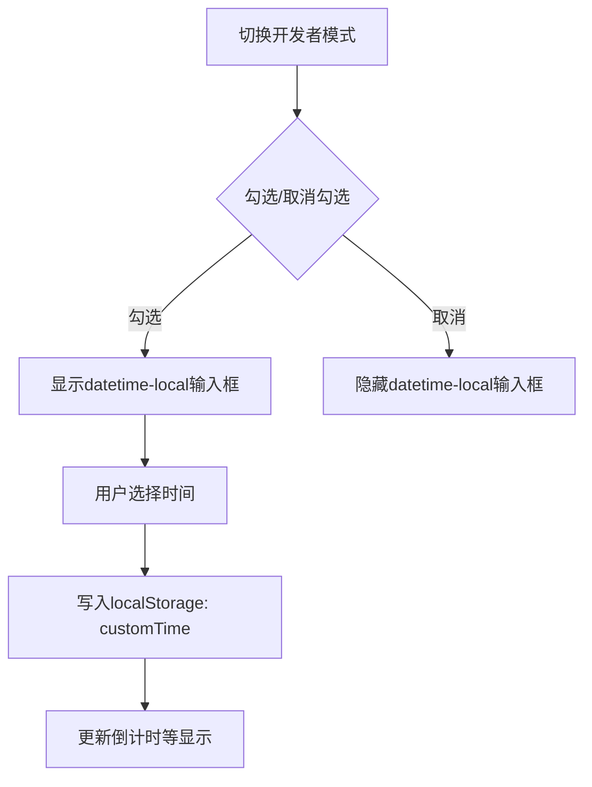
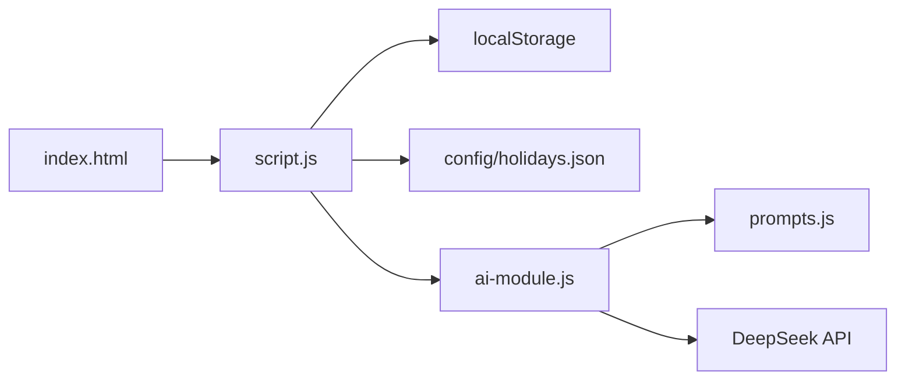

# 配置与自定义

<cite>
**本文引用的文件**
- [config/holidays.json](file://config/holidays.json)
- [script.js](file://script.js)
- [index.html](file://index.html)
- [ai-module.js](file://ai-module.js)
- [prompts.js](file://prompts.js)
- [README.md](file://README.md)
</cite>

## 目录
1. [简介](#简介)
2. [项目结构](#项目结构)
3. [核心组件](#核心组件)
4. [架构总览](#架构总览)
5. [详细组件分析](#详细组件分析)
6. [依赖关系分析](#依赖关系分析)
7. [性能考量](#性能考量)
8. [故障排查指南](#故障排查指南)
9. [结论](#结论)
10. [附录](#附录)

## 简介
本章节面向使用者与维护者，系统讲解本项目的配置管理机制，涵盖用户偏好的本地存储键值、工作时间与月工资的读取与计算、AI密钥的保存与测试、以及节假日配置文件 config/holidays.json 的结构设计与扩展方法。同时提供最佳实践与常见问题解决方案，帮助您高效定制属于自己的工作与假期管理体验。

## 项目结构
围绕配置与自定义的关键文件与职责如下：
- config/holidays.json：法定节假日与周末调休的基础配置源文件
- script.js：应用初始化、配置读取/写入、节假日合并、发薪日计算、开发者模式与AI密钥等核心逻辑
- index.html：设置页的UI结构，包含工作时间、月工资、节假日导入/重置/导出、开发者设置、AI密钥设置等
- ai-module.js：AI模块封装，负责DeepSeek API调用、问候语、摸鱼吉日签、工作总结等
- prompts.js：AI提示词与兜底文案，支撑AI功能
- README.md：产品说明，包含月工资与日薪计算等背景信息

图表来源
- [index.html](file://index.html#L360-L485)
- [script.js](file://script.js#L120-L223)
- [config/holidays.json](file://config/holidays.json#L1-L46)
- [ai-module.js](file://ai-module.js#L1-L60)
- [prompts.js](file://prompts.js#L1-L60)

章节来源
- [index.html](file://index.html#L360-L485)
- [script.js](file://script.js#L120-L223)
- [README.md](file://README.md#L43-L50)

## 核心组件
- 用户偏好与工作时间配置
  - 首次设置与设置页更新均写入 localStorage，键名包括：workStartTime、lunchStartTime、lunchEndTime、workEndTime、monthlySalary、salaryType、salaryDay、hasInitialized、hasVisited
  - 应用启动时从 localStorage 读取并初始化工作时间配置对象
- 月工资与日薪计算
  - 月工资来自 monthlySalary；日薪按当月天数计算，用于收入展示与进度条
- AI密钥管理
  - 保存在 localStorage 中的 deepseekApiKey；支持显示/隐藏、保存、测试连通性
- 节假日配置
  - config/holidays.json 提供默认官方节假日与周末调休映射
  - 设置页提供导入/重置/导出功能，实际生效基于 localStorage 中的 officialHolidays 与 officialWeekendWorkdays
- 开发者模式与自定义时间
  - developerMode 与 customTime 控制时间源，便于调试与演示

章节来源
- [script.js](file://script.js#L1-L110)
- [script.js](file://script.js#L120-L223)
- [script.js](file://script.js#L1207-L1270)
- [script.js](file://script.js#L1272-L1322)
- [script.js](file://script.js#L2550-L2585)
- [README.md](file://README.md#L43-L50)

## 架构总览
下图展示了配置读取与写入的总体流程，以及节假日与发薪日计算的关键路径。

图表来源
- [index.html](file://index.html#L360-L485)
- [script.js](file://script.js#L120-L223)
- [script.js](file://script.js#L1272-L1322)
- [script.js](file://script.js#L2550-L2585)
- [ai-module.js](file://ai-module.js#L1-L60)

## 详细组件分析

### 用户偏好与工作时间配置
- 键值与类型
  - workStartTime：字符串，格式 HH:mm
  - lunchStartTime：字符串，格式 HH:mm
  - lunchEndTime：字符串，格式 HH:mm
  - workEndTime：字符串，格式 HH:mm
  - monthlySalary：字符串，数值文本（默认 8000）
  - salaryType：字符串，枚举值 fixed 或 last
  - salaryDay：字符串，数值文本（固定日期发薪日）
  - hasInitialized：字符串，布尔标记
  - hasVisited：字符串，布尔标记
- 初始化与读取
  - 页面加载时从 localStorage 读取上述键值，若缺失则采用默认值
  - 初始化工作时间配置对象，用于倒计时与进度计算
- 更新与保存
  - 设置页“更新”按钮触发保存，写入对应键值
  - 保存后重新渲染事件与日历

图表来源
- [script.js](file://script.js#L1-L110)
- [script.js](file://script.js#L120-L223)
- [script.js](file://script.js#L1207-L1270)

章节来源
- [script.js](file://script.js#L1-L110)
- [script.js](file://script.js#L120-L223)
- [script.js](file://script.js#L1207-L1270)

### 月工资与日薪计算
- 月工资来源
  - 来自 monthlySalary（字符串），默认 8000
- 日薪计算
  - 依据当月天数计算日薪，用于收入展示与进度条
- 发薪日倒计时
  - 支持两种发薪日类型：固定日期与每月最后一天
  - 若发薪日落在周末或假期，按规则向前调整到工作日

图表来源
- [script.js](file://script.js#L2550-L2585)
- [script.js](file://script.js#L2671-L2701)
- [README.md](file://README.md#L43-L50)

章节来源
- [script.js](file://script.js#L2550-L2585)
- [script.js](file://script.js#L2671-L2701)
- [README.md](file://README.md#L43-L50)

### AI密钥与测试
- 保存与显示
  - 保存在 localStorage 中的 deepseekApiKey
  - 支持切换显示/隐藏，保存按钮写入密钥
- 测试连接
  - 临时保存密钥后调用 AI 接口，返回成功/失败状态
- 调用链路
  - ai-module.js 负责构造请求、校验响应、抛出错误
  - prompts.js 提供提示词模板，ai-module.js 在调用时注入参数

图表来源
- [index.html](file://index.html#L429-L442)
- [script.js](file://script.js#L424-L491)
- [ai-module.js](file://ai-module.js#L1-L60)
- [prompts.js](file://prompts.js#L1-L60)

章节来源
- [index.html](file://index.html#L429-L442)
- [script.js](file://script.js#L424-L491)
- [ai-module.js](file://ai-module.js#L1-L60)
- [prompts.js](file://prompts.js#L1-L60)

### 节假日配置：config/holidays.json 结构设计
- 文件位置与用途
  - config/holidays.json 提供默认官方节假日与周末调休映射
- 字段说明
  - officialHolidays：键为日期字符串 "YYYY-M-D"，值为节日名称字符串
  - weekendWorkdays：键为日期字符串 "YYYY-M-D"，值为布尔 true/false
- 数据类型与格式规范
  - 日期键：字符串，格式 YYYY-M-D（年-月-日），月与日无需补零
  - 节日名称：字符串
  - 调休标记：布尔值 true/false
- 初始化与合并
  - 首次加载时从 config/holidays.json 读取默认值，若 localStorage 中不存在则写入
  - 日历渲染时将 officialHolidays 与 officialWeekendWorkdays 合并到 workdaysOff 与 weekendsWork，并持久化到 localStorage

图表来源
- [config/holidays.json](file://config/holidays.json#L1-L46)
- [script.js](file://script.js#L1272-L1322)

章节来源
- [config/holidays.json](file://config/holidays.json#L1-L46)
- [script.js](file://script.js#L1272-L1322)

### 设置页：节假日导入/重置/导出
- 导入节假日
  - 将用户粘贴的 JSON 写入 localStorage 的 officialHolidays
- 重置为默认
  - 将 localStorage 的 officialHolidays 重置为默认值
- 导出配置
  - 将当前 localStorage 中的 officialHolidays 以 JSON 文本导出

图表来源
- [index.html](file://index.html#L397-L412)
- [script.js](file://script.js#L2659-L2668)

章节来源
- [index.html](file://index.html#L397-L412)
- [script.js](file://script.js#L2659-L2668)

### 开发者模式与自定义时间
- 开发者模式
  - 通过 developerMode 控制是否启用自定义时间
  - 启用后显示 datetime-local 输入框，选择后写入 customTime
- 自定义时间
  - 当 developerMode 为 true 且 customTime 存在时，getCurrentTime 返回自定义时间
  - 用于调试与演示，不影响生产数据

图表来源
- [script.js](file://script.js#L1118-L1160)

章节来源
- [script.js](file://script.js#L1118-L1160)

## 依赖关系分析
- 组件耦合
  - script.js 依赖 localStorage 与 DOM，承担配置读取/写入与业务逻辑
  - index.html 提供设置页 UI，驱动 script.js 的行为
  - ai-module.js 依赖 localStorage 中的 API Key，调用外部服务
  - prompts.js 为 ai-module.js 提供提示词模板
  - config/holidays.json 为 script.js 提供默认节假日数据
- 外部依赖
  - DeepSeek API（通过 ai-module.js 调用）
  - 浏览器 localStorage API

图表来源
- [index.html](file://index.html#L360-L485)
- [script.js](file://script.js#L120-L223)
- [ai-module.js](file://ai-module.js#L1-L60)
- [prompts.js](file://prompts.js#L1-L60)
- [config/holidays.json](file://config/holidays.json#L1-L46)

章节来源
- [index.html](file://index.html#L360-L485)
- [script.js](file://script.js#L120-L223)
- [ai-module.js](file://ai-module.js#L1-L60)
- [prompts.js](file://prompts.js#L1-L60)
- [config/holidays.json](file://config/holidays.json#L1-L46)

## 性能考量
- localStorage 读写
  - 读取与写入均为 O(1)，对性能影响极小
  - 避免频繁写入同一键值，可在批量更新后一次性写入
- JSON 解析
  - 节假日与工作时间配置在初始化与更新时进行 JSON 解析，建议控制数据规模
- 事件与日历渲染
  - 合并节假日与周末调休后统一写回 localStorage，减少重复计算

[本节为通用建议，不直接分析具体文件]

## 故障排查指南
- 保存设置后未生效
  - 检查 localStorage 中对应键值是否正确写入
  - 确认页面已重新渲染事件与日历
- 导入节假日失败
  - 确认粘贴的 JSON 符合键值格式规范（日期键为 "YYYY-M-D"，值为字符串或布尔）
  - 使用“重置为默认”恢复后再试
- AI 密钥保存失败或测试失败
  - 确认已保存密钥并点击“测试连接”
  - 检查网络与 API Key 是否有效
- 发薪日倒计时不正确
  - 检查 salaryType 与 salaryDay 的设置
  - 确认发薪日遇周末或假期时的调整逻辑符合预期

章节来源
- [script.js](file://script.js#L120-L223)
- [script.js](file://script.js#L2659-L2668)
- [ai-module.js](file://ai-module.js#L1-L60)

## 结论
本项目通过 localStorage 实现用户偏好的本地持久化，配合设置页与脚本逻辑，实现了工作时间、月工资、发薪日、节假日与开发者模式等全面的个性化配置。config/holidays.json 提供默认节假日与周末调休映射，用户可通过设置页灵活导入、重置与导出。AI密钥的保存与测试进一步增强了功能的可扩展性。遵循本文的最佳实践与排错建议，您可以高效地定制属于自己的工作与假期管理体验。

[本节为总结性内容，不直接分析具体文件]

## 附录

### 配置键值命名规则与数据类型
- 工作时间与偏好
  - workStartTime：字符串，HH:mm
  - lunchStartTime：字符串，HH:mm
  - lunchEndTime：字符串，HH:mm
  - workEndTime：字符串，HH:mm
  - hasInitialized：字符串，布尔标记
  - hasVisited：字符串，布尔标记
- 月工资与发薪日
  - monthlySalary：字符串，数值文本
  - salaryType：字符串，枚举值 fixed 或 last
  - salaryDay：字符串，数值文本（固定日期发薪日）
- 节假日与周末调休
  - officialHolidays：字符串到字符串的映射（"YYYY-M-D" -> "节日名"）
  - officialWeekendWorkdays：字符串到布尔的映射（"YYYY-M-D" -> true/false）
  - workdaysOff：字符串到布尔的映射（日历渲染使用）
  - weekendsWork：字符串到布尔的映射（日历渲染使用）
- 开发者模式与自定义时间
  - developerMode：字符串，布尔标记
  - customTime：字符串，ISO 时间文本
- AI 密钥
  - deepseekApiKey：字符串

章节来源
- [script.js](file://script.js#L1-L110)
- [script.js](file://script.js#L120-L223)
- [script.js](file://script.js#L1272-L1322)
- [script.js](file://script.js#L2550-L2585)
- [index.html](file://index.html#L397-L412)

### 最佳实践
- 首次设置
  - 使用“首次设置”弹窗完成基础配置，避免遗漏关键项
- 节假日管理
  - 使用“导入节假日”功能批量更新；如需临时调试，使用“重置为默认”快速恢复
- 发薪日设置
  - 固定日期发薪日建议避开周末与法定节假日，系统会自动向前调整
- AI 密钥
  - 保存后务必进行“测试连接”，确保可用性
- 开发者模式
  - 仅在调试时启用，避免长期影响正常时间计算

章节来源
- [index.html](file://index.html#L360-L485)
- [script.js](file://script.js#L120-L223)
- [script.js](file://script.js#L2550-L2585)
- [README.md](file://README.md#L43-L50)