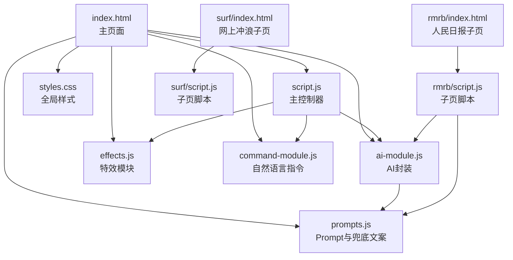
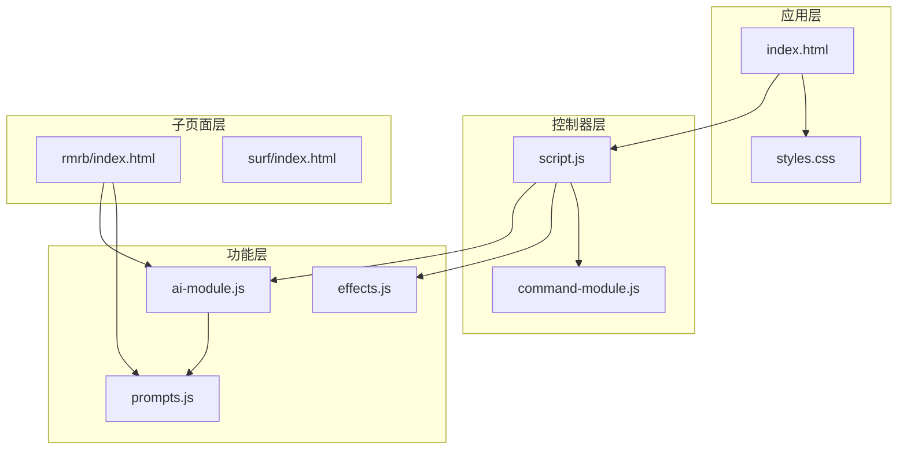
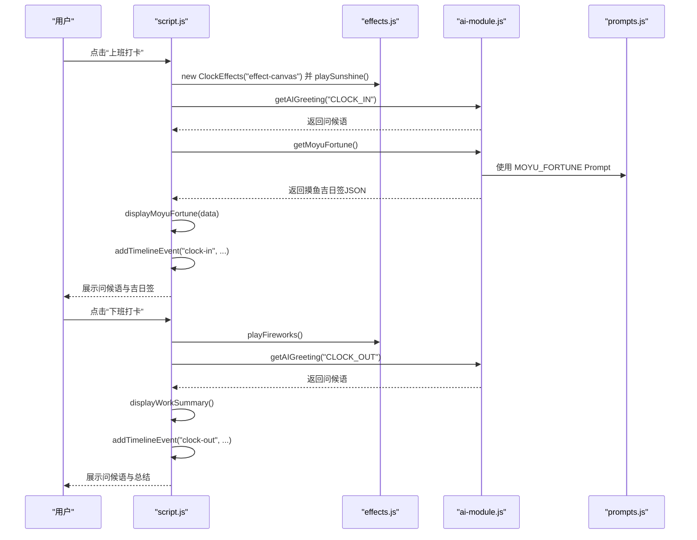
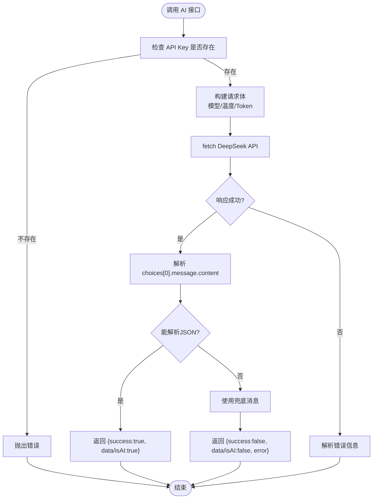
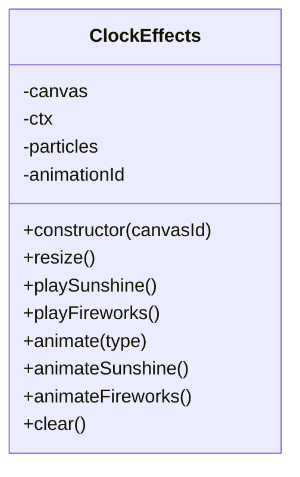
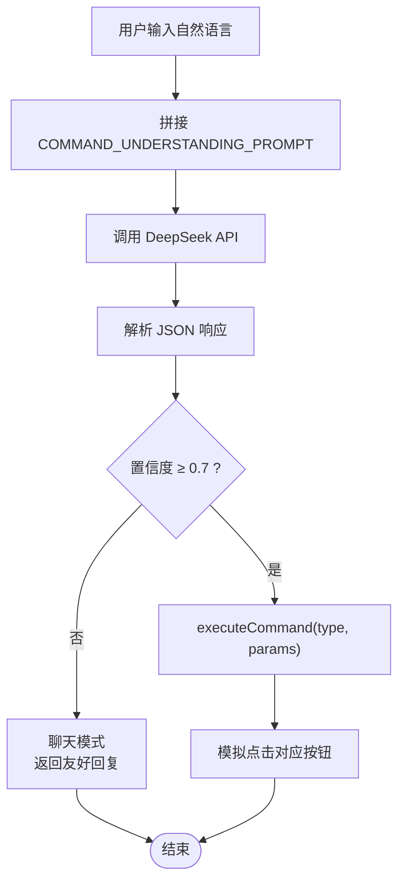
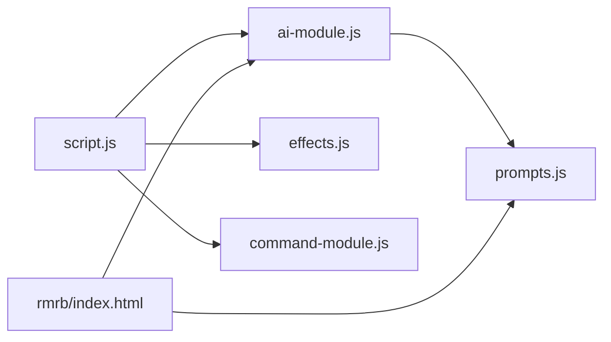

# 项目概述

<cite>
**本文引用的文件**
- [README.md](file://README.md)
- [index.html](file://index.html)
- [script.js](file://script.js)
- [ai-module.js](file://ai-module.js)
- [effects.js](file://effects.js)
- [command-module.js](file://command-module.js)
- [prompts.js](file://prompts.js)
- [styles.css](file://styles.css)
- [rmrb/index.html](file://rmrb/index.html)
- [surf/index.html](file://surf/index.html)
</cite>

## 目录
1. [引言](#引言)
2. [项目结构](#项目结构)
3. [核心组件](#核心组件)
4. [架构总览](#架构总览)
5. [详细组件分析](#详细组件分析)
6. [依赖关系分析](#依赖关系分析)
7. [性能考量](#性能考量)
8. [故障排查指南](#故障排查指南)
9. [结论](#结论)
10. [附录](#附录)

## 引言
Work Timer 是一款面向职场人士的时间管理与假期管理工具，旨在通过倒计时、日历视图、AI生成内容与视觉特效，帮助用户提升时间感知与工作节奏掌控力。产品强调原生 JavaScript 模块化开发、无框架依赖、localStorage 数据持久化以及 DeepSeek AI 集成，支持桌面与移动端响应式体验。

- 产品定位与核心功能来自 README.md 的明确说明，涵盖倒计时、日历、工作进度追踪、AI生成的“摸鱼吉日签”、工资计算与收入展示、打卡特效、设置与个性化、友好提示与反馈、响应式设计等。
- 架构设计原则：原生 JS 模块化、无框架依赖、localStorage 持久化、DeepSeek AI 集成、Canvas 高性能动画。

**章节来源**
- file://README.md#L1-L125

## 项目结构
项目采用“根页面 + 多模块 + 子页面”的组织方式：
- 根页面 index.html 引入全局脚本与样式，承载主应用的导航、标签页、模态框、AI 助手悬浮窗、打卡特效画布等。
- 核心模块：
  - script.js：主控制器，负责初始化、标签页切换、侧边栏、番茄钟、AI 设置、打卡流程、时间轴、日历事件、快捷功能等。
  - ai-module.js：独立的 DeepSeek API 调用封装，提供问候语、摸鱼吉日签、工作总结、通用分析等接口。
  - effects.js：打卡特效模块，基于 Canvas 实现“阳光特效”和“礼花特效”，使用 requestAnimationFrame 优化性能。
  - command-module.js：自然语言指令理解与执行模块，将用户自然语言转化为具体操作。
  - prompts.js：统一管理 AI Prompt 与兜底文案，供 AI 模块与子页面共享。
  - styles.css：全局样式，含响应式布局、日历高亮、模态框、动画与交互态。
- 子页面：
  - rmrb/index.html：人民日报阅读与 AI 分析功能，通过 iframe 嵌入到主应用的“人民日报”标签页。
  - surf/index.html：网上冲浪（热搜）功能，通过 iframe 嵌入到主应用的“网上冲浪”标签页。

**图表来源**
- [index.html](file://index.html#L1-L120)
- [script.js](file://script.js#L1-L120)
- [ai-module.js](file://ai-module.js#L1-L60)
- [effects.js](file://effects.js#L1-L40)
- [command-module.js](file://command-module.js#L1-L40)
- [prompts.js](file://prompts.js#L1-L40)
- [rmrb/index.html](file://rmrb/index.html#L1-L62)
- [surf/index.html](file://surf/index.html#L1-L54)

**章节来源**
- file://index.html#L1-L120
- file://script.js#L1-L120
- file://ai-module.js#L1-L60
- file://effects.js#L1-L40
- file://command-module.js#L1-L40
- file://prompts.js#L1-L40
- file://rmrb/index.html#L1-L62
- file://surf/index.html#L1-L54

## 核心组件
- 主控制器 script.js
  - 负责页面初始化、标签页与侧边栏切换、番茄钟、AI 设置、打卡流程、时间轴、日历事件、快捷功能、开发者模式与自定义时间。
  - 使用 localStorage 进行数据持久化，包括工作时间、假期配置、自定义事件、打卡状态、时间轴等。
- AI 模块 ai-module.js
  - 封装 DeepSeek API 调用，提供问候语、摸鱼吉日签、工作总结、通用分析等方法；具备兜底策略与错误处理。
- 特效模块 effects.js
  - 基于 Canvas 的高性能动画，实现“阳光特效”和“礼花特效”，使用 requestAnimationFrame 与粒子系统。
- 指令模块 command-module.js
  - 将自然语言转为结构化指令，判断置信度后执行对应操作，支持聊天模式与低置信度友好回复。
- Prompt 与兜底文案 prompts.js
  - 统一管理 AI Prompt 模板与兜底文案，供 AI 模块与子页面共享。
- 样式 styles.css
  - 提供响应式布局、日历高亮、模态框、动画与交互态，适配桌面与移动端。

**章节来源**
- file://script.js#L1-L200
- file://ai-module.js#L1-L120
- file://effects.js#L1-L120
- file://command-module.js#L1-L120
- file://prompts.js#L1-L120
- file://styles.css#L1-L200

## 架构总览
整体架构遵循“主控制器 + 模块化功能 + AI 集成 + Canvas 特效”的设计，主控制器负责编排与调度，各模块职责单一、耦合度低，通过全局命名空间暴露接口供其他模块调用。

**图表来源**
- [index.html](file://index.html#L1-L120)
- [script.js](file://script.js#L1-L120)
- [ai-module.js](file://ai-module.js#L1-L60)
- [effects.js](file://effects.js#L1-L40)
- [command-module.js](file://command-module.js#L1-L40)
- [prompts.js](file://prompts.js#L1-L40)
- [rmrb/index.html](file://rmrb/index.html#L1-L62)
- [surf/index.html](file://surf/index.html#L1-L54)

## 详细组件分析

### 主控制器 script.js
- 初始化与生命周期
  - 页面加载时检查首次访问、初始化标签页与侧边栏、番茄钟、AI 设置、打卡功能、时间轴、指令控制、快捷功能、日历事件。
  - 使用 localStorage 存储工作时间、假期、自定义事件、打卡状态、时间轴等。
- 打卡流程
  - 根据当天是否已打卡、打卡类型（上班/下班）更新按钮状态与行为。
  - 上班打卡：生成问候语、播放阳光特效、生成并展示“摸鱼吉日签”，支持再求一签与保存。
  - 下班打卡：播放礼花特效、生成“今日工作总结”，记录时间轴事件。
- 时间轴与进度
  - 以日期为键保存当日时间轴事件，支持添加、加载、保存。
  - 工资进度条与日薪计算（月工资 ÷ 当月天数），用于可视化展示。
- 日历与事件
  - 日历渲染与高亮（工作日、周末、公休、串休、自定义假期、发薪日）。
  - 支持添加事件、查看今日事件列表。
- 开发者模式
  - 支持自定义时间，便于测试与演示。

**图表来源**
- [script.js](file://script.js#L493-L732)
- [effects.js](file://effects.js#L1-L120)
- [ai-module.js](file://ai-module.js#L61-L127)
- [prompts.js](file://prompts.js#L1-L40)

**章节来源**
- file://script.js#L1-L200
- file://script.js#L493-L732
- file://script.js#L734-L800

### AI 模块 ai-module.js
- DeepSeek API 调用封装
  - 统一请求参数（模型、温度、最大 token、topP），处理响应与错误。
- 功能接口
  - getAIGreeting：返回固定问候语（非 AI）。
  - getMoyuFortune：调用 AI 生成“摸鱼吉日签”，解析 JSON 并提供兜底。
  - generateWorkSummary：根据工作数据生成幽默总结。
  - callAIAnalysis：通用分析接口，支持多种 Prompt 类型。
- 错误处理与兜底
  - 捕获网络与解析异常，回退至兜底文案，保证用户体验。

**图表来源**
- [ai-module.js](file://ai-module.js#L1-L120)
- [prompts.js](file://prompts.js#L1-L40)

**章节来源**
- file://ai-module.js#L1-L120
- file://ai-module.js#L128-L216

### 特效模块 effects.js
- 设计目标
  - 使用 HTML5 Canvas 与 requestAnimationFrame 实现高性能动画。
- 功能实现
  - playSunshine：创建大量光点与光晕粒子，模拟阳光飘落。
  - playFireworks：多组粒子爆炸，带重力与摩擦，形成绚烂礼花。
  - animateSunshine/animateFireworks：动画循环，维护粒子生命周期与视觉效果。
  - clear：清理画布与动画，释放资源。
- 性能优化
  - 仅保留存活粒子，按帧过滤与绘制；在 resize 时重设画布尺寸。

**图表来源**
- [effects.js](file://effects.js#L1-L279)

**章节来源**
- file://effects.js#L1-L279

### 指令模块 command-module.js
- 指令类型
  - 包括打卡、启动/暂停番茄钟、查看时间轴/日历、切换标签页、摸鱼、打开设置、聊天等。
- 意图理解与执行
  - 使用 Prompt 判断用户意图，返回 JSON 结构，包含置信度与参数。
  - 置信度阈值（>0.7）决定是否执行操作；低置信度或聊天模式仅返回友好回复。
  - 执行阶段通过 DOM 事件触发对应功能按钮。
- 友好提示
  - 通过全局 showToast 或控制台输出提示信息。

**图表来源**
- [command-module.js](file://command-module.js#L1-L200)

**章节来源**
- file://command-module.js#L1-L200
- file://command-module.js#L200-L313

### Prompt 与兜底文案 prompts.js
- 统一管理 AI Prompt 模板（摸鱼吉日签、工作总结、新闻分析等）。
- 提供兜底文案（摸鱼吉日签、工作总结、新闻分析等），在 AI 失败时使用。
- 导出到全局命名空间，供 AI 模块与子页面共享。

**章节来源**
- file://prompts.js#L1-L159

### 样式与响应式设计 styles.css
- 响应式布局：网格与弹性布局适配桌面与移动端。
- 日历高亮：不同日期类型使用不同背景色与图例说明。
- 模态框与交互态：按钮悬停、焦点、禁用态等。
- 动画与过渡：渐变、阴影、过渡时间曲线，提升交互体验。

**章节来源**
- file://styles.css#L1-L200
- file://styles.css#L528-L700

## 依赖关系分析
- 主控制器 script.js 依赖：
  - ai-module.js：调用 AI 功能（问候、摸鱼吉日签、工作总结）。
  - effects.js：播放打卡特效。
  - command-module.js：处理自然语言指令。
  - prompts.js：提供 Prompt 模板与兜底文案。
- 子页面 rmrb/index.html 依赖：
  - ai-module.js、prompts.js：用于“AI 读报分析”。
- 子页面 surf/index.html 为纯展示页面，不依赖 AI 模块。

**图表来源**
- [script.js](file://script.js#L1-L120)
- [ai-module.js](file://ai-module.js#L1-L60)
- [effects.js](file://effects.js#L1-L40)
- [command-module.js](file://command-module.js#L1-L40)
- [prompts.js](file://prompts.js#L1-L40)
- [rmrb/index.html](file://rmrb/index.html#L1-L62)

**章节来源**
- file://script.js#L1-L120
- file://ai-module.js#L1-L60
- file://effects.js#L1-L40
- file://command-module.js#L1-L40
- file://prompts.js#L1-L40
- file://rmrb/index.html#L1-L62

## 性能考量
- Canvas 动画
  - 使用 requestAnimationFrame 控制帧率，仅绘制存活粒子，避免过度重绘。
  - 在窗口 resize 时重设画布尺寸，避免离屏绘制导致的性能损耗。
- API 调用
  - 统一请求参数与错误处理，避免重复请求与异常吞没。
  - 在 AI 失败时使用兜底文案，减少用户等待时间。
- 本地存储
  - 使用 localStorage 缓存用户设置与时间轴，减少重复计算与网络请求。
- 响应式与渲染
  - 样式层面采用 CSS Grid 与 Flex 布局，减少复杂 JS 计算；日历高亮通过类名切换，避免频繁 DOM 操作。

[本节为通用性能建议，无需特定文件引用]

## 故障排查指南
- API 密钥未配置
  - 现象：测试连接失败或调用 AI 接口报错。
  - 处理：在设置页保存 DeepSeek API Key，并点击“测试连接”验证。
- AI 返回非 JSON
  - 现象：摸鱼吉日签或工作总结解析失败。
  - 处理：模块会回退至兜底文案，可在设置页查看状态提示。
- 打卡按钮状态异常
  - 现象：按钮文案与状态不符。
  - 处理：刷新页面后会根据本地存储的 lastClockInType 与 lastClockInDate 重新计算。
- 特效不显示
  - 现象：打卡时无特效。
  - 处理：确认 canvas 元素存在且未被遮挡；检查浏览器控制台是否有错误；尝试刷新页面。
- 自定义时间无效
  - 现象：开发者模式下时间未生效。
  - 处理：确认已开启开发者模式并正确设置自定义时间，刷新页面后生效。

**章节来源**
- file://script.js#L493-L732
- file://ai-module.js#L1-L120
- file://effects.js#L1-L120
- file://command-module.js#L1-L120

## 结论
Work Timer 以“原生 JavaScript + 模块化 + AI + Canvas 特效”为核心，围绕倒计时、日历、AI 生成内容与打卡特效构建了轻量而高效的职场时间管理工具。主控制器 script.js 协调各模块，通过 localStorage 实现数据持久化，配合 DeepSeek API 与 Canvas 动画，既满足初学者的易用性，也为高级用户提供扩展与二次开发空间。

[本节为总结性内容，无需特定文件引用]

## 附录
- 产品定位与核心功能参考 README.md。
- 子页面 rmrb 与 surf 通过 iframe 嵌入，分别提供“人民日报阅读与 AI 分析”、“网上冲浪热搜”。

**章节来源**
- file://README.md#L1-L125
- file://rmrb/index.html#L1-L62
- file://surf/index.html#L1-L54